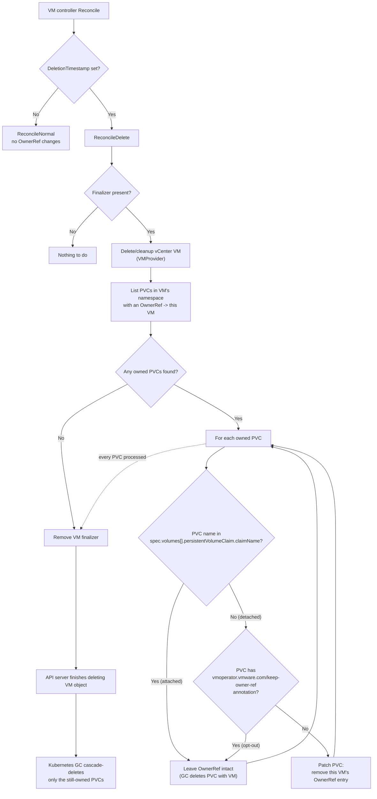

# Feature Specification: Remove PVC OwnerRef on Detach

- **Feature branch**: [`feature/rm-pvc-owner-ref`](https://github.com/akutz/vm-operator/tree/feature/rm-pvc-owner-ref/)
  - **Fork**: `akutz/vm-operator`
  - **PR target**: `vmware-tanzu/vm-operator`
- **Created**: 2026-07-08
- **Status**: Implementation
- **Ticket**: bz-3734442

---

## Summary

When deleting a traditional vSphere VM, only its attached disks are deleted along with the VM. For example, imagine the following scenarios:

1. User creates traditional vSphere VM with two disks at `/vmfs/volumes/my-datastore-1/my-vm/disk-1.vmdk` and `/vmfs/volumes/my-datastore-1/my-vm/disk-2.vmdk`
2. The VM is deleted.
3. The directory `/vmfs/volumes/my-datastore-1/my-vm/` is removed from the datastore, along with the VM's two disks.

Now, a spin on the above scenario:

1. User creates traditional vSphere VM with two disks at `/vmfs/volumes/my-datastore-1/my-vm/disk-1.vmdk` and `/vmfs/volumes/my-datastore-1/my-vm/disk-2.vmdk`
2. The second disk is detached.
3. The VM is deleted.
4. The directory `/vmfs/volumes/my-datastore-1/my-vm/` is still present, but the only file remaining in the directory is the second disk, i.e. `/vmfs/volumes/my-datastore-1/my-vm/disk-2.vmdk`.

Whenever VM Operator registers an unmanaged disk as a PVC, VM Operator ensures there is an OwnerRef set on that PVC that points back to the VM. That way if the VM is deleted, the PVC object gets cleaned up as well by Kubernetes' built-in garbage collection. However, currently this OwnerRef remains even if the PVC is later detached from the VM. This can result in the following scenario:

1. User creates VM Service VM from VMI that has two disks in it.
2. VM Operator creates the new VM and eventually registers the two, unmanaged disks as PVCs, placing OwnerRefs on each disk to ensure that when the Kubernetes VM object is deleted, the PVCs are cleaned up as well.
3. The user detaches the second disk from the VM by removing its entry from `spec.volumes`.
4. The user deletes the VM.
5. VM Operator destroys the underlying vSphere VM.
6. Because the PVCs have OwnerRefs that point to the VM that was deleted, they are both deleted as well, even the one that was detached from the VM at the time it was deleted.

Because the above scenario is *not* what happens to a traditional vSphere VM, it needs to be corrected.

---

## Reconciliation pipeline

1. The VM controller reconciles a VM.
2. If the VM has a deletion timestamp, the logic reconciles a VM to-be-destroyed.
3. Prior to removing the VM's finalizer, the logic finds all PVCs:
    1. Are in the same namespace as the VM
    2. Have an OwnerRef that point back to the VM
4. For each PVC in the above list:
    1. Check if the name of the PVC exists in the list of the currently attached volumes via `spec.volumes[].persistentVolumeClaim.claimName`.
    2. If the PVC is not currently attached to the VM:
        1. Check if the PVC carries the `vmoperator.vmware.com/keep-owner-ref` annotation. If present, leave the OwnerRef intact and move on to the next PVC.
        2. Otherwise, patch the PVC object to remove the VM's OwnerRef from the PVC.

A user may set the `vmoperator.vmware.com/keep-owner-ref` annotation directly on a PVC to opt that specific PVC out of this cleanup — for example, when they intend to reattach it later and still want it garbage-collected with the VM if they never do. The annotation is presence-based: its value is never inspected, only whether the key exists on the PVC at the moment this cleanup runs.

This cleanup runs **once, immediately before the VM's finalizer is removed** — not the moment a volume is detached from a running VM. Removing a volume from `spec.volumes` while the VM is still alive does not, by itself, touch the PVC's OwnerRef; the OwnerRef is only re-evaluated at VM-deletion time, right before the object (and Kubernetes' built-in garbage collection) would otherwise cascade-delete every PVC that still lists the VM as an owner. This keeps the fix isolated to the one moment where an incorrect OwnerRef causes data loss, and avoids adding a per-reconcile cost to the volume controllers for a condition that only matters at deletion.

### Diagram

---

## User stories

### US1 — DevOps user: a detached disk survives VM deletion (Priority: P1)

A DevOps user removes a disk from a VM's `spec.volumes` before deleting the VM. When the VM is later deleted, the disk's PVC is not deleted along with it — matching how a traditional vSphere VM behaves when a disk is detached before the VM is destroyed.

**Why P1**: This is the core bug. Without it, detaching a disk provides no real protection against data loss; the disk is still destroyed the moment the VM is deleted.

**Independent test**: Create a VM with two disks registered as PVCs, remove the second disk's entry from `spec.volumes`, delete the VM, and confirm the second PVC still exists (and no longer carries the VM's OwnerRef) after the VM object is gone.

**Acceptance scenarios**:

1. **Given** a VM with two unmanaged-disk PVCs both OwnerRef'd to the VM, **when** the second PVC's `claimName` is removed from `spec.volumes` and the VM is subsequently deleted, **then** the second PVC still exists after the VM is removed and no longer has an OwnerRef pointing to the VM.
2. **Given** a PVC's OwnerRef was removed because it was detached, **when** no further action is taken, **then** the PVC is otherwise unmodified (same `spec`, same data, same other OwnerReferences if any).
3. **Given** a VM has no PVCs with an OwnerRef pointing back to it, **when** the VM is deleted, **then** the reconcile completes without listing or patching any PVCs beyond the (empty) lookup.

---

### US2 — DevOps user: an attached disk is still cleaned up when the VM is deleted (Priority: P1)

A DevOps user deletes a VM whose disks are still attached. Those disks' PVCs are deleted along with the VM, exactly as they were before this change — this fix must not weaken existing cleanup for the common case.

**Why P1**: Regression protection. The fix only has value if it is strictly additive — it must never leave behind a PVC that legitimately should be garbage-collected.

**Independent test**: Create a VM with two unmanaged-disk PVCs, delete the VM without detaching anything, and confirm both PVCs are gone once Kubernetes garbage collection completes.

**Acceptance scenarios**:

1. **Given** a VM with N unmanaged-disk PVCs, all still listed in `spec.volumes`, **when** the VM is deleted, **then** the OwnerRef on every one of the N PVCs is left intact and all N PVCs are garbage-collected once the VM object is removed.
2. **Given** a VM with one attached and one detached unmanaged-disk PVC, **when** the VM is deleted, **then** only the detached PVC's OwnerRef is removed; the attached PVC's OwnerRef — and its eventual cascade deletion — is unaffected.

---

### US3 — Platform engineer: OwnerRef removal is scoped to this VM only (Priority: P2)

A PVC may end up with OwnerReferences to more than one object over its lifetime (for example, if it is re-registered, or if another controller also references it). Removing the detached VM's OwnerRef must not disturb any other entries in `OwnerReferences`, and must be safe to run repeatedly.

**Why P2**: Safety guarantee. An implementation that overwrites the whole `OwnerReferences` list instead of surgically removing one entry risks corrupting unrelated ownership relationships.

**Independent test**: Add a second, unrelated OwnerReference to a detached PVC alongside the VM's OwnerRef, delete the VM, and confirm only the VM's entry is gone while the unrelated entry remains.

**Acceptance scenarios**:

1. **Given** a detached PVC has two OwnerReferences — one to the VM and one to an unrelated object, **when** the VM is deleted, **then** only the VM's OwnerReference entry is removed from `PVC.metadata.ownerReferences`; the unrelated entry is untouched.
2. **Given** the patch to remove a VM's OwnerRef from a PVC is retried after a transient conflict, **when** the retry succeeds, **then** the end state is identical to a single successful patch (the operation is idempotent).
3. **Given** a PVC no longer exists by the time the reconcile attempts to patch it (already deleted independently), **when** the reconcile processes that PVC, **then** the reconcile does not fail because of that one missing PVC and continues processing the remaining PVCs.

---

### US4 — DevOps user: opt a specific detached PVC out of OwnerRef removal (Priority: P2)

A DevOps user wants a particular PVC to remain bound to its VM's lifecycle even though it is currently detached — for example, they plan to reattach it later and, until then, still want it garbage-collected along with the VM rather than survive indefinitely as an orphan. Setting the `vmoperator.vmware.com/keep-owner-ref` annotation on that PVC opts it out of the cleanup described in US1.

**Why P2**: Escape hatch. The new default (detached PVCs survive) is correct for most users, but not universally desired for every PVC; this gives users an explicit, per-PVC override.

**Independent test**: Detach a PVC from a VM, add the `vmoperator.vmware.com/keep-owner-ref` annotation to the PVC, delete the VM, and confirm the PVC's OwnerRef is still present and the PVC is garbage-collected along with the VM.

**Acceptance scenarios**:

1. **Given** a detached PVC carries the `vmoperator.vmware.com/keep-owner-ref` annotation, **when** the VM is deleted, **then** the PVC's OwnerRef is left intact and the PVC is garbage-collected along with the VM, exactly as if it had still been attached.
2. **Given** a detached PVC does not carry the annotation, **when** the VM is deleted, **then** behavior is unchanged from US1 — the OwnerRef is removed.
3. **Given** the annotation is present with an empty string value (or any other value), **when** the VM is deleted, **then** the PVC is still treated as opted out — only the annotation key's presence is checked, never its value.
4. **Given** the annotation is present on a PVC that is still attached to the VM, **when** the VM is deleted, **then** it has no observable effect, since that PVC's OwnerRef would not have been removed anyway.

---

## Edge cases

- A PVC has more than one `OwnerReference` (e.g., the VM plus something else). Only the VM's specific entry is removed; the rest of `OwnerReferences` is preserved unchanged.
- A PVC is concurrently deleted (e.g., by a user) between being listed and being patched. The reconcile tolerates the `NotFound` error for that PVC and continues with the rest.
- A patch to remove the OwnerRef hits a resource-version conflict (concurrent update to the same PVC). The reconcile retries the patch rather than failing the whole VM deletion.
- A VM is deleted while it has zero PVCs with an OwnerRef pointing back to it (e.g., a VM that never had unmanaged disks). The lookup returns an empty list and no patches are attempted.
- A VM is deleted via the "unregister" path (`pkgconst.SkipDeletePlatformResourceKey`, which skips destroying the underlying vSphere VM). The OwnerRef cleanup still runs before the finalizer is removed, because the Kubernetes-side cascade-delete risk exists regardless of whether the vSphere VM itself is destroyed or merely unregistered.
- A PVC also carries `spec.dataSourceRef` pointing back to the VM (a second, independent "pointer to the VM" set at PVC-registration time). `spec.dataSourceRef` is immutable once set on a `PersistentVolumeClaim`, so it cannot be cleared after creation; it does not participate in Kubernetes garbage collection and is out of scope for this change — see "Out of scope."
- Instance-storage-backed volumes (`VirtualMachineVolume.PersistentVolumeClaim.InstanceVolumeClaim`) are not a practical concern: the validating webhook rejects any attempt by a non-privileged (SSO) user to remove, add, or modify an instance-storage volume on an existing VM (`addingModifyingInstanceVolumesNotAllowed`). For ordinary DevOps users, an instance-storage PVC's `claimName` therefore never disappears from `spec.volumes` while the VM exists, so this cleanup never treats it as detached. Only a privileged/service account could remove one and trigger OwnerRef cleanup on it; that is an accepted, narrow consequence and not a reason to special-case instance storage in this feature.
- The `vmoperator.vmware.com/keep-owner-ref` annotation is presence-based: any value (including an empty string) opts the PVC out of removal; the value is never parsed or validated.
- The annotation lives on the PVC, not the VM — it protects that specific PVC regardless of which VM currently owns it, and has no effect on any other PVC.
- The annotation is evaluated fresh each time this cleanup runs (immediately before finalizer removal), not cached from an earlier reconcile. A user may add or remove it at any point before VM deletion; only its state at that moment matters.
- Adding the annotation to a PVC that is still attached has no effect, since an attached PVC's OwnerRef is never a removal candidate in the first place.

---

## Out of scope

- Removing a PVC's OwnerRef the moment a volume is detached from a running VM. Cleanup only happens once, at VM-deletion time, immediately before the finalizer is removed (see "Reconciliation pipeline").
- Clearing or otherwise modifying `PVC.spec.dataSourceRef`, which also points back to the VM for unmanaged-disk PVCs but is immutable once set and does not affect Kubernetes garbage collection.
- Any change to how the OwnerRef is *set* on PVC creation/registration (`pkg/vmconfig/volumes/unmanaged/register`), including whether it sets `Controller` or `BlockOwnerDeletion`.
- Any change to `CnsNodeVmAttachment` / `CnsNodeVMBatchAttachment` OwnerRef or deletion behavior; those objects are intentionally left to Kubernetes garbage collection and are unaffected by this change.
- Backfilling or correcting PVCs that were already deleted by the pre-fix cascade-delete behavior before this change ships.

---

## Review & acceptance checklist

- [ ] Both user stories (detached-disk survives, attached-disk still cleaned up) have at least two Given/When/Then scenarios.
- [ ] Each scenario is independently testable.
- [ ] The reconciliation pipeline states exactly when the OwnerRef check runs (once, before finalizer removal) and not on every detach.
- [ ] Partial-owner-reference removal (multiple OwnerReferences on one PVC) is specified.
- [ ] Failure modes (PVC not found, patch conflict) are specified and do not block VM deletion.
- [ ] The `dataSourceRef` distinction is called out explicitly as out of scope (immutable once set).
- [ ] The instance-storage interaction is resolved (webhook already prevents non-privileged removal) rather than left open.
- [ ] The `vmoperator.vmware.com/keep-owner-ref` opt-out annotation is specified, including its presence-based (value-agnostic), PVC-scoped, evaluated-at-cleanup-time semantics.
- [ ] Out-of-scope items are listed.

