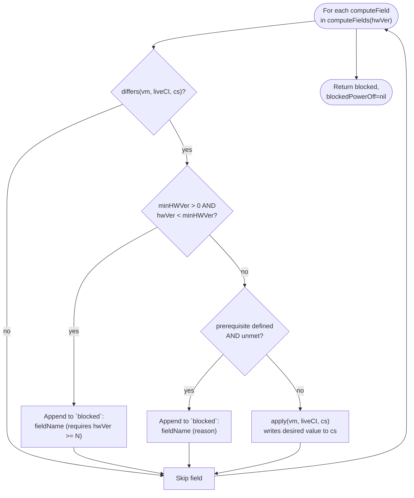
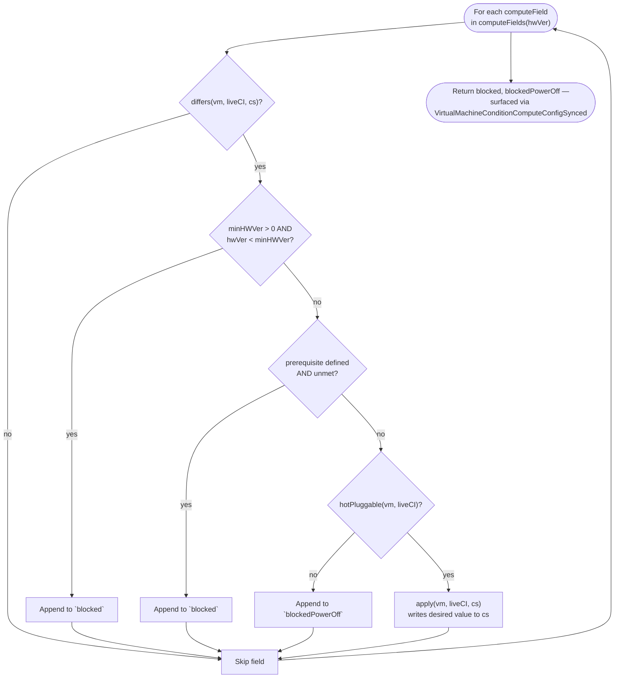
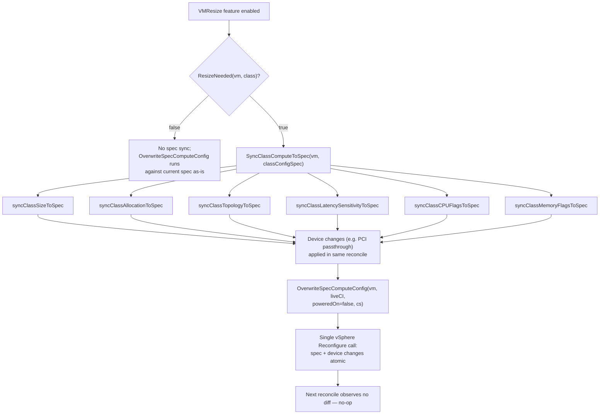
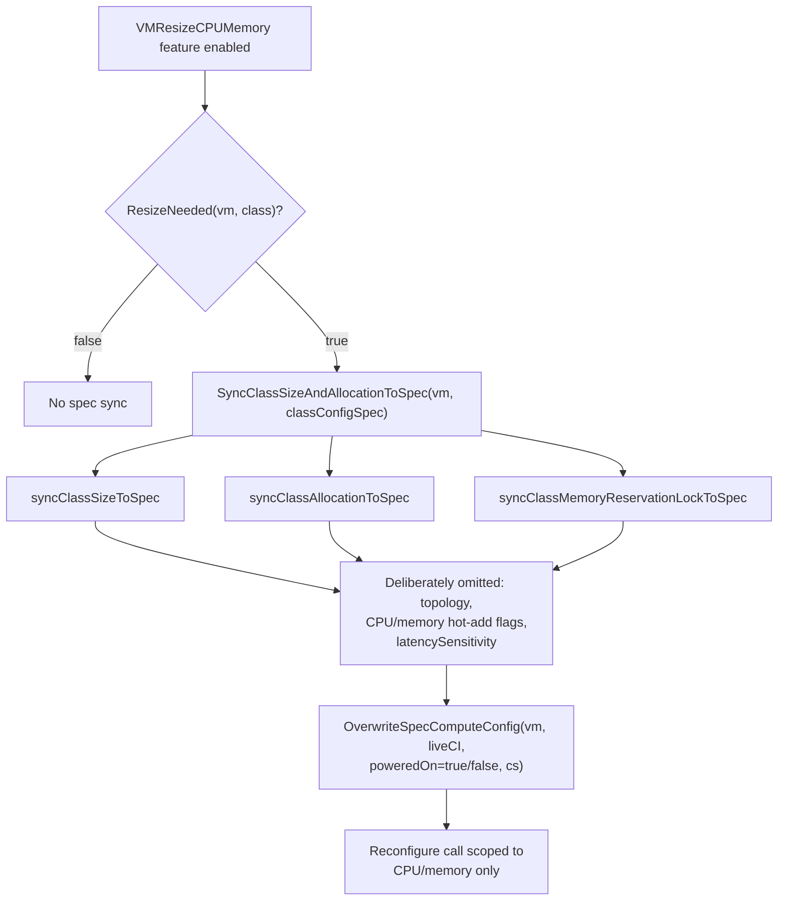

# Feature Specification: VM Compute Configuration Reconciliation

- **Feature branch**: [`compute-config-reconcile`](https://github.com/hpannem/vm-operator/tree/compute-config-reconcile)
  - **Fork**: `hpannem/vm-operator`
  - **PR target**: `vmware-tanzu/vm-operator`
- **Created**: 2026-07-08
- **Status**: In Review
- **Epic**: vmop-3388
- **Design docs**: Design+VM+Compute+Reconfiguration

---

## Summary

VM Operator introduces a compute configuration surface — `spec.resources`, `spec.cpuAdvanced`, and `spec.memoryAdvanced` — that lets a DevOps user directly control a VM's CPU/memory sizing, reservations and limits, CPU topology, and advanced settings, independently of what a `VirtualMachineClass` provides. This surface exists to serve class-less VM workloads, such as Telco VNF workloads, that require precise, per-VM control over vCPU count, guaranteed memory reservation, latency sensitivity, and NUMA topology.

The feature:

1. Reconciles `spec.resources`, `spec.cpuAdvanced`, and `spec.memoryAdvanced` to the live vSphere configuration through one consistent reconciliation path, applied the same way regardless of whether the change originates from a direct spec edit, a full class-based resize, or a narrow CPU/memory-only resize.
2. Applies every compatible field immediately when the VM is powered off, and applies only currently hot-pluggable fields when it is powered on, surfacing — never silently dropping — whatever it cannot apply this cycle.
3. Reports which fields are blocked, and why, via a new `VirtualMachineConditionComputeConfigSynced` status condition.
4. Preserves existing class-based resize behavior: when a VM's class changes, the new `VirtualMachineClass` is authoritative for the compute fields it defines, overriding stale or backfilled spec values, exactly as it does today for backward compatibility.
5. Backfills these fields into the VM spec — for new VMs, imported VMs, and existing VMs going through schema upgrade — populating only the fields the DevOps user has not already set, from the live vSphere config, once per VM.

This entire surface remains inert — rejected outright by the validating webhook — unless the `supports_telco_vm_service_api` supervisor capability is enabled for the Supervisor.

---

## Reconcile pipeline (big picture)

```
VirtualMachineClass (existing)
  │
  └─on class change (existing resize behavior, kept for backward compatibility) ─▶
      copy the new class's compute values into the VM spec, so the class's intent wins over stale or backfilled spec values for that resize
                                    │
                                    ▼
VirtualMachine.spec (resources / cpuAdvanced / memoryAdvanced)
  │
  └─every reconcile─▶ diff spec against the live vSphere config, field by field
                          │ Check hardware-version gate → Check runtime prerequisites → Check hot-pluggability → Apply
                          ├─powered off ─▶ applies every compatible field
                          ├─powered on  ─▶ applies only hot-pluggable fields; defers the rest
                          └─dry-run, before the real apply (status step)─▶
                                Update VirtualMachineComputeConfigSynced condition
```

The field-by-field decision logic for the powered-off and powered-on cases, and for the class-change resize path, is diagrammed in detail under "Reconcile flows" below.

---

## User stories

### US1 — DevOps user: direct control over VM compute configuration (Priority: P0)

A DevOps user sets CPU/memory sizing, reservation and limits, and advanced CPU/memory behavior directly on a `VirtualMachine`, independently of the `VirtualMachineClass`, and VM Operator applies those settings to vSphere.

**Why P0**: This is the primary capability the epic exists to deliver — Classless VM workloads such as Telco VNF workloads MUST need this feature.

**Independent test**: Setting a field in `spec.resources`, `spec.cpuAdvanced`, or `spec.memoryAdvanced` on a `VirtualMachine` with `supports_telco_vm_service_api` enabled results in the live vSphere `ConfigSpec` converging to the requested value, observable via `kubectl get vm -o yaml` status and a vCenter-side check of the live config.

**Acceptance scenarios**:

1. **Given** a powered-off VM, **when** the DevOps user sets `spec.resources.size.cpu` to a new value, **then** VM Operator applies the change on the next reconfigure and `VirtualMachineComputeConfigSynced` becomes `True`.
2. **Given** a powered-on VM with `cpuAdvanced.hotAddEnabled` already `true` on the live config, **when** the DevOps user increases `spec.resources.size.cpu`, **then** VM Operator applies the change immediately, without requiring a power cycle.
3. **Given** a powered-on VM, **when** the DevOps user decreases `spec.resources.size.cpu` (or increases it without hot-add enabled), **then** VM Operator defers the change until the VM is next powered off, and the condition reports `PowerOffRequired`, naming the field.
4. **Given** a VM below the hardware version a field requires (e.g. `cpuAdvanced.hotAddEnabled` needs vmx-11), **when** the DevOps user sets that field, **then** VM Operator leaves the field unapplied on the live VM, retains the requested value in spec, and reports `PrerequisiteNotMet`, naming the field and the required hardware version.
5. **Given** the `supports_telco_vm_service_api` capability is disabled, **when** the DevOps user attempts to set any of `spec.resources`, `spec.cpuAdvanced`, or `spec.memoryAdvanced`, **then** the admission webhook rejects the request.

---

### US2 — DevOps user: diagnosing sync status from a single condition (Priority: P0)

A DevOps user reads `VirtualMachineComputeConfigSynced` to understand why a compute-field change they made has not landed, without needing to inspect vCenter directly.

**Why P0**: Without a single, precedence-ordered condition, a DevOps user would need to separately reason about hardware-version gates, runtime prerequisites, and power-state requirements to explain their VM's state — this condition is the intended single source of truth.

**Independent test**: For any combination of blocked fields, the condition carries exactly one reason and a message naming every field in that category — never a blend of two categories, and never silent about a blocked field.

**Acceptance scenarios**:

1. **Given** one or more fields blocked by a hardware-version gate or an unmet runtime prerequisite (e.g. full CPU/memory reservation for `latencySensitivity=High`), **when** status is reconciled, **then** the condition is `False` with reason `PrerequisiteNotMet`, and the message lists every blocked field with its reason, e.g. `"cpuAdvanced.hotAddEnabled (requires hwVer >= 11)"`.
2. **Given** one or more fields deferred only because the VM is powered on (no hardware-version or prerequisite failures), **when** status is reconciled, **then** the condition is `False` with reason `PowerOffRequired`, and the message lists exactly the power-off-required fields.
3. **Given** fields in both categories on the same reconcile, **when** status is reconciled, **then** `PrerequisiteNotMet` takes precedence over `PowerOffRequired` — the condition reports only the prerequisite-blocked fields until those are resolved.
4. **Given** no blocked fields but at least one field still pending application, **when** status is reconciled, **then** the condition is `False` with reason `ComputeConfigMismatch` until the next reconcile confirms the live config has converged.
5. **Given** every field converged, **when** status is reconciled, **then** the condition is `True`, with no stale reason or message carried over from a prior `False` state.

---

### US3 — DevOps user: class-based resize applies the class's compute intent atomically (Priority: P1)

When a VM is resized onto a new `VirtualMachineClass`, the class's compute values take effect atomically alongside any device changes, without being overridden by stale or backfilled values already present in the VM's spec.

**Why P1**: Without this, class-based resize would silently fail to apply CPU/memory changes whenever the VM's spec still carried old or backfilled compute values, breaking the primary resize experience.

**Independent test**: Resizing a VM onto a class with a different vCPU or memory shape results in a single vSphere Reconfigure call carrying both the class's compute values and any device changes; the next reconcile observes no further diff.

**Acceptance scenarios**:

1. **Given** the full class-resize path is enabled and a resize is needed for a VM moving to a new class, **when** the reconcile runs, **then** the class's compute fields are copied into spec before the diff is computed, and the resulting Reconfigure call applies both the compute change and any device changes together.
2. **Given** the narrow CPU/memory-only resize path is enabled instead, and a resize is needed, **when** the reconcile runs, **then** only CPU/memory size, allocation, and the memory reservation lock are copied into spec — topology, hot-add flags, and `latencySensitivity` are left untouched.
3. **Given** a resize has just been applied, **when** the next reconcile runs, **then** no further diff is detected and `VirtualMachineComputeConfigSynced` is `True`.

---

### US4 — Platform engineer: the compute surface is opt-in per Supervisor (Priority: P2)

A Supervisor can run with the compute-config feature fully disabled, and enabling it does not disrupt VMs that never use it.

**Why P2**: Operational safety; allows phased rollout of a feature this broad in scope.

**Independent test**: With `supports_telco_vm_service_api` disabled, no VM can set `spec.resources`, `spec.cpuAdvanced`, or `spec.memoryAdvanced`, and reconcile behavior for VMs that never set them is unchanged.

**Acceptance scenarios**:

1. **Given** the `supports_telco_vm_service_api` capability is `false`, **when** a VM is admitted, **then** the webhook rejects any request that sets `spec.resources`, `spec.cpuAdvanced`, or `spec.memoryAdvanced`.
2. **Given** the capability is disabled, **when** an existing VM (created before this feature existed) reconciles, **then** its behavior is unchanged — the schema-upgrade backfill does not run, and no new condition is set.
3. **Given** the capability is re-enabled after being disabled, **when** the VM's next reconcile completes, **then** the backfill runs once (if not already recorded for that VM) and normal compute-config reconciliation begins.

---

## Sentinel value semantics

The table below distinguishes two layers: the spec-level sentinels (`nil`/`0`) that a DevOps user sets directly, and the vSphere wire-level `-1` sentinel that the reconcile logic reads from and writes to `ConfigSpec.{Cpu,Memory}Allocation.Limit`. `spec.resources.limits.{cpu,memory}` is the one spec field that also accepts `-1` directly, as an explicit, user-facing alternative to leaving the field `nil` — both mean "unlimited."

| Field | `nil` | `0` | explicit positive | `-1` |
|-------|-------|-----|--------------------|------|
| `resources.size.cpu` / `.memory` | defer to class-derived value; no override | invalid — rejected (`must be greater than 0 when set`) | override; sets guest-visible vCPU count / memory | invalid — negative sizes are always rejected |
| `resources.requests.cpu` / `.memory` | defer to class/vSphere default reservation | valid; explicit reservation of zero | override reservation | invalid — negative reservations are always rejected |
| `resources.limits.cpu` / `.memory` | unlimited — no ceiling set | invalid — rejected (`must be greater than 0 or -1 (unlimited) when set`) | override; explicit ceiling | valid; explicit "unlimited" request, semantically identical to `nil` |
| `cpuAdvanced.topology.coresPerSocket` | defer / clear explicit setting, vSphere auto-sizes | sentinel for "auto," equivalent to `nil` | override; explicit cores-per-socket | invalid — rejected (`Minimum=0`) |
| `cpuAdvanced.topology.vnumaNodeCount` | defer / clear manual vNUMA config | sentinel for "auto," equivalent to `nil` | override; explicit vNUMA node count (requires `coresPerSocket` also set) | invalid — rejected (`Minimum=0`) |
| `cpuAdvanced.{hotAddEnabled,iommuEnabled,nestedHardwareVirtualizationEnabled,performanceCountersEnabled}` / `memoryAdvanced.{hotAddEnabled,reservationLockedToMax}` (`*bool`) | defer / clear, revert to vSphere default | n/a (bool) | override; explicit true/false | n/a (bool) |
| `cpuAdvanced.latencySensitivity` (`*string` enum) | defer / clear, revert to `Normal` | n/a (string) | override; explicit level | n/a (string) |

---

## Reconcile flows

The diagrams below give the field-by-field decision logic in detail: the order in which the hardware-version gate, runtime prerequisite check, and hot-pluggability check apply, for each of the four cases introduced above.

### Diagram A — powered-off reconcile loop



### Diagram B — powered-on reconcile loop



### Diagram C — full class resize path



### Diagram D — narrow CPU/memory-only resize path



---

## Edge cases

- `spec.resources`, `spec.cpuAdvanced`, and `spec.memoryAdvanced` cannot be changed as a whole while a VM is mid schema-upgrade (before the one-time backfill populates them from the live vSphere config); the validating webhook rejects any change to any of the three top-level fields during that window.
- `spec.resources.limits.{cpu,memory}` accept exactly one negative value, `-1`, meaning "no ceiling," semantically identical to leaving the field `nil`; any other negative value (e.g. `-2`) is rejected. The `requests`-vs-`limits` and `reservationLockedToMax`-vs-`limits` ordering checks treat `-1` as unlimited rather than comparing it numerically — a naive comparison against `-1` would otherwise reject any positive `requests` value.
- `spec.resources.requests.{cpu,memory}` MUST reject a negative value directly, the same way `size` does, independent of the `requests`-vs-`size`/`limits` ordering checks — a negative request MUST NOT be admitted even when there is no `size` or `limits` set to compare it against.
- When both a hardware-version/prerequisite block and a power-off-required block exist on the same reconcile, `PrerequisiteNotMet` takes full precedence in the condition's reason and message; the power-off-required fields are not separately listed until the prerequisite is resolved.
- `PowerCyclePending` is a reason reserved for changes that need a guest power cycle after being applied; it is not used by `VirtualMachineComputeConfigSynced` today — only by other conditions (e.g. network extra config).
- `spec.resources`, `spec.cpuAdvanced`, and `spec.memoryAdvanced` are `v1alpha6`-only; on down-conversion to an older API version they are preserved via an annotation (`utilconversion.MarshalData`) and restored on up-conversion (see `model.md` "Conversion strategy") — a client that strips unknown annotations on the older version would lose them.
- `VMResize` and `VMResizeCPUMemory` are mutually exclusive by construction: when both are enabled, `VMResize`'s full resize path is used and `VMResizeCPUMemory`'s narrower sync never runs.

---

## Review & acceptance checklist

- [ ] All user stories have at least two Given/When/Then scenarios.
- [ ] Each scenario is independently testable.
- [ ] Sentinel semantics (`nil` / `0` / explicit / `-1`) are specified for every field, including which layer (spec vs. vSphere wire) each `-1` sentinel belongs to.
- [ ] Condition precedence (`PrerequisiteNotMet` > `PowerOffRequired` > `ComputeConfigMismatch` > `True`) is specified.
- [ ] `supports_telco_vm_service_api` opt-in behavior is specified.
- [ ] Backward-compatibility (schema-upgrade backfill and conversion round trip) is specified.
- [ ] Out-of-scope items are listed.
- [ ] The `requests` negative-value rejection rule is specified.
