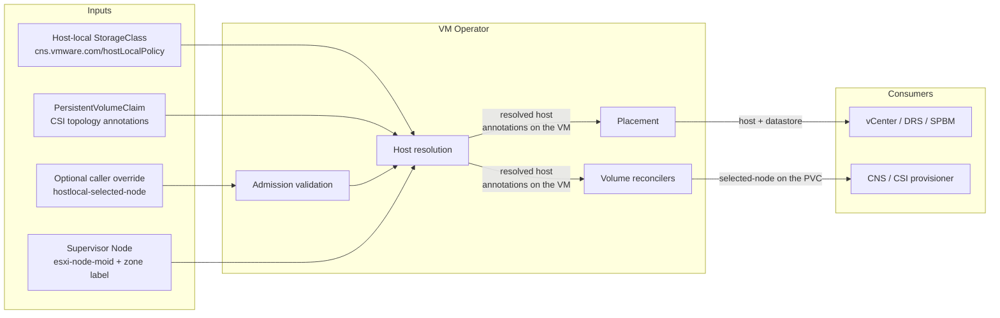
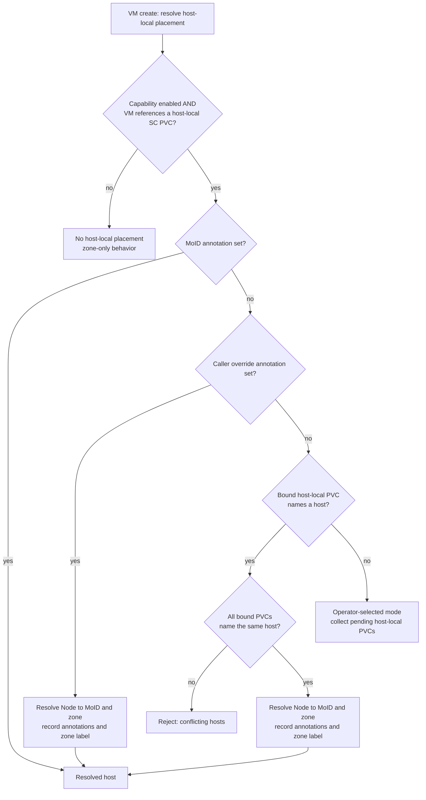
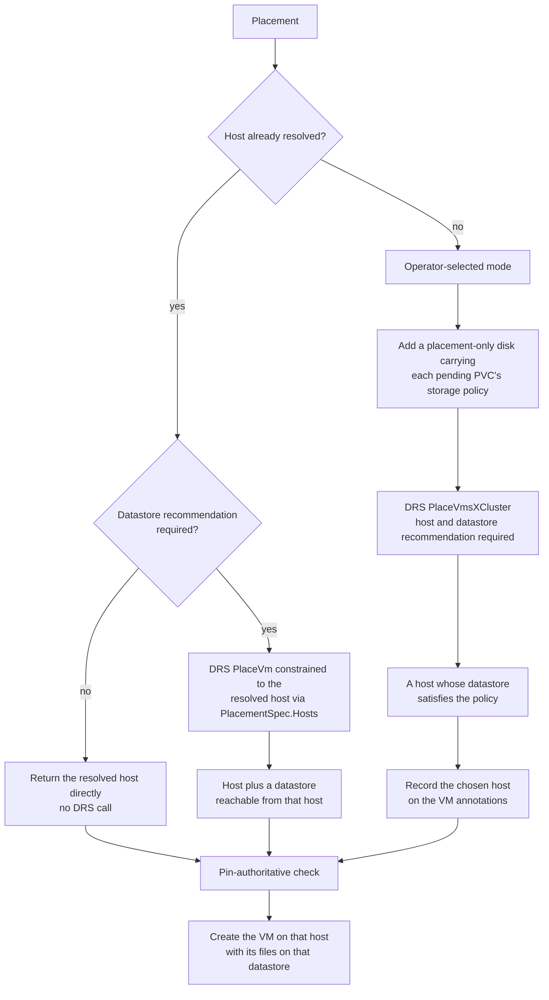
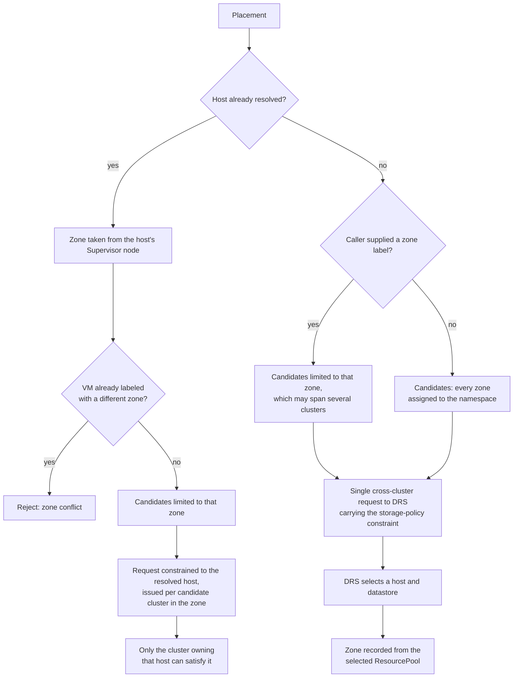
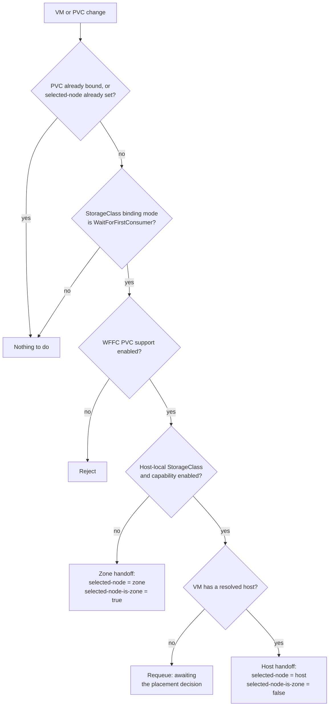
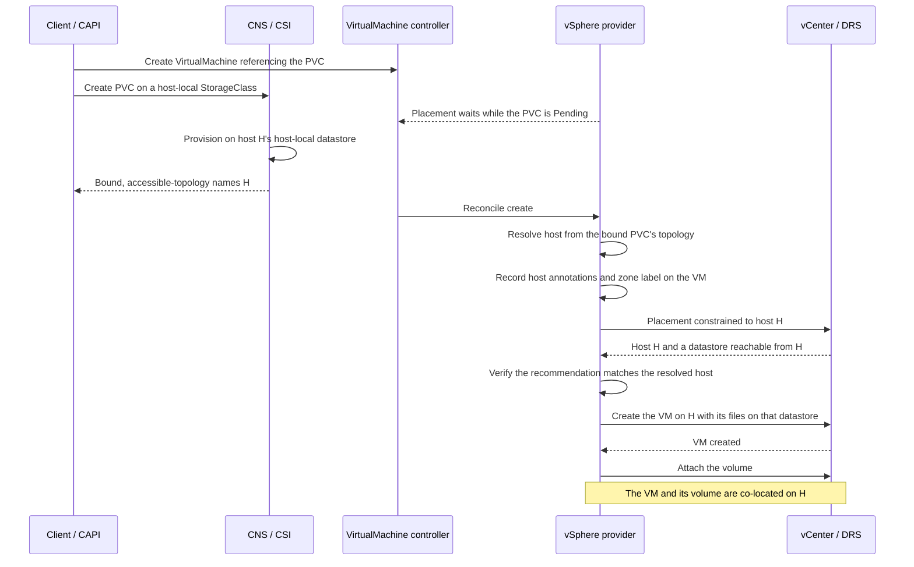

# Architecture: Host-Local Storage Support for VM Service

- **Branch**: `add-support-for-hostlocalstorage`
- **Date**: 2026-07-27
- **Spec**: [`spec.md`](spec.md)
- **Plan**: [`plan.md`](plan.md)
- **Capability**: `supports_host_local_storage` (Supervisor)
- **API group**: `vmoperator.vmware.com/v1alpha6`

---

## 1. Overview

VM Service places virtual machines at **zone** granularity. A namespace maps to
one or more zones, each zone maps to one or more vSphere clusters, and DRS
selects a host within the chosen cluster. Any host in that cluster is
considered equivalent, because the storage backing the VM is assumed to be
reachable from all of them.

Host-local storage breaks that assumption. A **host-local datastore** is a
VMFS-L or VMFS volume direct-attached to, and mounted on, exactly one ESXi
host. A disk placed there is reachable from that host and no other. Storage
locality is therefore a *host* property, while the placement contract is
*zone*-scoped.

This specification defines how VM Service reconciles the two: the ESXi host
becomes an explicit, persisted placement decision recorded on the
`VirtualMachine`, and that decision is then propagated in two directions — to
vSphere placement, so the VM is created on that host with its files on that
host's datastore, and to CNS/CSI, so volumes are provisioned there.

### 1.1 Goals

- Create a VM on the specific ESXi host that owns the host-local datastore its
  volumes require.
- Support volumes that are already provisioned on a host, and volumes not yet
  provisioned that must follow the VM.
- Derive the zone and vSphere cluster from storage locality, rather than
  requiring the caller to know either — including when the namespace is
  assigned multiple zones.
- Allow a caller to nominate the target host explicitly.
- Guarantee that once a host is chosen it is never silently substituted.
- Remain completely inert when the capability is disabled.

### 1.2 Non-goals

- Migrating or rebalancing a VM across hosts after creation.
- Host-local placement for VMs placed via a `VirtualMachineGroup`.
- Combining host-local storage with instance storage on one VM.
- Managing the lifecycle of the host-local datastores or storage policies
  themselves.

---

## 2. Concepts

| Term | Meaning |
|---|---|
| Host-local datastore | VMFS-L or VMFS volume attached to and mounted on a single ESXi host. |
| Host-local `StorageClass` | A `StorageClass` annotated `cns.vmware.com/hostLocalPolicy: "true"`, whose SPBM policy is satisfied only by host-local datastores. |
| Supervisor node | A Kubernetes `Node` representing an ESXi host. Carries `vmware-system-esxi-node-moid` and `topology.kubernetes.io/zone`. |
| Topology annotations | CNS/CSI annotations on a PVC: `csi.vsphere.volume-accessible-topology` once bound, `csi.vsphere.volume-requested-topology` when pending. They carry a `kubernetes.io/hostname` only for host-local storage. |
| Resolved host | The ESXi host a VM has been bound to, recorded on the VM as annotations. |

### 2.1 Topology invariants

The design relies on three properties of the Supervisor topology model. They are
what make a host a sufficient placement decision on its own:

1. **An ESXi host belongs to exactly one vSphere cluster.** Naming a host
   therefore names its cluster unambiguously.
2. **A Supervisor node belongs to exactly one zone**, and always publishes it
   via `topology.kubernetes.io/zone`. Naming a host therefore names its zone
   unambiguously.
3. **A host-local datastore is mounted on exactly one host.** Naming the
   datastore's host is the only way to reach the volume.

Together these make host, cluster and zone a single, consistent decision:
resolving the host resolves all three, with no ambiguity to arbitrate and no
preference to express.

---

## 3. Architecture

Host selection is a decision made once, recorded on the `VirtualMachine`
object, and consumed by two independent reconcilers. The VM's annotations are
the contract between them; the handoff is asynchronous and level-triggered,
consistent with the rest of VM Service.



### 3.1 Components

| Component | Responsibility |
|---|---|
| `pkg/config/capabilities` | Maps the `supports_host_local_storage` capability to `pkgcfg.Features.HostLocalStorage`. |
| `pkg/util/kube` | `IsHostLocalStorageClass`, `GetPVCHostLocalHostname`, `GetESXHostInfoForNode`. |
| `pkg/providers/vsphere/vmprovider_vm_hostlocal.go` | Resolves the target host and records it on the VM. |
| `pkg/providers/vsphere/placement` | Applies the resolved host to placement, or selects one when none exists. |
| `pkg/providers/vsphere/virtualmachine` | Expresses storage-policy requirements to DRS via a placement-only disk. |
| `controllers/virtualmachine/volume`, `.../volumebatch` | Publishes the resolved host to CNS/CSI on the PVC. |
| `webhooks/virtualmachine/validation` | Validates and protects the host annotations. |

### 3.2 API surface

Two annotations on the `VirtualMachine` form the recorded decision:

| Annotation | Value | Set by | Mutability |
|---|---|---|---|
| `vmoperator.vmware.com/hostlocal-selected-node` | Supervisor node name, i.e. the ESXi host FQDN | Caller, as an explicit request; otherwise VM Operator | Immutable once set; privileged accounts may change it for restore and fail-over |
| `vmoperator.vmware.com/hostlocal-selected-node-moid` | ESXi `HostSystem` MoID | VM Operator only | Rejected from non-privileged callers |

This mirrors the existing `topology.kubernetes.io/zone` label, which is both a
caller-supplied placement request and the system's record of the decision. One
annotation on the PVC completes the contract with CNS: the existing
`cns.vmware.com/selected-node-is-zone` is written `"false"`, indicating that
`volume.kubernetes.io/selected-node` names a host rather than a zone.

---

## 4. Host resolution

Resolution runs during VM creation, before placement, and is a no-op unless the
capability is enabled and the VM references at least one host-local
`StorageClass` PVC. Four sources are consulted in priority order.

| Priority | Source | Behavior |
|---|---|---|
| 1 | MoID annotation already present | Already resolved; reuse it. |
| 2 | Caller override annotation | Resolve the named node to its MoID and zone. |
| 3 | A **Bound** host-local PVC's topology hostname | The volume already exists on a host; the VM must follow it. |
| 4 | **Pending** host-local PVCs with no hostname | No host exists yet; VM Operator selects one and the volume follows the VM. |

Priorities 1-3 yield a **host-derived** decision. Priority 4 yields an
**operator-selected** decision, the only case in which VM Operator asks DRS to
choose.



A VM whose volumes are bound to two different hosts is unsatisfiable and is
rejected rather than partially placed.

---

## 5. Placement

Placement consumes the resolved host in one of three ways, depending on whether
a host is already known and whether a datastore recommendation is required.



### 5.1 Expressing storage locality to DRS

In operator-selected mode the volume does not yet exist, so DRS has nothing to
tell it which hosts are viable. VM Operator therefore adds a **placement-only
disk** to the ConfigSpec sent to DRS: one synthetic `VirtualDisk` per pending
host-local PVC, sized to the request and tagged with that PVC's SPBM policy ID.
The disk exists solely to make SPBM compliance part of the host-selection
calculation; it is never created, and never appears in the ConfigSpec used to
create the VM.

Two properties of the vSphere placement APIs shape this design:

- **SPBM compliance is only evaluated when a datastore recommendation is
  requested.** Host-local placement therefore always requests one, so that the
  recommended host is guaranteed to have a policy-compliant datastore.
- **Only the single-cluster placement API can constrain a request to a specific
  host.** When a host is already resolved *and* a datastore recommendation is
  needed, placement uses that API with `PlacementSpec.Hosts` set to the
  resolved host, so the datastore returned is reachable from it. The
  cross-cluster API cannot express this constraint for a create.

### 5.2 Datastore placement on create

The VM's own files — home directory and boot disk — must also land on the
resolved host's host-local datastore. This requires a create path that places
VM files on an **explicit** datastore rather than delegating the choice to
vCenter. Host-local VMs therefore use the fast-deploy create path, which
receives the recommended datastore and creates the VM directory and disk
backing there.

The alternative create path supplies a storage *profile* rather than a
datastore, and can only pin a datastore when no profile is present. With a
host-local profile, vCenter is free to select any policy-compliant datastore,
including one attached to a different host. Host-local placement consequently
depends on explicit datastore placement.

### 5.3 Zone and cluster selection

A Supervisor namespace may be assigned several zones, and **a single zone may
itself span several vSphere clusters** — `Zone.Spec.ManagedVMs.PoolMoIDs` and
`ClusterMoIDs` are lists, documented as "a zone may be comprised of multiple
ResourcePools / Clusters".

**There is no notion of an "active", primary or preferred cluster** for a zone
or a namespace, and host-local placement does not introduce one. Zone and
cluster are consequences of the host decision, not inputs to it:

| | Host-derived mode | Operator-selected mode |
|---|---|---|
| **Zone** | **Determined by the host.** Read from the resolved Supervisor node's `topology.kubernetes.io/zone` label and written to the VM's zone label. Unambiguous by invariant 2 of §2.1. A caller-supplied zone label that disagrees is rejected. | **An output.** If the caller supplied a zone label, candidates are restricted to that zone; otherwise every zone assigned to the namespace is a candidate. The selected zone is recorded on the VM. |
| **Cluster** | **Determined by the host.** By invariant 1 of §2.1 a host belongs to exactly one cluster, so exactly one candidate cluster can satisfy a request constrained to that host. | **An output.** Every candidate ResourcePool across every candidate zone is offered to DRS in a single cross-cluster request, subject to the storage-policy constraint of §5.1. |

In other words, for a VM whose volumes are already provisioned, storage
locality determines the host, and the host in turn determines both the cluster
and the zone. For a VM whose volumes do not yet exist, DRS selects across
everything the namespace is entitled to, and the zone is recorded afterwards
from whichever ResourcePool was chosen.



Two consequences worth stating explicitly:

- **Pinning a zone is not pinning a cluster.** A caller-supplied zone label
  narrows candidates to one zone, which may still contain several clusters.
  Only a resolved host narrows the decision to a single cluster.
- **Cluster entitlement is expressed solely through the candidate ResourcePool
  list.** `Zone.Spec.AllowedClusterComputeResourceMoIDs` exists in the API but
  is not consulted by placement today.

### 5.4 Binding modes and host-selection authority

Which of the two modes in §4 a VM takes is decided by the binding mode of the host-local `StorageClass`, because that is what decides whether CNS provisions the volume before or after a consumer exists — and therefore whether **CNS** or **VM Operator** chooses the host.

| | `Immediate` | `WaitForFirstConsumer` |
|---|---|---|
| **When CNS provisions** | On PVC creation; no consumer required | Only once a consumer nominates a node |
| **Who selects the host** | **CNS**, autonomously | **VM Operator** (operator-selected, §4) |
| **How VM Operator learns it** | Reads the bound PVC's accessible-topology — host-derived mode | It made the decision, and publishes it via the volume handoff (§6) |
| **VM creation meanwhile** | **Waits for the bind.** A `Pending` PVC yields a "not bound" error from zone-constraint derivation, so placement retries until CNS binds the volume | Proceeds; the volume follows the VM |
| **Several host-local PVCs on one VM** | **Co-location is not guaranteed.** Each volume is provisioned independently and may land on a different host, which the VM then rejects as unsatisfiable (§9). This mirrors existing zonal behavior at host granularity rather than being new — see §11 item 5 | **Co-location is guaranteed.** One host is chosen for the VM and stamped on every host-local PVC |

#### 5.4.1 The requested-topology contract

`csi.vsphere.volume-requested-topology` is an input to *CNS*, not to VM Operator — VM Operator only ever reads topology annotations, and never writes this one. For a host-local `StorageClass` it has three meaningful states:

- **Absent.** CNS performs its own host selection and records the outcome in the accessible-topology annotation. This is the state VKS/CAPI node volumes are created in.
- **Names a `kubernetes.io/hostname`.** CNS honors it.
- **Names a zone but no hostname.** Unsatisfiable: host-local provisioning requires a hostname, so CNS refuses. Because VM placement is simultaneously waiting for the bind, no hostname is ever produced from the other direction either, and neither side can advance. **A zone-only value is therefore worse than omitting the annotation entirely.**

#### 5.4.2 Options for a client that needs several co-located volumes

A client that attaches more than one host-local volume to a VM needs all of them on one host. This is the same choice a client already faces with zonal volumes, where several `Immediate`-bound PVCs must end up in a common zone (§11 item 5); host-local storage narrows the domain from a zone to a host but does not change the options. Three arrangements achieve co-location, with different division of responsibility:

1. **A `WaitForFirstConsumer` class.** VM Operator selects one host for the VM subject to storage-policy compliance, and stamps it on every host-local PVC. The client needs no host knowledge, and co-location holds by construction.
2. **An `Immediate` class with an explicit hostname on every host-local PVC of the VM.** Co-location holds by construction, but the client must choose the host itself, without DRS's view of capacity or policy compliance. Where the intent is specifically to pin a chosen host, the VM's own node annotation (§3.2) expresses that same intent to VM Operator and is validated at admission.
3. **An `Immediate` class with the annotation omitted.** CNS selects. Sufficient for a single volume; with several volumes, nothing correlates the independent provisioning decisions.

#### 5.4.3 Ordering under Immediate binding

The wait-then-follow ordering is the part that is easy to misread, since the VM object exists from the start — it is the VM's *placement* that waits, not its creation.

```mermaid
sequenceDiagram
    participant Client as Client / CAPI
    participant CSI as CNS / CSI
    participant VMC as VirtualMachine controller
    participant Prov as vSphere provider

    Client->>VMC: Create VirtualMachine
    Client->>CSI: Create host-local PVC on an Immediate class
    Note over Client,CSI: Both objects may be created together
    VMC->>Prov: Reconcile create
    Prov-->>VMC: PVC is Pending, so placement waits for the bind
    CSI->>CSI: Provision without a consumer, selecting host H
    CSI-->>Client: Bound; accessible-topology names H
    VMC->>Prov: Reconcile again
    Prov->>Prov: Host-derived resolution adopts H
    Note over Prov: Continues as in §7.1
```

### 5.5 Invariants

1. **A resolved host is authoritative.** If placement returns a *different*
   host than the resolved one, the operation fails rather than proceeding. A
   recommendation that returns *no* host is not a conflict — it means no host
   was requested — and the resolved host is preserved.
2. **The decision precedes creation.** The host is resolved and recorded before
   the VM is created on vCenter, so a retried create reuses the same host.
3. **The decision is immutable.** Enforced at admission for the node
   annotation, with a privileged carve-out for restore and fail-over.
4. **A resolved host implies a zone.** The zone label is derived from the
   Supervisor node's zone, keeping host and zone decisions consistent.

---

## 6. Volume handoff

For a pending volume, the host decision must reach CNS before provisioning. The
volume reconcilers watch the `VirtualMachine`, read the resolved host from its
annotations, and stamp the PVC. Because they observe the VM rather than
participate in its creation, the handoff tolerates arbitrary ordering: until
the annotation appears the reconciler returns a retryable error and waits.



---

## 7. End-to-end sequences

### 7.1 Host-derived: volume bound before the VM is placed

This is the path taken when the volume is bound before the VM is placed, such as a VKS/CAPI cluster node whose additional volume uses an `Immediate`-binding host-local `StorageClass`. The VM and the PVC may be created together; what matters is that CNS binds the volume — and so fixes its host — before VM placement runs. See §5.4 for why the binding mode decides this.



### 7.2 Operator-selected: volume follows the VM

This is the path taken for a `WaitForFirstConsumer` host-local
`StorageClass`, where no host exists until a consumer appears.

```mermaid
sequenceDiagram
    participant Client
    participant VMC as VirtualMachine controller
    participant Prov as vSphere provider
    participant VC as vCenter / DRS
    participant VolC as Volume reconciler
    participant CSI as CNS / CSI

    Client->>VMC: Create VirtualMachine and a pending PVC
    VMC->>Prov: Reconcile create
    Prov->>Prov: No host resolvable; enter operator-selected mode
    Prov->>Prov: Add a placement-only disk carrying the PVC's storage policy
    Prov->>VC: Request a host and datastore recommendation
    VC-->>Prov: Host H whose datastore satisfies the policy
    Prov->>Prov: Record host annotations and zone label on the VM
    Prov->>VC: Create the VM on H with its files on that datastore
    VMC->>VMC: Persist the VM, including the host annotations
    VolC->>VolC: Observe the VM's resolved host
    VolC->>CSI: Set selected-node to H, selected-node-is-zone false
    CSI->>CSI: Provision the volume on H's host-local datastore
    CSI-->>VolC: Bound
    Note over Prov,CSI: The volume follows the VM to H
```

---

## 8. Interaction with adjacent features

| Feature | Interaction |
|---|---|
| Fast deploy | **Required.** Provides explicit datastore placement on create, as described in §5.2. |
| Zones | A resolved host implies a zone; the zone label is set from the node's zone and must remain consistent with it. |
| Instance storage | Not supported together. Both features determine the host, and their requirements can conflict; the conflict surfaces as the invariant in §5.5.1 rather than a mis-placed VM. |
| VM Groups | Not supported. Group placement computes a batch, multi-VM recommendation independently of the per-VM path this feature extends. |
| Zone constraints from PVCs | Unchanged. Existing zone-level constraint derivation continues to apply and is complementary. The two mechanisms also share a failure mode at their respective granularities: several `Immediate`-bound PVCs may be provisioned into domains that do not intersect, and the VM is rejected (§11 item 5). |

---

## 9. Error semantics

| Condition | Behavior |
|---|---|
| Volumes bound to different hosts | Reject; the request is unsatisfiable. |
| Placement returns a host other than the resolved one | Fail the operation; never substitute silently. |
| Caller names a node that does not exist or lacks a host MoID | Reject at admission. |
| Caller sets the MoID annotation | Reject at admission for non-privileged accounts. |
| Caller changes a resolved node annotation | Reject at admission for non-privileged accounts. |
| Resolved host not yet available to the volume reconciler | Retry until it is; no fallback to zone placement. |
| No host has a policy-compliant datastore | Surfaces as a placement failure with no candidates. |
| Pending host-local PVC on an `Immediate` class | Placement waits for the bind, then adopts the host CNS chose (§5.4). |
| Requested topology names a zone but no host, on a host-local class | CNS cannot provision, so the wait above does not terminate until the annotation is corrected (§5.4.1). |

The "no policy-compliant datastore" row is the intended behavior: a VM that
cannot be satisfied does not get created somewhere it will not work.

---

## 10. Validation

Unit and integration coverage spans the capability mapping, the helper
functions, host resolution, placement routing, the placement-only disk, the
volume handoff in both reconcilers, and admission validation, alongside the
existing provider suite.

Validated on a vSphere Supervisor with a host-local VMFS `StorageClass` in both
binding modes:

| Scenario | Path | Outcome |
|---|---|---|
| Standalone VM, `WaitForFirstConsumer` volume, host-local VM storage class | Operator-selected | VM created on the resolved host; volume provisioned on that host; guest booted with volumes attached |
| VKS cluster, control plane and worker, `Immediate` additional volume | Host-derived | Each VM independently resolved to its own host, with that VM's boot disk and additional volume both on that host |

---

## 11. Scope limitations and follow-on work

1. **End-to-end suite coverage.** A Supervisor-level E2E spec, skipped unless
   the capability is active, is required to guard this behavior in CI.
2. **VM Groups.** Currently unsupported; a validation error would be clearer
   than falling back to zone-only placement.
3. **Self-referential volumes.** Volumes whose data source is the VM itself are
   derived from the VM's own placement and need not participate in host
   resolution; excluding them keeps the conflict check strictly about
   externally-provisioned volumes.
4. **Post-creation movement.** Nothing prevents an administrator from
   relocating a host-local VM in vCenter; detecting and reporting that drift is
   out of scope.
5. **Several `Immediate`-bound volumes on one VM may be provisioned into
   different topology domains.** This is a pre-existing property of `Immediate`
   binding at *any* granularity, not something host-local storage introduces.
   Each PVC is provisioned before a consumer exists, so nothing correlates the
   decisions; if they diverge, the VM is rejected as unsatisfiable rather than
   created somewhere its disks are unreachable.

   The zonal form of this predates the feature and is asserted by existing
   tests: `GetPVCZoneConstraints` intersects each PVC's zone set and errors
   when the intersection is empty (`no allowed zones remaining after applying
   PVC zone constraints`), covered for both `Bound` and `Pending` PVCs. The
   host-local form is the same rule one domain level down — disagreeing
   hostnames are rejected per §9.

   What host-local storage changes is how often the case is reached, not
   whether it exists. Most namespaces are assigned a single zone, leaving
   zonal volumes no domain to diverge across, whereas every cluster has many
   hosts — so divergence becomes the default outcome rather than an edge case.

   Correlating independent provisioning decisions is not something VM Operator
   can reach; it would have to happen at provisioning time. The mitigation is
   the one upstream Kubernetes prescribes for topology-constrained volumes:
   `WaitForFirstConsumer`, under which one host is chosen for the VM and
   stamped on every host-local PVC. See §5.4.2 for the client-side options.
6. **The owning cluster is discovered rather than looked up.** In a
   multi-cluster zone the host-constrained request is issued per candidate
   cluster, and the clusters that do not own the host decline. By invariant 1
   of §2.1 exactly one can ever succeed, so the outcome is deterministic;
   resolving the host's cluster up front would simply avoid the redundant
   calls and state the intent directly.

---

## 12. Implementation reference

Companion artifacts for this feature: [`spec.md`](spec.md) for user-visible
behavior and acceptance criteria, [`plan.md`](plan.md) for the technical
approach, and [`tasks.md`](tasks.md) for the task breakdown. User-facing
documentation lives in
[`docs/concepts/workloads/vm-placement.md`](../../../docs/concepts/workloads/vm-placement.md).

Files carrying the implementation, for reviewer orientation:

- `pkg/config/capabilities/capabilities.go`, `pkg/config/config.go`
- `pkg/providers/vsphere/constants/constants.go`
- `pkg/util/kube/node.go`, `pkg/util/kube/storage.go`
- `pkg/providers/vsphere/vmprovider_vm_hostlocal.go`
- `pkg/providers/vsphere/placement/zone_placement.go`, `cluster_placement.go`
- `pkg/providers/vsphere/virtualmachine/configspec.go`, `devices.go`
- `controllers/virtualmachine/volume/volume_controller.go`,
  `controllers/virtualmachine/volumebatch/volumebatch_controller.go`
- `webhooks/virtualmachine/validation/virtualmachine_validator.go`
- `docs/concepts/workloads/vm-placement.md`
