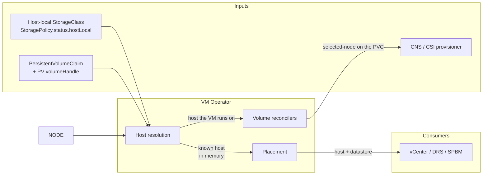
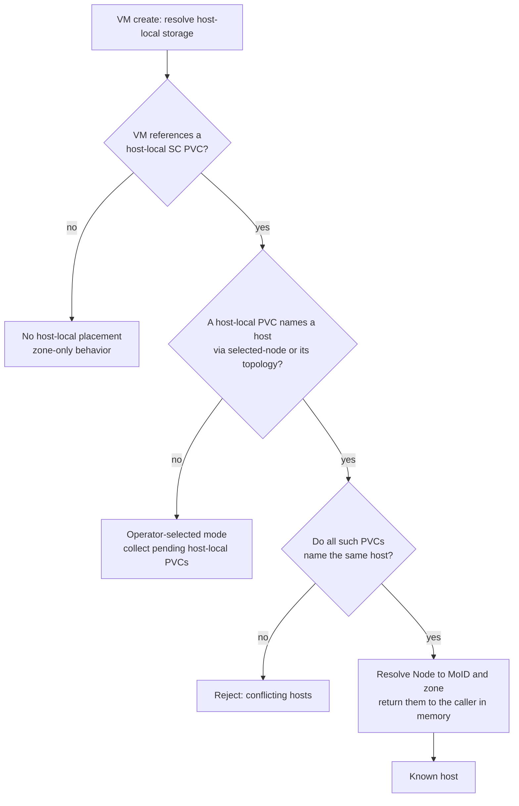
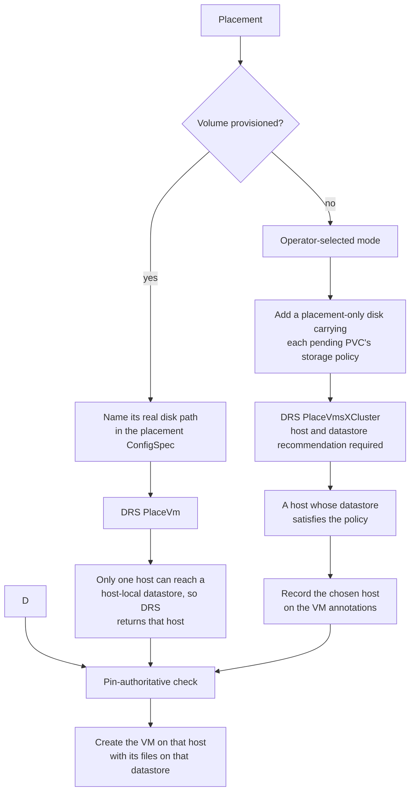
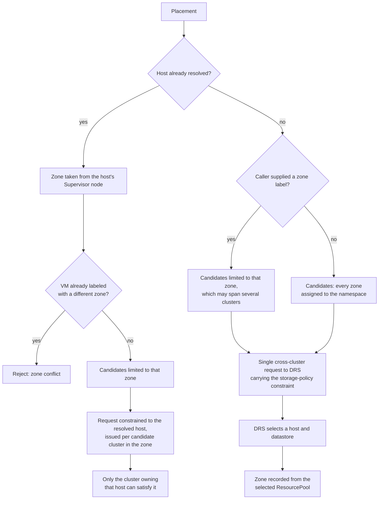
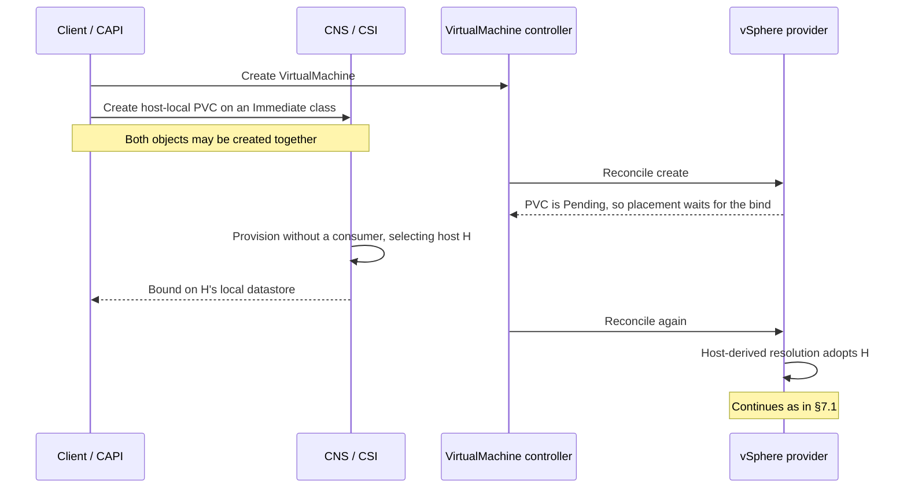
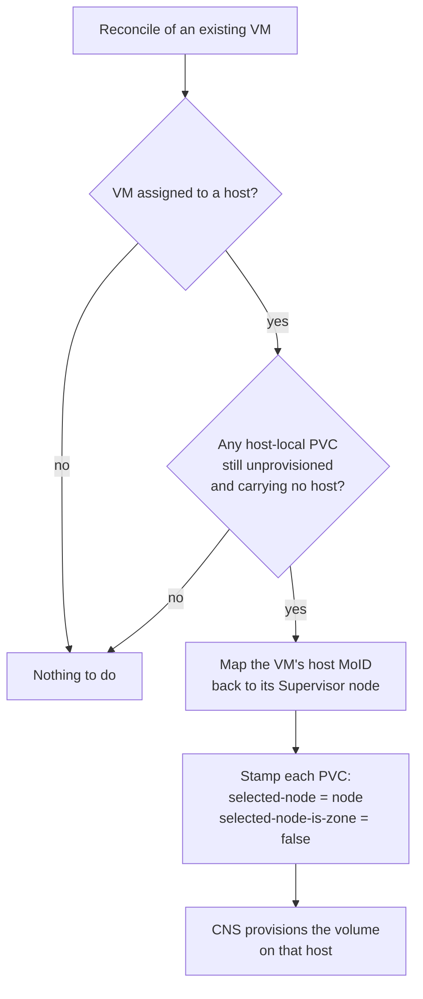
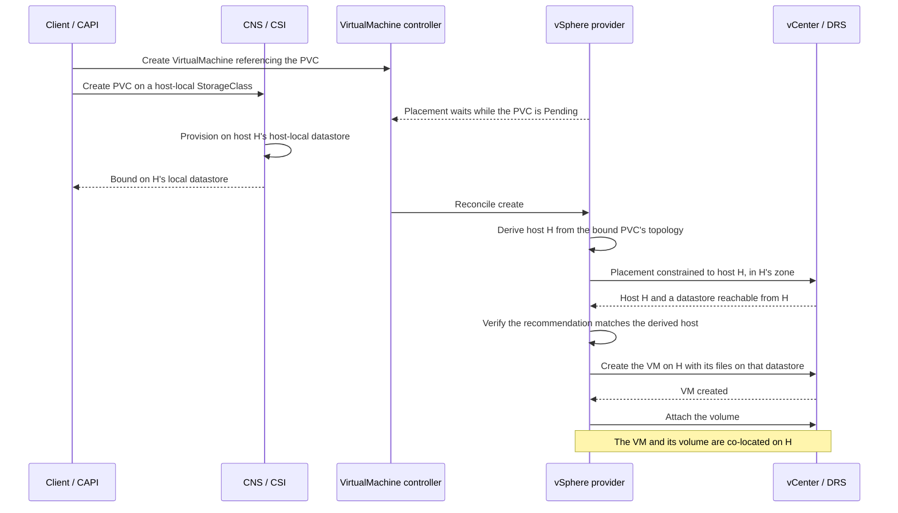

# Architecture: Host-Local Storage Support for VM Service

- **Branch**: `add-support-for-hostlocalstorage`
- **Date**: 2026-07-27
- **Spec**: [`spec.md`](spec.md)
- **Plan**: [`plan.md`](plan.md)
- **Capability**: `supports_host_local_storage` (Supervisor)
- **API group**: `vmoperator.vmware.com/v1alpha6`

---

## 1. Overview

VM Service places virtual machines at **zone** granularity. A namespace maps to
one or more zones, each zone maps to one or more vSphere clusters, and DRS
selects a host within the chosen cluster. Any host in that cluster is
considered equivalent, because the storage backing the VM is assumed to be
reachable from all of them.

Host-local storage breaks that assumption. A **host-local datastore** is a
direct attached VMFS datastore mounted on a single ESXi host. A disk placed
there is reachable from that host and no other. Storage
locality is therefore a *host* property, while the placement contract is
*zone*-scoped.

This specification defines how VM Service reconciles the two: the ESXi host is
derived from the VM's volumes on every reconcile, and that decision is
propagated in two directions — to vSphere placement, so the VM is created on
that host with its files on that host's datastore, and to CNS/CSI, so volumes
are provisioned there.

### 1.1 Goals

- Create a VM on the specific ESXi host that owns the host-local datastore its
  volumes require.
- Support volumes that are already provisioned on a host, and volumes not yet
  provisioned that must follow the VM.
- Derive the zone and vSphere cluster from storage locality, rather than
  requiring the caller to know either — including when the namespace is
  assigned multiple zones.
- Guarantee that once a host is chosen it is never silently substituted.
- Remain completely inert when the capability is disabled.

### 1.2 Non-goals

- Migrating or rebalancing a VM across hosts after creation.
- Host-local placement for VMs placed via a `VirtualMachineGroup`.
- Combining host-local storage with instance storage on one VM.
- Managing the lifecycle of the host-local datastores or storage policies
  themselves.

---

## 2. Concepts

| Term | Meaning |
|---|---|
| Host-local datastore | Direct attached VMFS datastore mounted on a single ESXi host. |
| Host-local `StorageClass` | A `StorageClass` whose SPBM policy declares the `StorageLocality` capability, so it is satisfied only by host-local datastores. Observed on `StoragePolicy.status.hostLocal`. |
| Supervisor node | A Kubernetes `Node` representing an ESXi host. Carries `vmware-system-esxi-node-moid` and `topology.kubernetes.io/zone`. |
| Selected node | `volume.kubernetes.io/selected-node` on a PVC, naming the node CNS must provision on. Paired with `cns.vmware.com/selected-node-is-zone=false` for a host. |
| Disk path | A volume's real datastore path, e.g. `[local-1] fcd/<id>.vmdk`, obtained from CNS. Naming it in the placement ConfigSpec is what lets DRS work out the host. |

### 2.1 Topology invariants

The design relies on three properties of the Supervisor topology model. They are
what make a host a sufficient placement decision on its own:

1. **An ESXi host belongs to exactly one vSphere cluster.** Naming a host
   therefore names its cluster unambiguously.
2. **A Supervisor node belongs to exactly one zone**, and always publishes it
   via `topology.kubernetes.io/zone`. Naming a host therefore names its zone
   unambiguously.
3. **A host-local datastore is mounted on exactly one host.** Naming the
   datastore's host is the only way to reach the volume.

Together these make host, cluster and zone a single, consistent decision:
resolving the host resolves all three, with no ambiguity to arbitrate and no
preference to express.

---

## 3. Architecture

Host selection is derived from the VM's PVCs and consumed by two independent
paths: placement, and the handoff that publishes the host back to those PVCs.
The PVC is the contract between them; the handoff is asynchronous and
level-triggered, consistent with the rest of VM Service.



### 3.1 Components

| Component | Responsibility |
|---|---|
| `pkg/config/capabilities` | Maps the `supports_host_local_storage` capability to `pkgcfg.Features.HostLocalStorage`. |
| `pkg/util/kube` | `IsHostLocalStorageProfile`, `HasVirtualMachineDataSourceRef`. |
| `pkg/providers/vsphere/vmprovider_vm_hostlocal_storage.go` | Resolves each bound volume's disk path from CNS, adds the per-PVC placement disks, and publishes the host to the PVCs after create. |
| `pkg/providers/vsphere/placement` | Requests a DRS host recommendation via `PlaceVm` when the VM has host-local storage. |
| `pkg/providers/vsphere/virtualmachine` | Expresses storage-policy requirements to DRS via a placement-only disk. |
| `controllers/virtualmachine/volume`, `.../volumebatch` | Publishes the resolved host to CNS/CSI on the PVC. |

### 3.2 API surface

**No annotation on the `VirtualMachine` takes part in this feature at all** —
VM Operator neither reads nor writes one. The host is derived afresh on every
reconcile from the VM's PVCs, so a VM whose creation fails is free to be placed
elsewhere on the next attempt. See §5.4.

The decision is instead published on the PVC, which is also the contract with
CNS:

| PVC annotation | Value |
|---|---|
| `volume.kubernetes.io/selected-node` | The Supervisor node whose host the volume must be provisioned on |
| `cns.vmware.com/selected-node-is-zone` | `"false"`, indicating the above names a host rather than a zone |

Putting the decision on the PVC rather than on the VM means the object that the
decision is *about* carries it, and a later reconcile recovers the decision by
reading it back.

---

## 4. Host resolution

Resolution runs during VM creation, before placement. The caller checks the
capability and only resolves when it is enabled; resolution itself is a no-op
unless the VM references at least one host-local `StorageClass` PVC. Every
source is a **PVC**, and each is a fact established outside of placement, so
deriving them again on a later reconcile is stable.

| Priority | Source | Behavior |
|---|---|---|
| 1 | A host-local PVC already carrying a **selected node** | How a host chosen by an earlier placement is remembered. |
| 2 | A **Bound** host-local PVC's topology hostname | The volume already exists on a host; the VM must follow it. |
| — | **Pending** host-local PVCs with no host | No host exists yet; VM Operator selects one and the volume follows the VM. |

The first two yield a **host-derived** decision. The last yields an
**operator-selected** decision, the only case in which VM Operator asks DRS to
choose.



A VM whose volumes are on two different hosts is unsatisfiable and is rejected
rather than partially placed.

---

## 5. Placement

Placement consumes the resolved host in one of three ways, depending on whether
a host is already known and whether a datastore recommendation is required.



### 5.1 Expressing storage locality to DRS

In operator-selected mode the volume does not yet exist, so DRS has nothing to
tell it which hosts are viable. VM Operator therefore adds **placement-only
disks** to the ConfigSpec sent to DRS: one synthetic `VirtualDisk` per PVC
attached to the VM, sized to the volume's capacity and tagged with that PVC's
SPBM policy ID. These disks exist solely to make SPBM compliance part of the
host- and datastore-selection calculation; they are never created, and never
appear in the ConfigSpec used to create the VM.

This is not specific to host-local storage. Every PVC a VM references
contributes a placement-only disk, so that the recommendation accounts for all
of the VM's storage rather than only the VM's own files — host-local storage is
simply the case where the resulting host constraint is load-bearing.

One exclusion matters: a PVC whose data source is the VM **itself** is skipped.
Those volumes are the VM's own disks, which already appear in the ConfigSpec
with their policy and size applied, so adding a synthetic disk for them would
count the same storage twice. This is the same exclusion that zone-constraint
derivation makes, and both now share one predicate.

Two properties of the vSphere placement APIs shape this design:

- **SPBM compliance is only evaluated when a datastore recommendation is
  requested.** Host-local placement therefore always requests one, so that the
  recommended host is guaranteed to have a policy-compliant datastore.
- **Only the single-cluster placement API honors the disks in the ConfigSpec.**
  Measured against real DRS, the cross-cluster API returns the same host
  whatever disks the ConfigSpec names — including hosts that cannot reach the
  datastore it names. Host-local placement therefore always uses `PlaceVm`.

### 5.2 Datastore placement on create

The VM's own files — home directory and boot disk — must also land on the
resolved host's host-local datastore. This requires a create path that places
VM files on an **explicit** datastore rather than delegating the choice to
vCenter. Host-local VMs therefore use the fast-deploy create path, which
receives the recommended datastore and creates the VM directory and disk
backing there.

The alternative create path supplies a storage *profile* rather than a
datastore, and can only pin a datastore when no profile is present. With a
host-local profile, vCenter is free to select any policy-compliant datastore,
including one attached to a different host. Host-local placement consequently
depends on explicit datastore placement.

### 5.3 Zone and cluster selection

A Supervisor namespace may be assigned several zones, and **a single zone may
itself span several vSphere clusters** — `Zone.Spec.ManagedVMs.PoolMoIDs` and
`ClusterMoIDs` are lists, documented as "a zone may be comprised of multiple
ResourcePools / Clusters".

**There is no notion of an "active", primary or preferred cluster** for a zone
or a namespace, and host-local placement does not introduce one. Zone and
cluster are consequences of the host decision, not inputs to it:

| | Host-derived mode | Operator-selected mode |
|---|---|---|
| **Zone** | **Determined by the host.** Read from the resolved Supervisor node's `topology.kubernetes.io/zone` label and written to the VM's zone label. Unambiguous by invariant 2 of §2.1. A caller-supplied zone label that disagrees is rejected. | **An output.** If the caller supplied a zone label, candidates are restricted to that zone; otherwise every zone assigned to the namespace is a candidate. The selected zone is recorded on the VM. |
| **Cluster** | **Determined by the host.** By invariant 1 of §2.1 a host belongs to exactly one cluster, so exactly one candidate cluster can satisfy a request constrained to that host. | **An output.** Every candidate ResourcePool across every candidate zone is offered to DRS in a single cross-cluster request, subject to the storage-policy constraint of §5.1. |

In other words, for a VM whose volumes are already provisioned, storage
locality determines the host, and the host in turn determines both the cluster
and the zone. For a VM whose volumes do not yet exist, DRS selects across
everything the namespace is entitled to, and the zone is recorded afterwards
from whichever ResourcePool was chosen.



Two consequences worth stating explicitly:

- **Pinning a zone is not pinning a cluster.** A caller-supplied zone label
  narrows candidates to one zone, which may still contain several clusters.
  Only a resolved host narrows the decision to a single cluster.
- **Cluster entitlement is expressed solely through the candidate ResourcePool
  list.** `Zone.Spec.AllowedClusterComputeResourceMoIDs` exists in the API but
  is not consulted by placement today.

### 5.4 Binding modes and host-selection authority

Which of the two modes in §4 a VM takes is decided by the binding mode of the host-local `StorageClass`, because that is what decides whether CNS provisions the volume before or after a consumer exists — and therefore whether **CNS** or **VM Operator** chooses the host.

| | `Immediate` | `WaitForFirstConsumer` |
|---|---|---|
| **When CNS provisions** | On PVC creation; no consumer required | Only once a consumer nominates a node |
| **Who selects the host** | **CNS**, autonomously | **VM Operator** (operator-selected, §4) |
| **How VM Operator learns it** | It does not need to: the volume's disk path in the ConfigSpec tells DRS | It made the decision, and publishes it via the volume handoff |
| **VM creation meanwhile** | **Waits for the bind.** A `Pending` PVC yields a "not bound" error from zone-constraint derivation, so placement retries until CNS binds the volume | Proceeds; the volume follows the VM |
| **Several host-local PVCs on one VM** | **Not supported.** Each volume is provisioned independently and may land on a different host, which the VM then rejects as unsatisfiable (§9) — observed on a real cluster. A VM needing several co-located host-local volumes requires the WFFC column; see §11 item 5 | **Co-location is guaranteed.** One host is chosen for the VM and stamped on every host-local PVC |

#### 5.4.1 The requested-topology contract

`csi.vsphere.volume-requested-topology` is an input to *CNS*, not to VM Operator — VM Operator only ever reads topology annotations, and never writes this one. For a host-local `StorageClass` it has three meaningful states:

- **Absent.** CNS performs its own host selection when provisioning. This is the state VKS/CAPI node volumes are created in.
- **Names a `kubernetes.io/hostname`.** CNS honors it.
- **Names a zone but no hostname.** Unsatisfiable: host-local provisioning requires a hostname, so CNS refuses. Because VM placement is simultaneously waiting for the bind, no hostname is ever produced from the other direction either, and neither side can advance. **A zone-only value is therefore worse than omitting the annotation entirely.**

#### 5.4.2 Options for a client that needs several co-located volumes

A client that attaches more than one host-local volume to a VM needs all of them on one host. This is the same choice a client already faces with zonal volumes, where several `Immediate`-bound PVCs must end up in a common zone (§11 item 5); host-local storage narrows the domain from a zone to a host but does not change the options.

1. **A `WaitForFirstConsumer` class — required for more than one host-local volume.** VM Operator selects one host for the VM subject to storage-policy compliance, and stamps it on every host-local PVC. The client needs no host knowledge, and co-location holds by construction. This is the only arrangement in which VM Operator itself guarantees the outcome.
2. **An `Immediate` class with an explicit hostname on every host-local PVC of the VM.** Co-location holds by construction, but the client must choose the host itself, without DRS's view of capacity or policy compliance.
3. **An `Immediate` class with the annotation omitted.** CNS selects, and the outcome cannot be relied on: sufficient for a single volume, but with several volumes nothing correlates the independent provisioning decisions.

#### 5.4.3 Ordering under Immediate binding

The wait-then-follow ordering is the part that is easy to misread, since the VM object exists from the start — it is the VM's *placement* that waits, not its creation.



### 5.5 Invariants

1. **A known host is authoritative.** If placement returns a *different*
   host than the known one, the operation fails rather than proceeding. A
   recommendation that returns *no* host is not a conflict — it means no host
   was requested — and the known host is preserved.
2. **The decision precedes creation.** The host is resolved before
   the VM is created on vCenter, so a retried create reuses the same host.
3. **A known host implies a zone.** The zone is derived from the Supervisor
   node's zone and narrows the placement candidates, keeping host and zone
   decisions consistent.
4. **Nothing is committed before the VM exists.** The host is never recorded
   until the VM has actually been created on it, so re-entering placement is
   always free to reach a different answer.

---

## 6. Volume handoff

For a pending volume, the host decision must reach CNS before provisioning.
Because a host-local volume cannot be moved once provisioned, the decision is
published only **after** the VM has actually been created — the provider reads
the host the VM really runs on, maps it back to its Supervisor node, and stamps
that node on the VM's unprovisioned host-local PVCs.

Running this on every reconcile makes it self-correcting: a failed attempt is
simply retried, and once the volume is provisioned there is nothing left to do.



The zone handoff for non-host-local WFFC PVCs is unchanged and remains in the
volume reconcilers; they deliberately leave host-local PVCs alone so that there
is exactly one writer of a host-local PVC's selected node.

---

## 7. End-to-end sequences

### 7.1 Host-derived: volume bound before the VM is placed

This is the path taken when the volume is bound before the VM is placed, such as a VKS/CAPI cluster node whose additional volume uses an `Immediate`-binding host-local `StorageClass`. The VM and the PVC may be created together; what matters is that CNS binds the volume — and so fixes its host — before VM placement runs. See §5.4 for why the binding mode decides this.



### 7.2 Operator-selected: volume follows the VM

This is the path taken for a `WaitForFirstConsumer` host-local
`StorageClass`, where no host exists until a consumer appears.

Note that the chosen host is **not** recorded anywhere until the VM has been
created on it. Up to that point a re-entered placement is free to choose
differently; afterwards, the PVC's selected node is what a later reconcile reads
the decision back from.

```mermaid
sequenceDiagram
    participant Client
    participant VMC as VirtualMachine controller
    participant Prov as vSphere provider
    participant VC as vCenter / DRS
    participant CSI as CNS / CSI

    Client->>VMC: Create VirtualMachine and a pending PVC
    VMC->>Prov: Reconcile create
    Prov->>Prov: No host derivable; enter operator-selected mode
    Prov->>Prov: Add a placement-only disk carrying the PVC's storage policy
    Prov->>VC: Request a host and datastore recommendation
    VC-->>Prov: Host H whose datastore satisfies the policy
    Prov->>VC: Create the VM on H with its files on that datastore
    Note over Prov: Nothing recorded yet; H is only a candidate until now
    VMC->>Prov: Next reconcile
    Prov->>VC: Read the host the VM actually runs on
    VC-->>Prov: Host H
    Prov->>CSI: Stamp the PVC: selected-node = H, selected-node-is-zone false
    CSI->>CSI: Provision the volume on H's host-local datastore
    CSI-->>Prov: Bound
    Note over Prov,CSI: The volume follows the VM to H
```

---

## 8. Interaction with adjacent features

| Feature | Interaction |
|---|---|
| Fast deploy | **Required.** Provides explicit datastore placement on create, as described in §5.2. |
| Zones | A resolved host implies a zone; the zone label is set from the node's zone and must remain consistent with it. |
| Instance storage | Not supported together. Both features determine the host, and their requirements can conflict; the conflict surfaces as the invariant in §5.5.1 rather than a mis-placed VM. |
| VM Groups | Not supported. Group placement computes a batch, multi-VM recommendation independently of the per-VM path this feature extends. |
| Zone constraints from PVCs | Unchanged. Existing zone-level constraint derivation continues to apply and is complementary. The two mechanisms also share a failure mode at their respective granularities: several `Immediate`-bound PVCs may be provisioned into domains that do not intersect, and the VM is rejected (§11 item 5). |

---

## 9. Error semantics

| Condition | Behavior |
|---|---|
| Volumes on different hosts | Reject; the request is unsatisfiable. |
| Placement returns a host other than the known one | Fail the operation; never substitute silently. |
| A PVC names a Supervisor node that does not exist or lacks a host MoID | Fail placement; the VM is not created. |
| The VM's host cannot be mapped back to a Supervisor node | Fail that reconcile step and retry; the PVC is left unstamped rather than stamped with a name CNS cannot match. |
| Known host's zone is outside the zones the VM's PVCs allow | Reject; the request is unsatisfiable. |
| No host has a policy-compliant datastore | Surfaces as a placement failure with no candidates. |
| Pending host-local PVC on an `Immediate` class | Placement waits for the bind, then adopts the host CNS chose (§5.4). |
| Requested topology names a zone but no host, on a host-local class | CNS cannot provision, so the wait above does not terminate until the annotation is corrected (§5.4.1). |

The "no policy-compliant datastore" row is the intended behavior: a VM that
cannot be satisfied does not get created somewhere it will not work.

---

## 10. Validation

Unit and integration coverage spans the capability mapping, the helper
functions, host resolution, placement routing, the placement-only disks, the
volume handoff, alongside the existing provider
suite.

Validated on a vSphere Supervisor with a host-local VMFS `StorageClass` in both
binding modes:

| Scenario | Path | Outcome |
|---|---|---|
| Standalone VM, `WaitForFirstConsumer` volume, host-local VM storage class | Operator-selected | VM created on the resolved host; volume provisioned on that host; guest booted with volumes attached |
| VKS cluster, control plane and worker, `Immediate` additional volume | Host-derived | Each VM independently resolved to its own host, with that VM's boot disk and additional volume both on that host |

---

## 11. Scope limitations and follow-on work

1. **End-to-end suite coverage.** A Supervisor-level E2E spec, skipped unless
   the capability is active, is required to guard this behavior in CI.
2. **VM Groups.** Group placement issues `PlaceVmsXCluster`. A real 3-VM batch
   call of exactly the shape it sends — several `VmPlacementSpecs` in one
   request, `HostRecommRequired` true — was measured against real DRS: three
   VMs, each carrying its own already-provisioned host-local volume on a
   distinct host, all came back with the *same* substituted host and the
   *same* substituted datastore, with no relationship to any of the three
   volumes' real locations. This was deterministic across three trials, and
   holds against both independently-created FCDs and a real Supervisor
   namespace's own live PVCs. The same `ConfigSpec`s sent through `PlaceVm`
   instead derived the correct host and datastore for every one of them,
   which is the control that rules out an ambiguous API contract and
   confirms this is specific to `PlaceVmsXCluster`. So the mechanism this
   design rests on is not available there, and the per-VM flow uses
   `PlaceVm` for that reason (§5). The PVCs are still passed so the
   recommendation accounts for their storage policies; only the host
   constraint is missing. This is an observed limitation of that API rather
   than a statement from the DRS team; it is filed and tracked as
   `CRM-4964`, asking DRS to honor ConfigSpec disk backings in
   `PlaceVmsXCluster`, or to accept a per-VM host constraint. Until that
   lands, a validation error would be clearer than falling back to zone-only
   placement.
3. **Self-referential volumes.** Volumes whose data source is the VM itself are
   derived from the VM's own placement and need not participate in host
   resolution; excluding them keeps the conflict check strictly about
   externally-provisioned volumes.
4. **Post-creation movement.** What guarantee exists depends on how the VM
   itself is provisioned:

   - **A VM provisioned with a host-local storage class** has its home *and* its
     disks on the host-local datastore. It cannot move to another host, since
     that would require a storage vMotion, which DRS load balancing does not
     perform. The host it is created on is the host it keeps.
   - **A VM provisioned with a shared zonal policy that also requests a
     host-local `WaitForFirstConsumer` volume** creates and powers on
     normally, by the same mechanism as above: DRS picks a host, that host is
     stamped onto the PVC, and CSI provisions there. What this shape lacks is
     a guarantee that the VM *stays* on that host. Nothing pins it there,
     because until the volume is bound and attached the VM has no host-local
     disk holding it in place. While the PVC is still unprovisioned this
     self-corrects: the selected node is re-published from the VM's *current*
     host on every reconcile. The gap is narrow and specific: only a DRS
     migration that lands *after* CNS has committed the volume causes a
     problem, since the volume cannot then follow — the VM fails to attach it,
     with no recovery short of deleting the PVC. Nothing in this feature
     detects or guards against that specific race.

   Closing that gap would need a DRS VM-Host rule, or placing the VM's home on
   the same host-local datastore. Separately, nothing prevents an
   administrator from relocating a host-local VM in vCenter by hand; detecting
   and reporting that drift is out of scope.
5. **More than one host-local volume on a VM requires a
   `WaitForFirstConsumer` StorageClass.** Under `Immediate` binding each PVC is
   provisioned before a consumer exists, so nothing correlates the decisions.
   If they diverge, the VM is rejected as unsatisfiable rather than created
   somewhere its disks are unreachable, and the volumes cannot afterwards be
   moved — so the VM never becomes creatable.

   This was confirmed on a Supervisor with four candidate hosts in one zone. A
   VKS cluster requested three additional node disks on an `Immediate`
   host-local class; its two machines, built from the same spec, diverged:

   | Machine | Hosts chosen | Result |
   |---|---|---|
   | Control plane | all three volumes on one host | created, co-located |
   | Worker | three volumes across three hosts | rejected, never created |

   The successful machine is not evidence of a guarantee. Both machines
   presented identical inputs — same StorageClass, policy, volume size and
   zone, and no requested-topology annotation on any PVC — and differed only
   in outcome. Why CNS selected as it did is not observable from the
   Supervisor; the CSI controller log, PV volume attributes, and CNS volume
   info records do not carry the chosen datastore or the reasoning.

   Re-running the same cluster shape on a `WaitForFirstConsumer` host-local
   class succeeded on both machines. Each VM independently selected its own
   host, VM Operator stamped that host on every host-local PVC, and CNS
   provisioned each volume on exactly the stamped host. That the two machines
   selected *different* hosts and each still co-located its own volumes is what
   distinguishes the guarantee from the coincidence above.

   The underlying behavior is a pre-existing property of `Immediate` binding at
   *any* granularity, not something host-local storage introduces. The zonal
   form is asserted by existing tests: `GetPVCZoneConstraints` intersects each
   PVC's zone set and errors when the intersection is empty (`no allowed zones
   remaining after applying PVC zone constraints`), covered for both `Bound`
   and `Pending` PVCs. The host-local form is the same rule one domain level
   down — disagreeing hostnames are rejected per §9. What host-local storage
   changes is how often the case is reached: most namespaces are assigned a
   single zone, leaving zonal volumes no domain to diverge across, whereas
   every cluster has many hosts.

   Correlating independent provisioning decisions is not something VM Operator
   can reach; it would have to happen at provisioning time. `WaitForFirstConsumer`
   moves host selection into VM Operator, which stamps one host on every
   host-local PVC before provisioning — the resolution upstream Kubernetes
   prescribes for topology-constrained volumes. See §5.4.2.
6. **The owning cluster is discovered rather than looked up.** In a
   multi-cluster zone the host-constrained request is issued per candidate
   cluster, and the clusters that do not own the host decline. By invariant 1
   of §2.1 exactly one can ever succeed, so the outcome is deterministic;
   resolving the host's cluster up front would simply avoid the redundant
   calls and state the intent directly.

---

## 12. Implementation reference

Companion artifacts for this feature: [`spec.md`](spec.md) for user-visible
behavior and acceptance criteria, [`plan.md`](plan.md) for the technical
approach, and [`tasks.md`](tasks.md) for the task breakdown. User-facing
documentation lives in
[`docs/concepts/workloads/vm-placement.md`](../../../docs/concepts/workloads/vm-placement.md).

Files carrying the implementation, for reviewer orientation:

- `pkg/config/capabilities/capabilities.go`, `pkg/config/config.go`
- `pkg/providers/vsphere/constants/constants.go`
- `pkg/util/kube/storage.go`
- `pkg/providers/vsphere/vmprovider_vm_hostlocal_storage.go` — host resolution
  and the post-create handoff to the PVC
- `pkg/providers/vsphere/placement/zone_placement.go`, `cluster_placement.go`
- `pkg/providers/vsphere/virtualmachine/configspec.go`, `devices.go` — the
  per-PVC placement-only disks, which are not host-local specific
- `controllers/virtualmachine/volume/volume_controller.go`,
  `controllers/virtualmachine/volumebatch/volumebatch_controller.go` — the zone
  handoff, which deliberately leaves host-local PVCs to the provider
- `webhooks/virtualmachine/validation/virtualmachine_validator.go`
- `docs/concepts/workloads/vm-placement.md`
