# Implementation Plan: Tag CRD + Tag Controller for Affinity

- **Spec**: [`spec.md`](./spec.md)
- **Model**: [`model.md`](./model.md)
- **Research**: [`research.md`](./research.md)
- **E2E plan**: [`e2e.md`](./e2e.md)
- **Epic**: vmop-3882
- **Date**: 2026-08-04

## Summary

Introduce a namespace-scoped `Tag` resource in the `vsphere.policy.vmware.com/v1alpha1` API that records which label key/value pairs currently participate in affinity in a namespace and which VMs own that participation. A new `vmconfig` reconciler on the VM path — invoked from **two** call sites in `doReconfigure` that straddle the vSphere policy reconciler — creates those resources, maintains its own VM's owner reference, and emits the vCenter `TagSpec` add/remove diff for **every** participating label the VM carries — including labels the VM does not itself reference. A new `Tag` controller owns `Tag` status, its label mirror, and its delete-at-zero-owners decision. Fan-out to the VMs a `Tag` change affects is a **watch**: the VM controller gains a feature-gated `Watches(&Tag{}, …)` whose mapper resolves a `Tag` to the VMs carrying its label through a field index. All of it is gated on a new `TaggingAPI` feature flag, itself gated behind the `PlacementPoliciesForVMServiceVmsV3` Supervisor capability (spec G13). `spec.affinity` stays immutable (spec NG8); what changes on a live VM is its labels.

## Technical context

- **Go version**: as declared in the root `go.mod` (unchanged by this feature).
- **API version(s) touched**: `vsphere.policy.vmware.com/v1alpha1` (new type `Tag`). No change to any `vmoperator.vmware.com` version; `api/` is untouched.
- **Modules touched**: root module (`controllers/`, `pkg/`, `webhooks/`, `config/`, `test/`), and `external/vsphere-policy` (new type + regenerated deepcopy).
- **New dependencies**: none.
- **Feature flag**: `pkgcfg.FromContext(ctx).Features.TaggingAPI`, gated behind the Supervisor capability `PlacementPoliciesForVMServiceVmsV3` (spec G13).
- **Depends on**: no other feature flag. In particular the fan-out is a watch on `Tag`, not a `cource` channel, so it does **not** depend on `AsyncSignalEnabled` (D19). It also does **not** depend on the VM update flow's attached-tag fetch (step 3 of the documented VM update reconcile order): that fetch yields tag URNs with no name or category, so the diff is taken against this feature's own ExtraConfig record instead (D12, `research.md`).
- **Interaction with the pre-existing flags**: `TaggingAPI` decides *whether the `Tag`-driven path runs*; it does **not** change which affinity terms are eligible. Term eligibility still comes from `CalculateAffinityConstraints`, i.e. `Features.VMPlacementPolicies` for zone-topology terms and `Features.VMAffinityDuringExecution` for host-topology terms, plus the VKS/zone-label exclusions. Consequence: with `TaggingAPI` on but both of those off, `AffinityLabelPairs` returns nothing and the feature is inert. That is deliberate — this spec does not re-open which terms are eligible (spec "Edge cases") — but it means enabling this flag alone is not sufficient to exercise the feature, which matters for test setup and for the capability wiring (spec G13).

## Constitution check

| Rule | Status | Notes |
|------|--------|-------|
| API compatibility — additive only, version bump + conversion webhook for breaking changes | OK | Brand-new type in an existing group/version. No existing field is changed, removed, or retyped, so no version bump and no conversion webhook (`model.md` "Conversion strategy"). |
| New CRD markers: `+kubebuilder:object:root=true`, `+groupName:`, deepcopy via `make generate-go` | OK | `Tag`/`TagList` carry the root marker; `+groupName=vsphere.policy.vmware.com` already exists in the module's `doc.go`; deepcopy regenerated in the module. |
| CRD manifests checked in, regenerated with `make generate-manifests` | OK | External types use `make generate-external-manifests`, which already covers `external/vsphere-policy/...`; output `config/crd/external-crds/vsphere.policy.vmware.com_tags.yaml` is checked in. |
| `+optional`/`+required` on every field, `omitempty` on optional | OK | See the marker column in `model.md` "Schema". |
| Resource names DNS-subdomain safe | OK | Name is `"tag-" + XXHash64Hex(...)` — always 20 safe characters (`model.md` "Name derivation"). |
| Controllers are thin; business logic in `pkg/` | OK | `controllers/vspherepolicy/tag/` holds the reconcile loop, finalizer, patch helper, and index registration only; the VM controller's change is a `Watches` line whose mapper and predicate live in `pkg/util/kube/vmtags.go`; the label/affinity/tag-set computation lives in `pkg/providers/vsphere/virtualmachine/vmtags.go`, `pkg/util/kube/vmtags.go`, and `pkg/vmconfig/vmtags/`. |
| Mapper functions use a field indexer with `client.MatchingFields`, not an unfiltered `List` | OK | The `Tag`→VM mapper is served by the `metadata.labels.keyValue` index; see "Field indexes and query patterns". |
| No controller calls vSphere directly | OK | Neither the `Tag` controller nor the `Tag` watch touches vCenter. The only vCenter interaction is the `TagSpec` emission, which happens inside the provider's `vmconfig` reconciler chain and is applied by the existing reconfigure call. |
| Controllers track `status.observedGeneration` and set `Ready` | OK | `Tag` controller writes both (`model.md` "Status conditions"). |
| Fan-in writes to a shared list field use `client.MergeFromWithOptimisticLock` and skip when unchanged | OK | This is the ownership-write rule; see "Ownership write discipline" below. `controllerutil.CreateOrPatch` is deliberately **not** used for the ownership patch. |
| Controllers for other API groups not directly in `controllers/` | OK | `controllers/vspherepolicy/tag/`, registered from `controllers/vspherepolicy/controllers.go`. |
| Webhooks for other API groups not directly in `webhooks/` | OK | `webhooks/vspherepolicy/tag/validation/`. (Note: `webhooks/configtarget/` is a pre-existing divergence for `vim.vmware.com`; this feature follows the rule, not that precedent.) |
| Webhook validation logic in an unexported validator type, shared with unit tests | OK | `type validator struct` in the validation package, per the repository pattern. |
| CEL preferred for simple structural rules; Go for complex/cross-field | OK | Immutability is a cross-field transition rule and the privileged-account rule cannot be expressed in CEL, so a Go validator handles all of them together (D8). |
| RBAC documented with kubebuilder markers | OK | See `model.md` "RBAC". |
| One test file per package (`<package>_test.go`), one suite bootstrap | OK | Every new package gets exactly `<x>_test.go` + `<x>_suite_test.go`; no `_unit_test.go`/`_intg_test.go` split. |
| Labels from `pkg/constants/testlabels` on top-level `Describe` | OK | See "Test strategy". |
| Cluster-observable behavior ships with E2E in the same change set | OK | [`e2e.md`](./e2e.md); tasks T031-T033. |
| New feature flag requires spec + plan + tasks covering default, rollout, removal | OK | Spec G11/G13, "Rollout / migration" below, and the follow-up list in `research.md`. |
| Markdown not hard-wrapped | OK | Applies to these artifacts. |
| Tickets masked as `vmop-NNN`, no internal URLs | OK | Epic `vmop-3882`; task tickets `vmop-11000`+. |
| Import aliases and grouping per `.golangci.yml` | OK | `vspherepolv1`, `vmopv1`, `pkgcfg`, `pkgctx`, `pkgutil`, `ctrlclient`, `ctrl`, `vimtypes`, `apierrors`, `metav1`. |

No constitutional rule is bent. "Complexity tracking" below records the three design points that deviate from a repository *default* (as opposed to a rule) and why.

## Project structure

New files:

```
external/vsphere-policy/api/v1alpha1/
  tag_types.go                                  # Tag, TagList, TagSpec, TagStatus, reason constants

pkg/util/kube/
  vmtags.go                                # field index keys + indexer funcs (repo convention),
                                                # the Tag→VM mapper, and the watch predicate
  vmtags_test.go

pkg/providers/vsphere/virtualmachine/
  vmtags.go                                # shared helpers + the ExtraConfig key, beside affinity.go
  vmtags_test.go

pkg/vmconfig/vmtags/
  vmtags_reconciler.go                     # vmconfig.Reconciler: Tag CRs + TagSpec diff
  vmtags_reconciler_suite_test.go
  vmtags_reconciler_test.go

controllers/vspherepolicy/tag/
  tag_controller.go                             # status, finalizer, delete-at-zero-owners, index registration
  tag_controller_suite_test.go
  tag_controller_test.go

webhooks/vspherepolicy/tag/
  webhooks.go                                   # AddToManager for the group's webhooks
  validation/
    tag_validator.go
    tag_validator_suite_test.go
    tag_validator_test.go

test/e2e/vmservice/vmservice/virtualmachine/
  vm_affinity.go                                # E2E suite (see e2e.md)

config/crd/external-crds/
  vsphere.policy.vmware.com_tags.yaml           # generated
```

Modified files:

```
external/vsphere-policy/api/v1alpha1/zz_generated.deepcopy.go   # generated
pkg/config/config.go                                            # + Features.TaggingAPI
pkg/config/default.go                                           # flag default true (dev branch)
pkg/providers/vsphere/virtualmachine/affinity.go                # export the shared label extraction; keep the flag-off path
pkg/providers/vsphere/virtualmachine/configspec.go              # gate mechanism A off in both functions when the flag is on
pkg/providers/vsphere/vmprovider_vm.go                          # AppendExistingTagSpecs at the placement/create call sites; ownership release in both delete methods
pkg/providers/vsphere/vmprovider_vmgroup.go                     # AppendExistingTagSpecs at the group placement call site
pkg/providers/vsphere/session/session_vm_update.go              # the two doReconfigure call sites that actually dispatch the reconciler
pkg/providers/vsphere/virtualmachine/cleanup.go                 # removeTagAssociations also drops this feature's recorded tags
controllers/virtualmachine/virtualmachine/virtualmachine_controller.go  # + the feature-gated Watches on Tag; register the vmconfig reconciler (conformity only); + RBAC marker
controllers/vspherepolicy/controllers.go                        # register the Tag controller behind TaggingAPI, and gate policyevaluation on VSpherePolicies
controllers/controllers.go                                      # call vspherepolicy.AddToManager when either flag is on
webhooks/webhooks.go                                            # register the vspherepolicy webhooks
test/builder/fake.go                                            # + Tag in KnownObjectTypes
config/rbac/role.yaml                                           # generated
config/default/kustomization.yaml                               # + the new external CRD in the install list
pkg/crd/crd.go                                                  # + case "Tag" gated on Features.TaggingAPI
config/crd/external-crds/README.md                              # note the new external CRD under "Production CRDs"
test/e2e/vmservice/vmservice_test.go                             # register the new E2E context
test/e2e/vmservice/config/wcp.yaml                              # new wait-interval keys (see e2e.md)
```

Two things that look like they need changing and do **not**: the `generate-external-manifests` Makefile target already globs `external/vsphere-policy/...`, and `test/builder/test_suite.go` already loads the whole `config/crd/external-crds` directory into envtest, so the generated CRD is picked up by both without wiring. Likewise `test/e2e/vmservice/common/scheme.go` calls the module's `AddToScheme`, which picks `Tag` up via its `init()`.

## API / CRD strategy

Additive: a new kind in the existing `vsphere.policy.vmware.com/v1alpha1` group/version, no change to any shipped field, therefore no version bump and no conversion webhook. Full schema, markers, printer columns, name derivation, admission rules, and RBAC are specified in [`model.md`](./model.md).

Two generation steps are required and both outputs are checked in:

- `make generate-go` — deepcopy for the new types in the `external/vsphere-policy` module.
- `make generate-external-manifests` — `config/crd/external-crds/vsphere.policy.vmware.com_tags.yaml`. The Makefile target already passes `paths=github.com/vmware-tanzu/vm-operator/external/vsphere-policy/...`, so no Makefile change is needed.

### Getting the CRD onto a Supervisor

There are **two** install paths for an external CRD, and this feature touches both:

1. **The install kustomization.** `config/default/kustomization.yaml` lists each external CRD by path (lines 11-19), which is what the `config/crd/external-crds/README.md` "Production CRDs" section documents. The new `vsphere.policy.vmware.com_tags.yaml` is added there, beside the three existing `vsphere.policy` entries.
2. **Runtime install by the manager.** `main.go`'s `initCRDs` calls `pkgcrd.Install`, which reads CRDs from the embedded FS in `config/crd/crd.go` and creates-or-deletes each one according to the current feature flags. The embed directive is a glob — `//go:embed external-crds/vsphere.policy.vmware.com_*.yaml` — so the new file is picked up with **no change to `crd.go`**.

The second path is the one that needs code, because `Install`'s `switch` on CRD kind ends in `default:` with `enabled = true`: an unlisted kind is installed unconditionally, which would leave the `Tag` CRD present on a Supervisor with `TaggingAPI` off. Its three siblings are not treated that way — `ComputePolicy`, `PolicyEvaluation` and `TagPolicy` share a `case` gated on `features.VSpherePolicies`, so they are removed when that flag is off. `Tag` gets the same treatment against its own flag:

```go
case "Tag":
    if err := updateOrDeleteUnstructured(
        ctx,
        k8sClient,
        features.TaggingAPI,
        c,
        k,
        nil); err != nil {

        return err
    }
```

This is worth doing for its own sake — consistency with every other feature-gated CRD, and no stray API surface on a Supervisor that was never meant to serve it — and it gives the E2E suite a cluster-observable signal to gate on until the `PlacementPoliciesForVMServiceVmsV3` capability lookup lands (spec G13, [`e2e.md`](./e2e.md) "Gating"). Note precisely what that signal is worth, because the deletion half is weaker than the creation half:

- **Creation is unconditional on the flag.** Flag on → the CRD is created if absent. So a Supervisor that has never had `TaggingAPI` enabled has no `Tag` CRD, and its absence is a sound reason for the suite to skip.
- **Deletion is doubly gated.** `updateOrDeleteUnstructured` only deletes when `pkgcfg.CRDCleanupEnabled` is also true, and that defaults to **`false`** (`pkg/config/default.go:66`) — flag-off merely logs "Skipped CRD deletion". So a Supervisor where the flag was once on and is now off *keeps* the CRD. CRD **presence therefore does not prove the feature is currently enabled**; only absence is conclusive.

The default-`false` cleanup gate is also what keeps this consistent with spec "Edge cases", which says existing `Tag` resources are left in place when the flag is turned off: in the default configuration the CRD survives, so the `Tag` resources do too.

With `CRDCleanupEnabled=true`, turning the flag off deletes the CRD and with it every `Tag` resource. Unlike `PolicyEvaluation` (`vmoperator.vmware.com/policy-evaluation-finalizer`, gated behind `features.VSpherePolicies`), `Tag` carries **no finalizer** (D10), so this deletion cannot wedge: there is no finalizer left behind for a now-stopped controller to have to clear.

No envtest wiring is needed either way: `test/builder/test_suite.go` loads the whole `config/crd/external-crds` directory.

`test/builder/fake.go`'s `KnownObjectTypes` must gain `&vspherepolv1.Tag{}` so the fake client enforces the status subresource split in unit tests (per `operator-best-practices.md`).

## Controller / webhook impact

### 1. Shared helpers — `pkg/providers/vsphere/virtualmachine/vmtags.go`

A new file **next to the existing `affinity.go`, in the same package**, so the helpers sit with the logic they generalize and nothing has to move:

- `AffinityLabelPairs(vmCtx, constraints) []LabelPair` — the label key/value pairs the VM's own `spec.affinity` references. This is today's `extractAffinityLabelsFromVM` logic, returning structured pairs instead of `"key:value"` strings, so the caller can build both a `Tag` spec and a vCenter tag name from one source of truth. `affinity.go`'s existing function is refactored to call this, so the flag-off path and the flag-on path cannot diverge in what "referenced by affinity" means.
- `TagResourceName(namespace, key, value string) string` — `"tag-" + pkgutil.XXHash64Hex(namespace + ":" + key + ":" + value)`.
- `VCenterTagName(key, value string) string` — `key + ":" + value`.
- `ExtraConfigVMTagsKey` — the ExtraConfig key the tag record uses (see step 5 and "Platform-resource cleanup"; the placement is deliberate, see the import-direction note below).

`AffinityRuleConstraints` and `CalculateAffinityConstraints` **stay exactly where they are** in `affinity.go` / `configspec.go` — nothing is moved, aliased, or re-signatured, so all 31 existing references, including the 18 in `configspec_test.go`, are untouched. That matters beyond churn: spec SC-006 leans on the pre-existing suites passing *unchanged* as the flag-off regression baseline. The new reconciler calls `CalculateAffinityConstraints(vmCtx, false)` so eligibility of host- vs zone-topology terms is decided by exactly the same rules as today (spec "Edge cases", VKS/zone-label case).

#### Why this package, and the one rule it imposes

Placing these in `pkg/util/vmopv1` does not compile. `pkg/util/kube/vmsnapshot.go` imports `pkg/util/vmopv1`, so the edge `pkg/util/kube → pkg/util/vmopv1` already exists and cannot be reversed — and every one of these helpers needs `pkg/util/kube/label.go` (`RemoveVMOperatorLabels` for the intersection, `HasCAPILabels` / `HasZoneLabel` for the constraints). Keeping them beside `affinity.go` avoids the problem entirely, since that package already imports `kubeutil`.

`pkg/vmconfig/vmtags` therefore imports `pkg/providers/vsphere/virtualmachine`. That direction is cycle-free and already idiomatic — `pkg/vmconfig/cdrom` does exactly this today, and `session` → provider `virtualmachine` is one-way (the provider package does **not** import `session`), so `session` calling both is fine.

**The rule it imposes:** no file in `pkg/providers/vsphere/virtualmachine` may import `pkg/vmconfig/vmtags`, or the graph closes. `cleanup.go` is precisely the file that would want to, for the ExtraConfig key (see "Platform-resource cleanup"), which is why `ExtraConfigVMTagsKey` is declared in this package rather than in `pkg/vmconfig/vmtags`: `cleanup.go` then reads it from its own package with no import at all, and the constraint is enforced structurally rather than by comment. This mirrors mechanism B, where the key lives with its owner (`pkg/vmconfig/policy`); the owner is simply on the other side here. (`pkg/providers/vsphere/constants`, which already holds `vmservice.namespacedName`, is the alternative home if this file ever gets crowded.)

The three field indexes are unaffected and stay in `pkg/util/kube/vmtags.go` per the `pvc.go` / `vmsnapshot.go` convention — `pkg/util/kube` can import `external/vsphere-policy` for the `Tag` extractors with no new cycle.

### 2. VM path — `pkg/vmconfig/vmtags` (`vmconfig.Reconciler`)

Chosen because the `vmconfig.Reconciler` shape is the only extension point in the VM reconcile path holding **both** a `ctrlclient.Client` and the outgoing `ConfigSpec` (see `research.md`).

#### How it is dispatched

`vmconfig.Register` does **not** dispatch `Reconcile`. In this repository the registry built by `vmconfig.Register` is consumed in exactly one place — the `OnResult` loop at `pkg/providers/vsphere/session/session_vm_update.go:136`, itself gated on `Features.BringYourOwnEncryptionKey || Features.TelcoVMServiceAPI`. Every reconciler's `Reconcile` runs from a hardcoded, individually flag-gated call site inside `doReconfigure` (`reconcileCrypto`, `reconcileVSpherePolicies`, `reconcileCdrom`, …), and `policy`, `cdrom`, `volumes`, `virtualcontroller` and `anno2extraconfig` are never `Register`ed at all. See `research.md` "The `vmconfig.Reconciler` extension point".

Therefore:

- The package exposes **two** package-level functions — `ReconcileTagCRs` (steps 1-3) and `ReconcileTagSpecs` (steps 4-5) — following the `pkg/vmconfig/policy` shape, which exposes a package-level `Reconcile` alongside `New()`. These two functions are the production code path.
- `New()` still returns a `vmconfig.Reconciler` whose `Reconcile` calls both in order and whose `OnResult` is a no-op, and the VM controller still registers it, so the package matches the house shape and the type is honest about what it does. Neither method is on the production path, and the registered `OnResult` would not fire under `TaggingAPI` alone given the gate above. Do **not** "simplify" this by deleting one of the two package-level functions — `doReconfigure` calls them individually because the vSphere policy reconciler runs between them.

#### Ordering inside `doReconfigure`

The two call sites straddle `reconcileVSpherePolicies`:

```go
var ownedTags []vspherepolv1.Tag

if pkgcfg.FromContext(ctx).Features.TaggingAPI {
    var err error
    if ownedTags, err = reconcileVMTagCRs(
        ctx, k8sClient, vm); err != nil {
        return err
    }
}

if pkgcfg.FromContext(ctx).Features.VSpherePolicies {
    if err := reconcileVSpherePolicies(
        ctx, k8sClient, vm, vcVM, moVM, &configSpec); err != nil {
        return err
    }
}

if pkgcfg.FromContext(ctx).Features.TaggingAPI {
    if err := reconcileVMTagSpecs(
        ctx, k8sClient, vm, vcVM, moVM, &configSpec, ownedTags); err != nil {
        return err
    }
}
```

Both halves of that ordering are load-bearing:

- **`Tag` bookkeeping first.** A tag set is derived from the `Tag` resources that exist; the ones this VM owns must therefore be established before the set is computed. Reversing this would mean a VM never carries a tag on the reconcile that establishes the relationship.
- **Tag-spec emission last.** `vmconfig/policy` appends **UUID**-identified `TagSpec` entries to the same `configSpec.TagSpecs` slice (mechanism B). Emitting last is what lets step 5 confine its diff to `Id.NameId` entries and leave mechanism B's entries untouched — the guarantee step 5 makes. Emitting before the policy reconciler would make that guarantee unverifiable from the slice itself.

Two flag checks on the same feature is deliberate: the dependency between the halves is real, and collapsing them into one call site would silently reorder the emission relative to the policy reconciler.

#### `ReconcileTagCRs` — steps 1-3

1. **Compute owned pairs** — `AffinityLabelPairs(vm, constraints)`, unfiltered by carriage. These are the pairs this VM **owns**: a VM owns a pair by referencing it from its own `spec.affinity`, whether or not it carries it (spec "Ownership vs. tag carriage") — this is what lets a VM own a `Tag` for a `VmToVmGroupsAntiAffinity` target group's label it does not carry itself. This set drives steps 2 and 3 only — **not** step 5's tag diff, which applies its own carriage check (see step 4).
2. **Ensure `Tag` resources exist** for every owned pair: `Get` by derived name; if `NotFound`, `Create` with spec, label mirror, and this VM's owner reference. If that `Create` returns `AlreadyExists` — another VM in the namespace created the same pair's `Tag` between this reconcile's `Get` and its `Create`, or the `Get` read a cache that had not yet observed it — re-`Get` and fall through to the adopt path rather than failing (spec G12). If found with a mismatched `spec.key`/`spec.value`, fail with a wrapped error (`model.md` "Collision handling"). There is no terminating-`Tag` case to handle: `Tag` carries no finalizer (D10), so a `Get` returns either the resource or `NotFound`. The remaining hazard is a stale cached `Get` returning a `Tag` already deleted on the server; the ownership patch in step 3 then fails with `NotFound` under its optimistic lock, which propagates and is retried by the next reconcile rather than silently tagging against a resource that no longer exists.
3. **Reconcile own ownership** — add this VM's owner reference to each owned pair's `Tag` (already in hand from step 2) if absent; then `List` the `Tag`s this VM currently owns via the `metadata.ownerReferences.uid` index and remove its entry from any that is no longer an owned pair, or from all of them if the VM is being deleted. Both directions are index-driven — neither iterates the namespace's `Tag`s. Writes follow the ownership discipline below.

`ReconcileTagCRs` **returns the owned `Tag` objects it ensured in step 2**, and `ReconcileTagSpecs` takes them as a parameter. That handoff is required for correctness, not convenience — see step 4.

#### `ReconcileTagSpecs` — steps 4-5

4. **Compute the desired vCenter tag set** — the union of two sources:

   - For each label on the VM, `Get` the `Tag` by `TagResourceName(key, value)` and keep it if it exists (see "Field indexes and query patterns" below). Equivalently: the `Tag`s in the namespace whose `spec.key`/`spec.value` matches one of **this VM's own labels**. Existence is the whole test — a `Tag` carries no finalizer, so there is no terminating state to exclude.
   - The owned `Tag`s handed over by `ReconcileTagCRs`.

   **The union is required, not an optimization.** Step 2's `Create` goes to the API server, but this `List` reads the informer cache — the provider's client is `mgr.GetClient()` (`pkg/manager/init/init_providers.go`), and `pkg/manager/manager.go` disables caching only for `ConfigMap`, `Secret` and `Deployment` — so the cache will not have observed that create within the same reconcile. Without the union, a VM that establishes a relationship would not carry its own tag until some later reconcile: spec G1 / US1.1 would converge only via the `Tag` watch's fan-out, which is a silent, timing-dependent second pass rather than the specified behavior. Cross-VM participation (label-only VMs, `Tag`s owned by others) legitimately reads through the cache and legitimately relies on the fan-out; only the self-referential case needs the union.

   The membership condition deliberately does **not** consult the VM's own `spec.affinity`: tag carriage follows labels plus `Tag` existence, ownership follows affinity alone (spec "Ownership vs. tag carriage"). This is the step that tags label-only VMs (spec G2), that keeps a VM carrying a participating label tagged even when it owns no `Tag` (spec US3 scenarios 1 and 3), and that makes participation namespace-wide rather than self-referential. Because step 1's owned set is no longer a subset of the label-matched set by construction — a VM can own a pair (`VmToVmGroupsAntiAffinity`) it does not carry — the union in this step re-applies the same carriage check before inserting an owned `Tag`'s name, so it can only recover a same-reconcile cache miss for a pair the VM both owns and carries, never widen the desired set to a pair the VM does not carry.

5. **Emit the diff against this feature's own ExtraConfig record** (D12). The attached-tag list the update flow fetches is a list of tag **URNs** and is not on `moVM` (it is in the context, via `pkgctx.GetVMTags`), so it cannot be matched against name+category tags at all — see `research.md`. This feature therefore mirrors mechanism B's workflow with its own key:

   ```go
   // pkg/providers/vsphere/virtualmachine/vmtags.go
   //
   // ExtraConfigVMTagsKey is the ExtraConfig key that contains the
   // "<key>:<value>" affinity tags this feature has applied, so it can later
   // remove only the tags it applied itself.
   const ExtraConfigVMTagsKey = "vmservice.tags"
   ```

   It is declared in the provider package, not here, so that `cleanup.go` can read it without importing `pkg/vmconfig/vmtags` — see "Why this package, and the one rule it imposes".

   - `shouldBe` — the desired set from step 4, as sorted `"<key>:<value>"` strings; the category is always the VM's namespace and is not recorded.
   - `haveBeen` — the comma-split value of `ExtraConfigVMTagsKey` from `moVM.Config.ExtraConfig`.
   - Append `TagSpec{Operation: add, Id.NameId{Tag: s, Category: vm.Namespace}}` for each `s` in `shouldBe \ haveBeen`, and `TagSpec{Operation: remove, …}` for each `s` in `haveBeen \ shouldBe`.
   - Append the new comma-joined `shouldBe` to `configSpec.ExtraConfig` **only when it differs** from `haveBeen`, exactly as mechanism B does, so the record and the tag change commit in the same reconfigure. When the sets are equal, nothing is appended at all — this is what keeps a no-op fan-out reconcile read-only (see "Fan-out — the VM controller's `Tag` watch" below, and tasks T022).

   Only `Id.NameId` entries are emitted and only names this feature recorded are removed, so mechanism B's UUID-identified entries — already appended to the same slice by the time this runs — and tags applied by anything else are never touched. That is why this half runs after `reconcileVSpherePolicies`.

   Two accepted consequences of not diffing against the live attached list: a tag detached out-of-band in vCenter is not re-applied until the desired set itself changes, and a remove may be emitted for a tag that is no longer attached (harmless — `Reconfigure` ignores it, as the equivalent comment in `cleanup.go` notes). Both are recorded in `spec.md` "Edge cases".

`OnResult` on the registered `Reconciler` is a no-op: nothing needs to be recorded after the reconfigure, because ownership is Kubernetes-side state and the tag set is recomputed from live state every reconcile (level-triggered). It would not be invoked under `TaggingAPI` alone in any case.

#### Releasing ownership when the VM is deleted

Ownership must be released before the VM's finalizer is removed, and the `doReconfigure` call sites cannot do it — they are on the update path only, and neither provider delete method dispatches `vmconfig` reconcilers.

The VM controller's `ReconcileDelete` (`virtualmachine_controller.go:511`) has exactly two terminal branches, chosen by the `SkipDeletePlatformResource` annotation, and **both** must release ownership or they leave a `Tag` with an owner reference to a VM that no longer exists:

- `CleanupVirtualMachine` (`vmprovider_vm.go:326`) — the skip-delete path; the vCenter VM survives, the Kubernetes object does not.
- `DeleteVirtualMachine` (`vmprovider_vm.go:369`) — the normal path; the vCenter VM is destroyed.

The release therefore goes in **both** provider methods, called near the top of each. The controller is left untouched. These two methods have no other callers (`pkg/providers/fake` aside), so the provider is the tightest place that covers both branches.

The release logic itself is a single exported function on `pkg/vmconfig/vmtags` — `ReleaseOwnership(ctx, k8sClient, vm)`, the same "`List` by the `metadata.ownerReferences.uid` index, remove my entry from each" branch step 3 uses — so both call sites share one implementation and **every** owner-reference write in the feature stays in one package (D2's single-writer rule). That is cycle-safe: the delete methods live in `pkg/providers/vsphere`, which already imports eight `pkg/vmconfig/*` packages, while `pkg/vmconfig/vmtags` imports only the *child* package `pkg/providers/vsphere/virtualmachine`, which does not import its parent. Note this is a different package from the one D13's rule constrains — that rule forbids `pkg/providers/vsphere/virtualmachine` from importing `pkg/vmconfig/vmtags`, and is why `cleanup.go` reads the ExtraConfig key locally.

Two placement constraints:

- **Before the vCenter work, not after.** `DeleteVirtualMachine` returns early in four places before it does anything — `providers.ErrReconcileInProgress`, a `getVcClient` failure, a `getVM` failure, and `vcVM == nil` ("VM does not exist", `return nil`). That last one is the dangerous one: a VM that never made it to vCenter returns `nil`, the controller removes the finalizer, and the `Tag` keeps a dangling owner reference. Release after the `currentlyReconciling` guard (which returns an error, so the finalizer stays and the next attempt retries) but before the client and inventory lookups.
- **Errors must propagate.** Both methods' errors block finalizer removal in the controller, which is what makes the release effectively transactional with the VM's disappearance.

There is an existing `TODO` on the skip-delete branch — *"we should also remove any tags added to the VM for affinity / anti-affinity or policy evaluations"* — which the `cleanup.go` work in "Platform-resource cleanup" resolves for the vCenter side; this section resolves the Kubernetes side of the same gap.

The third branch, `skipDelete` from `PauseAnnotation` or a `CheckAnnotationDelete/` key, returns before either method and keeps the finalizer. Ownership is correctly *not* released there: the VM object still exists and may resume, so it is still a legitimate owner.

Ordinary garbage collection remains the backstop if a release is somehow missed — but only given V6's allow-list, without which GC cannot prune the dangling reference at all (`model.md` "V6's system-account allow-list"). Explicit release is what makes the `Tag`'s deletion prompt rather than dependent on a GC pass.

### 3. Ownership write discipline

Every write to `Tag.metadata.ownerReferences` is:

```go
base := obj.DeepCopy()
// add or remove exactly this VM's entry
if !apiequality.Semantic.DeepEqual(base.OwnerReferences, obj.OwnerReferences) {
    if err := c.Patch(ctx, obj,
        client.MergeFromWithOptions(base, client.MergeFromWithOptimisticLock{})); err != nil {
        return err
    }
}
```

Mandated by the constitution for fan-in writes to a shared list field: several VMs write the same list, and a plain merge patch replaces list fields wholesale with no conflict detection, silently dropping a concurrent writer's entry. The optimistic lock turns that race into a conflict the next reconcile retries. `controllerutil.CreateOrPatch` is therefore not used here despite being the repository default for fan-out.

### 4. `Tag` controller — `controllers/vspherepolicy/tag`

Standard reconcile loop per `operator-best-practices.md`: `pkgcfg.JoinContext`, `Get` with `IgnoreNotFound`, typed context, `patch.NewHelper` with a deferred patch, then the delete/normal split.

**The `Tag` controller does not enqueue VMs.** It owns the `Tag` object and nothing else; waking the affected VMs is the VM controller's `Tag` watch (next section). That split is what keeps this reconciler small and keeps every write to a VM's tag state on the VM's own reconcile.

`ReconcileNormal`:

1. Correct the label mirror if `metadata.labels[spec.key] != spec.value`.
2. If `len(ownerReferences) == 0`, `Delete` the `Tag`, preconditioned on the `ResourceVersion` just read, and return. The `Tag` carries no finalizer, so this delete is atomic — there is no persisted `deletionTimestamp` state, only a create/delete pair of watch events. Because ownership is driven solely by each VM's immutable `spec.affinity`, the only way the owner list reaches zero is every owning VM being deleted — `ReleaseOwnership` empties it during that VM's own deletion, before its finalizer is released, which is exactly the case ordinary garbage collection does not cover (`research.md`), and it is what satisfies spec US1 scenario 6. The precondition matters: without it, a concurrent VM reconcile that just added an owner reference (read after this reconcile's own `Get`, written before this `Delete` lands) would be silently destroyed along with the object; with it, the `Delete` fails with a conflict instead, and the next reconcile re-reads the fresh, now-owned state and skips deletion.
3. Otherwise set `status.observedGeneration` and `Ready` per `model.md`.

There is no `ReconcileDelete` and no finalizer (see D10). A `Tag` with no owners is deleted outright in one step; the plain `Delete` event is what the watch fans out on, and nothing survives afterward to react to.

The deferred status patch that follows every `Reconcile` (per `operator-best-practices.md`'s canonical loop) must tolerate the object having just disappeared in step 2 above: `patchHelper.Patch` returns a `k8s.io/apimachinery/pkg/util/errors` aggregate of up to three sub-patches, and that aggregate type deliberately does not support `errors.As` (its own doc comment says so) — the mechanism `apierrors.IsNotFound`/`ctrlclient.IgnoreNotFound` rely on. Use `apierrorsutil.FilterOut(err, apierrors.IsNotFound)` instead, which recurses into the aggregate, so a `NotFound` tucked inside one of the three sub-patches is correctly treated as "already deleted, not a failure" rather than surfacing as a spurious error on every zero-owner reconcile.

### 4a. Fan-out — the VM controller's `Tag` watch

In `virtualmachine_controller.go`'s `AddToManager`, beside the existing `VirtualMachineClass` / `EncryptionClass` / `VirtualMachineImageCache` watches and gated the same way:

```go
if pkgcfg.FromContext(ctx).Features.TaggingAPI {
    builder = builder.Watches(
        &vspherepolv1.Tag{},
        handler.EnqueueRequestsFromMapFunc(
            kubeutil.TagToVirtualMachineMapper(ctx, r.Client)),
        ctrlbuilder.WithPredicates(kubeutil.TagFanOutPredicate()))
}
```

**The CRD must exist when the manager starts**, since a watch on an unserved kind fails to start. It does: `main.go` calls `initCRDs()` (line 96) — which is `pkgcrd.Install`, and therefore creates the `Tag` CRD whenever `TaggingAPI` is on — before `pkgmgr.New` runs `controllers.AddToManager` (line 457). The watch and the CRD install are gated on the same flag, so there is no configuration in which the watch is registered without its CRD.

**The mapper** (`pkg/util/kube/vmtags.go`, following the `EncryptionClassToVirtualMachineMapper` shape in `pkg/util/vmopv1/vm.go`) resolves a `Tag` to the VMs that carry its label with a single indexed `List`:

```go
client.InNamespace(tag.Namespace),
client.MatchingFields{kubeutil.VMLabelKeyValueIndexKey: tag.Spec.Key + ":" + tag.Spec.Value}
```

and returns one `reconcile.Request` per hit. This reconciles owners and label-only VMs alike (spec G2, US2). It lives in `pkg/util/kube` rather than `pkg/util/vmopv1` — where the other VM mappers live — because it needs `VMLabelKeyValueIndexKey` from `pkg/util/kube`, and the edge `pkg/util/kube → pkg/util/vmopv1` already exists (`vmsnapshot.go`) and cannot be reversed. `pkg/util/kube` already carries controller-runtime handler code (`priority.go`'s `EnqueueRequestForObject`), so this is not a new kind of dependency for the package.

**The predicate** exists because the `Tag` controller writes to `Tag`s on its own reconciles — status, the label mirror — and each VM path reconcile patches owner references. Without a filter every one of those writes would wake every VM carrying the label. `spec` is immutable by admission (`model.md` V-rules) and the mapper's key is derived from `spec` alone, so the set of interesting transitions is small — and, since the `Tag` carries no finalizer, there is no `deletionTimestamp` transition to watch for separately:

| Event | Fan out? | Why |
|-------|----------|-----|
| Create | yes | A new `Tag` is exactly the US2 trigger: a VM referenced a label that label-only VMs already carry. Also fires on informer replay at manager start. |
| Update | no | Every update is a status or label-mirror write from the `Tag` controller, or an owner-reference patch from the VM path — none of which change any VM's desired tag set. |
| Delete | yes | A `Tag` reaching zero owners is deleted outright (no terminating window); this is the only event a VM needs to drop the tag. |
| Generic | no | Nothing produces one. |

**Most of the resulting reconciles are expected to be no-ops, and that is the design working as intended.** The fan-out is intentionally indiscriminate at the VM level — it enqueues every VM carrying the label, not just the ones whose tag set actually changed — because deciding which VMs changed would require reproducing each VM's tag diff against a stale view, duplicating the VM path's logic. Instead each enqueued VM recomputes its own desired tag set from live state; if that set already equals its ExtraConfig record, step 5 of the VM path emits no `TagSpec` and no ExtraConfig entry, no reconfigure is issued, and no `Tag` is patched. Three properties keep this cheap:

- **Indexed mapper**: the `List` returns only label-carrying VMs, so the enqueue count is the size of the affinity relationship, not the namespace.
- **Workqueue de-duplication**: several `Tag` events for the same VM (e.g. two `Tag`s created at once, or a create immediately followed by a delete) collapse into one reconcile, because controller-runtime's queue de-duplicates by object key. This is also what absorbs the replay burst at manager start, where each VM is already being enqueued by the VM informer's own replay.
- **Idempotent, level-triggered reconcile**: the no-op path performs reads only. It must not bump `resourceVersion` on the VM or on any `Tag`, which is what the skip-if-unchanged guard on the ownership patch enforces — otherwise a no-op fan-out would re-trigger watchers and loop. Note the predicate does **not** rely on that guard for correctness, it merely reduces noise: an owner-reference write is filtered out by the predicate whether or not it happened. The same discipline applies on the vCenter side: when the desired set equals the ExtraConfig record, step 5 appends neither a `TagSpec` nor an ExtraConfig entry, so `doReconfigure`'s empty-`configSpec` short-circuit takes over and no reconfigure is issued.

**Fan-out durability.** The watch is backed by an informer, so a manager restart re-lists every `Tag` and delivers a Create event for each, which fans out to every affected VM. There is no in-memory queue to lose (D19). One residual gap remains and is inherent to any mechanism: a `Tag` that is fully deleted while the manager is down produces no event when it comes back, so a label-only VM can keep a vCenter tag it should have dropped until its next reconcile from any other cause, bounded by the manager's `SyncPeriod` resync. Bounded and self-healing rather than permanent, because the VM path recomputes its whole desired set from live state every time.

`AddToManager` on the `Tag` controller: `For(&vspherepolv1.Tag{})`, `WithLogConstructor(pkglog.ControllerLogConstructor(...))`, registered from `controllers/vspherepolicy/controllers.go` behind the flag. It does **not** register the field indexes (next section) — every consumer of those is on the VM controller's reconcile path, so the VM controller's own `AddToManager` registers them, which keeps a manager wiring only that controller from starting with an index its `Tag` watch requires missing. No `Watches` on `VirtualMachine` is needed — each VM's own reconcile is what maintains ownership, and that reconcile is triggered by the VM controller's existing watches.

### 5. Field indexes and query patterns

Every hot-path `Tag` query is served either by a point read on the derived name or by a field index. This matters because `client.MatchingLabels` is **not** an indexed lookup: controller-runtime's cache maintains field indexes only, and a label selector is applied as an in-memory filter after the cache has returned every object in the namespace. The `metadata.labels` mirror therefore exists for the `kubectl get tags -l app=nginx` path, not for the controller's own queries.

Following the repository's convention for indexes (`pkg/util/kube/pvc.go`'s `VMSpecVolumesPVCsIndexKey` + `VMSpecVolumesPVCsIndexerFunc`, `pkg/util/kube/vmsnapshot.go`'s `VMSnapshotVMNameFieldIndex`), the index key constants and their extractor functions live in `pkg/util/kube/vmtags.go`, exposed together as one `RegisterVMTagsIndexes(ctx, mgr.GetFieldIndexer()) error` helper:

| Index name | On | Indexed value | Serves |
|------------|----|---------------|--------|
| `metadata.ownerReferences.uid` | `vspherepolv1.Tag` | one entry per owner-reference UID | "which `Tag`s does this VM currently own?" |
| `metadata.labels.keyValue` | `vmopv1.VirtualMachine` | one `"<key>:<value>"` entry per label, after `kubeutil.RemoveVMOperatorLabels` | "give me every VM carrying this `Tag`'s label" — the `Tag` watch's mapper |

**Registered exactly once**, from `AddToManager` on the **`VirtualMachine` controller** under the same `TaggingAPI` gate as the `Tag` watch, against the shared manager cache — every client built from that cache then benefits. Registration lives with the consumers rather than with the reconciler for the indexed type: both indexes are read on the VM controller's reconcile path (`metadata.labels.keyValue` by the `Tag` watch's mapper, `metadata.ownerReferences.uid` by `pruneStaleOwnership` / `ReleaseOwnership`), and the `Tag` controller queries neither. That also keeps a manager wiring only the VM controller — a per-controller envtest suite, say — from starting with an index its own watch requires missing. Registering the same object/field pair twice returns an error from the field indexer, so it must **not** also be called from the `Tag` controller's `AddToManager`.

The VM-side index is a multi-valued extractor, which is the same shape as the existing `VMSpecVolumesPVCsIndexerFunc` (one entry per referenced PVC), so it is idiomatic rather than novel here. Two details matter:

- **It must not mutate the cached object.** `kubeutil.RemoveVMOperatorLabels` returns a fresh map rather than filtering in place, so calling it from the extractor is safe.
- **Filtering out VM Operator's own labels keeps the index small and correct.** Reserved `vmoperator.vmware.com`-domain labels can never participate in affinity (the same filter governs today's `genConfigSpecTagSpecsFromVMLabels`), so indexing them would add entries that can never match a `Tag`.

Index size is bounded by (VMs × user labels per VM), which is the same order as the label maps already held in the cache — the index stores one short string per label, not a copy of the object.

Query patterns, in the order of how often they run:

| Question | How it is answered | Cost |
|----------|--------------------|------|
| Does a `Tag` for this exact key/value exist? | `Get` by `TagResourceName(key, value)` — the name is a pure function of the pair, so no search is needed at all | O(1) point read from the cache |
| Which `Tag`s does this VM own? | `List` with `client.MatchingFields{"metadata.ownerReferences.uid": string(vm.UID)}` | indexed |
| Which `Tag`s match any of this VM's labels? (step 4 of the VM path) | one `Get` by `TagResourceName(key, value)` per label on the VM — **not** a list of the whole namespace — **unioned** with the `Tag`s `ReconcileTagCRs` just ensured, which the cache cannot yet return in this pass | O(1) point read per label |
| Which VMs carry this `Tag`'s label? (the `Tag` watch's mapper, spec US2) | `List` with `client.InNamespace(tag.Namespace)` + `client.MatchingFields{"metadata.labels.keyValue": tag.Spec.Key + ":" + tag.Spec.Value}` | indexed, returns matches only |

Every repeated query is indexed or a point read; none scans the namespace. In particular the mapper's `List` returns *only* the VMs that carry the label, so its cost scales with the size of the affinity relationship rather than with the number of VMs in the namespace — which is the property spec US2 needs, since that query runs on every `Tag` create and delete.

`client.MatchingLabels` is deliberately **not** used in the mapper even though it reads more naturally: it would return every VM in the namespace from the cache and filter in memory afterward. `operator-best-practices.md` ("Mapper Functions") requires the indexed form.

Note the interaction with the derived name (`model.md` "Name derivation"): because the name is a pure function of the key/value pair, both the existence check on the write path and step 4's desired-set computation resolve with a `Get` and never need a list or a selector at all.

### 6. Webhook — `webhooks/vspherepolicy/tag/validation`

An unexported `validator` implementing the repository's `builder.Validator` shape, with `+kubebuilder:webhook` markers for `CREATE`, `UPDATE`, and `DELETE` on `tags.vsphere.policy.vmware.com`. Rules V1-V6 are specified in `model.md` "Admission rules", including V6's mandatory allow-list for `generic-garbage-collector` and `namespace-controller` — without it, owner-reference pruning and namespace teardown are both denied (`model.md` "V6's system-account allow-list"). Registered via a new `webhooks/vspherepolicy/webhooks.go` called from `webhooks/webhooks.go` behind the flag, mirroring how `virtualmachinegroup` and `virtualmachinesnapshot` are gated there.

### 7. Every emission point is gated: flag off = today, flag on = the `Tag`-driven path

`genConfigSpecTagSpecsFromVMLabels` is called from two functions, but those two functions serve **four** distinct purposes, and the flag-on replacement differs per purpose. Mechanism A is gated off in both:

```go
if !pkgcfg.FromContext(vmCtx).Features.TaggingAPI {
    genConfigSpecTagSpecsFromVMLabels(vmCtx, &configSpec, affinityConstraints)
}
```

inside `CreateConfigSpec` and `CreateConfigSpecForPlacement`. `genConfigSpecAffinityPolicies` is untouched at both sites (spec NG5). With the flag off, behavior is byte-for-byte today's at every point (spec G11, SC-006).

With the flag on:

| Emission point | Caller | Flag-on behavior |
|----------------|--------|------------------|
| Placement | `vmprovider_vm.go:1786`, `vmprovider_vmgroup.go:245` | `AppendExistingTagSpecs`, **read-only** |
| Create | `vmprovider_vm.go:2581` (`createArgs`) | `AppendExistingTagSpecs`, **read-only**, plus the ExtraConfig record |
| Update | `vmprovider_vm.go:3274` (`updateArgs`) | nothing here — `doReconfigure` owns it |
| Resize | `vmprovider_vm.go:3340` (`resizeArgs`) | nothing here — `doReconfigure` owns it |

Update and resize get nothing at this layer because `updateArgs.ConfigSpec` / `resizeArgs.ConfigSpec` flow into `doReconfigure`, where `ReconcileTagSpecs` appends to the same `configSpec.TagSpecs` with the full add/remove diff. Emitting here as well would put two adds for the same tag in one slice — the collision D4 warns about, which is real on this path and only this path.

#### `AppendExistingTagSpecs` — the read-only emission

Neither `CreateConfigSpec` nor `CreateConfigSpecForPlacement` has a `ctrlclient.Client` — both are pure functions — so the lookup lives in a helper called by the provider methods, which hold `vs.k8sClient`. It goes in `pkg/providers/vsphere/virtualmachine/vmtags.go` beside the other shared helpers (D13):

```go
func AppendExistingTagSpecs(
    ctx context.Context,
    k8sClient ctrlclient.Client,
    vmCtx pkgctx.VirtualMachineContext,
    configSpec *vimtypes.VirtualMachineConfigSpec,
    configureExtraConfig bool) error
```

For each of the VM's own labels (after `kubeutil.RemoveVMOperatorLabels`), `Get` the `Tag` by its derived name; if it exists, append `TagSpec{Operation: add, Id.NameId{Tag: "<key>:<value>", Category: vm.Namespace}}`. Nothing else:

- **No `Tag` is created and no owner reference is written.** At placement the vCenter VM does not exist yet, and ownership is Kubernetes-side state that belongs to exactly one writer (D2). Creating `Tag` resources from the placement path would also mean a failed or retried placement leaves `Tag` resources behind for a VM that was never created.
- **No create, no adoption, no collision error.** All of those are `ReconcileTagCRs`' concern; this path treats an absent `Tag` simply as "no tag".
- **Add-only.** There is nothing attached to a VM that does not exist yet, and at create there is nothing to remove.
- `configureExtraConfig` appends the `ExtraConfigVMTagsKey` record for the emitted set. Call sites pass the exported `RecordTagInExtraConfig` constant, negated at the placement sites, so the intent reads at the call rather than as a bare boolean. **True at create, false at placement**: at create the record must match what was applied, or the first update reconcile reads an empty `haveBeen`, re-emits adds for tags already attached, and issues a reconfigure that changes nothing. The placement `ConfigSpec` is ephemeral and never persisted, so it needs no record.

Ownership is therefore always established by `ReconcileTagCRs` on the first update reconcile, never at placement or create. The consequence is stated as an edge case in `spec.md`: the **first** VM to reference a label pair is placed without that tag, because no `Tag` resource exists for it yet — it gets the tag once its own reconcile creates the resource. Subsequent VMs joining an established relationship are placed with the tag, which is the case that matters for placement quality.

### 8. Platform-resource cleanup — `cleanup.go`

`CleanupVMServiceState` in `pkg/providers/vsphere/virtualmachine/cleanup.go` sanitizes a vCenter VM when its `VirtualMachine` resource is deleted with the skip-delete-platform-resource annotation, and its `removeTagAssociations` currently drops only mechanism B's tags, read from `policy.ExtraConfigPolicyTagsKey` and emitted as `TagSpec{Uuid: …, Operation: remove}` behind `Features.VSpherePolicies`.

Because this feature records its applied tags the same way (D12), cleanup must do the same for its own key, behind `Features.TaggingAPI`: read `vmtags.ExtraConfigVMTagsKey`, and emit one `TagSpec{Operation: remove, Id.NameId{Tag: s, Category: vm.Namespace}}` per recorded entry. Without this, a VM detached from VM Operator keeps this feature's affinity tags in vCenter and stays subject to Compute Policies it is no longer managed by.

The ExtraConfig key itself needs no cleanup handling: `removeVMOperatorExtraConfig` in the same file already blanks every key with a `vmservice.` prefix, and it reads from `moVM.Config` rather than from the outgoing `configSpec`, so it does not race the read above. This is a second reason to name the key `vmservice.tags` rather than inventing a new prefix.

This is separate from ordinary VM deletion, where the platform resource is destroyed and the tags go with it; it matters only on the skip-delete path.

## Reconcile flow

```mermaid
flowchart TD
    subgraph VMPath1["doReconfigure #1 — vmtags.ReconcileTagCRs"]
        A[AffinityLabelPairs#40;vm, constraints#41;<br/>unfiltered by carriage<br/>= pairs this VM OWNS] --> B[Ensure Tag CR per owned pair<br/>create if absent]
        B --> B1{Create lost the race<br/>— AlreadyExists?}
        B1 -- yes --> B2[re-Get and adopt<br/>— no finalizer, so never<br/>a terminating CR to reject]
        B2 --> C
        B1 -- no --> C[Add/remove ONLY this VM's ownerRef<br/>optimistic-lock patch, skip if unchanged]
        C --> C1[return the owned Tag objects]
    end

    subgraph PolicyPath["doReconfigure #2 — reconcileVSpherePolicies"]
        P[mechanism B appends<br/>UUID-identified TagSpecs]
    end

    subgraph VMPath2["doReconfigure #3 — vmtags.ReconcileTagSpecs"]
        D[Per-label point Get by<br/>TagResourceName#40;key,value#41;<br/>#40;NOT a namespace List#41;<br/>= Tags matching vm.Labels] --> D1[UNION with the owned Tags<br/>from #1 — cache has not yet<br/>observed this pass's creates<br/>= desired vCenter tag set]
        D1 --> E[Diff vs ExtraConfig record<br/>vmservice.tags<br/>#40;NOT the attached URN list#41;]
        E --> F[configSpec.TagSpecs += add/remove<br/>NameId entries in this ns category only<br/>— mechanism B's UUID entries untouched<br/>+ rewrite the record iff it changed]
    end

    C1 --> P
    P --> D

    subgraph TagPath["Tag controller — controllers/vspherepolicy/tag"]
        G[Tag created / updated] --> H{ownerRefs empty?}
        H -- yes --> I[Delete the Tag, preconditioned on<br/>ResourceVersion — atomic, no finalizer,<br/>no terminating window.<br/>GC does not cover this case]
        H -- no --> J[status.observedGeneration + Ready]
    end

    subgraph WatchPath["Fan-out — VM controller's Watches#40;#38;Tag#123;#125;#41;"]
        W1[Tag event] --> W2{predicate:<br/>create or delete?}
        W2 -- no --> W3[dropped — status /<br/>ownerRef churn does not fan out]
        W2 -- yes --> K[Mapper: List VMs by INDEX<br/>metadata.labels.keyValue = key:value<br/>matches only, no ns scan]
        K --> L[one reconcile.Request per VM<br/>queue de-dupes by key]
    end

    G -.-> W1
    I -.->|object removed| W1

    F --> M[Reconfigure applies tags via vpxd]
    L -.->|re-enqueues owners AND label-only VMs| A
```



## Test strategy

Per `testing-standards.md`: one `_test.go` and one `_suite_test.go` per package, external `_test` package, labels on the top-level `Describe`.

### Unit (`testlabels.Controller`, `testlabels.API`, `testlabels.Webhook`, `testlabels.Utils`)

- `pkg/util/kube/vmtags_test.go` — the two index extractors: multi-label VMs, reserved-label filtering, empty values, prefixed keys, a VM with no labels, a `Tag` with several owner references. Plus `TagToVirtualMachineMapper` (one request per label-carrying VM, none for same-key-different-value or other namespaces, no request and no panic for a `Tag` with no matching VM) and `TagFanOutPredicate` (create → true; delete → true; every update → **false**, including status-only, label-mirror-only and owner-reference-only writes; generic → false).
- `pkg/providers/vsphere/virtualmachine/vmtags_test.go` — `AffinityLabelPairs` across `matchLabels`, `matchExpressions/In`, unsupported operators (ignored, not fatal), topology-key eligibility under each `AffinityRuleConstraints` combination, nil affinity; `TagResourceName`/`VCenterTagName` determinism, empty value, prefixed keys. A new file rather than additions to `affinity_test.go`, so the pre-existing suite stays the untouched flag-off baseline (spec SC-006).
- `pkg/vmconfig/vmtags/vmtags_reconciler_test.go` — with the fake client: `Tag` created with correct name/spec/label-mirror/owner; second VM appends an owner rather than replacing the list; owner removed when the VM drops the label; owner removed on VM delete; a `Create` that loses to `AlreadyExists` adopts the existing `Tag` and appends this VM's owner rather than failing the reconcile; mismatched-spec collision errors; label-only VM gets `TagSpec{add}` and **no** owner reference; extra attached tag in the namespace category yields `TagSpec{remove}`; tags in other categories and UUID-identified tags are left alone; no-op reconcile emits no `TagSpec` and no patch. Plus the union: a `Tag` that `ReconcileTagCRs` created in this pass is in `ReconcileTagSpecs`' desired set **even when the client's `Get` does not return it**, which the test forces so a regression to a `Get`-only desired set fails deterministically rather than depending on cache timing. Plus the ExtraConfig record (D12): the record is written on first apply; a reconcile whose desired set is unchanged appends neither a `TagSpec` nor an ExtraConfig entry; a pair dropped from the desired set yields `TagSpec{remove}` plus a rewritten record; a VM with no record yet emits adds only; and `pkgctx.GetVMTags` is never consulted.
- `controllers/vspherepolicy/tag/tag_controller_test.go` — status/`observedGeneration`/`Ready`; label-mirror correction; delete-at-zero-owners; and that the controller enqueues **no** VMs itself on any path (the fan-out is the watch's job, and a second copy of it here would be a silent duplicate).
- `webhooks/vspherepolicy/tag/validation/tag_validator_test.go` — V1-V6, each rule positive and negative, including the privileged-vs-DevOps account split and the derived-name check.
- `pkg/providers/vsphere/virtualmachine/` existing affinity/configspec tests — extended so the flag-off path is asserted unchanged and the flag-on path emits no create-time tag specs (spec SC-006).
- `pkg/providers/vsphere/virtualmachine/cleanup_test.go` — `removeTagAssociations` emits a `NameId` removal per entry recorded in `vmservice.tags` when `TaggingAPI` is on, leaves mechanism B's UUID removals intact when both flags are on, and emits nothing for this feature when the flag is off.

### Integration (`testlabels.EnvTest`)

- `controllers/vspherepolicy/tag/tag_controller_test.go` (envtest) — real garbage collection: deleting the last owning VM removes the `Tag`; deleting one of two owners does not; concurrent owner-reference writes from two VMs both survive (the optimistic-lock guarantee); all three field indexes resolve as specified, including the negative cases for `metadata.labels.keyValue` (same key with a different value, and VMs in another namespace); a `Tag` write that only touches status or owner references bumps no VM `resourceVersion` (`Consistently`); the CRD's printer columns and status subresource behave as generated. The generated CRD needs no test-suite wiring — `test/builder/test_suite.go` already loads the whole `config/crd/external-crds` directory into envtest.
- `controllers/virtualmachine/virtualmachine/virtualmachine_controller_test.go` (envtest) — the watch wiring itself, which no unit test covers: with `TaggingAPI` on, creating a `Tag` that matches a label-only VM's label causes that VM to be reconciled, and deleting it does so again. This is the one place the index registration, the mapper and the predicate are exercised through a real manager, so a mis-wired `Watches` or an unregistered index fails here rather than on a Supervisor.

### E2E

Mandatory (spec G1-G10 are all cluster-observable). Specified in [`e2e.md`](./e2e.md): new suite `test/e2e/vmservice/vmservice/virtualmachine/vm_affinity.go`, registered from `test/e2e/vmservice/vmservice_test.go`, `Label("experimental", …)` until validated on hardware per `e2e-testing.md`.

## Rollout / migration

- **Feature flag**: `pkgcfg.Features.TaggingAPI` is gated behind the `PlacementPoliciesForVMServiceVmsV3` Supervisor capability (spec G13). The follow-ups in `research.md` cover adding the `CapabilityKeyPlacementPoliciesForVMServiceVmsV3` entry to `pkg/config/capabilities/capabilities.go`.
- **No schema upgrade / backfill**: nothing in `api/` changes and no VM field is backfilled. On a Supervisor where the flag is turned on for the first time, every VM's next reconcile converges its tags and creates whatever `Tag` resources its affinity implies — the feature is level-triggered, so no migration job is needed.
- **Turning the flag off** stops the `Tag`-driven path; already-applied vCenter tags and existing `Tag` resources are left in place (spec "Edge cases"), and mechanism A resumes at all four emission points. This is a deliberate non-cleanup: proactively stripping tags on flag-off would disrupt placement for running VMs.
- **Partner comms**: none. The `Tag` API is internal (spec NG6) and DevOps-facing behavior only gains capability (affinity now includes label-only VMs, and relabeling a running VM converges its tags). No user-facing documentation change is needed beyond the release note.
- **Release note**: affinity/anti-affinity now tags every VM in the namespace carrying a participating label, independent of `VirtualMachineGroup` membership, and tag state converges when a VM is relabeled.

## Complexity tracking

| Deviation | Why needed | Simpler alternative rejected because |
|-----------|------------|--------------------------------------|
| Ownership writes use `client.MergeFromWithOptions(base, MergeFromWithOptimisticLock{})` instead of the repository-default `controllerutil.CreateOrPatch` | `ownerReferences` is a shared **list** field written by every participating VM in the namespace | `CreateOrPatch`'s merge patch replaces list fields wholesale with no `resourceVersion` precondition, so a concurrent VM's owner entry is silently dropped with no error to trigger a retry — the exact failure the constitution's fan-in rule calls out |
| The `Tag` controller explicitly deletes a `Tag` at zero owners instead of relying on owner-reference garbage collection | Kubernetes GC deletes a dependent only when its owners are **deleted**, not when the owner list is emptied while the owners still exist | `ReleaseOwnership` proactively removes a VM's owner reference during VM deletion, **before** the VM's own finalizer is released — i.e. while the VM object still exists with a `deletionTimestamp`, not yet actually removed from etcd. That is exactly the "emptied while the owner still exists" case ordinary GC does not cover, so relying on GC alone would leave a `Tag` (and therefore every label-only VM's vCenter tag) in place until GC's own cascading delete eventually runs against the fully-removed VM object, if at all. GC is retained as the backstop for the case where an owner reference is stranded outside this explicit path |
| Two label→tag mechanisms coexist for one release | Keeps the change set reversible by flag and preserves the existing suites as the flag-off regression baseline (spec SC-006) | Deleting the create-time path now would make the flag one-way and remove the only baseline proving flag-off behavior is unchanged; removal is a tracked follow-up (spec NG4) |
| Tag emission is split across three code paths under the flag — `AppendExistingTagSpecs` at placement and create, `ReconcileTagSpecs` in `doReconfigure` for everything after | Placement runs before the vCenter VM exists, so the only extension point with a `ConfigSpec` *and* a Kubernetes client at that moment is the provider method itself; and `doReconfigure` cannot participate in a decision made before the VM exists | One emission point would mean either giving up tags at placement (initial host choice ignores affinity for VMs joining an established relationship) or creating `Tag` resources from the placement path, which strands resources when a placement is retried or fails and breaks the single-writer-per-owner-reference rule (D2, D17) |
