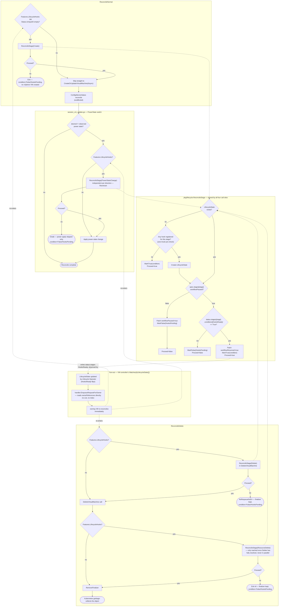

# Implementation Plan: Blocking Lifecycle Hooks

- **Spec**: [`spec.md`](./spec.md)
- **Model**: [`model.md`](./model.md)
- **Research**: [`research.md`](./research.md)
- **Epic**: vmop-3377
- **Date**: 2026-08-24
- **Status**: Draft (zero-hook pre-check / hook-detection design remains open; does not block Phase 1/2)

## Summary

Add a consumer-side integration with the externally-owned `lifecycle.vcfa.vmware.com` CRDs so VM Operator can pause and resume four `VirtualMachine` reconcile checkpoints — Create, PowerStateChange, Delete, ResourceDelete — based on a per-VM `LifecycleState` resource, without owning or reconciling any of the Lifecycle Operator's CRDs itself. A single shared routine, `pkg/lifecycle.ReconcileStage`, implements the pause/resume decision table once (spec.md Diagram D) — including lazily creating the `LifecycleState` on first read, since that creation is itself part of the same decision the rest of the routine makes — and is called identically from all four checkpoints — two in the VM controller (`ReconcileNormal`'s Create gate, `ReconcileDelete`'s ResourceDelete gate) and two in the vSphere provider (`DeleteVirtualMachine`'s Delete gate, `session_vm_update.go`'s PowerStateChange gate). `LifecycleState` is owned **1:1** by the `VirtualMachine` it tracks — every fan-out and query in this plan is shaped by that fact: no field index, no custom mapper, just the controller-runtime built-in `handler.EnqueueRequestForOwner`. The one design point still open is how `ReconcileStage` detects, before any `LifecycleState` `Get`/`Create`, whether a stage has any hook registered at all — so a zero-hook VM sees no behavior change (spec G6) without paying a per-stage round trip on every reconcile — addressed head-on in "Zero-hook pre-check" below, following `research.md`'s Candidate 2 lean.

## Technical context

- **Go version**: repo default (see root `go.mod`).
- **API version(s) touched**: `api/v1alpha6` (additive conditions only — no field removal, no version bump; `v1alpha6` is `main`'s current storage version per `model.md`).
- **Modules touched**: root module (`controllers/`, `pkg/`, `api/`, `config/`) plus a new `external/lifecycle` sub-module.
- **New dependencies**: none beyond the new `external/lifecycle` module (own `go.mod`, no third-party deps).
- **Feature flag**: `pkgcfg.FromContext(ctx).Features.LifecycleHooks`, gated behind the Supervisor capability `supports_vm_service_lifecycle_hooks` (spec G7). No independently-toggleable env-var default — the capability is the sole gate (spec "Resolved decisions").
- **Depends on**: no other feature flag. The fan-out is a `Watches(&lifecyclev1.LifecycleState{}, handler.EnqueueRequestForOwner(...))`, backed by the informer cache, not a `cource` channel — it does **not** depend on `AsyncSignalEnabled`
- **Interaction with pre-existing flags**: independent of `BringYourOwnEncryptionKey`, `TelcoVMServiceAPI`, and `FastDeploy` — none of `ReconcileStage`'s four call sites touch the `vmconfig.Reconciler` registry those flags gate. One interaction is load-bearing rather than incidental: the Create-stage gate in `ReconcileNormal` must run identically whichever create path is taken — `r.VMProvider.CreateOrUpdateVirtualMachine` or its `Async` sibling, chosen by `AsyncSignalEnabled && AsyncCreateEnabled` — because spec G1 makes no create-path distinction; the gate is placed before that branch, not duplicated into both arms.

## Constitution check

| Rule | Status | Notes |
|---|---|---|
| API compatibility (additive only) | OK | New condition types only; no field removal/rename. |
| Controllers are thin | OK | Stage-gate logic lives in a new `pkg/lifecycle` package, called from controllers/provider; controllers only orchestrate. |
| No controller calls vSphere directly | OK | Stage gate reads/writes `LifecycleState` via the k8s client, not vSphere; vSphere-side checkpoints (Create, PowerStateChange, Delete) are still invoked only from `pkg/providers/vsphere`. |
| Controllers for non-`vmoperator.vmware.com` groups don't live in `controllers/` | OK | This feature adds **no new controller** — it adds watches/logic to the existing `controllers/virtualmachine/virtualmachine` controller, which already reconciles `vmoperator.vmware.com`. `LifecycleHook`/`LifecycleState` are read/patched, never reconciled by a VM-Operator-owned controller loop. |
| External vendored APIs live under `external/` | OK | New `external/lifecycle` module, mirroring `external/byok`. |
| Mapper functions use a field indexer, not an unfiltered `List` | OK, and simpler than the rule anticipates | `LifecycleState` is owned 1:1 by its `VirtualMachine`, so the fan-out uses `handler.EnqueueRequestForOwner` — which resolves the owning VM straight from the `LifecycleState` object's own `ownerReferences`, no `List` and no field index at all. See "Fan-out" below for why this is a strictly cheaper case than the indexed-mapper rule the constitution is guarding against. |
| `+kubebuilder:rbac` markers document permissions | OK | New markers for `lifecycle.vcfa.vmware.com` `lifecyclestates`/`lifecyclestates/status` (get/list/watch/create/patch) only — `LifecycleHook` is never read directly by VM Operator (see `model.md`), so no RBAC needed for it. |
| E2E ships with cluster-observable behavior | OK (mandatory) | All four stages are cluster-observable (pausing reconciliation, new conditions) — E2E required per `e2e-sync-with-changes.md`, tracked in `tasks.md`. |
| Feature flag default / rollout documented | OK | Gated by a Supervisor capability, not a bare always-on flag — see "Rollout / migration" below. |

No complexity-tracking entries for constitutional rules — no rule is being bent. "Complexity tracking" below records design points that deviate from a repository *default* rather than a *rule*.

## Project structure

### New files

```
external/lifecycle/                              # NEW module — vendored client types only
  go.mod
  api/v1alpha1/
    doc.go
    groupversion_info.go
    lifecyclestate_types.go                       # LifecycleState, LifecycleStateList (Get/Create/Patch target)
    lifecyclehook_types.go                         # LifecycleHook, LifecycleHookList — types only; VM Operator
                                                    #   never Gets/Lists this kind (model.md), vendored for
                                                    #   completeness/documentation of the schema only
    zz_generated.deepcopy.go

pkg/lifecycle/                                     # NEW — stage-gate helper, reusable from controller + provider
  stage.go                                          # ReconcileStage(ctx, k8sClient, obj, stageName, conditionType) (Result, error)
  stage_test.go

config/crd/external-crds/
  lifecycle.vcfa.vmware.com_lifecyclestates.yaml   # generated via make generate-external-manifests

config/lifecycle/
  vmoperator-stages.yaml                            # static LifecycleStages *instance* (data, not a CRD
                                                     #   definition — model.md "Static LifecycleStages instance")

test/e2e/vmservice/vmservice/virtualmachine/
  vm_lifecycle_hooks.go                             # E2E suite for all four stages
```

### Modified files

```
config/crd/crd.go                                   # + //go:embed external-crds/lifecycle.vcfa.vmware.com_*.yaml
pkg/crd/crd.go                                       # + case "LifecycleState": updateOrDeleteUnstructured(...,
                                                     #   features.LifecycleHooks, ...) — see "Getting the CRD
                                                     #   onto a Supervisor" below
config/default/kustomization.yaml                   # + ../crd/external-crds/lifecycle.vcfa.vmware.com_lifecyclestates.yaml
config/crd/external-crds/README.md                   # + LifecycleState entry under "Production CRDs"
pkg/manager/manager.go                               # + lifecyclev1 import, + lifecyclev1.AddToScheme(opts.Scheme)
pkg/config/config.go                                 # + Features.LifecycleHooks bool
pkg/config/capabilities/capabilities.go             # + CapabilityKeyLifecycleHooks constant, + case in
                                                     #   updateCapabilitiesFeaturesFromCRD
api/v1alpha6/condition_consts.go                    # + 4 new condition type constants (name TBD, see spec
                                                     #   open questions)
controllers/virtualmachine/virtualmachine/
  virtualmachine_controller.go                      # + RBAC markers
                                                     # + Watches(&lifecyclev1.LifecycleState{},
                                                     #   handler.EnqueueRequestForOwner(...)) gated by
                                                     #   Features.LifecycleHooks
                                                     # ReconcileNormal: Create-stage gate before first-create path
                                                     # ReconcileDelete: ResourceDelete-stage gate before
                                                     #   finalizer removal

pkg/providers/vsphere/vmprovider_vm.go              # DeleteVirtualMachine: Delete-stage gate before the
                                                     #   vSphere delete/unregister call
pkg/providers/vsphere/session/session_vm_update.go  # reconcilePoweredOffOrPoweredOnVM: PowerStateChange-stage
                                                     #   gate inside the PowerState switch, before the
                                                     #   power-on/off task is issued

test/builder/fake.go                                # + lifecyclev1.LifecycleState{} in KnownObjectTypes
```

`external/lifecycle` is a brand-new module, so the root `Makefile`'s `generate-external-manifests` target needs a new `paths=github.com/vmware-tanzu/vm-operator/external/lifecycle/...` entry added, not just run against an existing path list.

No envtest wiring is needed for the new CRD beyond that: `test/builder/test_suite.go` loads the whole `config/crd/external-crds` directory into envtest, so the generated manifest is picked up automatically once it exists.

## API / CRD strategy

Additive only. No `vmoperator.vmware.com` CRD schema changes beyond four new condition type constants (conditions are not per-version typed fields, so no conversion webhook work is needed). `external/lifecycle` vendors the schema published in the "[API design] Blocking Lifecycle stages" design doc (see `research.md`) — VM Operator does not modify or extend it.

Two generation steps, both outputs checked in:

- `make generate-go` — deepcopy for `LifecycleState`/`LifecycleHook` in the new `external/lifecycle` module.
- `make generate-external-manifests` — `config/crd/external-crds/lifecycle.vcfa.vmware.com_lifecyclestates.yaml`, after the Makefile path-list addition noted above. Note this generates a manifest **only for `LifecycleState`** (the kind VM Operator actually `Get`/`Create`/`Patch`es), not for `LifecycleHook` or `LifecycleStages` — see below for why those two are different.

### Getting the CRD onto a Supervisor

Only one of the three vendored kinds needs VM Operator to manage its own CRD install, and that shapes the two install paths below:

- **`LifecycleState`** is the one kind VM Operator itself creates and patches (model.md "VM Operator's read/write contract"), so VM Operator must ensure its CRD exists on any Supervisor where the feature might run. Both install paths apply here:
  1. **The install kustomization** — `config/default/kustomization.yaml` gains a `../crd/external-crds/lifecycle.vcfa.vmware.com_lifecyclestates.yaml` entry, alongside the repo's other vendored external CRD manifest entries.
  2. **Runtime install by the manager** — `main.go`'s `initCRDs` calls `pkgcrd.Install` (`pkg/crd/crd.go`), which walks every CRD manifest embedded via the `//go:embed` directives in `config/crd/crd.go` and, for each one, creates or deletes it through `updateOrDeleteUnstructured(ctx, k8sClient, enabled, c, k, mutateFn)` — `enabled` decides whether that kind's CRD should exist right now. A kind with no explicit `case` in `pkgcrd.Install`'s `switch` falls through to `default: enabled = true` and is installed unconditionally. `LifecycleState` needs its own `case` so `enabled` tracks the feature flag instead of defaulting to always-on:
     ```go
     case "LifecycleState":
         if err := updateOrDeleteUnstructured(
             ctx,
             k8sClient,
             features.LifecycleHooks,
             c,
             k,
             nil); err != nil {

             return err
         }
     ```
     Without this `case`, `LifecycleState` would fall through to the unconditional-install default, leaving its CRD present on a Supervisor with the capability off — a small but real deviation from spec G7's "no stage ever pauses... and no `LifecycleState` is ever created" on a disabled Supervisor. The `case` closes that gap for the *install*; `ReconcileStage`'s own flag check closes it for *usage*.
  3. `config/crd/crd.go` additionally needs a `//go:embed external-crds/lifecycle.vcfa.vmware.com_*.yaml` line alongside its existing `//go:embed` directives, or the manifest is never loaded into `pkgcrd.External` in the first place.
- **`LifecycleStages` and `LifecycleHook`** are **not** installed by VM Operator at all. Per `model.md` "Static `LifecycleStages` instance," their CRDs are installed by the Lifecycle Operator's own chart; VM Operator only ever writes one `LifecycleStages` *instance* (`vmoperator-stages`, `config/lifecycle/vmoperator-stages.yaml`) into a CRD it assumes is already present, and never touches `LifecycleHook` at all (it reads hook existence only indirectly through `LifecycleState.status.stages[].hooks[]`). This is why the project structure above generates a manifest only for `LifecycleState` — generating one for the other two kinds would falsely imply VM Operator owns their installation.

`CRDCleanupEnabled` defaults to `false` (`pkg/config/default.go`), so turning `LifecycleHooks` off leaves an already-created `LifecycleState` CRD (and any existing `LifecycleState` instances) in place rather than deleting them. This is a low-risk default here: with the flag off, `ReconcileStage` is never called at all (every call site is wrapped in the flag check), so a lingering `LifecycleState` CRD is simply unused, not a source of drift.

`test/builder/fake.go`'s `KnownObjectTypes` must gain `&lifecyclev1.LifecycleState{}` so the fake client enforces the status subresource split in unit tests (per `operator-best-practices.md`).

## Controller / webhook impact

### 1. Shared helper — `pkg/lifecycle.ReconcileStage`

The one routine every checkpoint calls (spec.md Diagram D; model.md "VM Operator's read/write contract per stage checkpoint"). It lives in its own `pkg/lifecycle` package rather than beside either caller, because this routine is called from **both** `controllers/virtualmachine/virtualmachine` and `pkg/providers/vsphere`, and those two packages do not import each other. A new leaf package with no dependency on either caller is the only placement that avoids a cycle.

Its two parameters worth calling out explicitly:

- **`k8sClient ctrlclient.Client`** — the controller-runtime client used to `Get`/`Create`/`Patch` the `LifecycleState`. `ReconcileStage` takes it as a parameter rather than holding one, because its two call sites already carry their own with different lifetimes: the controller passes `r.Client`, the provider passes `vs.k8sClient`. `ReconcileStage` is a plain function, not a controller or a struct with a client field, so it has no independent way to obtain one.
- **`obj *vmopv1.VirtualMachine`** — the VM being reconciled. `ReconcileStage` keys the `LifecycleState` off `obj.Namespace`/`obj.Name`/`obj.UID` and calls `conditions.MarkTrue`/`MarkFalse` directly on `obj.Status.Conditions`, exactly like `pkgcond.MarkError(ctx.VM, ...)` at `vmprovider_vm.go:849` does today. It mutates the caller's in-memory object; it does **not** patch `obj` back to the API server — the caller's own patch helper (`patch.NewHelper`'s deferred patch in the controller, or the provider's own status patch) persists that.

Rough sketch, not applied to the real source file:

```go
func ReconcileStage(
    ctx context.Context,
    k8sClient ctrlclient.Client,
    obj *vmopv1.VirtualMachine,
    stageName string,
    conditionType vmopv1.VirtualMachineConditionType) (Result, error) {

    var ls lifecyclev1.LifecycleState
    err := k8sClient.Get(ctx, ctrlclient.ObjectKeyFromObject(obj), &ls)

    if apierrors.IsNotFound(err) {
        if hooked, err := stageHasHook(ctx, k8sClient, obj, stageName); err != nil {
            return Result{}, err
        } else if !hooked {
            conditions.MarkTrue(obj, conditionType) // G6: zero-hook no-op
            return Result{Proceed: true}, nil
        }
        ls = newLifecycleState(obj)
        if err := k8sClient.Create(ctx, &ls); err != nil {
            return Result{}, err
        }
    } else if err != nil {
        return Result{}, err
    }

    stage := findStage(&ls, stageName)
    if stage == nil || !stage.WorkflowPaused {
        patchWorkflowPaused(ctx, k8sClient, &ls, stageName, true)
        conditions.MarkFalse(obj, conditionType, "HooksPending", "waiting for %q hooks", stageName)
        return Result{Proceed: false}, nil
    }
    if !hooksReady(&ls, stageName) {
        conditions.MarkFalse(obj, conditionType, "HooksPending", "waiting for %q hooks", stageName)
        return Result{Proceed: false}, nil
    }
    patchWorkflowResumed(ctx, k8sClient, &ls, stageName, true)
    conditions.MarkTrue(obj, conditionType)
    return Result{Proceed: true}, nil
}
```

Every write to `LifecycleState.spec.stages[]` (`patchWorkflowPaused`/`patchWorkflowResumed` above) is a plain `client.MergeFrom` patch with **no optimistic lock**. This is deliberate, not an oversight: `operator-best-practices.md`'s "Fan-out to Child Objects" rule requires an optimistic lock only when a *shared* list-typed field can be written concurrently by multiple owners — e.g. a list several VMs write into at once. `LifecycleState.spec.stages[]` has exactly one writer — the single VM that owns it — so there is no concurrent-writer race for the optimistic lock to guard against. A skip-if-unchanged guard is still worth keeping (patching `workflowPaused=true` when it is already `true` would be a no-op write that needlessly bumps `resourceVersion` and could re-trigger the watch below), but that is the ordinary "don't write what didn't change" discipline, not the fan-in rule.

### 2. VM path — the four call sites and their ordering

Each of the four checkpoints wraps its `ReconcileStage` call in `pkgcfg.FromContext(ctx).Features.LifecycleHooks`, so a disabled capability makes every one a true no-op — no `Get`, no `Create`, nothing (spec G6/G7):

- **Create**, `ReconcileNormal`, immediately before the existing `r.VMProvider.CreateOrUpdateVirtualMachine`/`Async` dispatch (`virtualmachine_controller.go:657-668`), guarded additionally on `ctx.VM.Status.UniqueID == ""` so the gate is only consulted before the *first* create, matching the stage's `Single` type (model.md):
  ```go
  if pkgcfg.FromContext(ctx).Features.LifecycleHooks && ctx.VM.Status.UniqueID == "" {
      if res, err := lifecycle.ReconcileStage(ctx, r.Client, ctx.VM,
          lifecyclestages.Create, vmopv1.VirtualMachineConditionLifecycleCreateReady); err != nil {
          return err
      } else if !res.Proceed {
          return nil // watch re-triggers once HooksReady flips
      }
  }
  ```
- **PowerStateChange**, `session_vm_update.go`'s `reconcilePoweredOffOrPoweredOnVM`, inside the existing `switch vmCtx.MoVM.Runtime.PowerState` (lines 300-338), guarding only the branch that would apply a transition — the network/volume/guest-customization reconcile at lines 295-352 sits outside that switch and runs regardless, satisfying spec G2/SC-002's "pause only this step":
  ```go
  if pkgcfg.FromContext(vmCtx).Features.LifecycleHooks {
      if res, err := lifecycle.ReconcileStage(vmCtx, s.K8sClient, vmCtx.VM,
          lifecyclestages.PowerStateChange, vmopv1.VirtualMachineConditionLifecyclePowerStateChangeReady); err != nil {
          return err
      } else if !res.Proceed {
          break // skip only the power-state apply
      }
  }
  ```
  Because the stage is `Reentrant` (model.md), the same call runs for both the `PoweredOff→PoweredOn` and `PoweredOn→PoweredOff` branches of that switch, and `ReconcileStage`'s own get-or-create logic against `LifecycleState.spec.stages[PowerStateChange]` is what makes each transition pause independently (spec US2 scenario 3) — no extra bookkeeping is needed at the call site to distinguish the two directions.
- **Delete**, `vmprovider_vm.go`'s `DeleteVirtualMachine`, immediately before the existing terminal call to `virtualmachine.DeleteVirtualMachine(vmCtx, vcVM)` (line 460):
  ```go
  if pkgcfg.FromContext(vmCtx).Features.LifecycleHooks {
      if res, err := lifecycle.ReconcileStage(vmCtx, vs.k8sClient, vm,
          lifecyclestages.Delete, vmopv1.VirtualMachineConditionLifecycleDeleteReady); err != nil {
          return err
      } else if !res.Proceed {
          return pkgerr.NoRequeueNoErr("waiting for Delete stage hooks")
      }
  }
  ```
  `pkgerr.NoRequeueNoErr` rather than a plain `nil`/error return, because `DeleteVirtualMachine`'s caller — `ReconcileDelete` — treats its own error return as blocking finalizer removal either way, but `research.md`'s "Terminal failures" survey is explicit that a not-yet-ready hook is not a failure worth backoff retry; `NoRequeueNoErr` is the sentinel this codebase already uses for exactly that shape ("this reconcile did its job for now").
- **ResourceDelete**, `ReconcileDelete`, immediately before the existing `controllerutil.RemoveFinalizer(ctx.VM, finalizerName)` (line 598) — placed **after** the `Delete`-stage provider call above has already returned successfully, which is what gives spec US3 scenario 4's "never evaluated in parallel" for free: `ReconcileDelete` is straight-line code, so `ResourceDelete`'s `ReconcileStage` call is simply unreachable until `DeleteVirtualMachine` returns without pausing.
  ```go
  if pkgcfg.FromContext(ctx).Features.LifecycleHooks {
      if res, err := lifecycle.ReconcileStage(ctx, r.Client, ctx.VM,
          lifecyclestages.ResourceDelete, vmopv1.VirtualMachineConditionLifecycleResourceDeleteReady); err != nil {
          return err
      } else if !res.Proceed {
          return nil // finalizer stays; watch re-triggers on HooksReady flip
      }
  }

  controllerutil.RemoveFinalizer(ctx.VM, finalizerName)
  controllerutil.RemoveFinalizer(ctx.VM, deprecatedFinalizerName)
  ```

### 3. Zero-hook pre-check (spec G6, `research.md` "Zero-hook cost")

`research.md` leaves this genuinely open, and `ReconcileStage`'s sketch above calls a not-yet-designed `stageHasHook(ctx, k8sClient, obj, stageName)` to stand in for whichever resolution lands. This plan follows `research.md`'s stated lean — **Candidate 2**: the Lifecycle Operator maintains a new `AggregatedLifecycleHooks`-shaped resource, scoped to `(namespace, group, kind)`, precomputing which stages currently have at least one subscriber; VM Operator watches and reads it as a pure consumer, the same relationship it already has with `LifecycleState` itself. `stageHasHook` becomes a `Get`/cache-read against that resource, entirely before any `LifecycleState` `Get`/`Create` — so a VM with zero hooks registered anywhere pays one cached read per checkpoint and creates nothing, satisfying G6 on both the steady-state and one-time-creation axes `research.md` measured the four framework-documented handshakes against.

This is the one design point this plan does not finalize, because Candidate 2 needs the Lifecycle framework team's sign-off and a new vendored CRD that is not yet in `external/lifecycle`'s scaffolding — it does **not** block the foundational vendoring, capability wiring, and scaffolding work (`LifecycleState` creation and RBAC are independent of how the pre-check is implemented), but it must land before any of the four call sites can call real code instead of a stub, i.e. before any user-visible stage gating ships.

### 4. Fan-out — the VM controller's `LifecycleState` watch

In `virtualmachine_controller.go`'s `AddToManager`, gated the same way as every other feature-flagged watch in that function:

```go
if pkgcfg.FromContext(ctx).Features.LifecycleHooks {
    builder = builder.Watches(
        &lifecyclev1.LifecycleState{},
        handler.EnqueueRequestForOwner(
            mgr.GetScheme(),
            mgr.GetRESTMapper(),
            &vmopv1.VirtualMachine{}),
    )
}
```

This is the exact shape of the existing `PolicyEvaluation` watch (`virtualmachine_controller.go:197-205`, gated on `Features.VSpherePolicies`) — both types are owned 1:1 by a `VirtualMachine` via `ownerReferences`, so both use the built-in `handler.EnqueueRequestForOwner` rather than a hand-written mapper. This is a deliberately simple fan-out, and worth spelling out why it's sufficient: a custom mapper plus a dedicated field index is only needed when a child object must reach *multiple* interested parents with no static path back to them — a many-to-many relationship. `LifecycleState` has no such relationship: `EnqueueRequestForOwner` reads the owning VM's identity straight out of the `LifecycleState` object's own `ownerReferences` field and issues a single `Get`, no `List` and no field index at all. `HooksReady` flipping on any stage therefore re-triggers exactly the one VM it belongs to, promptly, with none of the workqueue-deduplication or predicate-filtering reasoning a many-to-many fan-out would need to justify staying cheap.

No predicate is added on this watch, because there is no analogous "controller writes to the object on every reconcile" noise source here: `LifecycleState.status` is written exclusively by the Lifecycle Operator, and VM Operator's own `spec.stages[].workflowPaused`/`workflowResumed` writes happen only on the pause/resume transitions `ReconcileStage` itself is trying to observe — there is no third party generating filler events on this object.

**The CRD must exist when the manager starts**, since a watch on an unserved kind fails to start. Per "Getting the CRD onto a Supervisor" above, `main.go`'s `initCRDs()` runs `pkgcrd.Install` — which creates the `LifecycleState` CRD whenever `Features.LifecycleHooks` is on — before `controllers.AddToManager` registers this watch, so there is no configuration where the watch starts without its CRD.

### 5. Webhook impact

None. Stage gating is a reconcile-time concern; there is no admission-time decision to make (the `LifecycleState` schema itself is validated by the Lifecycle Operator's own webhook, not VM Operator's).

### 6. RBAC

New markers on the `VirtualMachine` controller for `lifecycle.vcfa.vmware.com` `lifecyclestates` (get, list, watch, create, patch) and `lifecyclestates/status` (get, patch) — no `update` (every write is a `Patch`, per `operator-best-practices.md`'s reconcile-loop convention) and no verbs at all for `lifecyclehooks` or `lifecyclestages`, since VM Operator never reads either kind directly (model.md).

## Reconcile flow



## Test strategy

Per `testing-standards.md`: one `_test.go` and one `_suite_test.go` per package, external `_test` package, labels on the top-level `Describe`.

### Unit (`testlabels.Controller`)

- `pkg/lifecycle/stage_test.go` — the full `ReconcileStage` decision table against a fake client with `lifecyclev1.AddToScheme` registered: no hook anywhere → `Proceed=true`, no `LifecycleState`/`Create` (G6); hook registered, no `LifecycleState` yet → `Create` + `workflowPaused=true` + `Proceed=false`; `workflowPaused=true` + `HooksReady` absent/`False`/any non-`True` reason → `Proceed=false`, condition stays `HooksPending` regardless of the underlying `HooksReady` reason (model.md "HooksReady handling" — VM Operator does not branch on it); `workflowPaused=true` + `HooksReady=True` → `workflowResumed=true` patched, `Proceed=true`, condition flips `True`; a `LifecycleState` deleted out-of-band while paused → re-created and re-enters the paused state on the next call (spec "Resolved decisions"), not treated as an implicit resume.
- `controllers/virtualmachine/virtualmachine/*_test.go` — Create-stage gate: hook absent (no-op, proceeds to create); hook present and blocking (no vSphere create call reaches the fake provider, condition blocked); `Status.UniqueID` already set skips the gate entirely (post-create reconciles never re-consult `Create`). ResourceDelete-stage gate: finalizer retained while paused; `Delete`-stage completion is a precondition the test constructs explicitly (fake provider's delete call already returned) so the "never in parallel" ordering is exercised, not merely assumed.
- `pkg/providers/vsphere/vmprovider_vm.go`/`vmprovider_vm_test.go` — Delete-stage gate: paused → `pkgerr.NoRequeueNoErr` returned, `virtualmachine.DeleteVirtualMachine` (the vCenter call) never invoked; resumed or no hook → vCenter delete proceeds unchanged from today's behavior (spec SC-004 baseline).
- `pkg/providers/vsphere/session/session_vm_update_test.go` — PowerStateChange-stage gate: paused power-on does not issue the power task, but volume/network/guest-customization reconcile in the same call still runs (spec SC-002, asserted via the fake's other reconcile side effects still firing); the same for power-off; the two directions pause independently within one test given the `Reentrant` stage type (spec US2 scenario 3).
- Capability wiring — with `Features.LifecycleHooks=false`, every one of the above call sites makes zero calls into the fake client for `LifecycleState` (no `Get`, no `Create`) — asserted with a call-counting fake, not just "no error," since the no-op requirement (G6/G7) is specifically about absence of API traffic, not just absence of pausing.

### Integration (`testlabels.EnvTest`)

- `controllers/virtualmachine/virtualmachine/*_test.go` (envtest) — the watch wiring itself: with `Features.LifecycleHooks` on, patching `LifecycleState.status.stages[Create].conditions[HooksReady]=True` on a real object causes the owning VM to reconcile promptly (`Eventually`), exercising `handler.EnqueueRequestForOwner` through a real manager rather than a unit-level assertion that the builder call was made. Also: a `LifecycleState` update that does **not** touch `HooksReady` (e.g. the Lifecycle Operator setting an unrelated per-hook `status.stages[].hooks[]` entry) still re-triggers the VM, since no predicate filters this fan-out; confirm this is an accepted no-op reconcile rather than a bug (`ReconcileStage` reads the same non-`True` `HooksReady` again and produces an identical, non-mutating result).
- Full stage sequencing across a real object lifecycle: create a VM with hooks on all four stages, drive each `HooksReady` flip in order, and assert the VM only ever proceeds past `Delete` after that stage's `HooksReady` flip, never before, and that `ResourceDelete` is not evaluated (no `LifecycleState.spec.stages[ResourceDelete]` entry appears) until `Delete` has resolved.

### E2E (mandatory, `e2e-sync-with-changes.md`)

New suite `test/e2e/vmservice/vmservice/virtualmachine/vm_lifecycle_hooks.go`, registered from `test/e2e/vmservice/vmservice_test.go`, exercising all four stages end-to-end against a real (or vcsim-backed) `LifecycleState` fixture — Create pause/resume, PowerStateChange pause/resume in both directions, the sequential Delete-then-ResourceDelete flow including the case where only one of the two carries a hook, and a capability-disabled run confirming zero behavior change with hooks still registered (spec SC-005).

## Rollout / migration

- **Capability gate**: `supports_vm_service_lifecycle_hooks` is the sole gate for `pkgcfg.Features.LifecycleHooks` — no independently-toggleable env-var default, matching spec US4's "entire feature gated by a capability" requirement. `pkg/config/capabilities/capabilities.go` needs a new `CapabilityKeyLifecycleHooks` constant and a `case` in `updateCapabilitiesFeaturesFromCRD`, the same two-step wiring `CapabilityKeyBringYourOwnKeyProvider` already uses there — see "Controller / webhook impact" above for the call sites that consume the resulting flag.
- **No schema upgrade / backfill**: nothing in `api/` changes beyond the four additive condition types, and no existing VM field is backfilled. On a Supervisor where the capability is turned on for the first time, every VM's next reconcile simply starts consulting `ReconcileStage` — the feature is level-triggered, so no migration job or one-time pass is needed.
- **Turning the capability off** makes every `ReconcileStage` call site an immediate no-op on the VM's very next reconcile (each is gated inline, not just at controller-startup like the watch registration is) — a stage paused when the capability was on stays paused only until the next reconcile un-pauses evaluation entirely, per spec's edge case ("Enabling the capability on a Supervisor with no `LifecycleHook`s registered anywhere MUST still be a no-op") applied in reverse. Any already-created `LifecycleState` objects and the CRD itself are left in place (`CRDCleanupEnabled` defaults `false`), but since nothing reads or writes them with the flag off, they are simply inert rather than a source of drift.
- **Partner comms**: announce via the same channel/design-doc-review process as other new-condition, capability-gated features (e.g. `supports_telco_vm_service_api`) once the zero-hook pre-check design is resolved.
- **Release notes**: ship with the first PR that turns on any stage gate, referencing the new conditions and the capability name.

## Complexity tracking

| Deviation | Why needed | Simpler alternative rejected because |
|---|---|---|
| `ReconcileStage` lives in a brand-new leaf package (`pkg/lifecycle`) rather than beside either caller's existing helpers | It is called from both `controllers/virtualmachine/virtualmachine` and `pkg/providers/vsphere`, and those two packages do not import each other | Placing it in either caller's package (the repository default for a single-consumer helper) would force the other caller to import a controller package or vice versa, which either doesn't compile or violates "controllers are thin" |
| `LifecycleState.spec.stages[]` writes use a plain `client.MergeFrom` patch with no optimistic lock, unlike the constitution's fan-in guidance | `LifecycleState` has exactly one writer — the VM that owns it — so there is no concurrent-writer race for an optimistic lock to guard against | Applying the optimistic-lock pattern here anyway would be defensive complexity with no corresponding hazard, since that guidance targets a genuinely shared list several owners write concurrently, a hazard that does not exist for a 1:1-owned resource |
| The zero-hook pre-check (`stageHasHook`) is deliberately left as an open dependency on a not-yet-built Lifecycle-framework resource (`research.md` Candidate 2) rather than implemented locally now | Satisfying G6 without it requires either a per-stage-reach round trip forever (unacceptable per `research.md`'s measurement) or VM Operator re-implementing the framework's own hook-matching logic locally (Candidate 1), which risks silent drift from the authoritative matching logic if it ever grows richer | Candidate 1 was rejected on ownership grounds in `research.md`, not correctness — but building it now anyway to unblock this plan would create exactly the drift risk that rejection was meant to avoid, for a feature (Create pause) that isn't the priority-1 blocker; Phase 1/2 do not need it resolved |

## Blocking items before implementation starts

Resolved: power-off inclusion (both directions, `Reentrant`), per-stage `type`/`blocking` defaults, `HooksReady`-only handling with no failure-detail parsing (see `research.md` "Terminal failures"), capability-based gating for the whole feature (spec US4, model.md "Capability gating"), and the condition/reason and capability names themselves (model.md's condition-type table, `supports_vm_service_lifecycle_hooks`) — none of these are deferred any further. Still open: the zero-hook pre-check design (`research.md` "Zero-hook cost," "Complexity tracking" above), which needs the Lifecycle-framework team's sign-off before any of the four call sites can call real code instead of a stub. This does not block the foundational vendoring, capability wiring, or scaffolding work, or the shape of the four call sites themselves — only the point at which they stop calling a stub.
