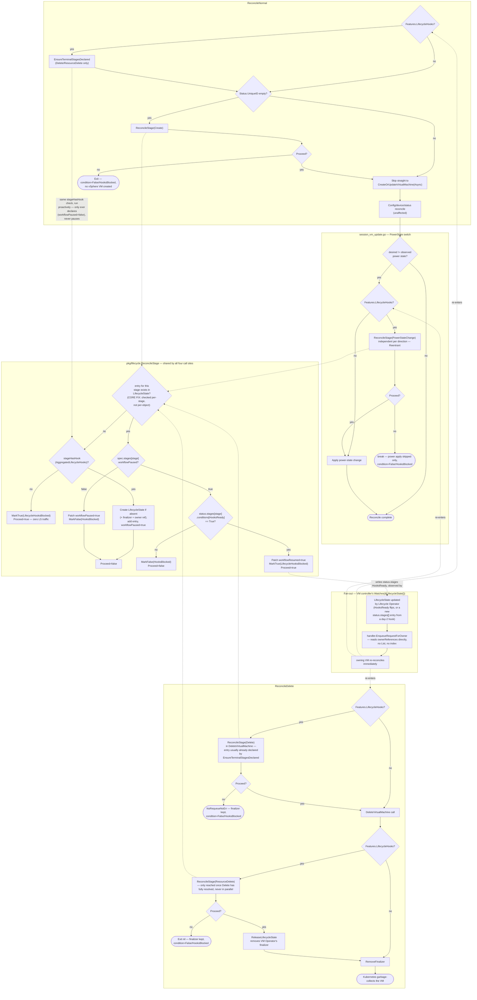

# Implementation Plan: Blocking Lifecycle Hooks

- **Spec**: [`spec.md`](./spec.md)
- **Model**: [`model.md`](./model.md)
- **Research**: [`research.md`](./research.md)
- **Epic**: vmop-3377
- **Date**: 2026-08-24
- **Status**: Draft

## Summary

Add a consumer-side integration with the externally-owned `lifecycle.vcfa.vmware.com` CRDs so VM Operator can pause and resume four `VirtualMachine` reconcile checkpoints — Create, PowerStateChange, Delete, ResourceDelete — based on a per-VM `LifecycleState` resource, without owning or reconciling any of the Lifecycle Operator's CRDs itself. A single shared routine, `pkg/lifecycle.ReconcileStage`, implements the pause/resume decision table once (see "Shared helper" below) — including creating the `LifecycleState` on first read, since that creation is itself part of the same decision the rest of the routine makes — and is called identically from all four checkpoints — two in the VM controller (`ReconcileNormal`'s Create gate, `ReconcileDelete`'s ResourceDelete gate) and two in the vSphere provider (`DeleteVirtualMachine`'s Delete gate, `session_vm_update.go`'s PowerStateChange gate). `LifecycleState` is owned **1:1** by the `VirtualMachine` it tracks — every fan-out and query in this plan is shaped by that fact: no field index, no custom mapper, just the controller-runtime built-in `handler.EnqueueRequestForOwner`.

`ReconcileStage` answers "does this stage have a hook" with a single cached read of `AggregatedLifecycleHooks` (one per namespace, Lifecycle-Operator-owned), consulted only once per VM — the moment `LifecycleState` exists (for any stage, any reason), it is never consulted again for that VM. See "Zero-hook pre-check."

Kubernetes' namespace controller deletes every namespaced object directly and concurrently on namespace deletion, independent of owner-reference cascades, which can make a real `Delete`/`ResourceDelete` hook indistinguishable from no hook at all if checked only lazily at the moment of deletion. A VM-Operator-owned finalizer on `LifecycleState`, plus proactively declaring `Delete`/`ResourceDelete` hook existence during ordinary `ReconcileNormal` passes (`pkg/lifecycle.EnsureTerminalStagesDeclared`), closes this for the two stages where a missed hook is irreversible. See "`EnsureTerminalStagesDeclared` — the namespace-deletion race fix."

## Technical context

- **Go version**: repo default (see root `go.mod`).
- **API version(s) touched**: `api/v1alpha6` (additive conditions only — no field removal, no version bump; `v1alpha6` is `main`'s current storage version per `model.md`).
- **Modules touched**: root module (`controllers/`, `pkg/`, `api/`, `config/`) plus a new `external/lifecycle` sub-module.
- **New dependencies**: none beyond the new `external/lifecycle` module (own `go.mod`, no third-party deps).
- **Feature flag**: `pkgcfg.FromContext(ctx).Features.LifecycleHooks`, gated behind the Supervisor capability `supports_vm_service_lifecycle_hooks` (spec G6). No independently-toggleable env-var default — the capability is the sole gate (spec "Resolved decisions").
- **Depends on**: no other feature flag. The fan-out is a `Watches(&lifecyclev1.LifecycleState{}, handler.EnqueueRequestForOwner(...))`, backed by the informer cache, not a `cource` channel — it does **not** depend on `AsyncSignalEnabled`
- **Interaction with pre-existing flags**: independent of `BringYourOwnEncryptionKey`, `TelcoVMServiceAPI`, and `FastDeploy` — none of `ReconcileStage`'s four call sites touch the `vmconfig.Reconciler` registry those flags gate. One interaction is load-bearing rather than incidental: the Create-stage gate in `ReconcileNormal` must run identically whichever create path is taken — `r.VMProvider.CreateOrUpdateVirtualMachine` or its `Async` sibling, chosen by `AsyncSignalEnabled && AsyncCreateEnabled` — because spec G1 makes no create-path distinction; the gate is placed before that branch, not duplicated into both arms.

## Constitution check

| Rule | Status | Notes |
|---|---|---|
| API compatibility (additive only) | OK | New condition types only; no field removal/rename. |
| Controllers are thin | OK | Stage-gate logic lives in a new `pkg/lifecycle` package, called from controllers/provider; controllers only orchestrate. |
| No controller calls vSphere directly | OK | Stage gate reads/writes `LifecycleState` via the k8s client, not vSphere; vSphere-side checkpoints (Create, PowerStateChange, Delete) are still invoked only from `pkg/providers/vsphere`. |
| Controllers for non-`vmoperator.vmware.com` groups don't live in `controllers/` | OK | This feature adds **no new controller** — it adds watches/logic to the existing `controllers/virtualmachine/virtualmachine` controller, which already reconciles `vmoperator.vmware.com`. `LifecycleHook`/`LifecycleState` are read/patched, never reconciled by a VM-Operator-owned controller loop. |
| External vendored APIs live under `external/` | OK | New `external/lifecycle` module, mirroring `external/byok`. |
| Mapper functions use a field indexer, not an unfiltered `List` | OK, and simpler than the rule anticipates | `LifecycleState` is owned 1:1 by its `VirtualMachine`, so the fan-out uses `handler.EnqueueRequestForOwner` — which resolves the owning VM straight from the `LifecycleState` object's own `ownerReferences`, no `List` and no field index at all. See "Fan-out" below for why this is a strictly cheaper case than the indexed-mapper rule the constitution is guarding against. |
| `+kubebuilder:rbac` markers document permissions | OK | New markers for `lifecycle.vcfa.vmware.com` `lifecyclestates`/`lifecyclestates/status` (get/list/watch/create/patch) and `aggregatedlifecyclehooks` (get/list/watch, cache-only, no fan-out) — `LifecycleHook` and `LifecycleStages` are never read directly by VM Operator (see `model.md`), so no RBAC needed for either. |
| E2E ships with cluster-observable behavior | OK (mandatory) | All four stages are cluster-observable (pausing reconciliation, new conditions) — E2E required per `e2e-sync-with-changes.md`, tracked in `tasks.md`. |
| Feature flag default / rollout documented | OK | Gated by a Supervisor capability, not a bare always-on flag — see "Rollout / migration" below. |

No complexity-tracking entries for constitutional rules — no rule is being bent. "Complexity tracking" below records design points that deviate from a repository *default* rather than a *rule*.

## Project structure

### New files

```
external/lifecycle/                              # NEW module — vendored client types only
  go.mod
  api/v1alpha1/
    doc.go
    groupversion_info.go
    lifecyclestate_types.go                       # LifecycleState, LifecycleStateList (Get/Create/Patch target)
    lifecyclehook_types.go                         # LifecycleHook, LifecycleHookList — types only; VM Operator
                                                    #   never Gets/Lists this kind (model.md), vendored for
                                                    #   completeness/documentation of the schema only
    aggregatedlifecyclehooks_types.go              # AggregatedLifecycleHooks, AggregatedLifecycleHooksList —
                                                    #   Get-only, the zero-hook pre-check's data source (model.md)
    zz_generated.deepcopy.go

pkg/lifecycle/                                     # NEW — stage-gate helper, reusable from controller + provider
  stage.go                                          # ReconcileStage(ctx, k8sClient, obj, stageName) (Result, error),
                                                     #   EnsureTerminalStagesDeclared, ReleaseLifecycleState
  stage_test.go

config/crd/external-crds/
  lifecycle.vcfa.vmware.com_lifecyclestates.yaml   # generated via make generate-external-manifests

config/lifecycle/
  vmoperator-stages.yaml                            # static LifecycleStages *instance* (data, not a CRD
                                                     #   definition — model.md "Static LifecycleStages instance")

test/e2e/vmservice/vmservice/virtualmachine/
  vm_lifecycle_hooks.go                             # E2E suite for all four stages
```

### Modified files

```
config/crd/crd.go                                   # + //go:embed external-crds/lifecycle.vcfa.vmware.com_*.yaml
pkg/crd/crd.go                                       # + case "LifecycleState": updateOrDeleteUnstructured(...,
                                                     #   features.LifecycleHooks, ...) — see "Getting the CRD
                                                     #   onto a Supervisor" below
config/default/kustomization.yaml                   # + ../crd/external-crds/lifecycle.vcfa.vmware.com_lifecyclestates.yaml
config/crd/external-crds/README.md                   # + LifecycleState entry under "Production CRDs"
pkg/manager/manager.go                               # + lifecyclev1 import, + lifecyclev1.AddToScheme(opts.Scheme)
pkg/config/config.go                                 # + Features.LifecycleHooks bool
pkg/config/capabilities/capabilities.go             # + CapabilityKeyLifecycleHooks constant, + case in
                                                     #   updateCapabilitiesFeaturesFromCRD
api/v1alpha6/condition_consts.go                    # + VirtualMachineConditionLifecycleHooksBlocked
                                                     #   constant
controllers/virtualmachine/virtualmachine/
  virtualmachine_controller.go                      # + RBAC markers
                                                     # + Watches(&lifecyclev1.LifecycleState{},
                                                     #   handler.EnqueueRequestForOwner(...)) gated by
                                                     #   Features.LifecycleHooks
                                                     # ReconcileNormal: Create-stage gate before first-create path
                                                     # ReconcileDelete: ResourceDelete-stage gate before
                                                     #   finalizer removal

pkg/providers/vsphere/vmprovider_vm.go              # DeleteVirtualMachine: Delete-stage gate before the
                                                     #   vSphere delete/unregister call
pkg/providers/vsphere/session/session_vm_update.go  # reconcilePoweredOffOrPoweredOnVM: PowerStateChange-stage
                                                     #   gate inside the PowerState switch, before the
                                                     #   power-on/off task is issued

test/builder/fake.go                                # + lifecyclev1.LifecycleState{} in KnownObjectTypes
```

`external/lifecycle` is a brand-new module, so the root `Makefile`'s `generate-external-manifests` target needs a new `paths=github.com/vmware-tanzu/vm-operator/external/lifecycle/...` entry added, not just run against an existing path list.

No envtest wiring is needed for the new CRD beyond that: `test/builder/test_suite.go` loads the whole `config/crd/external-crds` directory into envtest, so the generated manifest is picked up automatically once it exists.

## API / CRD strategy

Additive only. No `vmoperator.vmware.com` CRD schema changes beyond a new condition type constant (conditions are not per-version typed fields, so no conversion webhook work is needed). `external/lifecycle` vendors the schema published in the "[API design] Blocking Lifecycle stages" design doc (see `research.md`) — VM Operator does not modify or extend it.

Two generation steps, both outputs checked in:

- `make generate-go` — deepcopy for `LifecycleState`/`LifecycleHook` in the new `external/lifecycle` module.
- `make generate-external-manifests` — `config/crd/external-crds/lifecycle.vcfa.vmware.com_lifecyclestates.yaml`, after the Makefile path-list addition noted above. Note this generates a manifest **only for `LifecycleState`** (the kind VM Operator actually `Get`/`Create`/`Patch`es), not for `LifecycleHook` or `LifecycleStages` — see below for why those two are different.

### Getting the CRD onto a Supervisor

Only one of the four vendored kinds needs VM Operator to manage its own CRD install, and that shapes the two install paths below:

- **`LifecycleState`** is the one kind VM Operator itself creates and patches (model.md "VM Operator's read/write contract"), so VM Operator must ensure its CRD exists on any Supervisor where the feature might run. Both install paths apply here:
  1. **The install kustomization** — `config/default/kustomization.yaml` gains a `../crd/external-crds/lifecycle.vcfa.vmware.com_lifecyclestates.yaml` entry, alongside the repo's other vendored external CRD manifest entries.
  2. **Runtime install by the manager** — `main.go`'s `initCRDs` calls `pkgcrd.Install` (`pkg/crd/crd.go`), which walks every CRD manifest embedded via the `//go:embed` directives in `config/crd/crd.go` and, for each one, creates or deletes it through `updateOrDeleteUnstructured(ctx, k8sClient, enabled, c, k, mutateFn)` — `enabled` decides whether that kind's CRD should exist right now. A kind with no explicit `case` in `pkgcrd.Install`'s `switch` falls through to `default: enabled = true` and is installed unconditionally. `LifecycleState` needs its own `case` so `enabled` tracks the feature flag instead of defaulting to always-on:
     ```go
     case "LifecycleState":
         if err := updateOrDeleteUnstructured(
             ctx,
             k8sClient,
             features.LifecycleHooks,
             c,
             k,
             nil); err != nil {

             return err
         }
     ```
     Without this `case`, `LifecycleState` would fall through to the unconditional-install default, leaving its CRD present on a Supervisor with the capability off — a small but real deviation from spec G6's "no stage ever pauses... and no `LifecycleState` is ever created" on a disabled Supervisor. The `case` closes that gap for the *install*; `ReconcileStage`'s own flag check closes it for *usage*.
  3. `config/crd/crd.go` additionally needs a `//go:embed external-crds/lifecycle.vcfa.vmware.com_*.yaml` line alongside its existing `//go:embed` directives, or the manifest is never loaded into `pkgcrd.External` in the first place.
- **`LifecycleStages`, `LifecycleHook`, and `AggregatedLifecycleHooks`** are **not** installed by VM Operator at all. Per `model.md` "Static `LifecycleStages` instance," their CRDs are installed by the Lifecycle Operator's own chart; VM Operator only ever writes one `LifecycleStages` *instance* (`vmoperator-stages`, `config/lifecycle/vmoperator-stages.yaml`) into a CRD it assumes is already present, never touches `LifecycleHook` at all, and only ever `Get`s `AggregatedLifecycleHooks` (one per namespace) against a CRD it likewise assumes the Lifecycle Operator has already installed. This is why the project structure above generates a manifest only for `LifecycleState` — generating one for the other three kinds would falsely imply VM Operator owns their installation.

`CRDCleanupEnabled` defaults to `false` (`pkg/config/default.go`), so turning `LifecycleHooks` off leaves an already-created `LifecycleState` CRD (and any existing `LifecycleState` instances) in place rather than deleting them. This is a low-risk default here: with the flag off, `ReconcileStage` is never called at all (every call site is wrapped in the flag check), so a lingering `LifecycleState` CRD is simply unused, not a source of drift.

`test/builder/fake.go`'s `KnownObjectTypes` must gain `&lifecyclev1.LifecycleState{}` so the fake client enforces the status subresource split in unit tests (per `operator-best-practices.md`).

## Controller / webhook impact

### 1. Shared helper — `pkg/lifecycle.ReconcileStage`

The one routine every checkpoint calls (model.md "VM Operator's read/write contract per stage checkpoint"). It lives in its own `pkg/lifecycle` package rather than beside either caller, because this routine is called from **both** `controllers/virtualmachine/virtualmachine` and `pkg/providers/vsphere`, and those two packages do not import each other. A new leaf package with no dependency on either caller is the only placement that avoids a cycle.

Its two parameters worth calling out explicitly:

- **`k8sClient ctrlclient.Client`** — the controller-runtime client used to `Get`/`Create`/`Patch` the `LifecycleState`. `ReconcileStage` takes it as a parameter rather than holding one, because its two call sites already carry their own with different lifetimes: the controller passes `r.Client`, the provider passes `vs.k8sClient`. `ReconcileStage` is a plain function, not a controller or a struct with a client field, so it has no independent way to obtain one.
- **`obj *vmopv1.VirtualMachine`** — the VM being reconciled. `ReconcileStage` keys the `LifecycleState` off `obj.Namespace`/`obj.Name`/`obj.UID` and calls `conditions.MarkTrue`/`MarkFalse` directly on `obj.Status.Conditions`, exactly like `pkgcond.MarkError(ctx.VM, ...)` at `vmprovider_vm.go:849` does today. It mutates the caller's in-memory object; it does **not** patch `obj` back to the API server — the caller's own patch helper (`patch.NewHelper`'s deferred patch in the controller, or the provider's own status patch) persists that.

`ReconcileStage` no longer takes a `conditionType` parameter — the feature now has a single condition (`VirtualMachineConditionLifecycleHooksBlocked`), so every call site marks the same one, with the stage name folded into the message rather than into a distinct condition type per stage.

**The core fix, relative to the very first drafts of this sketch**: `LifecycleState` existing is *not* the same thing as "this stage has a hook." A different stage's hook may be the reason the object exists at all (e.g. `Create` was hooked, `Delete` was not). So the zero-hook check (`stageHasHook`, against `AggregatedLifecycleHooks`) must run any time this stage has no entry of its own yet — whether the whole object is missing or just this one stage — never inferred from "the object happens to exist."

Rough sketch, not applied to the real source file:

```go
func ReconcileStage(
    ctx context.Context,
    k8sClient ctrlclient.Client,
    obj *vmopv1.VirtualMachine,
    stageName string) (Result, error) {

    var ls lifecyclev1.LifecycleState
    err := k8sClient.Get(ctx, ctrlclient.ObjectKeyFromObject(obj), &ls)

    switch {
    case apierrors.IsNotFound(err):
        return reconcileMissingStage(ctx, k8sClient, obj, nil, stageName)
    case err != nil:
        return Result{}, fmt.Errorf("failed to get LifecycleState for %s: %w", obj.Name, err)
    }

    // CORE FIX: don't treat "LifecycleState exists" as "this stage has a
    // hook" -- a different stage's hook may be why the object exists at all.
    if stage := findStage(&ls, stageName); stage == nil {
        return reconcileMissingStage(ctx, k8sClient, obj, &ls, stageName)
    }

    return evaluateStage(ctx, k8sClient, obj, &ls, stageName)
}

// reconcileMissingStage handles a stage with no entry yet, sourcing the
// answer from a fresh AggregatedLifecycleHooks read rather than from
// whatever LifecycleState happens to contain. ls may be nil (object doesn't
// exist at all) or non-nil (object exists, but not for this stage).
func reconcileMissingStage(
    ctx context.Context,
    k8sClient ctrlclient.Client,
    obj *vmopv1.VirtualMachine,
    ls *lifecyclev1.LifecycleState,
    stageName string) (Result, error) {

    hooked, err := stageHasHook(ctx, k8sClient, obj, stageName)
    if err != nil {
        return Result{}, err
    }
    if !hooked {
        // G5: zero-hook no-op for this stage.
        conditions.MarkTrue(obj, vmopv1.VirtualMachineConditionLifecycleHooksBlocked)
        return Result{Proceed: true}, nil
    }

    if ls == nil {
        created, err := getOrCreateLifecycleState(ctx, k8sClient, obj)
        if err != nil {
            return Result{}, err
        }
        ls = created
    }

    if err := patchStageEntry(ctx, k8sClient, ls, stageName, true /* workflowPaused */); err != nil {
        return Result{}, err
    }
    conditions.MarkFalse(obj, vmopv1.VirtualMachineConditionLifecycleHooksBlocked,
        "HooksBlocked", "blocked on %q stage hooks", stageName)
    return Result{Proceed: false}, nil
}

// evaluateStage runs the pause/resume decision for a stage that already has
// an entry -- unchanged in shape from the original design.
func evaluateStage(
    ctx context.Context,
    k8sClient ctrlclient.Client,
    obj *vmopv1.VirtualMachine,
    ls *lifecyclev1.LifecycleState,
    stageName string) (Result, error) {

    stage := findStage(ls, stageName)

    if !stage.WorkflowPaused {
        if err := patchStageEntry(ctx, k8sClient, ls, stageName, true); err != nil {
            return Result{}, err
        }
        conditions.MarkFalse(obj, vmopv1.VirtualMachineConditionLifecycleHooksBlocked,
            "HooksBlocked", "blocked on %q stage hooks", stageName)
        return Result{Proceed: false}, nil
    }
    if !hooksReady(ls, stageName) {
        conditions.MarkFalse(obj, vmopv1.VirtualMachineConditionLifecycleHooksBlocked,
            "HooksBlocked", "blocked on %q stage hooks", stageName)
        return Result{Proceed: false}, nil
    }
    if err := patchWorkflowResumed(ctx, k8sClient, ls, stageName); err != nil {
        return Result{}, err
    }
    conditions.MarkTrue(obj, vmopv1.VirtualMachineConditionLifecycleHooksBlocked)
    return Result{Proceed: true}, nil
}
```

Every write to `LifecycleState.spec.stages[]` (`patchStageEntry`/`patchWorkflowResumed` above) is a plain `client.MergeFrom` patch with **no optimistic lock**. This is deliberate, not an oversight: `operator-best-practices.md`'s "Fan-out to Child Objects" rule requires an optimistic lock only when a *shared* list-typed field can be written concurrently by multiple owners — e.g. a list several VMs write into at once. `LifecycleState.spec.stages[]` has exactly one writer — the single VM that owns it — so there is no concurrent-writer race for the optimistic lock to guard against. A skip-if-unchanged guard is still worth keeping (patching `workflowPaused=true` when it is already `true` would be a no-op write that needlessly bumps `resourceVersion` and could re-trigger the watch below), but that is the ordinary "don't write what didn't change" discipline, not the fan-in rule.

### 1a. `EnsureTerminalStagesDeclared` — the namespace-deletion race fix

Kubernetes' namespace controller deletes **every namespaced object directly and concurrently** when a `Namespace` is deleted — `LifecycleHook`, `AggregatedLifecycleHooks`, and `LifecycleState` alike — independent of any owner-reference cascade, and none of the first two carry finalizers today. Without protection, this makes a real `Delete`/`ResourceDelete` hook indistinguishable from no hook at all: if `LifecycleState` didn't already exist for a VM, and `AggregatedLifecycleHooks` is swept away in the same instant `ReconcileStage` tries to consult it, the check incorrectly concludes "no hook," and the VM (and its external cleanup obligation) proceeds to delete — defeating spec US3's entire premise that a missed deletion hook is irreversible.

Two pieces close this, scoped specifically to `Delete`/`ResourceDelete`:

**A VM-Operator-owned finalizer on `LifecycleState`**, added at creation and removed only after `ResourceDelete` resolves. This protects an *already-existing* `LifecycleState` from being removed mid-check, regardless of whether the delete call came from Kubernetes' garbage collector (a normal, single-VM delete — the owner reference on `LifecycleState` means GC issues a `Delete` on it the moment the VM's own `DeletionTimestamp` is set, and this can race ahead of VM Operator's own `ReconcileDelete` even without a namespace in the picture) or the namespace controller's direct sweep (namespace delete). VM Operator never issues an explicit `Delete` call on `LifecycleState` anywhere — either of those two paths does it automatically; VM Operator's finalizer only controls when that already-issued delete is allowed to complete. `ReleaseLifecycleState` removes the finalizer once `ResourceDelete` resolves with `Proceed=true`, called from `ReconcileDelete` right before the VM's own finalizers come off.

**`EnsureTerminalStagesDeclared`**, called from the top of every `ReconcileNormal` pass (before the `Create` gate), proactively commits `Delete`/`ResourceDelete` hook existence into a finalizer-protected `LifecycleState` *while the VM is alive and `AggregatedLifecycleHooks` is still guaranteed reachable* — long before any deletion, namespace-triggered or otherwise, is in play:

```go
func EnsureTerminalStagesDeclared(
    ctx context.Context,
    k8sClient ctrlclient.Client,
    obj *vmopv1.VirtualMachine) error {

    var ls lifecyclev1.LifecycleState
    err := k8sClient.Get(ctx, ctrlclient.ObjectKeyFromObject(obj), &ls)
    if err == nil {
        // LifecycleState already exists, for any reason. Lifecycle Operator
        // now patches new Delete/ResourceDelete hook entries into it
        // directly as they're registered -- nothing left for VM Operator to
        // proactively check.
        return nil
    }
    if !apierrors.IsNotFound(err) {
        return err
    }

    var pending []string
    for _, stageName := range []string{lifecyclestages.Delete, lifecyclestages.ResourceDelete} {
        hooked, err := stageHasHook(ctx, k8sClient, obj, stageName)
        if err != nil {
            return fmt.Errorf("failed to check %q stage hooks for %s: %w", stageName, obj.Name, err)
        }
        if hooked {
            pending = append(pending, stageName)
        }
    }
    if len(pending) == 0 {
        // G5: a VM with no terminal-stage hook anywhere causes zero
        // LifecycleState traffic from this call, every reconcile, forever.
        return nil
    }

    ls2, err := getOrCreateLifecycleState(ctx, k8sClient, obj)
    if err != nil {
        return err
    }
    for _, stageName := range pending {
        // workflowPaused=false: declaring the stage exists, NOT pausing yet
        // -- the real checkpoint hasn't been reached, so nothing should
        // block or flip the VM's condition here.
        if err := patchStageEntry(ctx, k8sClient, ls2, stageName, false); err != nil {
            return fmt.Errorf("failed to declare %q stage for %s: %w", stageName, obj.Name, err)
        }
    }
    return nil
}
```

By the time the real `Delete`/`ResourceDelete` checkpoint runs (inside `ReconcileDelete`), it finds the entry already declared — `evaluateStage` handles it exactly as it would a lazily-discovered entry, patching `workflowPaused=true` for real at that point. No live `AggregatedLifecycleHooks` read happens at the moment a namespace could be tearing it down.

**Why not `Create`/`PowerStateChange` too** — this was deliberately considered and rejected, not merely deferred:

- **`Create`**: this stage is `Single`, gated by `Status.UniqueID == ""`. For any VM whose `UniqueID` is already set, the actual `Create` checkpoint will *never fire again* — that guard is permanent, not a timing accident. Eagerly declaring `Create` on such a VM would create a permanently-dangling `spec.stages[Create]` entry that misrepresents the VM's state to anyone reading `LifecycleState` directly, and — if the mere presence of a stage entry is what triggers the Lifecycle Operator's eventing to notify hook owners (worth confirming with them explicitly) — could fire a spurious "prepare for `Create`" notification for a VM that was created long ago. This is a genuine correctness hazard, not just wasted work, so `Create` stays lazy-only.
- **`PowerStateChange`**: `Reentrant`, so it will genuinely be evaluated again on the next transition regardless. Eagerly declaring it produces an identical end result to the lazy path once that transition happens — no incorrect behavior — but it also doesn't close any race, since nothing sweeps `AggregatedLifecycleHooks` away except namespace deletion, and a VM mid-power-transition during a namespace teardown resolves the same way either way (the transition either already happened or gets abandoned along with the rest of `ReconcileNormal` once `DeletionTimestamp` is set). Extending eager declaration here is machinery with nothing to show for it, so `PowerStateChange` also stays lazy-only.

### 2. VM path — the four call sites and their ordering

Each of the four checkpoints wraps its `ReconcileStage` call in `pkgcfg.FromContext(ctx).Features.LifecycleHooks`, so a disabled capability makes every one a true no-op — no `Get`, no `Create`, nothing (spec G6). `EnsureTerminalStagesDeclared` and `ReleaseLifecycleState` (below) are gated the same way.

- **`EnsureTerminalStagesDeclared`**, `ReconcileNormal`, at the very top — before the `Create` gate and before anything else in the function. See "`EnsureTerminalStagesDeclared`" above for why this runs unconditionally on every pass rather than only near deletion:
  ```go
  if pkgcfg.FromContext(ctx).Features.LifecycleHooks {
      if err := lifecycle.EnsureTerminalStagesDeclared(ctx, r.Client, ctx.VM); err != nil {
          return err
      }
  }
  ```
- **Create**, `ReconcileNormal`, immediately before the existing `r.VMProvider.CreateOrUpdateVirtualMachine`/`Async` dispatch (`virtualmachine_controller.go:657-668`), guarded additionally on `ctx.VM.Status.UniqueID == ""` so the gate is only consulted before the *first* create, matching the stage's `Single` type (model.md):
  ```go
  if pkgcfg.FromContext(ctx).Features.LifecycleHooks && ctx.VM.Status.UniqueID == "" {
      if res, err := lifecycle.ReconcileStage(ctx, r.Client, ctx.VM,
          lifecyclestages.Create); err != nil {
          return err
      } else if !res.Proceed {
          return nil // returns nil just similar pause annotation guard
      }
  }
  ```
- **PowerStateChange**, `session_vm_update.go`'s `reconcilePoweredOffOrPoweredOnVM`, inside the existing `switch vmCtx.MoVM.Runtime.PowerState` (lines 300-338), guarding only the branch that would apply a transition — the network/volume/guest-customization reconcile at lines 295-352 sits outside that switch and runs regardless, satisfying spec G2/SC-002's "pause only this step":
  ```go
  if pkgcfg.FromContext(vmCtx).Features.LifecycleHooks {
      if res, err := lifecycle.ReconcileStage(vmCtx, s.K8sClient, vmCtx.VM,
          lifecyclestages.PowerStateChange); err != nil {
          return err
      } else if !res.Proceed {
          break // skip only the power-state apply
      }
  }
  ```
  Because the stage is `Reentrant` (model.md), the same call runs for both the `PoweredOff→PoweredOn` and `PoweredOn→PoweredOff` branches of that switch, and `ReconcileStage`'s own get-or-create logic against `LifecycleState.spec.stages[PowerStateChange]` is what makes each transition pause independently (spec US2 scenario 3) — no extra bookkeeping is needed at the call site to distinguish the two directions.
- **Delete**, `vmprovider_vm.go`'s `DeleteVirtualMachine`, immediately before the existing terminal call to `virtualmachine.DeleteVirtualMachine(vmCtx, vcVM)` (line 460):
  ```go
  if pkgcfg.FromContext(vmCtx).Features.LifecycleHooks {
      if res, err := lifecycle.ReconcileStage(vmCtx, vs.k8sClient, vm,
          lifecyclestages.Delete); err != nil {
          return err
      } else if !res.Proceed {
          return pkgerr.NoRequeueNoErr("waiting for Delete stage hooks")
      }
  }
  ```
  `pkgerr.NoRequeueNoErr` rather than a plain `nil`/error return, because `DeleteVirtualMachine`'s caller — `ReconcileDelete` — treats its own error return as blocking finalizer removal either way, but `research.md`'s "Terminal failures" survey is explicit that a not-yet-ready hook is not a failure worth backoff retry; `NoRequeueNoErr` is the sentinel this codebase already uses for exactly that shape ("this reconcile did its job for now").
- **ResourceDelete**, `ReconcileDelete`, immediately before the existing `controllerutil.RemoveFinalizer(ctx.VM, finalizerName)` (line 598) — placed **after** the `Delete`-stage provider call above has already returned successfully, which is what gives spec US3 scenario 4's "never evaluated in parallel" for free: `ReconcileDelete` is straight-line code, so `ResourceDelete`'s `ReconcileStage` call is simply unreachable until `DeleteVirtualMachine` returns without pausing.
  ```go
  if pkgcfg.FromContext(ctx).Features.LifecycleHooks {
      if res, err := lifecycle.ReconcileStage(ctx, r.Client, ctx.VM,
          lifecyclestages.ResourceDelete); err != nil {
          return err
      } else if !res.Proceed {
          return nil // finalizer stays; watch re-triggers on HooksReady flip
      }
      // ResourceDelete resolved -- release VM Operator's own finalizer on
      // LifecycleState. Whatever DeletionTimestamp is already on that object
      // (set automatically by GC's owner-reference cascade, or by the
      // namespace controller during a namespace delete) lets the API server
      // finish removing it the moment the finalizer list is empty -- VM
      // Operator never calls Delete on it directly, here or anywhere else.
      if err := lifecycle.ReleaseLifecycleState(ctx, r.Client, ctx.VM); err != nil {
          return err
      }
  }

  controllerutil.RemoveFinalizer(ctx.VM, finalizerName)
  controllerutil.RemoveFinalizer(ctx.VM, deprecatedFinalizerName)
  ```

### 3. Zero-hook pre-check (spec G5, `research.md` "Zero-hook cost")

This plan follows `research.md`'s **Candidate 2**: the Lifecycle Operator owns `AggregatedLifecycleHooks`, **one instance per namespace** (not per `(namespace, group, kind)` — a single instance covers every consumer kind registered for hooks in that namespace, disambiguated internally by a `(group, kind)` field inside its `status`). VM Operator reads it as a pure consumer, the same relationship it already has with `LifecycleState` itself, and — this is the key simplification over earlier drafts — **consults it at most once per VM**: the moment `LifecycleState` exists for any reason, `stageHasHook` is never called again for that VM.

```go
const aggregatedHooksName = "vmoperator-hooks"

// stageHasHook answers, from the informer cache, whether any LifecycleHook
// currently exists for (obj.Namespace, vmoperator.vmware.com, VirtualMachine,
// stageName). AggregatedLifecycleHooks is one object per namespace, so this
// is always a single cached Get, filtered locally to VM Operator's own
// (group, kind) entry -- never a List or Watch against LifecycleHook itself.
func stageHasHook(
    ctx context.Context,
    k8sClient ctrlclient.Client,
    obj *vmopv1.VirtualMachine,
    stageName string) (bool, error) {

    var agg lifecyclev1.AggregatedLifecycleHooks
    key := ctrlclient.ObjectKey{Namespace: obj.Namespace, Name: aggregatedHooksName}
    if err := k8sClient.Get(ctx, key, &agg); err != nil {
        if apierrors.IsNotFound(err) {
            return false, nil
        }
        return false, fmt.Errorf("failed to get AggregatedLifecycleHooks in %s: %w", obj.Namespace, err)
    }

    for _, target := range agg.Status.Objects {
        if target.Group != vmopv1.GroupVersion.Group || target.Kind != "VirtualMachine" {
            continue
        }
        for _, s := range target.Stages {
            if s == stageName {
                return true, nil
            }
        }
    }
    return false, nil
}

// getOrCreateLifecycleState creates a finalizer-protected LifecycleState
// owned by obj, or returns the existing one on a create/get race.
func getOrCreateLifecycleState(
    ctx context.Context,
    k8sClient ctrlclient.Client,
    obj *vmopv1.VirtualMachine) (*lifecyclev1.LifecycleState, error) {

    ls := &lifecyclev1.LifecycleState{
        ObjectMeta: metav1.ObjectMeta{
            Name:       obj.Name,
            Namespace:  obj.Namespace,
            Finalizers: []string{lifecycleStateFinalizer},
        },
        Spec: lifecyclev1.LifecycleStateSpec{
            Target: lifecyclev1.TargetReference{
                APIVersion: vmopv1.GroupVersion.String(),
                Kind:       "VirtualMachine",
                Name:       obj.Name,
                Namespace:  obj.Namespace,
                UID:        obj.UID,
            },
        },
    }
    if err := controllerutil.SetControllerReference(obj, ls, k8sClient.Scheme()); err != nil {
        return nil, fmt.Errorf("failed to set owner reference on LifecycleState for %s: %w", obj.Name, err)
    }

    if err := k8sClient.Create(ctx, ls); err != nil {
        if !apierrors.IsAlreadyExists(err) {
            return nil, fmt.Errorf("failed to create LifecycleState for %s: %w", obj.Name, err)
        }
        existing := &lifecyclev1.LifecycleState{}
        if getErr := k8sClient.Get(ctx, ctrlclient.ObjectKeyFromObject(ls), existing); getErr != nil {
            return nil, fmt.Errorf("failed to get existing LifecycleState for %s: %w", obj.Name, getErr)
        }
        return existing, nil
    }
    return ls, nil
}

// ReleaseLifecycleState removes VM Operator's finalizer once the
// ResourceDelete stage has fully resolved. Called from ReconcileDelete
// immediately before the VM's own finalizers are removed.
func ReleaseLifecycleState(
    ctx context.Context,
    k8sClient ctrlclient.Client,
    obj *vmopv1.VirtualMachine) error {

    var ls lifecyclev1.LifecycleState
    if err := k8sClient.Get(ctx, ctrlclient.ObjectKeyFromObject(obj), &ls); err != nil {
        if apierrors.IsNotFound(err) {
            return nil
        }
        return fmt.Errorf("failed to get LifecycleState for %s: %w", obj.Name, err)
    }
    if !controllerutil.ContainsFinalizer(&ls, lifecycleStateFinalizer) {
        return nil
    }

    base := ls.DeepCopy()
    controllerutil.RemoveFinalizer(&ls, lifecycleStateFinalizer)
    return k8sClient.Patch(ctx, &ls, ctrlclient.MergeFrom(base))
}
```

`lifecycleStateFinalizer` is a single constant (`"lifecycle.vcfa.vmware.com/vm-operator-state"`), used by both `getOrCreateLifecycleState` (add) and `ReleaseLifecycleState` (remove) — see "`EnsureTerminalStagesDeclared`" above for why it exists.

This design point is fully resolved and requires only one thing from the Lifecycle Operator team: that `AggregatedLifecycleHooks` is exactly as described above (one per namespace, `status.objects[].{group,kind,stages[]}`). It does not require them to build anything new beyond what `research.md`'s Candidate 2 already proposed.

### 4. Fan-out — the VM controller's `LifecycleState` watch

In `virtualmachine_controller.go`'s `AddToManager`, gated the same way as every other feature-flagged watch in that function:

```go
if pkgcfg.FromContext(ctx).Features.LifecycleHooks {
    builder = builder.Watches(
        &lifecyclev1.LifecycleState{},
        handler.EnqueueRequestForOwner(
            mgr.GetScheme(),
            mgr.GetRESTMapper(),
            &vmopv1.VirtualMachine{}),
    )
}
```

This is the exact shape of the existing `PolicyEvaluation` watch (`virtualmachine_controller.go:197-205`, gated on `Features.VSpherePolicies`) — both types are owned 1:1 by a `VirtualMachine` via `ownerReferences`, so both use the built-in `handler.EnqueueRequestForOwner` rather than a hand-written mapper. This is a deliberately simple fan-out, and worth spelling out why it's sufficient: a custom mapper plus a dedicated field index is only needed when a child object must reach *multiple* interested parents with no static path back to them — a many-to-many relationship. `LifecycleState` has no such relationship: `EnqueueRequestForOwner` reads the owning VM's identity straight out of the `LifecycleState` object's own `ownerReferences` field and issues a single `Get`, no `List` and no field index at all. `HooksReady` flipping on any stage therefore re-triggers exactly the one VM it belongs to, promptly, with none of the workqueue-deduplication or predicate-filtering reasoning a many-to-many fan-out would need to justify staying cheap.

No predicate is added on this watch, because there is no analogous "controller writes to the object on every reconcile" noise source here: `LifecycleState.status` is written exclusively by the Lifecycle Operator, and VM Operator's own `spec.stages[].workflowPaused`/`workflowResumed` writes happen only on the pause/resume transitions `ReconcileStage` itself is trying to observe — there is no third party generating filler events on this object. This includes a day-2 hook addition: when the Lifecycle Operator patches a new entry into `status.stages[]` on an already-existing `LifecycleState` (see model.md "`LifecycleState`"), that write rides this exact same watch with no extra wiring — it is simply another update to an object VM Operator is already watching via its owner reference.

**`AggregatedLifecycleHooks` is never watched, deliberately.** It is one instance per namespace and covers every consumer kind registered for hooks in that namespace — watching it and fanning out to "every VM in the namespace" on each change would be the many-to-many problem this section's `EnqueueRequestForOwner` approach exists to avoid, and would fire on hook activity for kinds that have nothing to do with `VirtualMachine`. Instead, `stageHasHook` (see "Zero-hook pre-check" above) reads it via a plain, informer-cache-backed `Get` — the RBAC below grants `list`/`watch` on it purely so that cache stays populated, not to register any event handler.

**The CRD must exist when the manager starts**, since a watch on an unserved kind fails to start. Per "Getting the CRD onto a Supervisor" above, `main.go`'s `initCRDs()` runs `pkgcrd.Install` — which creates the `LifecycleState` CRD whenever `Features.LifecycleHooks` is on — before `controllers.AddToManager` registers this watch, so there is no configuration where the watch starts without its CRD. `AggregatedLifecycleHooks`'s CRD is installed by the Lifecycle Operator's own chart (see "Getting the CRD onto a Supervisor" below), so it must be present before VM Operator's manager starts issuing `Get`s against it — the same install-ordering dependency `LifecycleStages`' static instance write already has.

### 5. Webhook impact

None. Stage gating is a reconcile-time concern; there is no admission-time decision to make (the `LifecycleState` schema itself is validated by the Lifecycle Operator's own webhook, not VM Operator's).

### 6. RBAC

New markers on the `VirtualMachine` controller for `lifecycle.vcfa.vmware.com`:

- `lifecyclestates` (get, list, watch, create, patch) and `lifecyclestates/status` (get, patch) — no `update` (every write is a `Patch`, per `operator-best-practices.md`'s reconcile-loop convention).
- `aggregatedlifecyclehooks` (get, list, watch) — `list`/`watch` are needed even though there is no dedicated `Watches()` fan-out registered against this kind (see "Fan-out" above), because the informer cache backing every `stageHasHook` `Get` needs them to stay populated.

No verbs at all for `lifecyclehooks` or `lifecyclestages`, since VM Operator never reads either kind directly (model.md).

## Reconcile flow


```mermaid
flowchart TD
    subgraph Normal["ReconcileNormal"]
        Z{Features.LifecycleHooks?}
        Z -- yes --> Z1[EnsureTerminalStagesDeclared<br/>#40;Delete/ResourceDelete only#41;]
        Z -- no --> A
        Z1 --> A{Status.UniqueID empty?}
        A -- no --> A1[Skip straight to<br/>CreateOrUpdateVirtualMachine#40;Async#41;]
        A -- yes --> B[ReconcileStage#40;Create#41;]
        B --> C{Proceed?}
        C -- no --> C1([Exit — condition=False/HooksBlocked,<br/>no vSphere VM created])
        C -- yes --> A1
        A1 --> D[Config/device/status reconcile<br/>#40;unaffected#41;]
    end

    subgraph PowerSwitch["session_vm_update.go — PowerState switch"]
        D --> E{desired != observed<br/>power state?}
        E -- no --> Done1([Reconcile complete])
        E -- yes --> F{Features.LifecycleHooks?}
        F -- no --> G[Apply power-state change]
        F -- yes --> H[ReconcileStage#40;PowerStateChange#41;<br/>independent per direction — Reentrant]
        H --> I{Proceed?}
        I -- no --> I1([break — power apply skipped only,<br/>condition=False/HooksBlocked])
        I -- yes --> G
        G --> Done1
    end

    subgraph Delete["ReconcileDelete"]
        J{Features.LifecycleHooks?} -- no --> K1[DeleteVirtualMachine call]
        J -- yes --> K[ReconcileStage#40;Delete#41;<br/>in DeleteVirtualMachine —<br/>entry usually already declared<br/>by EnsureTerminalStagesDeclared]
        K --> L{Proceed?}
        L -- no --> L1([NoRequeueNoErr — finalizer kept,<br/>condition=False/HooksBlocked])
        L -- yes --> K1
        K1 --> M{Features.LifecycleHooks?}
        M -- no --> N1[RemoveFinalizer]
        M -- yes --> N[ReconcileStage#40;ResourceDelete#41;<br/>— only reached once Delete has<br/>fully resolved, never in parallel]
        N --> O{Proceed?}
        O -- no --> O1([Exit nil — finalizer kept,<br/>condition=False/HooksBlocked])
        O -- yes --> N2[ReleaseLifecycleState<br/>removes VM Operator's finalizer]
        N2 --> N1
        N1 --> GC([Kubernetes garbage-collects the VM])
    end

    subgraph ReconcileStageBox["pkg/lifecycle.ReconcileStage — shared by all four call sites"]
        P{entry for this<br/>stage exists in<br/>LifecycleState?<br/>#40;CORE FIX: checked per-stage,<br/>not per-object#41;}
        P -- no --> Q{stageHasHook<br/>#40;AggregatedLifecycleHooks#41;?}
        Q -- no --> QA[MarkTrue#40;LifecycleHooksBlocked#41;<br/>Proceed=true — zero LS traffic]
        Q -- yes --> R[Create LifecycleState if absent<br/>#40;+ finalizer + owner ref#41;;<br/>add entry, workflowPaused=true]
        R --> T1
        P -- yes --> S{spec.stages#91;stage#93;<br/>.workflowPaused?}
        S -- false --> T[Patch workflowPaused=true<br/>MarkFalse#40;HooksBlocked#41;]
        T --> T1[Proceed=false]
        S -- true --> U{status.stages#91;stage#93;<br/>.conditions#91;HooksReady#93;<br/>== True?}
        U -- no --> U1[MarkFalse#40;HooksBlocked#41;<br/>Proceed=false]
        U -- yes --> V[Patch workflowResumed=true<br/>MarkTrue#40;LifecycleHooksBlocked#41;<br/>Proceed=true]
    end

    B -.-> P
    H -.-> P
    K -.-> P
    N -.-> P
    Z1 -.->|same stageHasHook check, run<br/>proactively — only ever declares<br/>#40;workflowPaused=false#41;, never pauses| Q

    subgraph Watch["Fan-out — VM controller's Watches#40;&LifecycleState{}#41;"]
        W1[LifecycleState updated<br/>by Lifecycle Operator<br/>#40;HooksReady flips, or a new<br/>status.stages#91;#93; entry from<br/>a day-2 hook#41;] --> W2[handler.EnqueueRequestForOwner<br/>— reads ownerReferences directly,<br/>no List, no index]
        W2 --> W3[owning VM re-reconciles<br/>immediately]
    end

    V -.->|writes status.stages HooksReady, observed by| W1
    W3 -.->|re-enters| Z
    W3 -.->|re-enters| F
    W3 -.->|re-enters| J
```

`AggregatedLifecycleHooks` and `LifecycleHook` are not shown as reachable from a `Namespace`-deletion actor in this diagram because they carry no finalizers today and can vanish from either path at any point without further interaction from VM Operator — the diagram's `Q` node's `AggregatedLifecycleHooks` read is only safe against that disappearance because `Z1` (`EnsureTerminalStagesDeclared`) runs it during ordinary operation, well before any deletion; see model.md "Namespace-deletion protection" for the mechanics this diagram doesn't attempt to depict directly.

## Test strategy

Per `testing-standards.md`: one `_test.go` and one `_suite_test.go` per package, external `_test` package, labels on the top-level `Describe`.

### Unit (`testlabels.Controller`)

- `pkg/lifecycle/stage_test.go` — the full `ReconcileStage` decision table against a fake client with `lifecyclev1.AddToScheme` registered:
  - No hook anywhere → `Proceed=true`, no `LifecycleState` `Get`/`Create` beyond the initial lookup (G5).
  - Hook registered, no `LifecycleState` yet → created (with finalizer + owner reference) + `workflowPaused=true` + `Proceed=false`.
  - `LifecycleState` already exists (created for a *different* stage's hook) but has no entry for *this* stage → `stageHasHook` is re-consulted fresh for this stage rather than assuming the object's existence means it's hooked; asserted both ways — hooked (entry gets added, pauses) and not hooked (proceeds, no entry ever added for this stage).
  - `workflowPaused=true` + `HooksReady` absent/`False`/any non-`True` reason → `Proceed=false`, condition stays `HooksBlocked` regardless of the underlying `HooksReady` reason (model.md "Hooks-not-ready handling" — VM Operator does not branch on it).
  - `workflowPaused=true` + `HooksReady=True` → `workflowResumed=true` patched, `Proceed=true`, condition flips `True`.
  - A `LifecycleState` deleted out-of-band while paused → re-created and re-enters the paused state on the next call (spec "Resolved decisions"), not treated as an implicit resume.
- `pkg/lifecycle/stage_test.go` (continued) — `EnsureTerminalStagesDeclared`: no `Delete`/`ResourceDelete` hook anywhere → zero calls into the fake client beyond the initial `Get` (G5); `LifecycleState` already exists (any reason) → returns immediately, makes no further calls at all — asserting this is what lets VM Operator stop consulting `AggregatedLifecycleHooks` once a VM has any `LifecycleState`; hook present, no `LifecycleState` yet → creates it (finalizer + owner reference) with the declared stage's entry at `workflowPaused=false` — assert the condition is **not** touched and no `MarkFalse`/`MarkTrue` call happens, since declaring is not reaching the checkpoint.
- `pkg/lifecycle/stage_test.go` (continued) — `ReleaseLifecycleState`: finalizer present → removed via a bare `MergeFrom` patch; finalizer already absent, or object already gone (`NotFound`) → no-op, no patch call issued.
- `controllers/virtualmachine/virtualmachine/*_test.go` — Create-stage gate: hook absent (no-op, proceeds to create); hook present and blocking (no vSphere create call reaches the fake provider, condition blocked); `Status.UniqueID` already set skips the gate entirely (post-create reconciles never re-consult `Create`). `EnsureTerminalStagesDeclared` call: asserted to run before the `Create` gate on every pass, including ones where `Create` itself skips. ResourceDelete-stage gate: finalizer retained while paused; `Delete`-stage completion is a precondition the test constructs explicitly (fake provider's delete call already returned) so the "never in parallel" ordering is exercised, not merely assumed; `ReleaseLifecycleState` is asserted to run exactly once, only after `ResourceDelete` resolves with `Proceed=true`, and before `RemoveFinalizer` on the VM.
- `pkg/providers/vsphere/vmprovider_vm.go`/`vmprovider_vm_test.go` — Delete-stage gate: paused → `pkgerr.NoRequeueNoErr` returned, `virtualmachine.DeleteVirtualMachine` (the vCenter call) never invoked; resumed or no hook → vCenter delete proceeds unchanged from today's behavior (spec SC-004 baseline); the entry having already been declared by a prior `EnsureTerminalStagesDeclared` call (fixture pre-seeds `LifecycleState` with an unpaused `Delete` entry) is asserted to produce the identical pause behavior as the entry being discovered lazily for the first time here.
- `pkg/providers/vsphere/session/session_vm_update_test.go` — PowerStateChange-stage gate: paused power-on does not issue the power task, but volume/network/guest-customization reconcile in the same call still runs (spec SC-002, asserted via the fake's other reconcile side effects still firing); the same for power-off; the two directions pause independently within one test given the `Reentrant` stage type (spec US2 scenario 3).
- Capability wiring — with `Features.LifecycleHooks=false`, every one of the above call sites (including `EnsureTerminalStagesDeclared` and `ReleaseLifecycleState`) makes zero calls into the fake client for `LifecycleState`/`AggregatedLifecycleHooks` — asserted with a call-counting fake, not just "no error," since the no-op requirement (G5/G6) is specifically about absence of API traffic, not just absence of pausing.

### Integration (`testlabels.EnvTest`)

vcsim gives VM Operator a fake vSphere; it does not give VM Operator a fake Lifecycle Operator. The Lifecycle Operator's own business logic (hook fan-out, timeout, matching) is out of scope per spec's non-goals, and a real Lifecycle Operator binary is unnecessary weight for envtest — VM Operator's contract is fully defined by what it reads/writes on `LifecycleState`/`AggregatedLifecycleHooks`, not by how the Lifecycle Operator arrives at those values. Two tiers, in increasing realism:

1. **Direct test-code manipulation (primary, for most scenarios)** — envtest + real API server, `LifecycleState`/`AggregatedLifecycleHooks` objects created/patched directly by test code standing in for the Lifecycle Operator (already the existing plan's approach for the watch-wiring test below). Sufficient for anything that only needs "the Lifecycle Operator eventually writes X" — no sequencing between multiple Lifecycle-Operator-side writes is needed.
2. **A minimal fake Lifecycle Operator reconciler (new, for compound/day-2 sequencing scenarios)** — a small test-only controller, `test/builder/fakelifecycle` (mirroring the shape of `test/builder/fake.go`'s `VMProvider` fake), registered only in envtest suites that need it. It watches `LifecycleHook` create/delete and mechanically mirrors the minimum needed for these tests: adding/removing the corresponding entry in `AggregatedLifecycleHooks.status.objects[].stages[]`, and — for hooks targeting a VM that already has a `LifecycleState` — patching a matching entry into `status.stages[]`. It does **not** implement timeout, eventing, or multi-hook aggregation (`status.stages[].hooks[]`) — those stay entirely out of scope, per spec's non-goals; it exists purely to remove the hand-choreographed, multi-step test setup that scenarios like "day-2 hook added while `LifecycleState` already exists" would otherwise require (create the `LifecycleHook`, then manually patch `AggregatedLifecycleHooks`, then manually patch `LifecycleState.status`, in the right order, in every such test). Flipping `HooksReady` itself stays a manual test-code patch in both tiers — that boundary (readiness computation) is never faked, only existence propagation is.
- `controllers/virtualmachine/virtualmachine/*_test.go` (envtest, tier 1) — the watch wiring itself: with `Features.LifecycleHooks` on, patching `LifecycleState.status.stages[Create].conditions[HooksReady]=True` on a real object causes the owning VM to reconcile promptly (`Eventually`), exercising `handler.EnqueueRequestForOwner` through a real manager rather than a unit-level assertion that the builder call was made. Also: a `LifecycleState` update that does **not** touch `HooksReady` (e.g. a new `status.stages[]` entry from a simulated day-2 hook) still re-triggers the VM, since no predicate filters this fan-out; confirm this is an accepted, non-mutating reconcile rather than a bug.
- `controllers/virtualmachine/virtualmachine/*_test.go` (envtest, tier 1) — full stage sequencing across a real object lifecycle: create a VM with hooks on all four stages, drive each `HooksReady` flip in order, and assert the VM only ever proceeds past `Delete` after that stage's `HooksReady` flip, never before, and that `ResourceDelete` is not evaluated (no `LifecycleState.spec.stages[ResourceDelete]` entry appears) until `Delete` has resolved. Also assert `ReleaseLifecycleState` actually results in the `LifecycleState` object disappearing from the API server once both the VM's and `LifecycleState`'s finalizers clear.
- `controllers/virtualmachine/virtualmachine/*_test.go` (envtest, tier 1) — `EnsureTerminalStagesDeclared`'s proactive-declaration behavior: a VM created with no hooks, then a `Delete`-stage `AggregatedLifecycleHooks` entry patched in directly (simulating a day-2 registration) while `LifecycleState` still doesn't exist, followed by a normal `ReconcileNormal` trigger (e.g. an unrelated spec touch) — assert `LifecycleState` gets created with the declared, unpaused entry, and that the VM's condition is **not** flipped to blocked by this declaration alone.
- `controllers/virtualmachine/virtualmachine/*_test.go` (envtest, tier 2, using `fakelifecycle`) — the day-2 sequencing case end-to-end: VM created and reconciled with a `Create`-stage hook only (so `LifecycleState` exists early); register a *new* `LifecycleHook` targeting `Delete` afterward; assert `fakelifecycle` propagates it into the already-existing `LifecycleState.status.stages[]` without any `EnsureTerminalStagesDeclared` involvement (since the object already existed, that function returns immediately per its own contract); then delete the VM and assert the `Delete` stage blocks correctly.

### E2E (mandatory, `e2e-sync-with-changes.md`)

New suite `test/e2e/vmservice/vmservice/virtualmachine/vm_lifecycle_hooks.go`, registered from `test/e2e/vmservice/vmservice_test.go`. Unlike the unit/integration tiers above, E2E scenarios that exercise namespace deletion or genuine Lifecycle-Operator reconcile timing need the **real** Lifecycle Operator installed in the E2E environment — a hand-crafted `LifecycleState` fixture cannot reproduce actual concurrent-delete timing or actual hook fan-out, and that's precisely what these scenarios are validating.

- **Baseline, all four stages**: Create pause/resume, PowerStateChange pause/resume in both directions, the sequential Delete-then-ResourceDelete flow including the case where only one of the two carries a hook, and a capability-disabled run confirming zero behavior change with hooks still registered (spec SC-005).
- **Compound/day-2 sequencing** : create a VM with a `Create`-stage hook only; once resolved, register a *new* `LifecycleHook` on `Delete` against the running VM; delete the VM and confirm `Delete` blocks correctly — validating the real Lifecycle Operator's own day-2 propagation into an already-existing `LifecycleState`, which no lower test tier can fully validate since tier 2's `fakelifecycle` deliberately doesn't implement the real matching/propagation logic.
- **Namespace deletion** (spec US3 scenario 5, SC-007): a VM with a `Delete`-stage hook registered, in a namespace that is then deleted wholesale (not the VM individually) — assert the namespace stays in `Terminating`, the VM and its `LifecycleState` remain present with the condition `False`/`HooksBlocked`, until the hook resolves; then resolve it and confirm both the VM and the namespace complete deletion. This is the one scenario that **cannot** be meaningfully exercised below E2E — it depends on the real namespace controller's concurrent-delete semantics, which envtest's control plane does technically have, but pairing it with a genuine Lifecycle Operator reacting to the same teardown is what actually exercises the race this feature defends against.
- **Normal single-VM delete, for contrast**: the same `Delete`-stage-hooked VM, deleted individually with the namespace left alone — confirms the ordinary GC-cascade-plus-finalizer path (no namespace teardown involved) behaves identically to today's baseline scenario, establishing that the namespace-deletion scenario above is testing an *additional* case, not a different code path for the common one.
- **Day-2 hook removed before it ever resolves**: register a `Delete`-stage hook, let it block a VM delete, then delete the `LifecycleHook` itself while the VM is still paused — confirms VM Operator's own side (condition, finalizer) reacts sanely to whatever the real Lifecycle Operator does with `HooksReady` in that situation (documented as the Lifecycle Operator's own decision per model.md, not VM Operator's — this scenario is about confirming VM Operator doesn't do anything surprising in response, not about dictating what the Lifecycle Operator should do).

## Rollout / migration

- **Capability gate**: `supports_vm_service_lifecycle_hooks` is the sole gate for `pkgcfg.Features.LifecycleHooks` — no independently-toggleable env-var default, matching spec US4's "entire feature gated by a capability" requirement. `pkg/config/capabilities/capabilities.go` needs a new `CapabilityKeyLifecycleHooks` constant and a `case` in `updateCapabilitiesFeaturesFromCRD`, the same two-step wiring `CapabilityKeyBringYourOwnKeyProvider` already uses there — see "Controller / webhook impact" above for the call sites that consume the resulting flag.
- **No schema upgrade / backfill**: nothing in `api/` changes beyond the four additive condition types, and no existing VM field is backfilled. On a Supervisor where the capability is turned on for the first time, every VM's next reconcile simply starts consulting `ReconcileStage` — the feature is level-triggered, so no migration job or one-time pass is needed.
- **Turning the capability off** makes every `ReconcileStage` call site an immediate no-op on the VM's very next reconcile (each is gated inline, not just at controller-startup like the watch registration is) — a stage paused when the capability was on stays paused only until the next reconcile un-pauses evaluation entirely, per spec's edge case ("Enabling the capability on a Supervisor with no `LifecycleHook`s registered anywhere MUST still be a no-op") applied in reverse. Any already-created `LifecycleState` objects and the CRD itself are left in place (`CRDCleanupEnabled` defaults `false`), but since nothing reads or writes them with the flag off, they are simply inert rather than a source of drift.
- **Partner comms**: announce via the same channel/design-doc-review process as other new-condition, capability-gated features (e.g. `supports_telco_vm_service_api`), once the Lifecycle Operator team confirms the two items noted in "Blocking items before implementation starts."
- **Release notes**: ship with the first PR that turns on any stage gate, referencing the new conditions and the capability name.

## Complexity tracking

| Deviation | Why needed | Simpler alternative rejected because |
|---|---|---|
| `ReconcileStage` lives in a brand-new leaf package (`pkg/lifecycle`) rather than beside either caller's existing helpers | It is called from both `controllers/virtualmachine/virtualmachine` and `pkg/providers/vsphere`, and those two packages do not import each other | Placing it in either caller's package (the repository default for a single-consumer helper) would force the other caller to import a controller package or vice versa, which either doesn't compile or violates "controllers are thin" |
| `LifecycleState.spec.stages[]` writes use a plain `client.MergeFrom` patch with no optimistic lock, unlike the constitution's fan-in guidance | `LifecycleState` has exactly one writer — the VM that owns it — so there is no concurrent-writer race for an optimistic lock to guard against | Applying the optimistic-lock pattern here anyway would be defensive complexity with no corresponding hazard, since that guidance targets a genuinely shared list several owners write concurrently, a hazard that does not exist for a 1:1-owned resource |
| `stageHasHook` depends on a Lifecycle-Operator-owned resource (`AggregatedLifecycleHooks`, `research.md` Candidate 2) rather than a locally-computed cache | Satisfying G5 without it requires either a per-stage-reach round trip forever (unacceptable per `research.md`'s measurement) or VM Operator re-implementing the framework's own hook-matching logic locally (Candidate 1), which risks silent drift from the authoritative matching logic if it ever grows richer | Candidate 1 was rejected on ownership grounds in `research.md`, not correctness — building it locally would duplicate matching logic the Lifecycle Operator already owns and risk drift the moment that logic grows richer (e.g. label selectors) |
| `LifecycleState` carries a VM-Operator-owned finalizer, and `EnsureTerminalStagesDeclared` runs on every `ReconcileNormal` pass, rather than checking `Delete`/`ResourceDelete` hooks lazily only at the moment of deletion like `Create`/`PowerStateChange` do | Kubernetes' namespace controller deletes every namespaced object directly and concurrently on namespace deletion — `LifecycleHook`, `AggregatedLifecycleHooks`, and (without a finalizer) `LifecycleState` alike — independent of any owner-reference cascade. Checking lazily at delete time can race against `AggregatedLifecycleHooks` being swept away in the same instant, making a real `Delete`/`ResourceDelete` hook indistinguishable from no hook at all — the one irreversible case (spec US3) this plan cannot afford to get wrong | A dedicated `Watches(&AggregatedLifecycleHooks{}, ...)` fanning out to every VM in the namespace on each hook change would close the same gap without the extra proactive-check machinery, but reopens exactly the many-to-many fan-out problem `operator-best-practices.md`'s indexed-mapper guidance exists to avoid, and fires on hook activity for kinds that have nothing to do with `VirtualMachine` — rejected as strictly worse than a per-VM cached read on the VM's own natural reconcile cadence |

## Blocking items before implementation starts


Confirming `AggregatedLifecycleHooks`'s exact shape (one per namespace, `status.objects[].{group,kind,stages[]}`) and that they are willing to patch a new `status.stages[]` entry onto an already-existing `LifecycleState` when a day-2 `LifecycleHook` targets a stage that object doesn't yet track (see model.md "`LifecycleState`"). Neither blocks starting implementation — both are consistent with `research.md`'s Candidate 2 and with capabilities the Lifecycle Operator already has (writing `LifecycleState.status`), not new capabilities being requested.
