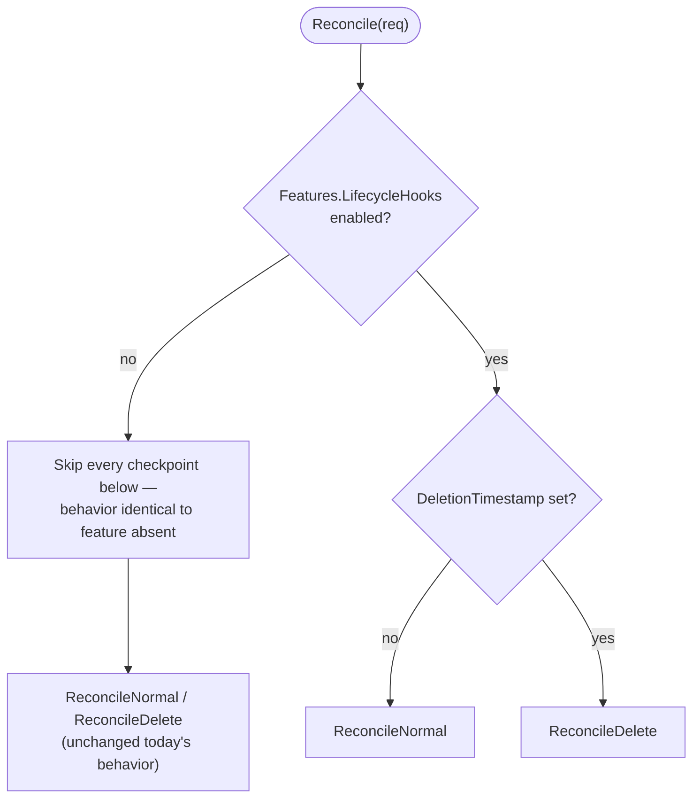
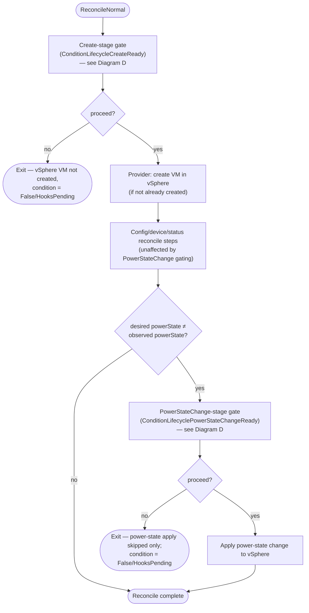
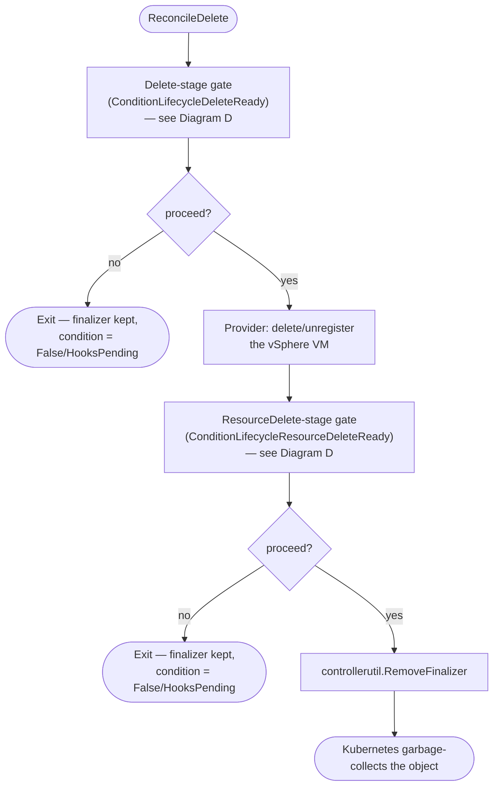
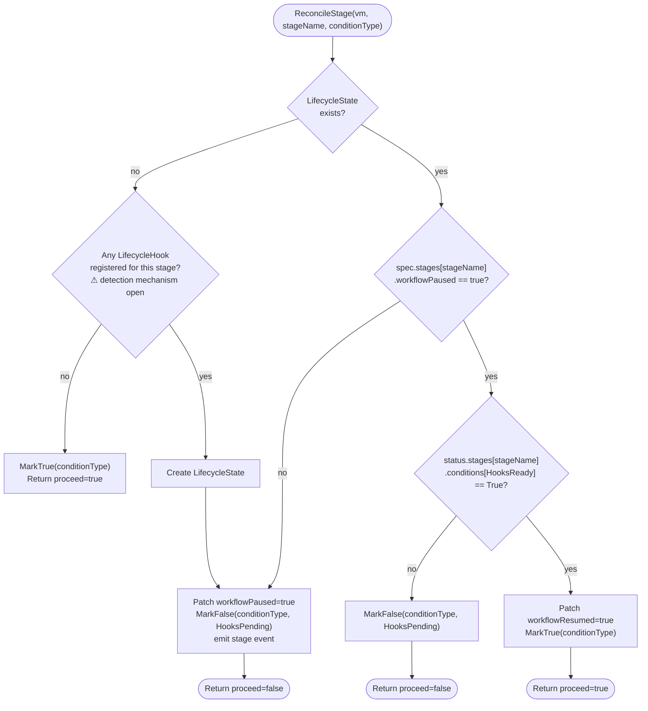

# Feature Specification: Blocking Lifecycle Hooks

- **Feature branch**: [`lifecyclehooks-sdd`](../../../../tree/lifecyclehooks-sdd)
  - **Fork**: N/A (branch on `vmware-tanzu/vm-operator`)
  - **PR target**: `vmware-tanzu/vm-operator`
- **Created**: 2026-08-24
- **Status**: Draft
- **Epic**: vmop-3377

---

## Background

A DevOps user's `VirtualMachine` reconciliation passes through several points — before it's created in vSphere, before a power-state change, and before it's deleted (from vSphere and, subsequently, from Kubernetes) — where work outside VM Operator's control needs to run first (AD registration, resource rebalancing, external cleanup) before the workflow resumes. Today, VM Operator offers no way to pause at any of these points; reconciliation always runs straight through.

VM Operator does not own the coordination mechanism itself. A separate Lifecycle Operator owns the `LifecycleStages`, `LifecycleHook`, and `LifecycleState` CRDs (group `lifecycle.vcfa.vmware.com`) and all hook fan-out, timeout, and eventing logic. VM Operator's role is limited to declaring which stages it exposes, and at each stage checkpoint, reading a single readiness signal off `LifecycleState` and pausing or proceeding accordingly — the same "consumer-only" relationship this repo already has with `external/byok`'s `EncryptionClass`.

---

## Reconcile pipeline (big picture)

```
Reconcile(req)
  │
  └─DeletionTimestamp set?
      │
      ├─no  ─▶ ReconcileNormal
      │           │
      │           ├─Create stage checkpoint (once per VM lifecycle)
      │           │     not yet created + hook registered + not ready ─▶ pause, skip provider Create
      │           │     ready or no hook ─▶ proceed to provider Create
      │           │
      │           └─PowerStateChange stage checkpoint (every power transition)
      │                 desired power state ≠ observed + hook registered + not ready ─▶ pause,
      │                 skip the power-state apply only — all other config/device reconcile continues
      │                 ready or no hook ─▶ apply the power-state change
      │
      └─yes ─▶ ReconcileDelete
                  │
                  ├─Delete stage checkpoint (vSphere-side, once)
                  │     hook registered + not ready ─▶ pause, skip provider Delete, keep finalizer
                  │     ready or no hook ─▶ delete the vSphere VM
                  │
                  └─ResourceDelete stage checkpoint (Kubernetes-side, once — never in
                     parallel with Delete; only evaluated once Delete has fully resolved)
                        hook registered + not ready ─▶ pause, skip RemoveFinalizer
                        ready or no hook ─▶ RemoveFinalizer, object is garbage-collected
```

Every checkpoint above calls the same shared routine, applied at four different
points in the reconcile flow. That routine — sketched in Diagram D below — lazily
creates the VM's `LifecycleState` the first time a checkpoint is reached, as part
of the same get-or-create/pause/resume decision the rest of the routine makes. See
"Reconcile flows" below for the per-checkpoint decision logic and its two
failure-free exits (no capability, no hook).

---

## Goals

- **G1**: VM Operator MUST expose exactly four lifecycle stages for `VirtualMachine`: **Create**, **PowerStateChange**, **Delete** (vSphere-side deletion), and **ResourceDelete** (Kubernetes CR finalizer removal).
- **G2**: VM Operator MUST pause the corresponding underlying action for a stage — and MUST NOT pause unrelated reconcile work — whenever that VM's `LifecycleState` indicates the stage is registered for blocking and hooks are not yet ready.
- **G3**: VM Operator MUST resume the paused action once the `LifecycleState`'s `HooksReady` condition for that stage becomes `True`, without requiring a full VM spec change to trigger the resume.
- **G4**: VM Operator MUST surface, via a `VirtualMachine` status condition per stage, whether that stage is currently blocked and whether it has ever been reached.
- **G5**: VM Operator MUST support multiple hooks registered on the same stage for the same VM (multiplexed through `LifecycleState.status.stages[].hooks[]`) without requiring changes to how VM Operator itself pauses/resumes.
- **G6**: VM Operator MUST continue to function (create/update/delete VMs normally) when no `LifecycleState`/hook exists for a VM, with no measurable behavior change from today.
- **G7**: The entire feature MUST be gated behind a single Supervisor capability, `supports_vm_service_lifecycle_hooks` — no stage ever pauses on a Supervisor where the capability is disabled, and no `LifecycleState` is ever created or patched while it is disabled.

## Non-goals

- Implementing the Lifecycle Operator, or any controller that reconciles `LifecycleStages`, `LifecycleHook`, or `LifecycleState` — those CRDs and their controllers are owned elsewhere.
- Implementing the eventing/notification system (`Subscription`/`Event`, group `eventing.vcfa.vmware.com`) that notifies external hook owners that a stage was reached.
- Defining or enforcing hook timeout policy, or distinguishing *why* hooks aren't ready (pending vs. failed vs. timed out) — that is entirely the Lifecycle Operator's responsibility. VM Operator only reads `LifecycleState.status.stages[].conditions[HooksReady]`, a single boolean-like signal.
- Stages beyond the four listed above (e.g. `Encrypt`, as illustrated in the one-pager) — may be added in a follow-up spec.
- Any customer-facing UI or CLI for registering `LifecycleHook`s.

---

## User scenarios & testing *(mandatory)*

### User Story 1 — VM Create can be paused for external setup (Priority: P1)

A DevOps user creates a `VirtualMachine` in a namespace where a `LifecycleHook` is registered for the `Create` stage (e.g. so an AD pre-registration step can run before the VM exists in vSphere). The VM is not created in vSphere until that hook reports done.

**Why this priority**: This is the earliest and simplest checkpoint — without it, no later stage's design would be validated end to end. It delivers a demonstrable MVP on its own.

**Independent test**: Create a VM in a namespace with a `Create`-stage `LifecycleHook` registered, reconcile it, and verify no vSphere VM is created and the VM's `Create` condition is blocked; flip the hook's readiness and verify the VM is then created and the condition clears.

**Acceptance scenarios**:

1. **Given** a `VirtualMachine` with no `LifecycleState` yet and a `LifecycleHook` registered for the `Create` stage on `(vmoperator.vmware.com, VirtualMachine)` in its namespace, **When** VM Operator reconciles the VM for the first time, **Then** VM Operator creates a `LifecycleState` for the VM, sets `spec.stages[Create].workflowPaused=true`, sets the VM's `Create` stage condition to blocked, emits the stage's event, and does not create the underlying vSphere VM.
2. **Given** a `LifecycleState` with `spec.stages[Create].workflowPaused=true` and `status.stages[Create].conditions[HooksReady]=True`, **When** VM Operator reconciles the VM, **Then** VM Operator sets `workflowResumed=true`, updates the VM's `Create` condition to ready, and proceeds to create the VM in vSphere on that same or a subsequent reconcile.
3. **Given** no `LifecycleHook` exists for the `Create` stage in the VM's namespace, **When** VM Operator reconciles a newly created VM, **Then** VM Operator proceeds to create the VM in vSphere without creating a `LifecycleState` or pausing, identical to today's behavior.

---

### User Story 2 — Power-state changes can be paused for external coordination (Priority: P1)

A DevOps user's VM is about to power on or off, and a `LifecycleHook` on `PowerStateChange` needs to run first (e.g. a rebalancing step). `PowerStateChange` is `Reentrant`: both `PoweredOff → PoweredOn` and `PoweredOn → PoweredOff` transitions are in scope, and each transition is paused independently.

**Why this priority**: Power-state transitions are the most frequent lifecycle event after create/delete, so this is the highest-value checkpoint after US1.

**Independent test**: Transition a VM `PoweredOff → PoweredOn` with a `PowerStateChange` hook registered; verify only the power-on is held (other reconcile work proceeds) and the condition is blocked. Flip readiness, verify the power-on applies. Repeat for the reverse transition and verify it pauses independently of the first.

**Acceptance scenarios**:

1. **Given** a `VirtualMachine` transitioning `PoweredOff` → `PoweredOn` and a blocking `LifecycleHook` on `PowerStateChange`, **When** VM Operator would otherwise apply the power-on to vSphere, **Then** VM Operator pauses that step only — config/device reconciliation unrelated to power state continues to converge — and sets the `PowerStateChange` condition to blocked.
2. **Given** the same VM once `HooksReady=True`, **When** VM Operator next reconciles, **Then** the power-on is applied and the condition flips to ready.
3. **Given** the `PowerStateChange` stage is `Reentrant`, **When** the VM later transitions `PoweredOn` → `PoweredOff` with the same hook still registered, **Then** VM Operator pauses again for the new transition (power-off), independent of and unaffected by the prior power-on pause/resume.

---

### User Story 3 — VM deletion can be paused for external cleanup, both in vSphere and in Kubernetes (Priority: P1)

A DevOps user deletes a VM that needs external cleanup (e.g. an external CMDB entry) before the VM is deleted from vSphere (`Delete` stage), and/or one more checkpoint after the vSphere VM is gone but before the Kubernetes object disappears (e.g. to finish writing an audit record keyed by the VM's UID) (`ResourceDelete` stage). `Delete` and `ResourceDelete` remain two distinct, independently-hookable stages — a hook may register on either or both — but `Delete` MUST fully resolve (vSphere VM gone) before `ResourceDelete` is ever evaluated; they are never evaluated in parallel.

**Why this priority**: Deletion is the one path where a missed hook is irreversible — once the vSphere VM or the Kubernetes object is gone, there's no second chance to run cleanup.

**Independent test**: Delete a VM with a `Delete`-stage hook registered; verify the vSphere VM is not removed and the finalizer stays in place until the hook reports done. Then verify `ResourceDelete` is evaluated the same way before the finalizer is actually removed.

**Acceptance scenarios**:

1. **Given** a `VirtualMachine` with `DeletionTimestamp` set and a blocking `LifecycleHook` on `Delete`, **When** VM Operator's delete reconciliation would otherwise call into the provider to delete/unregister the vSphere VM, **Then** VM Operator pauses before that provider call, sets the `Delete` condition to blocked, and does not remove the VM Operator finalizer.
2. **Given** `HooksReady=True` for the `Delete` stage, **When** VM Operator next reconciles the deleting VM, **Then** the vSphere VM is deleted, and VM Operator then evaluates the `ResourceDelete` stage the same way — pausing before finalizer removal if a hook is registered and not ready, or removing the finalizer immediately if none is.
3. **Given** `HooksReady=True` for `ResourceDelete` (or no hook registered for it), **When** VM Operator next reconciles, **Then** the finalizer is removed and Kubernetes garbage-collects the object.
4. **Given** `Delete` and `ResourceDelete` are two distinct, independently-hookable stages, **When** a hook is registered on either or both, **Then** `Delete` fully resolves (vSphere VM gone) before `ResourceDelete` is ever evaluated — the two stages are never evaluated in parallel.

---

### User Story 4 — Diagnosing a blocked VM from status alone (Priority: P2)

A DevOps user needs to tell, from the VM object alone, whether any stage is currently holding up reconciliation, without inspecting the `LifecycleState` or any hook resource directly.

**Why this priority**: Diagnosability. Without it, a DevOps user waiting on a stuck VM has no way to distinguish "waiting on a hook" from any other stalled reconcile.

**Independent test**: With a stage currently blocked, run `kubectl get vm <name> -o yaml` and confirm the corresponding condition is `False` with a reason indicating hooks are pending. Resolve the hook and confirm the condition flips.

**Acceptance scenarios**:

1. **Given** any of the four stages is currently blocked, **When** a DevOps user runs `kubectl get vm <name> -o yaml`, **Then** the corresponding stage condition is `False` with reason `HooksPending`, without needing to inspect the `LifecycleState` or any hook resource directly.
2. **Given** a stage has never been reached (e.g. a `Single`-type stage already resumed once), **When** status is read, **Then** its condition reflects "resumed"/ready, not "never evaluated" — no condition is left `Unknown` after the stage's first reconcile pass.

---

## Reconcile flows

The diagrams below give the checkpoint decision logic in detail: the shared
stage-check applied identically at all four points, and where each one sits inside
`Reconcile`'s `ReconcileNormal`/`ReconcileDelete` split.

### Diagram A — Reconcile entrypoint



### Diagram B — ReconcileNormal: Create and PowerStateChange checkpoints

Node labels below say "stage gate," standing in for the shared `ReconcileStage`
routine (see Diagram D). Only the pause/resume *decision* each checkpoint makes,
and where it sits in the flow, is fixed by G1-G3.



### Diagram C — ReconcileDelete: Delete and ResourceDelete checkpoints

Same caveat as Diagram B: each box names the stage being gated, standing in for
the shared `ReconcileStage` routine (see Diagram D).



### Diagram D — shared stage-gate decision logic (`ReconcileStage`)

Every checkpoint in Diagrams B and C calls into the same decision logic (see
`model.md` "VM Operator's read/write contract per stage checkpoint"). The routine
performs lazy initialization — it creates the `LifecycleState` itself, on demand,
the first time a checkpoint reaches it — as part of the same get-or-create/
pause/resume decision the rest of the routine makes; this is a settled part of
`ReconcileStage`'s shape, not an open question. The one piece of this diagram that
is **not yet finalized** is `HookExists` below — how VM Operator determines
whether a stage has any hook registered at all, before ever touching
`LifecycleState` (see "Open questions").



---

## Resolved decisions

All open questions from the prior draft have been resolved:

- **Power-off inclusion**: `PowerStateChange` covers both `PoweredOff → PoweredOn` and `PoweredOn → PoweredOff`, and is `Reentrant`.
- **Stage `type`/`blocking` defaults**: `Create`=`Single`, `PowerStateChange`=`Reentrant`, `Delete`=`Single`, `ResourceDelete`=`Single`; all four are `blocking=true`.
- **Hooks-not-ready handling**: VM Operator does not distinguish pending/failed/timed-out; it only mirrors the `HooksReady` boolean via a single `False` reason, `HooksPending`. That detail lives in the Lifecycle Operator and is out of scope here. This is not a terminal state — VM Operator is a level-triggered controller with no concept of permanent failure (see [`research.md`](./research.md) "Terminal failures"); it keeps reconciling at the normal cadence and self-heals the moment `HooksReady` flips `True`.
- **Supervisor-level opt-in gating**: a dedicated Supervisor capability, `supports_vm_service_lifecycle_hooks`, gates the entire feature (see G7, `model.md`/`plan.md`), not deferred.
- **Condition type/reason names**: four new `VirtualMachine` condition types — `VirtualMachineConditionLifecycleCreateReady`, `VirtualMachineConditionLifecyclePowerStateChangeReady`, `VirtualMachineConditionLifecycleDeleteReady`, `VirtualMachineConditionLifecycleResourceDeleteReady` — each with a single `False` reason, `HooksPending` (see `model.md`).
- **`LifecycleState` deleted out-of-band while a stage is paused**: VM Operator re-creates it and re-enters the paused state on the next reconcile, rather than treating its absence as "resume."
- **VM Operator restart mid-pause**: state lives in the `LifecycleState` CR, not in-memory, so a restart does not lose the pause — the next reconcile re-evaluates from the CR as normal (level-triggered reconciliation).

---

## Success criteria *(mandatory)*

### Measurable outcomes

- **SC-001**: A `Create`-stage hook registered on a VM's namespace prevents that VM's vSphere creation until `HooksReady=True`, verifiable across create/hook-resolve sequences with no vSphere VM created prematurely.
- **SC-002**: A `PowerStateChange`-stage hook holds only the power-state application, not any other in-flight reconcile step, and re-triggers independently on every subsequent power transition.
- **SC-003**: A `Delete`-stage hook prevents vSphere-side VM deletion, and a `ResourceDelete`-stage hook prevents finalizer removal, until each resolves in sequence — never in parallel.
- **SC-004**: A VM with no `LifecycleHook` registered anywhere in its namespace shows zero behavior change from today — no `LifecycleState` created, no pause, no extra reconcile latency.
- **SC-005**: With the `supports_vm_service_lifecycle_hooks` capability disabled, behavior is identical to the feature not existing — verifiable by the pre-existing test suites passing unchanged.
- **SC-006**: A DevOps user can determine, from `status.conditions` alone, whether any stage is currently blocking a VM and why.

## Open questions

- [NEEDS CLARIFICATION: G6 ("no `LifecycleHook` anywhere → zero measurable behavior change from today") may not be achievable relying solely on the Lifecycle framework's own create-time contract — see `research.md` "Zero-hook cost." All four handshake options the framework side has documented (populate-all-stages vs. populate-subscribed-only, crossed with who populates) cost something for the common zero-hook VM: either a per-stage-reach round trip (4 writes, 2 round trips, forever) or a one-time creation-time wait for `StagesConverged`. Satisfying G6 likely requires VM Operator to pre-check `LifecycleHook` existence itself (e.g. a cached list/watch) before ever entering the framework's handshake, rather than deferring "direct list vs. rely on `LifecycleState` absence" to `plan.md` as a pure implementation detail. Needs a decision before `plan.md`'s reconcile-pipeline design (see "Reconcile pipeline" diagrams above) can be finalized.]


## Review & acceptance checklist

- [x] All user stories have at least two Given/When/Then scenarios.
- [x] Each scenario is independently testable.
- [x] The no-hook-registered case is specified as a no-op/no-regression path.
- [x] Hooks-not-ready handling is specified (mirrors `HooksReady` only, no failure-detail parsing).
- [x] Stage `type`/`blocking` defaults are specified.
- [x] Condition/reason names and the capability name are specified.
- [x] Out-of-scope items (Lifecycle Operator, eventing system, additional stages, hook-failure-detail parsing) are listed.
- [x] Feature-flag/capability-off behavior is specified (G7, SC-005).
- [x] The reconcile pipeline and the per-checkpoint decision logic (shared `ReconcileStage`) are diagrammed.
