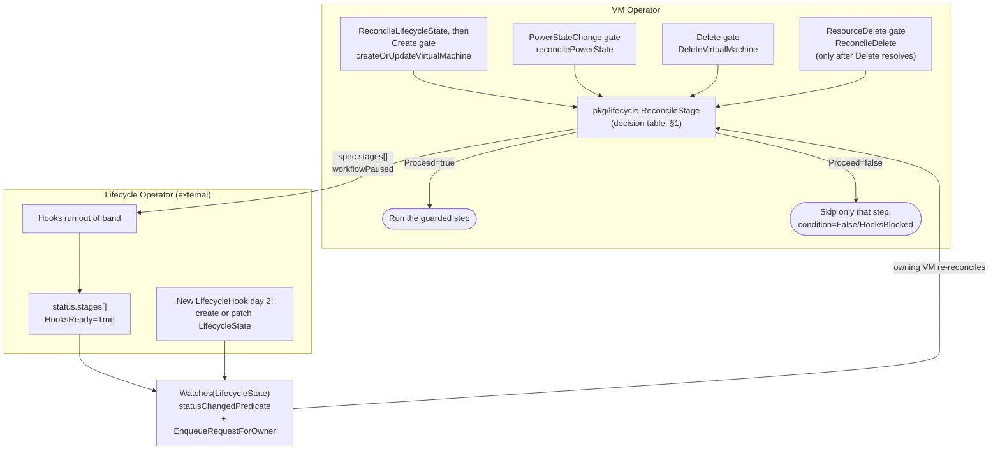

# Implementation Plan: Blocking Lifecycle Hooks

- **Spec**: [`spec.md`](./spec.md)
- **Model**: [`model.md`](./model.md)
- **Research**: [`research.md`](./research.md)
- **Epic**: vmop-3377
- **Date**: 2026-08-24
- **Status**: Draft

## Summary

Add a consumer-side integration with the externally-owned `lifecycle.vcfa.vmware.com` CRDs so VM Operator can pause and resume four `VirtualMachine` reconcile checkpoints — Create, PowerStateChange, Delete, ResourceDelete — based on a per-VM `LifecycleState` resource, without owning or reconciling any of the Lifecycle Operator's CRDs itself. `LifecycleState` is owned **1:1** by the `VirtualMachine` it tracks, so the fan-out needs no field index and no custom mapper — just the built-in `handler.EnqueueRequestForOwner`.

The design has two parts, each small:

- **Initialize once.** Before a VM's first create — determined by `createOrUpdateVirtualMachine`'s `getVM` finding no existing vSphere VM, not by `Status.UniqueID` (see "Create gate placement" below) — `pkg/lifecycle.ReconcileLifecycleState` reads `LifecycleSubscribedStages` (one per namespace, Lifecycle-Operator-owned, cached but never watched). If it lists any stage for `VirtualMachine`, VM Operator creates the VM's `LifecycleState` with **every** listed stage in `spec.stages[]` in one write. If it lists none, nothing is created (G5).
- **Decide at each checkpoint.** A shared routine, `pkg/lifecycle.ReconcileStage`, is called identically from all four checkpoints — one in the VM controller (`ReconcileDelete`'s ResourceDelete gate) and three in the vSphere provider (`createOrUpdateVirtualMachine`'s Create gate, `DeleteVirtualMachine`'s Delete gate, `reconcilePowerState`'s PowerStateChange gate). It reads `LifecycleState` and pauses, holds, or resumes per the decision table in §1, decided fresh at the point of use (not pre-computed at the top of the reconcile loop — see "Rejected: upfront `ReconcileStages`" in Complexity tracking). A missing object or a missing stage entry means "no hook" and the checkpoint proceeds.

**One condition per stage, not one condition for all four.** Each stage gets its own condition type — `VirtualMachineConditionCreateHooksReady`, `...PowerStateChangeHooksReady`, `...DeleteHooksReady`, `...ResourceDeleteHooksReady` — rather than a single `VirtualMachineConditionLifecycleHooksReady` with the stage name carried only in the message. A consumer (e.g. `VirtualMachineGroup`, see §7) that needs to know specifically whether *PowerStateChange* is blocking a given VM cannot reliably parse a free-text message, and must not be made to read `LifecycleState` directly (see §7's "why not read `LifecycleState` from the group controller"). A per-stage condition is the only signal that is both unambiguous and keeps `LifecycleState` access confined to `pkg/lifecycle`.

After initialization, keeping `LifecycleState` accurate is the Lifecycle Operator's responsibility: a `LifecycleHook` registered later (day 2) is patched into the existing `LifecycleState`, or the object is created if the VM had none. VM Operator never adds or repairs stage entries.

VM Operator's watch on `LifecycleState` reacts only to `status` changes — not `Create` events (frequently its own) or spec-only updates — since those are the only events carrying information VM Operator doesn't already know. Writes to `spec.stages[].workflowPaused`/`workflowResumed` use optimistic locking, because `LifecycleState` has two writers on that object: VM Operator and, for day-2 additions, the Lifecycle Operator.

## Technical context

- **Go version**: repo default (see root `go.mod`).
- **API version(s) touched**: `api/v1alpha6` (additive conditions only — no field removal, no version bump; `v1alpha6` is `main`'s current storage version per `model.md`).
- **Modules touched**: root module (`controllers/`, `pkg/`, `api/`, `config/`) plus a new `external/lifecycle` sub-module.
- **New dependencies**: none beyond the new `external/lifecycle` module (own `go.mod`, no third-party deps).
- **Feature flag**: `pkgcfg.FromContext(ctx).Features.LifecycleHooks`, gated behind the Supervisor capability `supports_vm_service_lifecycle_hooks` (spec G6). No independently-toggleable env-var default — the capability is the sole gate (spec "Resolved decisions").
- **Depends on**: no other feature flag. The fan-out is a `Watches(&lifecyclev1.LifecycleState{}, handler.EnqueueRequestForOwner(...))`, backed by the informer cache, not a `cource` channel — it does **not** depend on `AsyncSignalEnabled`.
- **Interaction with pre-existing flags**: independent of `BringYourOwnEncryptionKey`, `TelcoVMServiceAPI`, and `FastDeploy` — none of `ReconcileStage`'s four call sites touch the `vmconfig.Reconciler` registry those flags gate. One interaction is load-bearing rather than incidental: the Create-stage gate must run identically whichever create path is taken — `CreateOrUpdateVirtualMachine` or its `Async` sibling, chosen by `AsyncSignalEnabled && AsyncCreateEnabled` — because spec G1 makes no create-path distinction. Both arms share the same underlying implementation, `createOrUpdateVirtualMachine` (`vmprovider_vm.go:155`), so placing the gate inside it, after `getVM` and before `ctxop.MarkCreate`, covers both arms structurally rather than by duplicating the gate into each (see "Create gate placement" below).

## Constitution check

| Rule | Status | Notes |
|---|---|---|
| API compatibility (additive only) | OK | New condition types only; no field removal/rename. |
| Controllers are thin | OK | Stage-gate logic lives in a new `pkg/lifecycle` package, called from controllers/provider; controllers only orchestrate. |
| No controller calls vSphere directly | OK | Stage gate reads/writes `LifecycleState` via the k8s client, not vSphere; all three vSphere-side checkpoints (Create, PowerStateChange, Delete) live in `pkg/providers/vsphere` — only `ResourceDelete` is controller-side, and it gates a Kubernetes action (finalizer removal), not a vSphere call. |
| Controllers for non-`vmoperator.vmware.com` groups don't live in `controllers/` | OK | This feature adds **no new controller** — it adds watches/logic to the existing `controllers/virtualmachine/virtualmachine` controller, which already reconciles `vmoperator.vmware.com`. `LifecycleHook`/`LifecycleState` are read/patched, never reconciled by a VM-Operator-owned controller loop. |
| External vendored APIs live under `external/` | OK | New `external/lifecycle` module, mirroring `external/byok`. |
| Mapper functions use a field indexer, not an unfiltered `List` | OK, and simpler than the rule anticipates | `LifecycleState` is owned 1:1 by its `VirtualMachine`, so the fan-out uses `handler.EnqueueRequestForOwner` — which resolves the owning VM straight from the `LifecycleState` object's own `ownerReferences`, no `List` and no field index at all. See "Fan-out" below for why this is a strictly cheaper case than the indexed-mapper rule the constitution is guarding against. |
| `+kubebuilder:rbac` markers document permissions | OK | New markers for `lifecycle.vcfa.vmware.com` `lifecyclestates` (get/list/watch/create/patch) and `lifecyclesubscribedstages` (get/list/watch, cache-only, no fan-out) — `LifecycleHook` and `LifecycleStages` are never read directly by VM Operator (see `model.md`), so no RBAC needed for either. |
| E2E ships with cluster-observable behavior | OK (mandatory) | All four stages are cluster-observable (pausing reconciliation, new conditions) — E2E required per `e2e-sync-with-changes.md`, tracked in `tasks.md`. |
| Feature flag default / rollout documented | OK | Gated by a Supervisor capability, not a bare always-on flag — see "Rollout / migration" below. |

No complexity-tracking entries for constitutional rules — no rule is being bent. "Complexity tracking" below records design points that deviate from a repository *default* rather than a *rule*.

## Project structure

### New files

```
external/lifecycle/                              # NEW module — vendored client types only
  go.mod
  api/v1alpha1/
    doc.go
    groupversion_info.go
    lifecyclestate_types.go                       # LifecycleState, LifecycleStateList (Get/Create/Patch target)
    lifecyclehook_types.go                         # LifecycleHook, LifecycleHookList — types only; VM Operator
                                                    #   never Gets/Lists this kind (model.md), vendored for
                                                    #   completeness/documentation of the schema only
    lifecyclesubscribedstages_types.go              # LifecycleSubscribedStages, LifecycleSubscribedStagesList —
                                                    #   Get-only, the zero-hook pre-check's data source (model.md)
    zz_generated.deepcopy.go

pkg/lifecycle/                                     # NEW — stage-gate helper, reusable from controller + provider
  stage.go                                          # ReconcileStage(ctx, k8sClient, obj, stageName) (Result, error),
                                                     #   ReconcileLifecycleState, ReleaseLifecycleState
  stage_test.go

config/crd/external-crds/
  lifecycle.vcfa.vmware.com_lifecyclestates.yaml   # generated via make generate-external-manifests

config/lifecycle/
  vmoperator-stages.yaml                            # static LifecycleStages *instance* (data, not a CRD
                                                     #   definition — model.md "Static LifecycleStages instance")

test/e2e/vmservice/vmservice/virtualmachine/
  vm_lifecycle_hooks.go                             # E2E suite for all four stages
```

### Modified files

```
config/crd/crd.go                                   # + //go:embed external-crds/lifecycle.vcfa.vmware.com_*.yaml
pkg/crd/crd.go                                       # + case "LifecycleState": updateOrDeleteUnstructured(...,
                                                     #   features.LifecycleHooks, ...) — see "Getting the CRD
                                                     #   onto a Supervisor" below
config/default/kustomization.yaml                   # + ../crd/external-crds/lifecycle.vcfa.vmware.com_lifecyclestates.yaml
config/crd/external-crds/README.md                   # + LifecycleState entry under "Production CRDs"
pkg/manager/manager.go                               # + lifecyclev1 import, + lifecyclev1.AddToScheme(opts.Scheme)
pkg/config/config.go                                 # + Features.LifecycleHooks bool
pkg/config/capabilities/capabilities.go             # + CapabilityKeyLifecycleHooks constant, + case in
                                                     #   updateCapabilitiesFeaturesFromCRD
api/v1alpha6/condition_consts.go                    # + four condition type constants, one per stage:
                                                     #   VirtualMachineConditionCreateHooksReady,
                                                     #   VirtualMachineConditionPowerStateChangeHooksReady,
                                                     #   VirtualMachineConditionDeleteHooksReady,
                                                     #   VirtualMachineConditionResourceDeleteHooksReady
controllers/virtualmachine/virtualmachine/
  virtualmachine_controller.go                      # + RBAC markers
                                                     # + Watches(&lifecyclev1.LifecycleState{},
                                                     #   handler.EnqueueRequestForOwner(...)) gated by
                                                     #   Features.LifecycleHooks
                                                     # ReconcileDelete: ResourceDelete-stage gate before
                                                     #   finalizer removal

pkg/providers/vsphere/vmprovider_vm.go              # createOrUpdateVirtualMachine: ReconcileLifecycleState +
                                                     #   Create-stage gate at `:223`, after getVM finds no
                                                     #   VM, before ctxop.MarkCreate (see "Create gate
                                                     #   placement" below)
                                                     # DeleteVirtualMachine: Delete-stage gate before the
                                                     #   vSphere delete/unregister call
                                                     # reconcilePowerState: PowerStateChange-stage gate
                                                     #   inside `if setPowerState`, before SetPowerState

controllers/virtualmachinegroup/
  virtualmachinegroup_controller.go                 # reconcileMembers: all-members-hooks-ready pre-check
                                                     #   before stamping ApplyPowerStateTimeAnnotation;
                                                     #   base time recomputed to `now` once the check
                                                     #   passes (see §7 Sequencing)

test/builder/fake.go                                # + lifecyclev1.LifecycleState{} in KnownObjectTypes
```

`external/lifecycle` is a brand-new module, so the root `Makefile`'s `generate-external-manifests` target needs a new `paths=github.com/vmware-tanzu/vm-operator/external/lifecycle/...` entry added, not just run against an existing path list.

No envtest wiring is needed for the new CRD beyond that: `test/builder/test_suite.go` loads the whole `config/crd/external-crds` directory into envtest, so the generated manifest is picked up automatically once it exists.

## API / CRD strategy

Additive only. No `vmoperator.vmware.com` CRD schema changes beyond a new condition type constant (conditions are not per-version typed fields, so no conversion webhook work is needed). `external/lifecycle` vendors the schema published in the "[API design] Blocking Lifecycle stages" design doc (see `research.md`) — VM Operator does not modify or extend it.

Two generation steps, both outputs checked in:

- `make generate-go` — deepcopy for `LifecycleState`/`LifecycleHook` in the new `external/lifecycle` module.
- `make generate-external-manifests` — `config/crd/external-crds/lifecycle.vcfa.vmware.com_lifecyclestates.yaml`, after the Makefile path-list addition noted above. Note this generates a manifest **only for `LifecycleState`** (the kind VM Operator actually `Get`/`Create`/`Patch`es), not for `LifecycleHook` or `LifecycleStages` — see below for why those two are different.

### Getting the CRD onto a Supervisor

Only one of the four vendored kinds needs VM Operator to manage its own CRD install, and that shapes the two install paths below:

- **`LifecycleState`** is the one kind VM Operator itself creates and patches (model.md "VM Operator's read/write contract"), so VM Operator must ensure its CRD exists on any Supervisor where the feature might run. Both install paths apply here:
  1. **The install kustomization** — `config/default/kustomization.yaml` gains a `../crd/external-crds/lifecycle.vcfa.vmware.com_lifecyclestates.yaml` entry, alongside the repo's other vendored external CRD manifest entries.
  2. **Runtime install by the manager** — `main.go`'s `initCRDs` calls `pkgcrd.Install` (`pkg/crd/crd.go`), which walks every CRD manifest embedded via the `//go:embed` directives in `config/crd/crd.go` and, for each one, creates or deletes it through `updateOrDeleteUnstructured(ctx, k8sClient, enabled, c, k, mutateFn)` — `enabled` decides whether that kind's CRD should exist right now. A kind with no explicit `case` in `pkgcrd.Install`'s `switch` falls through to `default: enabled = true` and is installed unconditionally. `LifecycleState` needs its own `case "LifecycleState"` calling `updateOrDeleteUnstructured` with `features.LifecycleHooks` as `enabled`, so the install tracks the feature flag instead of defaulting to always-on. Without this `case`, `LifecycleState` would fall through to the unconditional-install default, leaving its CRD present on a Supervisor with the capability off — a small but real deviation from spec G6's "no stage ever pauses... and no `LifecycleState` is ever created" on a disabled Supervisor. The `case` closes that gap for the *install*; `ReconcileStage`'s own flag check closes it for *usage*.
  3. `config/crd/crd.go` additionally needs a `//go:embed external-crds/lifecycle.vcfa.vmware.com_*.yaml` line alongside its existing `//go:embed` directives, or the manifest is never loaded into `pkgcrd.External` in the first place.
- **`LifecycleStages`, `LifecycleHook`, and `LifecycleSubscribedStages`** are **not** installed by VM Operator at all. Per `model.md` "Static `LifecycleStages` instance," their CRDs are installed by the Lifecycle Operator's own chart; VM Operator never touches `LifecycleHook` at all, and only ever `Get`s `LifecycleSubscribedStages` (one per namespace) against a CRD it assumes the Lifecycle Operator has already installed. This is why the project structure above generates a manifest only for `LifecycleState` — generating one for the other three kinds would falsely imply VM Operator owns their installation.
  - The one `LifecycleStages` *instance* (`vmoperator-stages`, authored as `config/lifecycle/vmoperator-stages.yaml`) is a special case even among these three: VM Operator authors its YAML content (since it alone knows which stages it exposes) but does not apply it to any cluster itself — no Kustomize entry, no runtime `Create`/`Patch`. It is **bundled with the Lifecycle Operator's own deployment package**, which applies it alongside its own `LifecycleStages` CRD install. This resolves the install-ordering question for free: because both ship in the same package, the CRD this instance targets is guaranteed to already exist wherever the instance is applied — unlike `LifecycleState` above, which VM Operator does install and reconcile itself.

`CRDCleanupEnabled` defaults to `false` (`pkg/config/default.go`), so turning `LifecycleHooks` off leaves an already-created `LifecycleState` CRD (and any existing `LifecycleState` instances) in place rather than deleting them. This is a low-risk default here: with the flag off, `ReconcileStage` returns before making any API call (the flag check lives inside `pkg/lifecycle`), so a lingering `LifecycleState` CRD is simply unused, not a source of drift.

`test/builder/fake.go`'s `KnownObjectTypes` must gain `&lifecyclev1.LifecycleState{}` so the fake client enforces the status subresource split in unit tests (per `operator-best-practices.md`).

## Controller / webhook impact

### 1. Shared helper — `pkg/lifecycle.ReconcileStage`

The one routine every checkpoint calls (model.md "VM Operator's read/write contract per stage checkpoint"). It lives in its own `pkg/lifecycle` package rather than beside either caller, because this routine is called from **both** `controllers/virtualmachine/virtualmachine` and `pkg/providers/vsphere`, and those two packages do not import each other. A new leaf package with no dependency on either caller is the only placement that avoids a cycle.

Its two parameters worth calling out explicitly:

- **`k8sClient ctrlclient.Client`** — the controller-runtime client used to `Get`/`Create`/`Patch` the `LifecycleState`. `ReconcileStage` takes it as a parameter rather than holding one, because its two call sites already carry their own with different lifetimes: the controller passes `r.Client`, the provider passes `vs.k8sClient`. `ReconcileStage` is a plain function, not a controller or a struct with a client field, so it has no independent way to obtain one.
- **`obj *vmopv1.VirtualMachine`** — the VM being reconciled. `ReconcileStage` keys the `LifecycleState` off `obj.Namespace`/`obj.Name`/`obj.UID` and calls `conditions.MarkTrue`/`MarkFalse` directly on `obj.Status.Conditions`, exactly like `pkgcond.MarkError(ctx.VM, ...)` does today in the provider. It mutates the caller's in-memory object; it does **not** patch `obj` back to the API server — the caller's own patch helper (`patch.NewHelper`'s deferred patch in the controller, or the provider's own status patch) persists that.

`ReconcileStage` takes a `stageName` parameter (`"Create"`, `"PowerStateChange"`, `"Delete"`, `"ResourceDelete"`) and an explicit `conditionType` parameter — the specific per-stage condition constant the call site marks. Each of the four call sites passes its own: `createOrUpdateVirtualMachine` passes `VirtualMachineConditionCreateHooksReady`, `reconcilePowerState` passes `VirtualMachineConditionPowerStateChangeHooksReady`, and so on. This is a deliberate change from a single shared condition: a consumer outside the VM controller (§7's `VirtualMachineGroup`) needs to know unambiguously whether *this specific stage* is blocking a given VM, and a single condition with the stage name only in the message text cannot be consumed reliably by another controller without string-parsing. See Complexity tracking for the rejected single-condition alternative.

`ReconcileStage` only reads and patches; it never creates `LifecycleState` and never reads `LifecycleSubscribedStages`. Creation happens once, in `ReconcileLifecycleState` (§3). `ReconcileStage` does one `Get` and resolves to a row of this decision table:

| `LifecycleState` | This stage's `spec.stages[]` entry | `workflowPaused` | `HooksReady` | Action | `Proceed` |
|---|---|---|---|---|---|
| `NotFound` | — | — | — | this stage's condition `True` | `true` |
| found | absent | — | — | this stage's condition `True` | `true` |
| found | present | `false` | — | pause; this stage's condition `False`/`HooksBlocked` | `false` |
| found | present | `true` | not `True` | this stage's condition stays `False`/`HooksBlocked` | `false` |
| found | present | `true` | `True` | resume; this stage's condition `True` | `true` |

**No condition is ever written for a stage `ReconcileStage` is not called for.** A VM whose power state already matches spec never reaches the `reconcilePowerState` gate (it returns before `if setPowerState`), so `VirtualMachineConditionPowerStateChangeHooksReady` is simply absent on that VM — not `True`, not `False`, not present at all — until a transition is actually attempted. Consumers must treat "condition absent" and "condition `True`" identically (not blocked), exactly as `conditions.IsFalse` already does by returning `false` for a missing condition. This is what makes it safe for a consumer like `VirtualMachineGroup` to check only `conditions.IsFalse(vm, conditionType)`, without needing to know whether the VM was ever a lifecycle-hooks participant at all (G5/G6).

- **No object, or no entry, means no hook for this stage.** Either the VM had no hooks at initialization, or the Lifecycle Operator has not (yet) propagated one; in both cases VM Operator proceeds (G5).
- **Pause** patches `workflowPaused=true` and sets the condition to `False`/`HooksBlocked` with the stage name in the message.
- **Resume** patches **both** `workflowPaused=false` and `workflowResumed=true` in one write. VM Operator clears its own pause and signals the resume together, so the stage is left un-paused and re-pauses on its next reach of the checkpoint — true uniformly for all four stages, since all four are declared `Reentrant` and the gate never branches on stage type (see "Uniform gate" below); the Lifecycle Operator then resets that stage's `status` entry for the next pass (model.md).
- **Helpers** (internal to `pkg/lifecycle`): `ReconcileLifecycleState`, `ReleaseLifecycleState`, and one find-then-patch helper for `spec.stages[]` writes.

Every `spec.stages[]` write uses `client.MergeFromWithOptimisticLock`. The Lifecycle Operator also writes that list (day-2 additions), so it is a shared multi-writer list — the case `operator-best-practices.md`'s "Fan-out to Child Objects" rule requires a lock for, since a merge patch replaces the whole array and would silently drop a concurrent writer's entry. A `409 Conflict` propagates as a plain error and the caller's normal requeue re-reads fresh state; no dedicated conflict handling lives in `pkg/lifecycle`.

### 1a. `LifecycleState` initialization and day-2 hook additions

**VM Operator initializes once.** `ReconcileLifecycleState` (§3) runs immediately before the Create-stage gate in `createOrUpdateVirtualMachine`, once `getVM` has determined the VM does not yet exist in vCenter (`foundVM == nil`) — not when `Status.UniqueID == ""`, which a snapshot revert can also produce for a VM that already exists (see "Create gate placement" below). If `LifecycleSubscribedStages` lists any stage for `VirtualMachine`, it creates `LifecycleState` with **every** listed stage in `spec.stages[]` in one write. `Delete`/`ResourceDelete` entries therefore exist long before any deletion is in play.

**After that, a missing entry means "no hook" and VM Operator does not second-guess it.** `ReconcileStage` does not consult `LifecycleSubscribedStages`, and does not add or repair entries. Keeping `LifecycleState` accurate from then on is the Lifecycle Operator's job:
- A `LifecycleHook` registered later (day 2) for a VM that already has a `LifecycleState`: the Lifecycle Operator patches the new stage into `spec.stages[]`.
- A VM that had zero hooks at initialization, so no `LifecycleState`: the Lifecycle Operator creates it.

This runs on the Lifecycle Operator's own reconcile cadence, reacting to the new `LifecycleHook` directly, not on VM Operator's `ReconcileNormal` cadence (bounded by the 30-minute default `SyncPeriod` in the worst case, per `pkg/manager/constants.go`).

**Why `Create`/`PowerStateChange` need no extra protection**: `Create` being interrupted by a namespace delete is a conflict of intention (the namespace deletion is the user's later, more explicit action), not a gap to protect against — see spec.md US3. `PowerStateChange` self-heals by re-evaluating on every future transition.

**Accepted gaps** (documented, not solved further):
- A hook registered for `Delete`/`ResourceDelete` in the same instant the namespace begins terminating, before the Lifecycle Operator reacts and before `Namespace.status.phase` flips to `Terminating` (after which `NamespaceLifecycle` admission rejects new creates in the namespace). Bounded by how fast the Lifecycle Operator reacts, not by VM Operator's cadence.
- A `LifecycleState` the Lifecycle Operator creates for a day-2 hook carries no VM Operator finalizer unless the Lifecycle Operator adds it, since only `ReconcileLifecycleState` adds it on VM Operator's side. Without it, that object has no namespace-delete protection from VM Operator (see "Confirmations needed from the Lifecycle Operator team").

### 2. VM path — the four call sites and their ordering

`ReconcileLifecycleState`, `ReconcileStage`, and `ReleaseLifecycleState` each check `pkgcfg.FromContext(ctx).Features.LifecycleHooks` first and return immediately when it is off (`ReconcileStage` returns `Proceed=true`) — no `Get`, no `Create`, no condition change (spec G6). Keeping the check in one place, rather than wrapping each of the four call sites, means a new call site cannot forget it; call sites therefore call these functions unconditionally. Each site acts on `Result.Proceed`: when `false`, skip only the guarded step.

| Stage | Location | Placement | When `!Proceed` |
|---|---|---|---|
| Create | `vmprovider_vm.go` `createOrUpdateVirtualMachine` | `ReconcileLifecycleState` first, then the Create gate, both at `:223` — after the `if foundVM != nil { MarkUpdate; return updateVirtualMachine(...) }` block closes, **before** `ctxop.MarkCreate(vmCtx)` at `:225`. This is `getVM`-determined ("does this VM exist in vCenter?"), not `Status.UniqueID`-determined — see "Create gate placement" below for why. Because this sits inside `createOrUpdateVirtualMachine`, which both `CreateOrUpdateVirtualMachine` and its `Async` sibling call (`:140-153`), one placement covers both dispatch arms. | Return `pkgerr.NoRequeueNoErr("waiting for Create stage hooks")`. |
| PowerStateChange | `vmprovider_vm.go` `reconcilePowerState` | Inside the `if setPowerState` block, immediately before `SetPowerState` — the single choke point for every transition (on→off, off→on, on→suspended, suspended→off). Every "no change needed" exit returns before that block, so an unchanged power state never consults the stage. `reconcilePowerState` runs after config reconcile (see the VM update reconcile order), so network/volume/hardware reconcile is unaffected (G2/SC-002). The same call covers every direction because the stage is `Reentrant`, so each transition pauses independently (US2 scenario 3). `session_vm_update.go` was the original candidate but never issues a power task — it only reconfigures the VM in its current power state. | Return `nil` — skip only the power operation; later steps (e.g. snapshot create) still run. |
| Delete | `vmprovider_vm.go` `DeleteVirtualMachine` | Immediately before the terminal `virtualmachine.DeleteVirtualMachine(vmCtx, vcVM)` call. | Return `pkgerr.NoRequeueNoErr("waiting for Delete stage hooks")`. |
| ResourceDelete | `ReconcileDelete` | Immediately before its `controllerutil.RemoveFinalizer(ctx.VM, finalizerName)`, after the Delete-stage provider call has returned. On `Proceed`, call `ReleaseLifecycleState` and then remove the VM finalizers. | Return `nil` — finalizer stays; the watch re-triggers on the `HooksReady` flip. |

### Create gate placement — why `getVM`, not `Status.UniqueID`

The Create gate must **not** use `ctx.VM.Status.UniqueID == ""` to decide "is this the first create," because `reconcileSnapshotRevert` wipes the VM's entire `Status` (`vmprovider_vmsnapshot.go:601`) — including `UniqueID` — as a deliberate recompute mechanism, for a VM that plainly still exists in vCenter. A Status-based gate would misread that wipe as "never created" and re-run the Create hook against a VM that already exists.

The authoritative signal already exists one layer down: `vcenter.GetVirtualMachine` (`getvm.go:24-57`), called as `getVM` inside `createOrUpdateVirtualMachine`, looks up the VM by `Status.UniqueID`, then `Spec.InstanceUUID`, then `vmCtx.VM.UID`. A snapshot revert never touches `Spec.InstanceUUID`, so `getVM` still finds the VM, takes the `MarkUpdate` branch, and the Create gate (inside the `foundVM == nil` branch only) is never reached. Placing the gate at `:223` — after `getVM` resolves `foundVM`, before `ctxop.MarkCreate` — means:

- **Survives snapshot revert.** Post-revert, `getVM` finds the VM via `Spec.InstanceUUID`; the update path runs and `reconcileStatus` (step 5) repopulates `Status.UniqueID` from `vmCtx.MoVM.Self.Value`, with no Create hook re-run.
- **Covers both create dispatch arms** (`CreateOrUpdateVirtualMachine` and `...Async`) in one place, since both call `createOrUpdateVirtualMachine` (`:140-153`).
- **No event-emission regression.** Placed before `ctxop.MarkCreate`, neither `IsCreate` nor `IsUpdate` is set, so the controller's switch falls to the catch-all case, which filters `NoRequeueNoErr` to no event (`virtualmachine_controller.go:929-934`). Placed after `MarkCreate` instead, `handleBlockingCreateErr` would emit a spurious `CreateFailure` warning on every blocked reconcile.
- **Narrows retry amplification.** A create that failed after the vSphere VM appeared takes the update path on retry, so only a VM that genuinely never got created re-pauses on Create.

- **Delete uses `NoRequeueNoErr`, not a plain `nil`/error**: `ReconcileDelete` treats the provider's error return as blocking finalizer removal either way, but `research.md` "Terminal failures" is explicit that a not-yet-ready hook is not a failure worth backoff retry. `NoRequeueNoErr` is the codebase's sentinel for "this reconcile did its job for now."
- **Every stage re-pauses on every reach of its checkpoint.** All four stages are declared `type=Reentrant` (spec "Resolved decisions"), and §1's decision table applies identically to all of them: `workflowPaused=false` always leads to pausing, regardless of stage or of how many times that checkpoint has been reached before. For `Create`, this has no practical cost: the gate only runs inside `foundVM == nil` (see "Create gate placement"), so a repeat reach only ever happens for a VM that genuinely still doesn't exist, which legitimately should re-decide. A retried vSphere delete (after a transient error) or a retried finalizer-removal patch (after a conflict) does re-reach an already-resumed `Delete`/`ResourceDelete` checkpoint and re-pauses, which requires hooks to be idempotent (spec "Resolved decisions").
- **`SkipDeletePlatformResourceKey`**: on this path VM Operator unregisters rather than deletes the vSphere VM, so the `Delete` stage is not evaluated, but the VM resource's finalizer is still removed at the same point, so the `ResourceDelete` gate still applies — otherwise its hooks would be skipped and the `LifecycleState` would never be released.
- **Delete-before-ResourceDelete ordering is free**: `ReconcileDelete` is straight-line code, so the ResourceDelete call is unreachable until `DeleteVirtualMachine` returns without pausing — spec US3 scenario 4's "never in parallel."
- **`ReleaseLifecycleState` removes only VM Operator's finalizer** from `LifecycleState`. VM Operator never calls `Delete` on it: GC's owner-reference cascade, or the namespace controller during a namespace delete, sets `DeletionTimestamp`, and the API server finishes the removal once the finalizer list is empty.

### 3. Reconcile and release helpers (spec G5, `research.md` "Zero-hook cost")

Follows `research.md`'s **Candidate 2**: the Lifecycle Operator owns `LifecycleSubscribedStages`, one instance per namespace covering every consumer kind (shape in model.md). VM Operator is a pure consumer and reads it **only inside `ReconcileLifecycleState`**; `ReconcileStage` never reads it.

**`ReconcileLifecycleState` is a level-triggered reconcile step, not a one-shot initializer** — the name follows `operator-best-practices.md`'s "Level-Triggered Reconciliation" convention deliberately, to avoid the misleading implication of a function that is only ever invoked a single time. It is expected to be called on every reconcile for as long as its call site is reached, and does nothing on every call after the first:

- **`ReconcileLifecycleState`**: guarded only on `Features.LifecycleHooks`.
  - If a `LifecycleState` for the VM already exists, return. This is the idempotency check that makes repeated calls free no-ops — the same shape as the finalizer-add pattern already in this controller (`virtualmachine_controller.go:614-623`: `if !ContainsFinalizer { AddFinalizer }`, called on every reconcile, acting only once).
  - Otherwise do a single informer-cache `Get` of the per-namespace `LifecycleSubscribedStages` (`vmoperator-hooks`) and filter locally to the `(vmoperator.vmware.com, VirtualMachine)` entry. `NotFound`, or no stages listed, means no hooks: return without creating anything.
  - Otherwise create a finalizer-protected `LifecycleState` owned by the VM (`SetControllerReference`) whose `spec.stages[]` holds **every** listed stage at `workflowPaused=false`, in one `Create`. On `AlreadyExists`, return.
  - `LifecycleSubscribedStages` is finalizer-protected by the Lifecycle Operator (confirmed with them), so this read never races a namespace-teardown sweep. Never a `List` or `Watch` against `LifecycleHook`.
- **`ReleaseLifecycleState`**: called from `ReconcileDelete` once ResourceDelete resolves. `NotFound` or finalizer already absent is a no-op; otherwise an optimistic-lock patch removes only VM Operator's finalizer entry — `metadata.finalizers` is also a shared list once the Lifecycle Operator may add VM Operator's finalizer for a day-2 object, so the same lost-update reasoning as `spec.stages[]` applies.
- **Finalizer constant**: one `lifecycleStateFinalizer` (`"lifecycle.vcfa.vmware.com/vm-operator-state"`), added by `ReconcileLifecycleState` and removed by `ReleaseLifecycleState`.

This requires only one thing of the Lifecycle Operator team: that `LifecycleSubscribedStages` is as described (one per namespace, `status.objects[].{group,kind,stages[]}`) — nothing beyond `research.md`'s Candidate 2.

### 4. Fan-out — the VM controller's `LifecycleState` watch

In `virtualmachine_controller.go`'s `AddToManager`, add `Watches(&lifecyclev1.LifecycleState{}, handler.EnqueueRequestForOwner(scheme, restMapper, &vmopv1.VirtualMachine{}), builder.WithPredicates(statusChangedPredicate{}))`, gated on `Features.LifecycleHooks` like every other feature-flagged watch there.

- **Shape mirrors the existing `PolicyEvaluation` watch** (`virtualmachine_controller.go:197-205`, gated on `Features.VSpherePolicies`). Both types are owned 1:1 by a `VirtualMachine`, so the built-in `EnqueueRequestForOwner` resolves the owner straight from `ownerReferences` — no `List`, no field index. A custom mapper plus index is only needed for many-to-many relationships; `LifecycleState` has none. A `HooksReady` flip re-triggers exactly the one VM it belongs to.
- **`statusChangedPredicate`**: `Create` → false, `Generic` → false, `Delete` → true, `Update` → true only when `status` differs (`apiequality.Semantic.DeepEqual`). `LifecycleState` can be created by either side, so its `Create` event is often VM Operator's own write reflected back, and VM Operator's own `spec.stages[]` patches would otherwise re-trigger the VM that just made them. Only `status` changes (`HooksReady` flipping, or a new day-2 `status.stages[]` entry) carry new information.
- **The predicate saves reconciles and API traffic, not memory**: the informer still caches every `LifecycleState`.
- **`LifecycleSubscribedStages` is deliberately never watched.** It is one instance per namespace spanning every consumer kind; fanning out to every VM in the namespace on each change is the many-to-many problem this section avoids. `ReconcileLifecycleState` reads it via a cache-backed `Get`; the RBAC grants `list`/`watch` only to keep that cache populated.
- **CRD ordering**: a watch on an unserved kind fails to start. `main.go`'s `initCRDs()` runs `pkgcrd.Install` — which creates the `LifecycleState` CRD whenever `Features.LifecycleHooks` is on — before `controllers.AddToManager` registers the watch. `LifecycleSubscribedStages`'s CRD comes from the Lifecycle Operator's chart and must be present before VM Operator issues `Get`s against it — the same install-ordering dependency the `LifecycleStages` instance write has.

### 5. Webhook impact

None. Stage gating is a reconcile-time concern; there is no admission-time decision to make (the `LifecycleState` schema itself is validated by the Lifecycle Operator's own webhook, not VM Operator's).

### 6. RBAC

New markers on the `VirtualMachine` controller for `lifecycle.vcfa.vmware.com`:

- `lifecyclestates` (get, list, watch, create, patch) — no `update` (every write is a `Patch`, per `operator-best-practices.md`'s reconcile-loop convention). No verbs on `lifecyclestates/status`: VM Operator reads `HooksReady` from the object `Get` and never writes `status` (the Lifecycle Operator owns it, model.md).
- `lifecyclesubscribedstages` (get, list, watch) — `list`/`watch` are needed even though there is no dedicated `Watches()` fan-out registered against this kind (see "Fan-out" above), because the informer cache backing `ReconcileLifecycleState`'s `Get` needs them to stay populated.

No verbs at all for `lifecyclehooks` or `lifecyclestages`, since VM Operator never reads either kind directly (model.md).

### 7. Sequencing — `VirtualMachineGroup` boot order and lifecycle hooks [NEEDS CLARIFICATION / TBD]

`research.md`'s controller-impact table flags `PowerStateChange` × `VirtualMachineGroup` as the highest-severity row: `reconcileMembers` (`virtualmachinegroup_controller.go:252-357`) computes every boot-order tier's `ApplyPowerStateTimeAnnotation` as an absolute wall-clock offset, cumulative across tiers, and patches **all** tiers in one reconcile pass, upfront. If a tier's `PowerStateChange` hook holds a member past its stamped time, later tiers still fire on schedule regardless — boot order silently degrades into "whichever tier's annotation time arrives first." This is not fixed inside this spec (consistent with `research.md`'s framing that consuming the new per-stage conditions in other controllers is follow-up work), but the design constraints below are established enough to record now:

- **The group controller must not read `LifecycleState` directly.** That access is confined to `pkg/lifecycle` (§1); the group must instead rely on the per-stage condition `VirtualMachineConditionPowerStateChangeHooksReady` that `ReconcileStage` already writes on the VM.
- **A single group reconcile cannot observe a member's hook outcome before stamping it**, because `reconcileMember` patches `Spec.PowerState` and the annotation together in one write, and the hook condition is only produced by a *separate, later* reconcile of that member. This means any fix necessarily spans **multiple** group reconciles (tier *i* stamped and observed to converge before tier *i+1* is stamped), not a smarter one-shot delay computation — with a corresponding open question of how much of that phasing cost is acceptable under G5's zero-hook-cost requirement, versus accepted as a documented gap the way `research.md`'s other controller-impact rows already are.
- **Nested `VirtualMachineGroup` members and `Status.Members` bookkeeping** both need follow-up design attention once the above is resolved, but are left open here.

Follow-up: resolve in a dedicated design pass (likely its own section once settled), or hand off to `VirtualMachineGroup`'s own spec per `research.md`'s "consuming it is follow-up work in each controller's own spec."

## Reconcile flow

The four checkpoints all funnel into the one shared routine; the per-stage decision logic lives in §1's table, not here.



`LifecycleSubscribedStages` is finalizer-protected by the Lifecycle Operator, so the read in `ReconcileLifecycleState` cannot be swept away mid-check by a namespace teardown. What the diagram cannot depict is timing: the Lifecycle Operator's reaction to a new `LifecycleHook` runs on its own cadence, independent of VM Operator — see §1a.

## Test strategy

Per `testing-standards.md`: one `_test.go` and one `_suite_test.go` per package, external `_test` package, labels on the top-level `Describe`.

### Unit (`testlabels.Controller`)

- `pkg/lifecycle/stage_test.go` — `ReconcileLifecycleState` and the full `ReconcileStage` decision table against a fake client with `lifecyclev1.AddToScheme` registered:
  - **Init, no hooks** (`LifecycleSubscribedStages` `NotFound`, or no stages listed for `VirtualMachine`) → no `LifecycleState` created (G5).
  - **Init, hooks present** → `LifecycleState` created with finalizer and owner reference, `spec.stages[]` holding **every** listed stage at `workflowPaused=false` in one write; a second call (already exists) is a no-op.
  - No `LifecycleState` → `ReconcileStage` returns `Proceed=true`, condition `True`, no `LifecycleSubscribedStages` read.
  - `LifecycleState` exists but has no entry for *this* stage → `Proceed=true`, no write (the Lifecycle Operator owns adding entries).
  - Entry present, `workflowPaused=false` → patched `true`, `Proceed=false`, condition `HooksBlocked`.
  - `workflowPaused=true` + `HooksReady` absent/`False`/any non-`True` reason → `Proceed=false`, condition stays `HooksBlocked` regardless of the underlying reason (model.md "Hooks-not-ready handling" — VM Operator does not branch on it).
  - `workflowPaused=true` + `HooksReady=True` → `workflowPaused=false` and `workflowResumed=true` patched together, `Proceed=true`, condition flips `True`; a subsequent reach of the same checkpoint re-pauses.
  - **Optimistic-lock conflict**: a patch attempt where the fake client's object was concurrently modified (simulating a Lifecycle Operator write) between read and patch → the patch fails with a conflict, propagated as a plain error rather than retried inside `ReconcileStage` (retry is the caller's normal requeue).
- `pkg/lifecycle/stage_test.go` (continued) — `ReleaseLifecycleState`: finalizer present → removed via a bare `MergeFrom` patch; finalizer already absent, or object already gone (`NotFound`) → no-op, no patch call issued.
- `pkg/providers/vsphere/vmprovider_vm_test.go` — Create-stage gate: hook absent (no-op, proceeds to create); hook present and blocking (`getVM` already stubbed to return `foundVM == nil`, no further vSphere create call made, `VirtualMachineConditionCreateHooksReady` blocked); `getVM` returning a non-nil `foundVM` (including the post-snapshot-revert case, where `Status` is simulated as wiped) takes the update path and never reaches the gate — asserted as the regression case for the old `Status.UniqueID`-based design. `controllers/virtualmachine/virtualmachine/*_test.go` — ResourceDelete-stage gate: finalizer retained while paused; `Delete`-stage completion is a precondition the test constructs explicitly (fake provider's delete call already returned) so the "never in parallel" ordering is exercised, not merely assumed; `ReleaseLifecycleState` is asserted to run exactly once, only after `ResourceDelete` resolves with `Proceed=true`, and before `RemoveFinalizer` on the VM.
- `pkg/providers/vsphere/vmprovider_vm.go`/`vmprovider_vm_test.go` — Delete-stage gate: paused → `pkgerr.NoRequeueNoErr` returned, `virtualmachine.DeleteVirtualMachine` (the vCenter call) never invoked; resumed, or no `Delete` entry → vCenter delete proceeds unchanged from today's behavior (spec SC-004 baseline); a fixture where `LifecycleState` carries an unpaused `Delete` entry (seeded at initialization, or patched in by the Lifecycle Operator) pauses identically either way.
- `pkg/providers/vsphere/vmprovider_vm_test.go` — PowerStateChange-stage gate: paused power-on does not issue the power task, but volume/network/guest-customization reconcile in the same call still runs (spec SC-002, asserted via the fake's other reconcile side effects still firing); the same for power-off; the two directions pause independently within one test given the `Reentrant` stage type (spec US2 scenario 3).
- Capability wiring — with `Features.LifecycleHooks=false`, every one of the above call sites (including `ReleaseLifecycleState`) makes zero calls into the fake client for `LifecycleState`/`LifecycleSubscribedStages` — asserted with a call-counting fake, not just "no error," since the no-op requirement (G5/G6) is specifically about absence of API traffic, not just absence of pausing.
- `pkg/lifecycle` watch predicate unit test (no envtest needed — `statusChangedPredicate` is a plain function): `Create` events always filtered out; `Update` events with only `spec` changed filtered out; `Update` events with `status.stages[]`/`conditions` changed pass through; `Delete` events pass through.

### Integration (`testlabels.EnvTest`)

vcsim gives VM Operator a fake vSphere; it does not give VM Operator a fake Lifecycle Operator. The Lifecycle Operator's own business logic (hook fan-out, timeout, matching) is out of scope per spec's non-goals, and a real Lifecycle Operator binary is unnecessary weight for envtest — VM Operator's contract is fully defined by what it reads/writes on `LifecycleState`/`LifecycleSubscribedStages`, not by how the Lifecycle Operator arrives at those values. Two tiers, in increasing realism:

1. **Direct test-code manipulation (primary, for most scenarios)** — envtest + real API server, `LifecycleState`/`LifecycleSubscribedStages` objects created/patched directly by test code standing in for the Lifecycle Operator (already the existing plan's approach for the watch-wiring test below). Sufficient for anything that only needs "the Lifecycle Operator eventually writes X" — no sequencing between multiple Lifecycle-Operator-side writes is needed.
2. **A minimal fake Lifecycle Operator reconciler (new, for compound/day-2 sequencing scenarios)** — a small test-only controller, `test/builder/fakelifecycle` (mirroring the shape of `test/builder/fake.go`'s `VMProvider` fake), registered only in envtest suites that need it. It watches `LifecycleHook` create/delete and mechanically mirrors the minimum needed for these tests: adding/removing the corresponding entry in `LifecycleSubscribedStages.status.objects[].stages[]`, and — this now includes the day-2 responsibility described in "`LifecycleState` creation and day-2 hook additions" — patching a matching entry into `status.stages[]` on an existing `LifecycleState`, or **creating** `LifecycleState` (with an owner reference to the target VM) and patching it if none exists yet. It does **not** implement timeout, eventing, or multi-hook aggregation (`status.stages[].hooks[]`) — those stay entirely out of scope, per spec's non-goals; it exists purely to remove the hand-choreographed, multi-step test setup these sequencing scenarios would otherwise require. Flipping `HooksReady` itself stays a manual test-code patch in both tiers — that boundary (readiness computation) is never faked, only existence/propagation is.
- `controllers/virtualmachine/virtualmachine/*_test.go` (envtest, tier 1) — the watch wiring itself: with `Features.LifecycleHooks` on, patching `LifecycleState.status.stages[Create].conditions[HooksReady]=True` on a real object causes the owning VM to reconcile promptly (`Eventually`), exercising `handler.EnqueueRequestForOwner` and `statusChangedPredicate` together through a real manager. Also assert the predicate's actual filtering behavior end-to-end: a spec-only patch to `LifecycleState` (e.g. VM Operator's own `workflowPaused` write) does **not** cause a second, redundant reconcile of the same VM; a `status.stages[]` addition with no `HooksReady` change (a day-2 hook just registered, not yet resolved) **does** trigger one.
- `controllers/virtualmachine/virtualmachine/*_test.go` (envtest, tier 1) — full stage sequencing across a real object lifecycle: create a VM with hooks on all four stages, drive each `HooksReady` flip in order, and assert the VM only ever proceeds past `Delete` after that stage's `HooksReady` flip, never before, and that `ResourceDelete` is not evaluated (no `LifecycleState.spec.stages[ResourceDelete]` entry appears) until `Delete` has resolved. Also assert `ReleaseLifecycleState` actually results in the `LifecycleState` object disappearing from the API server once both the VM's and `LifecycleState`'s finalizers clear.
- `controllers/virtualmachine/virtualmachine/*_test.go` (envtest, tier 1) — initialization against a real object: patch `LifecycleSubscribedStages` to list both `Create` and `Delete` before a fresh VM's first reconcile; assert the `LifecycleState` created before the `Create` checkpoint already carries a declared (`workflowPaused=false`) `Delete` entry, with no separate write needed later.
- `controllers/virtualmachine/virtualmachine/*_test.go` (envtest, tier 2, using `fakelifecycle`) — day-2 end to end: VM created and reconciled with zero hooks anywhere (no `LifecycleState` created); register a *new* `LifecycleHook` targeting `Delete` against the running VM; assert `fakelifecycle` creates `LifecycleState` and adds the `Delete` entry; then delete the VM and assert the `Delete` stage blocks correctly. Stands in for the day-2 window discussed in "`LifecycleState` initialization and day-2 hook additions."

### E2E (mandatory, `e2e-sync-with-changes.md`)

New suite `test/e2e/vmservice/vmservice/virtualmachine/vm_lifecycle_hooks.go`, registered from `test/e2e/vmservice/vmservice_test.go`. Unlike the unit/integration tiers above, E2E scenarios that exercise namespace deletion or genuine Lifecycle-Operator reconcile timing need the **real** Lifecycle Operator installed in the E2E environment — a hand-crafted `LifecycleState` fixture cannot reproduce actual concurrent-delete timing or actual hook fan-out, and that's precisely what these scenarios are validating.

- **Baseline, all four stages**: Create pause/resume, PowerStateChange pause/resume in both directions, the sequential Delete-then-ResourceDelete flow including the case where only one of the two carries a hook, and a capability-disabled run confirming zero behavior change with hooks still registered (spec SC-005).
- **Compound/day-2 sequencing** : create a VM with a `Create`-stage hook only; once resolved, register a *new* `LifecycleHook` on `Delete` against the running VM; delete the VM and confirm `Delete` blocks correctly — validating the real Lifecycle Operator's own day-2 propagation into an already-existing `LifecycleState`, which no lower test tier can fully validate since tier 2's `fakelifecycle` deliberately doesn't implement the real matching/propagation logic.
- **Namespace deletion** (spec US3 scenario 5, SC-007): a VM with a `Delete`-stage hook **present at first reconcile** (so its `LifecycleState` carries VM Operator's finalizer), in a namespace that is then deleted wholesale (not the VM individually) — assert the namespace stays in `Terminating`, the VM and its `LifecycleState` remain present with the condition `False`/`HooksBlocked`, until the hook resolves; then resolve it and confirm both the VM and the namespace complete deletion. This is the one scenario that **cannot** be meaningfully exercised below E2E — it depends on the real namespace controller's concurrent-delete semantics, which envtest's control plane does technically have, but pairing it with a genuine Lifecycle Operator reacting to the same teardown is what actually exercises the race this feature defends against.
- **Normal single-VM delete, for contrast**: the same `Delete`-stage-hooked VM, deleted individually with the namespace left alone — confirms the ordinary GC-cascade-plus-finalizer path (no namespace teardown involved) behaves identically to today's baseline scenario, establishing that the namespace-deletion scenario above is testing an *additional* case, not a different code path for the common one.
- **Day-2 hook removed before it ever resolves**: register a `Delete`-stage hook, let it block a VM delete, then delete the `LifecycleHook` itself while the VM is still paused — confirms VM Operator's own side (condition, finalizer) reacts sanely to whatever the real Lifecycle Operator does with `HooksReady` in that situation (documented as the Lifecycle Operator's own decision per model.md, not VM Operator's — this scenario is about confirming VM Operator doesn't do anything surprising in response, not about dictating what the Lifecycle Operator should do).

## Rollout / migration

- **Capability gate**: `supports_vm_service_lifecycle_hooks` is the sole gate for `pkgcfg.Features.LifecycleHooks` — no independently-toggleable env-var default, matching spec US4's "entire feature gated by a capability" requirement. `pkg/config/capabilities/capabilities.go` needs a new `CapabilityKeyLifecycleHooks` constant and a `case` in `updateCapabilitiesFeaturesFromCRD`, the same two-step wiring `CapabilityKeyBringYourOwnKeyProvider` already uses there — see "Controller / webhook impact" above for the call sites that consume the resulting flag.
- **No schema upgrade / backfill**: nothing in `api/` changes beyond the one additive condition type, and no existing VM field is backfilled. On a Supervisor where the capability is turned on for the first time, every VM's next reconcile simply starts consulting `ReconcileStage` — the feature is level-triggered, so no migration job or one-time pass is needed.
- **Turning the capability off** makes every `ReconcileStage` call site an immediate no-op on the VM's very next reconcile (the flag is checked on every call inside `pkg/lifecycle`, not just at controller-startup like the watch registration is) — a stage paused when the capability was on stays paused only until the next reconcile un-pauses evaluation entirely, per spec's edge case ("Enabling the capability on a Supervisor with no `LifecycleHook`s registered anywhere MUST still be a no-op") applied in reverse. Any already-created `LifecycleState` objects and the CRD itself are left in place (`CRDCleanupEnabled` defaults `false`), but since nothing reads or writes them with the flag off, they are simply inert rather than a source of drift.
- **Partner comms**: announce via the same channel/design-doc-review process as other new-condition, capability-gated features (e.g. `supports_telco_vm_service_api`), once the Lifecycle Operator team confirms the two items in "Confirmations needed from the Lifecycle Operator team."
- **Release notes**: ship with the first PR that turns on any stage gate, referencing the new conditions and the capability name.

## Complexity tracking

| Deviation | Why needed | Simpler alternative rejected because |
|---|---|---|
| `ReconcileStage` lives in a brand-new leaf package (`pkg/lifecycle`) rather than beside either caller's existing helpers | It is called from both `controllers/virtualmachine/virtualmachine` and `pkg/providers/vsphere`, and those two packages do not import each other | Placing it in either caller's package (the repository default for a single-consumer helper) would force the other caller to import a controller package or vice versa, which either doesn't compile or violates "controllers are thin" |
| `ReconcileLifecycleState` depends on a Lifecycle-Operator-owned resource (`LifecycleSubscribedStages`, `research.md` Candidate 2) rather than a locally-computed cache | Satisfying G5 without it requires either a per-stage-reach round trip forever (unacceptable per `research.md`'s measurement) or VM Operator re-implementing the framework's own hook-matching logic locally (Candidate 1), which risks silent drift from the authoritative matching logic if it ever grows richer | Candidate 1 was rejected on ownership grounds in `research.md`, not correctness — building it locally would duplicate matching logic the Lifecycle Operator already owns and risk drift the moment that logic grows richer (e.g. label selectors) |
| `spec.stages[]` writes use `client.MergeFromWithOptimisticLock` | The Lifecycle Operator also writes into `spec.stages[]` for day-2 stage additions to an object it didn't just create, making this a genuinely shared list with two writers — exactly the case `operator-best-practices.md`'s "Fan-out to Child Objects" rule requires a lock for | An unlocked patch risks a silent lost update: a JSON merge patch on a plain list field replaces the whole array, so a stale local read from either side can drop the other's concurrent addition with no error to signal it |
| `LifecycleState`'s watch carries a custom `statusChangedPredicate` rather than no predicate at all | `LifecycleState` can be created by either side, so its `Create` event is frequently VM Operator's own write reflected back — and VM Operator's own `spec.stages[]` patches would otherwise re-trigger a reconcile of the VM that just made them, for no new information | No predicate would be correct only if VM Operator were the sole writer of everything except `status`; because the Lifecycle Operator's day-2 writes and VM Operator's own `Create`/spec writes both flow through the same watched object, filtering to `status`-only changes is what keeps the fan-out from generating self-inflicted reconcile noise |
| One condition per stage (`...CreateHooksReady`, `...PowerStateChangeHooksReady`, `...DeleteHooksReady`, `...ResourceDeleteHooksReady`) rather than a single shared `VirtualMachineConditionLifecycleHooksReady` | A consumer outside the VM controller (§7's `VirtualMachineGroup`) needs to know unambiguously whether one *specific* stage is blocking a given VM; a single condition with the stage name only in a free-text message cannot be consumed reliably without string-parsing, and the alternative (letting that consumer read `LifecycleState` directly) was rejected on ownership grounds — see the next row | A single shared condition was the original design and is simpler (one constant, one `MarkTrue`/`MarkFalse` call shape) — rejected once a second, non-`pkg/lifecycle` consumer of stage-blocking state was identified |
| `ReconcileStage` decides at the point of use in each of the four call sites, rather than a single `ReconcileStages` pass at the top of the reconcile loop | Two of the four gates are only reachable conditionally on business state computed mid-reconcile: `PowerStateChange`'s gate sits inside `if setPowerState`, which `reconcilePowerState` only knows after comparing current vs. desired power state; `ResourceDelete`'s gate must never be evaluated until `Delete` has already resolved in the same pass (spec US3 scenario 4, "never in parallel") | An upfront pass would need to either duplicate that business logic inside `pkg/lifecycle` (reintroducing the cross-package coupling the leaf-package design avoids) or evaluate stages unconditionally, which would write `workflowPaused=true` for `ResourceDelete` before `Delete` resolves — signaling the Lifecycle Operator to run that hook concurrently, which the spec explicitly forbids — and would invoke `PowerStateChange`'s hook even when no transition is needed at all |
| A `VirtualMachineGroup` boot-order member's hook-blocked state must be surfaced via conditions on the member, not via the group controller reading `LifecycleState` | `LifecycleState` access is confined to `pkg/lifecycle`, called only from the VM controller and vSphere provider (§1); a third package reading it directly would duplicate `ReconcileStage`'s decision logic in a different shape and couple group sequencing to the lifecycle-hooks schema | Reading `LifecycleState` directly from `virtualmachinegroup_controller.go` was considered and rejected — see §7 (marked TBD pending the full sequencing design) |

## Confirmations needed from the Lifecycle Operator team

Two items, neither of which blocks starting implementation:

- `LifecycleSubscribedStages`'s exact shape (one per namespace, `status.objects[].{group,kind,stages[]}`).
- That, for a day-2 `LifecycleHook`, they patch the new stage into `spec.stages[]` of an already-existing `LifecycleState`, or create the `LifecycleState` (with its owner reference to the VM, and ideally VM Operator's finalizer) when none exists yet (see model.md "`LifecycleState`"). Both are consistent with `research.md`'s Candidate 2 and with writes the Lifecycle Operator already performs on `LifecycleState`, not new capabilities being requested.

Previously tracked here and now resolved: hook timeout → `HooksReady` semantics (the Lifecycle Operator sets `HooksReady=True` for completion, failure, and timeout alike, with detail only in the message — see spec.md "Resolved decisions"), and install-time sequencing for the `vmoperator-stages` `LifecycleStages` instance (bundled with the Lifecycle Operator's own deployment package — see "Getting the CRD onto a Supervisor" above).
