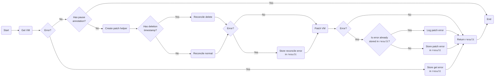
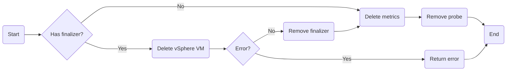

# VirtualMachine Controller

The `VirtualMachine` controller is responsible for reconciling `VirtualMachine` objects.

## Reconcile

### Reconcile Delete

### Reconcile Normal

// TODO ([github.com/vmware-tanzu/vm-operator#444](https://github.com/vmware-tanzu/vm-operator/issues/444))
