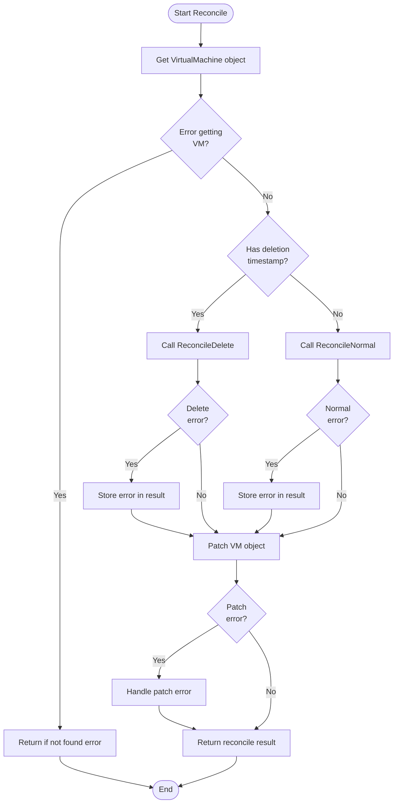
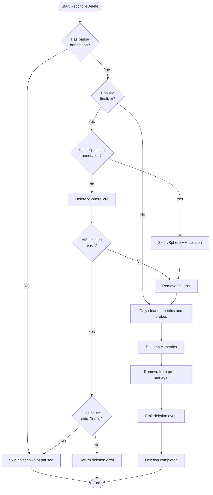
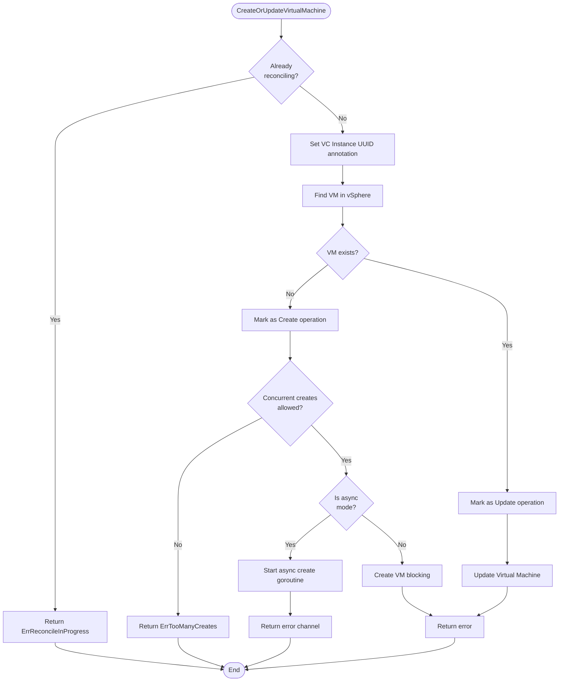
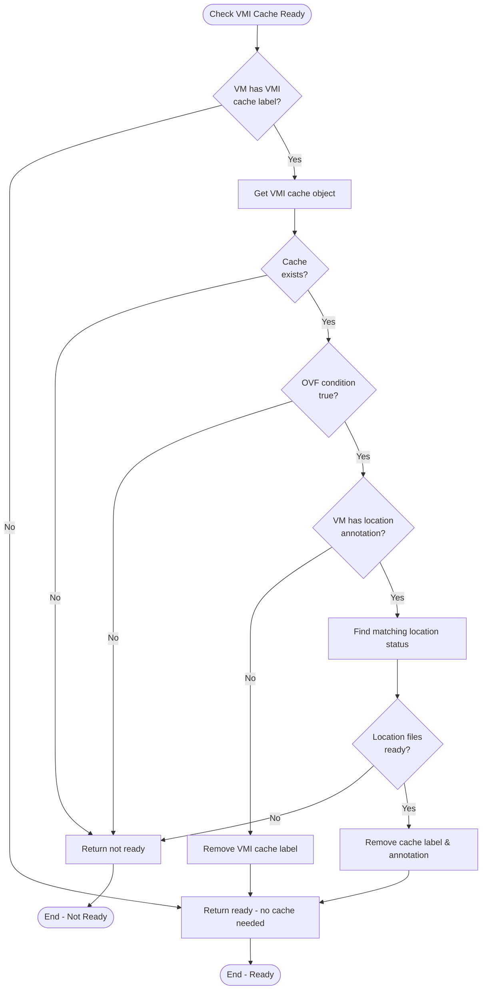
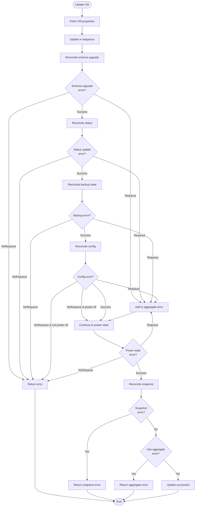
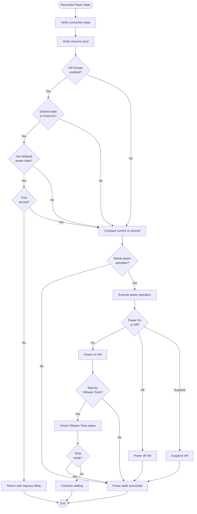

# VirtualMachine Controller

The `VirtualMachine` controller is responsible for reconciling `VirtualMachine` objects.

## Priority

The VirtualMachine controller leverages controller-runtime's [priority queue feature](https://github.com/kubernetes-sigs/controller-runtime/issues/2374) to intelligently order reconciliation requests based on the operational state of each VM. Priority queues allow the controller to process more urgent operations (like VM creation or deletion) ahead of routine maintenance operations (like resync events), improving system responsiveness and resource utilization.

### Priority queues

Controller-runtime's priority queue implementation uses a min-heap data structure where items with **higher numerical values have higher priority** and are dequeued first. When a Kubernetes event (create, update, delete, or generic) triggers a reconciliation, the controller can assign a specific priority value to that request. This ensures that critical operations don't get stuck behind less urgent work, especially during periods of high activity like controller restarts when many resync events are generated simultaneously.

The priority queue feature addresses the common problem of event storms during resyncs, where hundreds or thousands of objects might be queued at once. By assigning lower priorities to resync events and higher priorities to user-initiated changes, the system remains responsive to important operations.

### Priority levels

The VirtualMachine controller implements five priority levels, evaluated in the following order:

| Priority Level | Value | VM State | Description |
|----------------|-------|----------|-------------|
| **Creating** | `100` | `VirtualMachineConditionCreated` is not `True` | Highest priority. Assigned to VMs that are being created for the first time. This ensures new VM requests are processed quickly. |
| **PowerStateChange** | `99` | `spec.powerState` ≠ `status.powerState` | Second highest priority. Assigned when a VM needs a power state transition (power on, power off, or suspend). Power operations are time-sensitive and user-visible. |
| **Deleting** | `98` | `deletionTimestamp` is set | Assigned to VMs being deleted. Cleanup operations have high priority to free resources promptly. |
| **WaitingForIP** | `97` | Powered on, networking enabled, but no IP address assigned | Assigned when a VM is powered on with networking enabled but hasn't yet received an IP address (neither IPv4 nor IPv6). This ensures the controller actively monitors for network readiness. |
| **WaitingForDiskPromo** | `96` | `spec.promoteDisksMode` ≠ `Disabled` and `VirtualMachineDiskPromotionSynced` is not `True` | Assigned when disk promotion is configured but not yet completed. Ensures timely processing of disk promotion operations. |
| **Default** | `-1` to `-4 `| All other cases | Used for routine reconciliations of stable VMs. The default value varies by event type (see below), with all defaults being negative numbers to indicate lower priority than the specific VM state priorities. |

The **Default** priority level varies based on the Kubernetes event type that triggered the reconciliation:

| Event Type | Default Priority | When Applied |
|------------|------------------|--------------|
| Create | `-1` | Events from initial controller cache sync |
| Update | `-2` | Events caused by an update to the object's desired state |
| Delete | `-3` | Delete events (though typically overridden by state-based priorities) |
| Generic | `-4` | Generic events like periodic resyncs |

This tiered default system ensures that even among routine operations, there's an inherent ordering: create events from cache sync are processed before unchanged updates, which are processed before generic resyncs.

### Priority evaluation

The controller evaluates priorities using a cascade of conditions, with each check returning immediately if matched:

1. **Annotation Override**: If the VM has the `vmoperator.vmware.com.protected/reconcile-priority` annotation set to a valid integer, that value is used directly, bypassing all other checks.

!!! note "Privileged users only"

    Only privileged users, such as the VM Operator service account, may override the reconcile priority via annotation.

2. **Non-VM Objects**: If the object is not a `VirtualMachine`, the default priority is returned.

3. **Deletion**: If the VM has a `deletionTimestamp`, return `PriorityVirtualMachineDeleting` (`98`).

4. **Creation**: If the `VirtualMachineConditionCreated` condition is not `True`, return `PriorityVirtualMachineCreating` (`100`).

5. **Power State Change**: If `spec.powerState` doesn't match `status.powerState`, return `PriorityVirtualMachinePowerStateChange` (`99`).

6. **Waiting for IP**: If the VM is powered on (`status.powerState == PoweredOn`) and networking is enabled (`spec.network.disabled != true`), but no IP address is assigned (`status.network.primaryIP4` and `status.network.primaryIP6` are both empty), return `PriorityVirtualMachineWaitingForIP` (`97`).

7. **Disk Promotion**: If `spec.promoteDisksMode` is not `Disabled` and the `VirtualMachineDiskPromotionSynced` condition is not `True`, return `PriorityVirtualMachineWaitingForDiskPromo` (`96`).

8. **Default**: If none of the above conditions match, return the default priority value that was passed in based on the event type. This means:
    - For **Create** events from initial cache sync: priority `-1`
    - For **Update** events: priority `-2`
    - For **Delete** events (rare, as deletion typically matches condition #3): priority `-3`
    - For **Generic** events (periodic resyncs): priority `-4`

### Priority assignment

Different Kubernetes event types receive different priority handling:

- **Create Events**: During initial controller startup (when processing the initial list of objects from the API server), create events are assigned the default priority. For new objects created after startup, the priority function is evaluated.

- **Update Events**: If the resource version hasn't changed between old and new objects, the default priority is used. Otherwise, the priority function evaluates the VM's current state.

- **Delete Events**: Always evaluated through the priority function, typically resulting in `PriorityVirtualMachineDeleting`.

- **Generic Events**: Always evaluated through the priority function based on the VM's current state.

### Priority examples

**Scenario 1: New VM Creation**
When a user creates a new VirtualMachine resource, the reconcile request receives `PriorityVirtualMachineCreating (100)`, ensuring it's processed ahead of routine updates to existing VMs.

**Scenario 2: Power State Change on Existing VM**
When a user changes `spec.powerState` from `PoweredOff` to `PoweredOn`, the reconcile request receives `PriorityVirtualMachinePowerStateChange (99)`, placing it near the front of the queue.

**Scenario 3: Waiting for IP Address**
After a VM is powered on and networking is configured, but the IP hasn't been assigned yet, subsequent reconciliations receive `PriorityVirtualMachineWaitingForIP (97)`, ensuring the controller actively monitors for IP assignment completion.

**Scenario 4: Routine Reconciliation**
For a stable, running VM with no pending changes, reconcile requests (like periodic resyncs) receive the default priority, allowing more urgent operations to be processed first.

**Scenario 5: Controller Restart with Many VMs**
When the controller starts and processes its initial cache sync with 1,000 VMs, all initial reconciliations receive the default (lower) priority. If during this time a user creates a new VM or requests a power state change, those operations receive higher priority values and are processed first, maintaining system responsiveness.

## Workflows

### Overview

The main `Reconcile` function orchestrates the entire VirtualMachine reconciliation process, handling both creation/updates and deletions:

### Delete

The `ReconcileDelete` method handles the deletion of VirtualMachine resources, ensuring proper cleanup of the underlying vSphere VM and associated resources:

### Normal

The `ReconcileNormal` method handles the creation and updating of VirtualMachine resources. It manages finalizers, checks for paused annotations, and orchestrates the main reconcile logic including fast deploy support and VMI cache readiness.

## vSphere provider

### CreateOrUpdate

The VM provider determines whether to create or update a VM based on whether it exists in vSphere:

### Fast deploy

When creating a VM, the system supports both traditional content library deployment and fast deploy optimization:

#### VMI Cache Integration (Fast Deploy)

When Fast Deploy is enabled, the controller integrates with VirtualMachineImageCache resources to optimize VM creation:

This comprehensive workflow documentation shows how the VirtualMachine controller orchestrates VM lifecycle management, including the sophisticated fast deploy optimization that uses cached VM images for faster provisioning.

### Update

When updating an existing VM, the system reconciles various aspects in a specific order:

### Status

The status reconciliation updates the VM's observed state from vSphere:

### Config

Config reconciliation ensures the VM configuration matches the desired spec:

### Power state

Power state reconciliation manages VM power operations:

