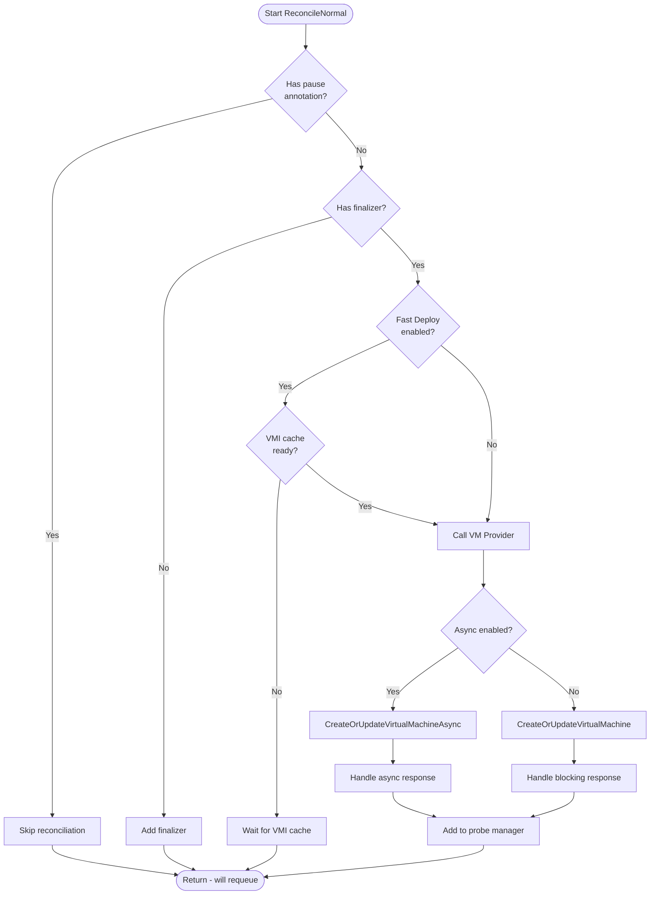
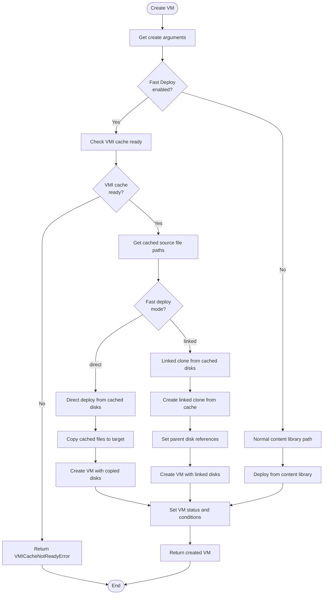
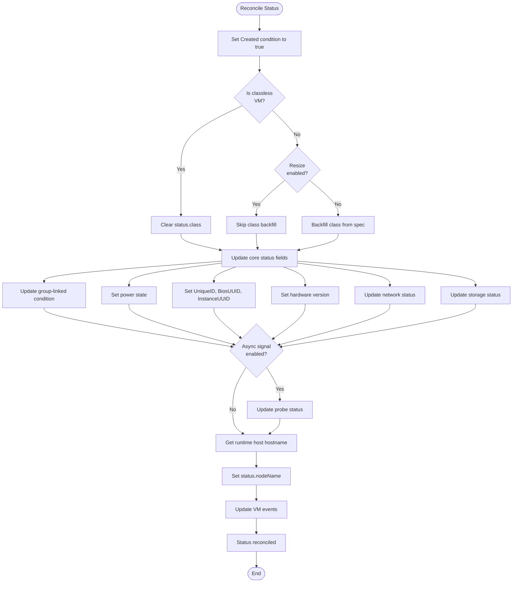
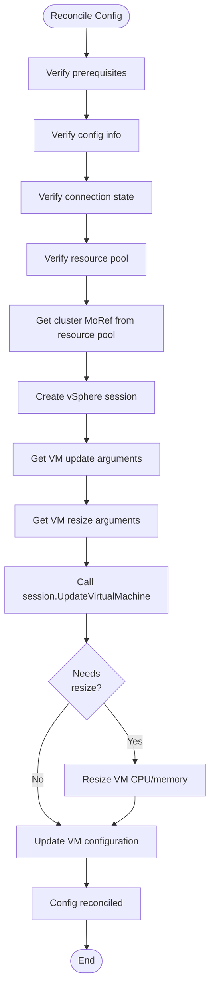

# VirtualMachine Controller

The `VirtualMachine` controller is responsible for reconciling `VirtualMachine` objects.

## Reconcile

The main `Reconcile` function orchestrates the entire VirtualMachine reconciliation process, handling both creation/updates and deletions:

## ReconcileDelete

The `ReconcileDelete` method handles the deletion of VirtualMachine resources, ensuring proper cleanup of the underlying vSphere VM and associated resources:

### ReconcileNormal

The `ReconcileNormal` method handles the creation and updating of VirtualMachine resources. It manages finalizers, checks for paused annotations, and orchestrates the main reconcile logic including fast deploy support and VMI cache readiness.

#### High-Level Reconcile Normal Flow

#### VM Provider CreateOrUpdate Decision Logic

The VM provider determines whether to create or update a VM based on whether it exists in vSphere:

#### VM Creation Workflow with Fast Deploy

When creating a VM, the system supports both traditional content library deployment and fast deploy optimization:

#### VM Update Workflow

When updating an existing VM, the system reconciles various aspects in a specific order:

#### Status Reconciliation Details

The status reconciliation updates the VM's observed state from vSphere:

#### Config Reconciliation Process

Config reconciliation ensures the VM configuration matches the desired spec:

#### Power State Reconciliation

Power state reconciliation manages VM power operations:

### VMI Cache Integration (Fast Deploy)

When Fast Deploy is enabled, the controller integrates with VirtualMachineImageCache resources to optimize VM creation:

#### VMI Cache Readiness Check

This comprehensive workflow documentation shows how the VirtualMachine controller orchestrates VM lifecycle management, including the sophisticated fast deploy optimization that uses cached VM images for faster provisioning.
