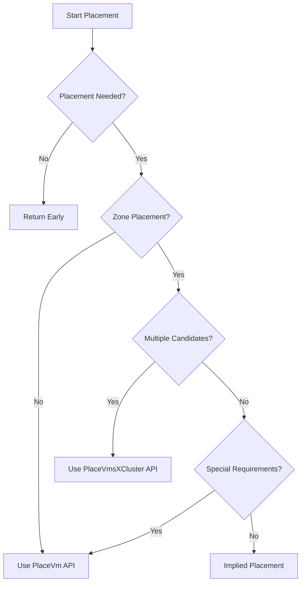

# VirtualMachine Placement

VirtualMachine placement determines where and how virtual machines are scheduled across the underlying infrastructure. The placement system evaluates resource availability, constraints, and policies to select optimal locations for VM workloads.

## Overview

The VM placement subsystem coordinates with vSphere to determine the best location for a VirtualMachine based on:

- **Zone Requirements**: Availability zone assignment and distribution
- **Resource Availability**: CPU, memory, and storage capacity across hosts and clusters
- **Storage Placement**: Datastore selection for VM disks and configuration files
- **Host Selection**: Specific host assignment for instance storage or performance requirements
- **Placement Policies**: Administrator-defined rules and constraints

## Placement Requirements

VirtualMachine placement requirements are determined by analyzing the VM's current state and configuration:

### Zone Placement

Zone placement ensures VMs are properly distributed across availability zones for fault tolerance:

- **Required when**: VM lacks a zone label (`topology.kubernetes.io/zone`)
- **Evaluates**: Available resource pools across zones
- **Result**: Assigns VM to optimal zone based on capacity and constraints

### Host Placement

Host placement assigns VMs to specific ESXi hosts when needed:

- **Required when**: VM has instance storage volumes
- **Evaluates**: Host capacity, compatibility, and storage availability
- **Result**: Binds VM to specific host for storage locality

### Datastore Placement

Datastore placement optimizes storage location for VM files:

- **Required when**: FastDeploy feature is enabled
- **Evaluates**: Datastore capacity, performance tiers, and policies
- **Result**: Selects optimal datastore for VM configuration and disks

## Placement Strategies

The placement system employs different strategies based on VM requirements and available candidates:

### Single Cluster Placement (PlaceVm API)

Used for fine-grained placement decisions within a single cluster:

```yaml
# Scenarios using PlaceVm API:
- Non-zonal placement (VM already has zone assigned)
- Single candidate with special requirements (instance storage or FastDeploy)
- Fallback when cross-cluster placement cannot satisfy requirements
```

**Characteristics**:
- Evaluates each cluster individually
- Provides detailed host and datastore recommendations
- Supports all placement requirements including instance storage

### Multi-Cluster Placement (PlaceVmsXCluster API)

Used for zone-level placement across multiple clusters:

```yaml
# Scenarios using PlaceVmsXCluster API:
- Zone placement required with multiple candidates
- No instance storage requirements
- Optimal for comparing options across clusters
```

**Characteristics**:
- Evaluates multiple clusters simultaneously
- Selects best placement across all candidates
- More efficient for zone-level decisions
- Currently limited support for instance storage

### Implied Placement

Used when placement decision is deterministic:

```yaml
# Scenarios using implied placement:
- Single resource pool candidate
- No special placement requirements (no instance storage, FastDeploy disabled)
- VM already fully placed (zone, host, and datastore assigned)
```

**Characteristics**:
- No remote API calls required
- Most efficient placement path
- Direct assignment to single available option

## Placement Process

The placement workflow follows these steps:

### 1. Evaluate Placement Needs

```go
// Determines what types of placement are required
needZonePlacement     = (VM lacks zone label)
needHostPlacement     = (VM has instance storage)
needDatastorePlacement = (FastDeploy enabled)
```

### 2. Identify Candidates

The system discovers available resource pools based on:
- Namespace permissions
- Zone availability
- Resource capacity
- Policy compatibility

### 3. Select Placement Strategy



### 4. Apply Recommendations

The selected placement recommendation provides:
- **Resource Pool**: Target resource pool for VM
- **Host** (optional): Specific ESXi host for instance storage
- **Datastore** (optional): Storage location for VM files

## Configuration

### Zone Selection

VMs can influence zone placement through labels:

```yaml
apiVersion: vmoperator.vmware.com/v1alpha5
kind: VirtualMachine
metadata:
  name: my-vm
  labels:
    topology.kubernetes.io/zone: zone-a  # Request specific zone
spec:
  # VM specification
```

Once set, the zone label is immutable to ensure placement stability.

### Storage Classes

Storage class selection affects placement decisions:

```yaml
spec:
  storageClass: performance-ssd  # Influences datastore selection
```

### Instance Storage

Instance storage volumes require host-level placement:

```yaml
spec:
  hardware:
    instanceStorage:
      volumes:
      - size: 100Gi
```

## Status and Conditions

Placement results are reflected in the VM's status:

### Zone Assignment

```yaml
status:
  zone: zone-a  # Assigned availability zone
```

### Host Assignment

```yaml
metadata:
  annotations:
    vmoperator.vmware.com/host-moref: host-123  # Assigned host
```

### Placement Conditions

The `VirtualMachineConditionPlacementReady` condition indicates placement status:

```yaml
status:
  conditions:
  - type: VirtualMachineConditionPlacementReady
    status: True
    reason: PlacementSatisfied
```

Common condition reasons:
- `PlacementSatisfied`: VM successfully placed
- `NoAvailableHosts`: No hosts meet requirements
- `InsufficientResources`: Resource constraints prevent placement
- `PlacementError`: Error during placement operation

## Best Practices

### Zone Distribution

- Deploy VMs across multiple zones for high availability
- Use VM affinity rules to control zone placement relationships
- Monitor zone capacity to ensure balanced distribution

### Resource Planning

- Ensure adequate resources across placement targets
- Consider resource reservations in placement decisions
- Monitor placement success rates and adjust capacity

### Performance Optimization

- Use instance storage for I/O intensive workloads requiring storage locality
- Enable FastDeploy for improved deployment performance
- Consider network topology in placement decisions

## Troubleshooting

### Common Issues

**VM stuck in pending state**:
- Check zone resource availability
- Verify storage class compatibility
- Review placement conditions for specific errors

**Placement failures**:
- Examine VM events for detailed error messages
- Verify namespace resource quotas
- Check infrastructure capacity and health

**Suboptimal placement**:
- Review affinity/anti-affinity rules
- Verify resource pool configuration
- Check for placement constraint conflicts

### Debugging Commands

```shell
# Check VM placement status
kubectl describe vm -n <namespace> <vm-name>

# View placement-related events
kubectl get events -n <namespace> --field-selector involvedObject.name=<vm-name>

# Check available zones
kubectl get nodes -L topology.kubernetes.io/zone

# View resource pool capacity
kubectl get resourcequota -n <namespace>
```

## Advanced Topics

### Custom Placement Policies

Administrators can define placement policies through:
- Resource pool configuration
- DRS rules and groups
- Storage policies
- Network policies

### Placement Constraints

Various constraints influence placement:
- Hardware requirements (GPU, vTPM)
- License restrictions
- Compliance policies
- Performance SLAs

### Integration with vSphere

The placement system leverages vSphere capabilities:
- Distributed Resource Scheduler (DRS)
- Storage DRS
- vSphere zones and clusters
- Host profiles and compliance

For detailed implementation specifics and API references, see the [placement implementation documentation](https://github.com/vmware-tanzu/vm-operator/blob/main/pkg/providers/vsphere/placement/).