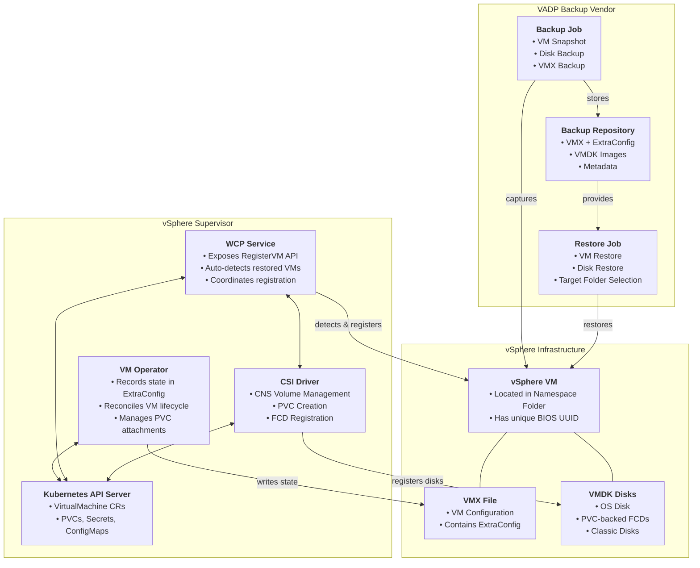
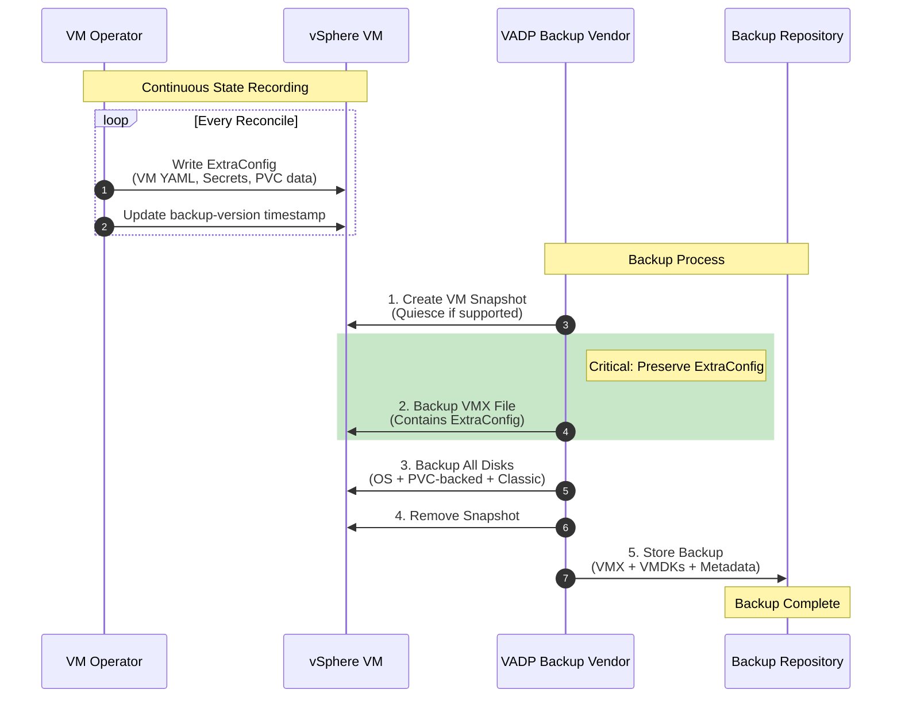
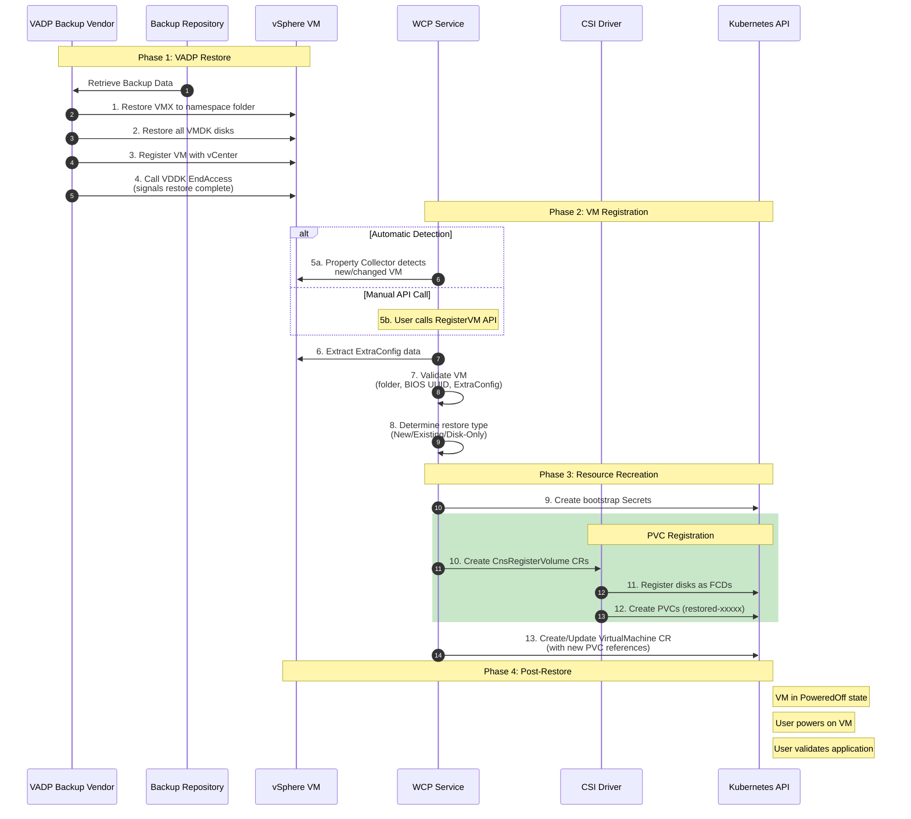
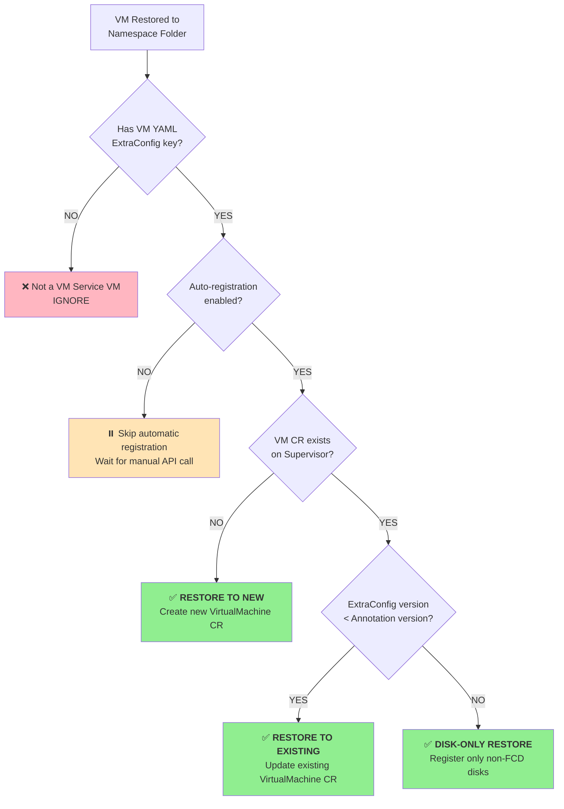
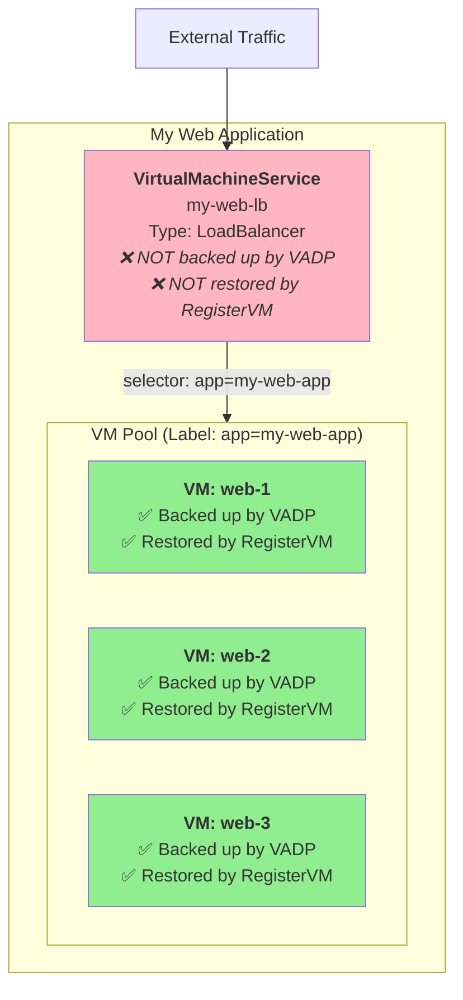
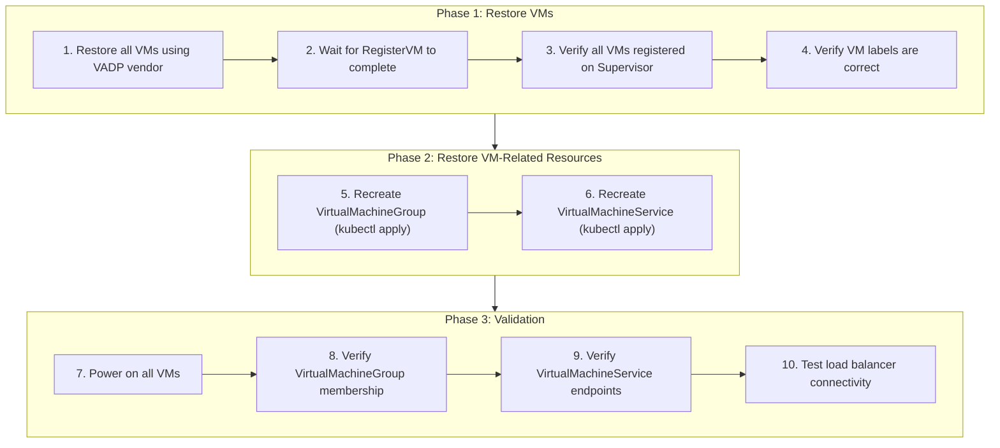

# VM Service Backup and Restore Guide

**Comprehensive Documentation for Backup Vendors and Customers**

---

## Table of Contents

1. [Introduction](#1-introduction)
2. [Architecture and Components](#2-architecture-and-components)
3. [How Backup Works](#3-how-backup-works)
4. [How Restore Works](#4-how-restore-works)
5. [Backup Considerations](#5-backup-considerations)
6. [Supported Restore Workflows](#6-supported-restore-workflows)
7. [Unsupported Scenarios and Limitations](#7-unsupported-scenarios-and-limitations)
8. [Understanding the Restored VM](#8-understanding-the-restored-vm)
9. [Step-by-Step Restore Procedures](#9-step-by-step-restore-procedures)
10. [Application-Level Considerations](#10-application-level-considerations)
11. [Troubleshooting](#11-troubleshooting)
12. [Reference](#12-reference)

---

## 1. Introduction

### 1.1 Purpose

This guide provides comprehensive documentation for backing up and restoring VM Service Virtual Machines (VMs) running on vSphere Supervisor. It is intended for:

- **Backup Vendors**: Integrating VADP-based backup solutions with VM Service
- **Customers**: Using backup vendors to protect and restore VM Service workloads
- **VI Administrators**: Managing backup/restore operations for VM Service VMs

### 1.2 Scope

This document covers:

- Complete backup and restore workflow architecture
- Integration requirements for backup vendors
- Step-by-step restore procedures
- Differences between original and restored VMs
- Application-level backup considerations beyond individual VMs
- Known limitations and unsupported scenarios

### 1.3 Prerequisites

| Requirement | Minimum Version |
|-------------|-----------------|
| vSphere Supervisor | 8.0 Update 3 (VCF 5.2) |
| VM Operator | v1alpha2 API or later |
| VADP Backup Vendor | Any VADP-compliant solution |

**Additional Features by Version:**

| Feature | vSphere 8.0 U3 | VCF 9.0+ |
|---------|----------------|----------|
| Restore to New VM | ✅ | ✅ |
| In-Place Restore | ❌ | ✅ |
| Disk-Only Restore | ❌ | ✅ |
| Cross-vCenter Failover | ❌ | ✅ |
| Network Override | ❌ | ✅ |

---

## 2. Architecture and Components

### 2.1 Component Overview

The VM Service backup and restore architecture consists of three layers working together:



### 2.2 VM Operator

**Role**: Manages the lifecycle of VM Service VMs on Supervisor.

**Backup-Related Functions**:
- Records VM state in vSphere VM ExtraConfig during every reconcile
- Maintains backup version timestamp for restore detection
- Stores VM YAML, bootstrap secrets, and PVC metadata

**Reference**: [VM Operator vmprovider_vm.go](https://github.com/vmware-tanzu/vm-operator/blob/main/pkg/providers/vsphere/vmprovider_vm.go#L1262)

### 2.3 WCP Service

**Role**: Provides the RegisterVM API and automatic restore detection.

**Backup-Related Functions**:
- Exposes `RegisterVM` API for manual registration
- Monitors vSphere for restored VMs using Property Collectors
- Triggers automatic registration when restore is detected
- Coordinates PVC registration with CSI driver

### 2.4 CSI Driver (vSphere CNS)

**Role**: Manages persistent storage for VM Service VMs.

**Backup-Related Functions**:
- Registers restored disks as First Class Disks (FCDs)
- Creates PersistentVolumeClaims (PVCs) for restored disks
- Manages CNS volume lifecycle

### 2.5 VADP Backup Vendor

**Role**: Performs actual backup and restore operations using VMware vStorage APIs for Data Protection.

**Requirements for VM Service Integration**:
- Must backup and restore VMX file with ExtraConfig intact
- Must restore VM to correct Supervisor namespace folder
- Must support disk-level backup/restore
- Should call VDDK PrepareForAccess/EndAccess for proper restore signaling

---

## 3. How Backup Works

### 3.1 Continuous State Recording

VM Operator continuously records VM state in the vSphere VM's ExtraConfig during every reconcile operation. This ensures the ExtraConfig always contains the latest VM configuration.

**What Gets Recorded**:

| ExtraConfig Key | Content | Purpose |
|-----------------|---------|---------|
| `vmservice.vmoperator.vmware.com/vm-resource-yaml` | Complete VM YAML (base64 + gzip) | Recreate VirtualMachine CR |
| `vmservice.vmoperator.vmware.com/additional-resources-yaml` | Bootstrap Secrets/ConfigMaps (base64 + gzip) | Recreate bootstrap resources |
| `vmservice.vmoperator.vmware.com/pvc-disk-data` | PVC metadata (JSON, base64 + gzip) | Re-register PVCs |
| `vmservice.vmoperator.vmware.com/classic-disk-data` | Classic disk metadata (JSON, base64 + gzip) | Identify non-PVC disks |
| `vmservice.vmoperator.vmware.com/backup-version` | Unix timestamp (milliseconds) | Detect restore operations |
| `vmservice.namespacedName` | `<namespace>/<vmname>` | Identify VM namespace/name |

### 3.2 VADP Backup Workflow

The following diagram illustrates the complete backup workflow:



### 3.3 What Gets Backed Up

| Component | Backed Up By | Notes |
|-----------|--------------|-------|
| VM Configuration | VADP (VMX) | Includes ExtraConfig |
| OS Disk | VADP | First virtual disk |
| PVC-backed Disks | VADP | FCDs lose FCD property after restore |
| Classic Disks | VADP | Non-PVC attached disks |
| Bootstrap Secrets | ExtraConfig | Stored in VM YAML |
| VM Labels/Annotations | ExtraConfig | Stored in VM YAML |
| Network Configuration | ExtraConfig | Stored in VM YAML |

### 3.4 What is NOT Backed Up by VADP

| Component | Reason | Solution |
|-----------|--------|----------|
| VirtualMachine CR | Kubernetes resource | Recreated by RegisterVM |
| PVCs | Kubernetes resources | Recreated by RegisterVM |
| PVs | Kubernetes resources | Recreated by CSI |
| CNS Volumes | vSphere CNS metadata | Re-registered by RegisterVM |
| VirtualMachineService | Separate K8s resource | Manual backup/restore (see Section 10) |
| VirtualMachineGroup | Separate K8s resource | Manual backup/restore (see Section 10) |

---

## 4. How Restore Works

### 4.1 Restore and Registration Workflow

The following diagram illustrates the complete restore and registration workflow:



### 4.2 Automatic vs Manual Registration

#### Automatic Registration

WCP Service continuously monitors VMs in Supervisor namespace folders for restore events.

**Pre-VCF 9.0 (Opt-Out Model)**:
- Automatic registration is **enabled by default**
- To disable: Set `vmservice.vmoperator.vmware.com/disable-auto-registration=true` in ExtraConfig
- Monitors: VM creation events (parent folder changes)

**VCF 9.0+ (Opt-In Model)**:
- Automatic registration is **disabled by default**
- To enable: Set `vmservice.vmoperator.vmware.com/enable-auto-registration=true` in ExtraConfig
- Monitors: ExtraConfig changes to VM YAML key
- Additional checks: Snapshot revert detection, backup version comparison

#### Manual Registration

Use the RegisterVM API when:
- Automatic registration is disabled
- Need network configuration override
- Want controlled timing
- Automatic registration failed

**API**: `com.vmware.vcenter.namespaces.instances.register_VM`

**Documentation**: [Broadcom TechDocs - Manually Register a VM Service VM](https://techdocs.broadcom.com/us/en/vmware-cis/vcf/vcf-9-0-and-later/9-0/vsphere-supervisor-installation-and-configuration/backing-up-and-restoring-vsphere-supervisor/backing-up-and-restoring-vm-service-vms/manually-register-a-vm-service-vm.html)

### 4.3 Restore Detection Logic

The following diagram shows how WCP Service determines the restore type:



**Summary of Restore Types:**

| Restore Type | Trigger Condition | Action |
|--------------|-------------------|--------|
| **Restore to New** | VM does not exist on Supervisor | Create new VirtualMachine CR |
| **Restore to Existing** | VM exists AND ExtraConfig version < Annotation version | Update existing VirtualMachine CR |
| **Disk-Only Restore** | VM exists AND ExtraConfig version >= Annotation version | Register only non-FCD disks |

---

## 5. Backup Considerations

### 5.1 Before Taking a Backup

Similar to [Veeam's backup considerations](https://helpcenter.veeam.com/docs/vbr/qsg/vm_restore.html?ver=13), ensure the following before initiating a backup:

#### Pre-Backup Checklist

- [ ] **VM is in stable state**: No ongoing operations, updates, or reconciliation
- [ ] **Application quiesce** (if supported): Coordinate with guest OS for consistent backup
- [ ] **Verify ExtraConfig is populated**: VM Operator should have recorded state
- [ ] **Document VM dependencies**: Note related resources (Services, ConfigMaps, etc.)
- [ ] **Verify PVC bindings**: All PVCs should be bound before backup

#### Backup Timing Recommendations

| Scenario | Recommendation |
|----------|----------------|
| Production VMs | Schedule during maintenance windows |
| Database VMs | Use application-aware backup with quiesce |
| Stateless VMs | Can backup anytime |
| VMs with frequent changes | Ensure recent reconcile before backup |

### 5.2 Backup Vendor Requirements

For backup vendors integrating with VM Service:

#### Must Support

1. **Full VMX backup with ExtraConfig**
   - ExtraConfig keys starting with `vmservice.` must be preserved
   - VMX file must be restored with ExtraConfig intact

2. **All disk types**
   - OS disk
   - PVC-backed disks (FCDs)
   - Classic disks (non-FCD)

3. **Restore to specific folder**
   - Must restore VM to Supervisor namespace folder
   - Folder name matches Kubernetes namespace name

4. **VDDK PrepareForAccess/EndAccess**
   - Call PrepareForAccess before restore
   - Call EndAccess after restore completes
   - This signals WCP Service that restore is complete

#### Should Support

1. **Incremental backup**
   - Changed block tracking (CBT)
   - Reduces backup time and storage

2. **Application-aware backup**
   - Guest OS quiesce
   - VSS integration (Windows)
   - Pre/post scripts

3. **Restore point selection**
   - Multiple restore points
   - Point-in-time recovery

### 5.3 Backup Validation

After taking a backup, validate:

1. **VMX file contains ExtraConfig**
   ```
   vmservice.vmoperator.vmware.com/vm-resource-yaml = <base64+gzip data>
   vmservice.namespacedName = <namespace>/<vmname>
   ```

2. **All disks are included**
   - Count matches VM configuration
   - PVC-backed disks are captured

3. **Backup metadata is complete**
   - VM name
   - Namespace folder path
   - Disk paths

### 5.4 Backup Frequency Recommendations

| VM Type | Recommended Frequency | Notes |
|---------|----------------------|-------|
| Critical production | Daily or more frequent | Use incremental |
| Standard workloads | Weekly | Full or incremental |
| Development/Test | As needed | Before major changes |
| Stateless VMs | Weekly or less | Configuration only |

---

## 6. Supported Restore Workflows

### 6.1 Restore to New VM (Full Restore)

**Use Case**: Restore a VM that no longer exists on Supervisor, or restore to create a new copy.

**When It Occurs**:
- No VirtualMachine CR exists with matching name in namespace
- First-time restore of a backed-up VM

**What Happens**:

| Step | Action | Result |
|------|--------|--------|
| 1 | VADP restores VM to namespace folder | vSphere VM created |
| 2 | WCP detects new VM with ExtraConfig | Registration triggered |
| 3 | Bootstrap secrets created | Secrets available in namespace |
| 4 | Disks registered as FCDs | CnsRegisterVolume CRs created |
| 5 | PVCs created | New PVCs with `restored-*` names |
| 6 | VirtualMachine CR created | VM managed by VM Operator |
| 7 | VM set to PoweredOff | Ready for power on |

**Post-Restore State**:
- New VirtualMachine CR exists
- New PVCs with `restored-<random>` naming
- Cloud-init instance ID reset (network reconfiguration will occur)
- VM in PoweredOff state

### 6.2 Restore to Existing VM (In-Place Restore)

**Availability**: VCF 9.0+ only

**Use Case**: Restore a VM to a previous state while preserving its identity on Supervisor.

**When It Occurs**:
- VirtualMachine CR exists with matching name
- Backup version in ExtraConfig < Backup version in VM annotations

**What Happens**:

| Step | Action | Result |
|------|--------|--------|
| 1 | VADP restores VM | vSphere VM updated |
| 2 | WCP detects version mismatch | Registration triggered |
| 3 | VM paused | Reconciliation stopped |
| 4 | Old PVCs identified as dangling | Marked for cleanup |
| 5 | New disks registered as FCDs | CnsRegisterVolume CRs created |
| 6 | VirtualMachine CR patched | Spec updated with new PVCs |
| 7 | Dangling PVCs cleaned up | Old PVCs deleted |

**Post-Restore State**:
- Same VirtualMachine CR (updated)
- New PVCs with `restored-<random>` naming
- Old PVCs deleted (if dangling)
- VM in PoweredOff state

### 6.3 Disk-Only Restore (Partial Restore)

**Availability**: VCF 9.0+ only

**Use Case**: Restore specific disks without restoring the entire VM configuration.

**When It Occurs**:
- VirtualMachine CR exists with matching name
- Backup version in ExtraConfig >= Backup version in VM annotations
- One or more disks restored but not entire VM

**What Happens**:

| Step | Action | Result |
|------|--------|--------|
| 1 | VADP restores specific disk(s) | vSphere disks updated |
| 2 | WCP detects non-FCD disks | Registration triggered |
| 3 | Non-FCD disks registered | CnsRegisterVolume CRs created |
| 4 | New PVCs created | Added to VM spec |
| 5 | VM spec updated | References new PVCs |

**Post-Restore State**:
- Same VirtualMachine CR (updated volumes)
- Mix of original and new PVCs
- VM may remain running (depending on disk)

### 6.4 Cross-vCenter Failover

**Availability**: VCF 9.0+ only

**Use Case**: Disaster recovery - restore VM to different vCenter/Supervisor.

**When It Occurs**:
- VM restored to different vCenter than backup source
- VC UUID in backup annotations differs from current VC UUID

**What Happens**:

| Step | Action | Result |
|------|--------|--------|
| 1 | VADP restores VM to target site | vSphere VM created |
| 2 | WCP detects VC UUID mismatch | Failover mode triggered |
| 3 | VM image spec cleared | Image may not exist on target |
| 4 | Failover annotation applied | Validation relaxed |
| 5 | Disks with existing CNS volumes reused | No re-registration |
| 6 | Missing disks registered | New PVCs created |
| 7 | VirtualMachine CR created/updated | VM managed on target |

**Post-Restore State**:
- VirtualMachine CR on target Supervisor
- Mix of reused and new PVCs
- VM image reference cleared
- Failover annotation present

---

## 7. Unsupported Scenarios and Limitations

### 7.1 Hard Limitations (Cannot Be Worked Around)

#### 7.1.1 Duplicate BIOS UUID

**Limitation**: Cannot register a VM if another VM in the same namespace has the same BIOS UUID.

**Reason**: PVCs and other Kubernetes resources require unique VM identifiers.

**Impact**: 
- Cannot create a "copy" of an existing VM from backup
- Cannot restore same VM twice in same namespace

**Error**: `VCenterWcpWorkloadRegisterVMDuplicateVMBiosUUID`

#### 7.1.2 Unsupported VM Operator API Versions

**Limitation**: VMs backed up with API versions older than v1alpha2 cannot be restored.

**Supported Versions**:
- `vmoperator.vmware.com/v1alpha2`
- `vmoperator.vmware.com/v1alpha3`
- `vmoperator.vmware.com/v1alpha4`
- `vmoperator.vmware.com/v1alpha5`

**Error**: `VCenterWcpWorkloadRegisterVMConvertUnstructuredToVMTypeFailed`

#### 7.1.3 Missing ExtraConfig Data

**Limitation**: VM must have valid backup data in ExtraConfig.

**Required Keys**:
- `vmservice.vmoperator.vmware.com/vm-resource-yaml` (always required)
- `vmservice.vmoperator.vmware.com/pvc-disk-data` (if VM has PVC volumes)
- `vmservice.vmoperator.vmware.com/backup-version` (for incremental restore)

**Error**: `VCenterWcpWorkloadRegisterVMValidateVMResourceFailed`

### 7.2 Conditional Limitations

#### 7.2.1 VM Snapshot Revert

**Limitation**: VMs being reverted to a snapshot will NOT be registered automatically.

**Reason**: Snapshot revert modifies ExtraConfig, triggering false-positive restore detection.

**Detection**: 
- `vmop.VirtualMachineSnapshotRevertInProgressAnnotation` annotation
- `spec.currentSnapshotName` field in VM CR

**Workaround**: Wait for snapshot revert to complete, then manually call RegisterVM if needed.

#### 7.2.2 Pre-existing VM (vSphere 8.0 U3)

**Limitation**: On Supervisors without incremental restore support, cannot register a VM that already exists.

**Error**: `VCenterWcpWorkloadRegisterVMAlreadyExistsOnSupervisor`

**Workaround**: 
- Upgrade to VCF 9.0+ for incremental restore support
- Delete existing VirtualMachine CR before registration (data loss risk)

#### 7.2.3 VM Not in Namespace Folder

**Limitation**: VM must be restored to the correct Supervisor namespace folder.

**Error**: `VCenterWcpWorkloadRegisterVMNotFoundInNamespaceFolder`

**Workaround**: Move VM to correct namespace folder before registration.

### 7.3 Feature Limitations

#### 7.3.1 VirtualMachineGroup

**Limitation**: VirtualMachineGroup membership is not preserved during backup/restore.

**What is NOT preserved**:
- VirtualMachineGroup custom resources
- Group membership associations

**Workaround**: Manually backup and restore VirtualMachineGroup resources (see Section 10.4).

#### 7.3.2 Network Configuration Override

**Limitation**: Network override only supported on:
- Supervisors with incremental restore support (VCF 9.0+)
- NSX-VPC network provider

**Not Supported**:
- vSphere Distributed Switch networking
- NSX-T Container Plugin (pre-VPC)

#### 7.3.3 Restore Timeout

**Limitation**: If VADP vendor takes longer than 15 minutes to complete restore, automatic registration may proceed prematurely.

**Mitigation**: WCP Service monitors `RelocateVM_Task` method state to detect restore completion.

---

## 8. Understanding the Restored VM

### 8.1 Differences Between Original and Restored VM

After restore and registration, the VM will have several differences from the original:

#### 8.1.1 PVC/Volume Names

**Original VM**:
```yaml
spec:
  volumes:
    - name: my-data-volume
      persistentVolumeClaim:
        claimName: my-data-pvc
```

**Restored VM**:
```yaml
spec:
  volumes:
    - name: my-data-volume           # Volume name preserved
      persistentVolumeClaim:
        claimName: restored-a1b2c3   # PVC name changed!
```

**Why**: Disks are re-registered as new FCDs with new CNS volume IDs. New PVCs are created with random names to avoid conflicts.

**PVC Naming Convention**: `restored-<6-character-random-hex>`

**Example**: `restored-a1b2c3`, `restored-f4e5d6`

#### 8.1.2 Labels

Labels are handled differently based on restore type:

**Restore to New VM**:
| Label Type | Behavior |
|------------|----------|
| User labels | Restored from backup |
| `topology.kubernetes.io/zone` | **Removed** (new zone assigned) |
| Infrastructure labels | Removed |

**Restore to Existing VM**:
| Label Type | Behavior |
|------------|----------|
| User labels | Restored from backup |
| `topology.kubernetes.io/zone` | **Preserved** from existing VM |
| Infrastructure labels | Preserved from existing VM |

**Labels Preserved from Existing VM**:
- `topology.kubernetes.io/zone`

**Labels Removed for New VM**:
- `topology.kubernetes.io/zone`

#### 8.1.3 Annotations

Annotations are merged during restore:

**Annotations from Backup** (take precedence):
- User-defined annotations
- Most VM Operator annotations

**Annotations Preserved from Existing VM**:
- `vmoperator.vmware.com/created-at-build-version`
- `vmoperator.vmware.com/created-at-schema-version`
- `vmoperator.vmware.com/upgraded-to-build-version`
- `vmoperator.vmware.com/upgraded-to-schema-version`
- `vmoperator.vmware.com/upgraded-to-feature-version`

**Annotations Added by Restore**:
- `vmoperator.vmware.com/restored-vm` (for normal restore)
- `vmoperator.vmware.com/failed-over-vm` (for cross-vCenter failover)

#### 8.1.4 Power State

**After Registration**: VM is always set to `PoweredOff`

**Reason**: Allows user to verify configuration before starting VM.

**Action Required**: User must manually power on VM after validation.

#### 8.1.5 Cloud-Init (Restore to New)

**For Restore to New VMs**:
- Cloud-init instance ID is reset
- Cloud-init will run again on first boot
- Network configuration will be reapplied

**Annotation Removed**: `vmoperator.vmware.com/instance-id`

**Bootstrap Spec Updated**: `spec.bootstrap.cloudInit.instanceID` set to new UUID

#### 8.1.6 VM Image (Failover Only)

**For Cross-vCenter Failover**:
- `spec.image` set to `nil`
- `spec.imageName` set to empty string

**Reason**: VM image may not exist on target vCenter.

**Impact**: Day-2 operations requiring image may fail until image is available.

### 8.2 Comparing Original vs Restored VM

| Attribute | Original | Restored (New) | Restored (Existing) |
|-----------|----------|----------------|---------------------|
| VM Name | `my-vm` | `my-vm` | `my-vm` |
| Namespace | `my-ns` | `my-ns` | `my-ns` |
| BIOS UUID | `abc-123` | `abc-123` | `abc-123` |
| Instance UUID | `def-456` | `def-456` | `def-456` |
| PVC Names | `my-pvc` | `restored-xxxxx` | `restored-xxxxx` |
| Volume Names | `my-vol` | `my-vol` | `my-vol` |
| User Labels | ✅ | ✅ | ✅ |
| Zone Label | `zone-a` | ❌ Removed | ✅ Preserved |
| User Annotations | ✅ | ✅ | ✅ |
| Immutable Annotations | N/A | N/A | ✅ Preserved |
| Restored Annotation | ❌ | ✅ Added | ✅ Added |
| Power State | Running | PoweredOff | PoweredOff |
| Cloud-Init ID | `old-id` | `new-uuid` | Preserved |

### 8.3 Resource Mapping

After restore, the following resources are mapped:

**Original VM Resources:**

| Resource Type | Name | Backing |
|---------------|------|---------|
| VirtualMachine CR | `my-vm` | - |
| PVC | `my-data-pvc` | CNS Volume: `vol-abc-123` |
| PV | `pv-my-data-pvc` | FCD: `fcd-abc-123` |
| VMDK | - | `[datastore] my-vm/data.vmdk` |
| Secret | `my-bootstrap-secret` | - |

⬇️ **BACKUP / RESTORE** ⬇️

**Restored VM Resources:**

| Resource Type | Name | Backing | Notes |
|---------------|------|---------|-------|
| VirtualMachine CR | `my-vm` | - | Same name |
| PVC | `restored-a1b2c3` | CNS Volume: `vol-xyz-789` | **NEW name, NEW CNS volume** |
| PV | `pv-restored-a1b2c3` | FCD: `fcd-xyz-789` | **NEW PV, NEW FCD** |
| VMDK | - | `[datastore] my-vm/data.vmdk` | **Same file, new FCD registration** |
| Secret | `my-bootstrap-secret` | - | Recreated from ExtraConfig |

---

## 9. Step-by-Step Restore Procedures

### 9.1 Restore to New VM

Follow this procedure to restore a VM that no longer exists on Supervisor.

#### Prerequisites

- [ ] Backup contains valid VM with ExtraConfig
- [ ] Target namespace exists on Supervisor
- [ ] No VM with same name exists in namespace
- [ ] No VM with same BIOS UUID exists in namespace

#### Procedure

**Step 1: Prepare Target Environment**

```bash
# Verify namespace exists
kubectl get namespace <namespace>

# Verify no conflicting VM exists
kubectl get vm -n <namespace> <vm-name>
# Should return "not found"
```

**Step 2: Initiate VADP Restore**

Using your backup vendor (e.g., Veeam):

1. Select the VM backup and restore point
2. Choose "Restore entire VM" option
3. Configure restore location:
   - **Target folder**: Supervisor namespace folder (e.g., `/<datacenter>/vm/<namespace>`)
   - **Target datastore**: Supervisor-managed datastore
4. Start restore job
5. Wait for restore to complete

**Step 3: Verify VM Restored to vSphere**

```powershell
# Using PowerCLI
Get-VM -Name <vm-name> | Select-Object Name, Folder, PowerState

# Verify ExtraConfig
(Get-VM -Name <vm-name>).ExtensionData.Config.ExtraConfig | 
    Where-Object { $_.Key -like "vmservice.*" }
```

**Step 4: Wait for or Trigger Registration**

*For Automatic Registration (VCF 9.0+ with opt-in):*
- Wait 1-2 minutes for automatic detection
- Check vCenter tasks for `com.vmware.wcp.vmservice.registervm`

*For Manual Registration:*

```bash
# Using vSphere API or dcli
dcli com vmware vcenter namespaces instances register-VM \
    --namespace <namespace> \
    --vm <vm-moid>
```

**Step 5: Monitor Registration Task**

```bash
# Check task in vCenter UI or via API
# Task type: com.vmware.wcp.vmservice.registervm

# Or check VirtualMachine CR
kubectl get vm -n <namespace> <vm-name> -w
```

**Step 6: Verify Registration Complete**

```bash
# Check VirtualMachine CR exists
kubectl get vm -n <namespace> <vm-name>

# Check PVCs created
kubectl get pvc -n <namespace>
# Look for: restored-<random> PVCs

# Check secrets recreated
kubectl get secrets -n <namespace>

# Describe VM for details
kubectl describe vm -n <namespace> <vm-name>
```

**Step 7: Power On VM**

```bash
# Update VM power state
kubectl patch vm <vm-name> -n <namespace> --type merge \
    -p '{"spec":{"powerState":"PoweredOn"}}'

# Or use vSphere UI to power on
```

**Step 8: Validate VM**

- [ ] VM powered on successfully
- [ ] Network connectivity working
- [ ] Application responding
- [ ] Data integrity verified

### 9.2 Restore to Existing VM (In-Place)

**Availability**: VCF 9.0+ only

Follow this procedure to restore a VM to a previous state.

#### Prerequisites

- [ ] VCF 9.0+ Supervisor
- [ ] VM exists on Supervisor
- [ ] Backup is older than current VM state

#### Procedure

**Step 1: Document Current State**

```bash
# Record current PVCs
kubectl get pvc -n <namespace> -o yaml > current-pvcs.yaml

# Record current VM spec
kubectl get vm -n <namespace> <vm-name> -o yaml > current-vm.yaml
```

**Step 2: Power Off VM (Recommended)**

```bash
kubectl patch vm <vm-name> -n <namespace> --type merge \
    -p '{"spec":{"powerState":"PoweredOff"}}'

# Wait for power off
kubectl wait --for=jsonpath='{.status.powerState}'=PoweredOff \
    vm/<vm-name> -n <namespace> --timeout=300s
```

**Step 3: Initiate VADP Restore**

Using your backup vendor:

1. Select the VM backup and restore point
2. Choose "Restore to original location" option
3. Select appropriate restore point (older than current)
4. Start restore job
5. Wait for restore to complete

**Step 4: Wait for Registration**

```bash
# VM will be automatically paused
kubectl get vm -n <namespace> <vm-name> -o jsonpath='{.metadata.annotations}'
# Should show: vmoperator.vmware.com/pause: "true"

# Wait for registration task
# Check vCenter tasks for com.vmware.wcp.vmservice.registervm
```

**Step 5: Verify Changes**

```bash
# Check PVCs - old ones should be deleted, new ones created
kubectl get pvc -n <namespace>

# Compare with saved state
diff <(kubectl get pvc -n <namespace> -o yaml) current-pvcs.yaml
```

**Step 6: Remove Pause and Power On**

```bash
# Registration should remove pause automatically
# If not, remove manually:
kubectl annotate vm <vm-name> -n <namespace> \
    vmoperator.vmware.com/pause-

# Power on VM
kubectl patch vm <vm-name> -n <namespace> --type merge \
    -p '{"spec":{"powerState":"PoweredOn"}}'
```

### 9.3 Manual Registration with Network Override

Use this procedure when restoring to a different network environment.

**Availability**: VCF 9.0+ with NSX-VPC only

#### Procedure

**Step 1: Identify Current Network Configuration**

```bash
# Get VM's network interfaces from backup
# Look at spec.network.interfaces in the VM YAML stored in ExtraConfig
```

**Step 2: Plan Subnet Mappings**

| Original Subnet | Target Subnet |
|-----------------|---------------|
| `subnet-prod-a` | `subnet-dr-a` |
| (default SubnetSet) | `subnet-dr-default` |

**Step 3: Call RegisterVM with Override**

```json
// API Request Body
{
  "vm": "vm-12345",
  "network_config_override": {
    "subnet_mappings": [
      {
        "current_subnet": {
          "type": "SUBNET",
          "name": "subnet-prod-a"
        },
        "new_subnet": {
          "type": "SUBNET",
          "name": "subnet-dr-a"
        }
      },
      {
        "current_subnet": {
          "type": "SUBNETSET",
          "name": ""
        },
        "new_subnet": {
          "type": "SUBNETSET",
          "name": "subnet-dr-default"
        }
      }
    ]
  }
}
```

**Step 4: Monitor and Validate**

```bash
# Check VM network configuration after registration
kubectl get vm -n <namespace> <vm-name> -o jsonpath='{.spec.network}'
```

---

## 10. Application-Level Considerations

### 10.1 Beyond Single VM Restore

VM Service backup/restore handles individual VMs and their directly attached resources (PVCs, bootstrap secrets). However, many applications span multiple components that are NOT automatically restored:



### 10.2 VM-Related Resources NOT Handled by RegisterVM

| Resource Type | Description | Restore Method |
|---------------|-------------|----------------|
| **VirtualMachineService** | Load balancer for VMs | Manual backup/restore |
| **VirtualMachineGroup** | Groups VMs for placement policies | Manual backup/restore |

### 10.3 VirtualMachineService Considerations

**What is VirtualMachineService?**

A Kubernetes custom resource that creates a load balancer fronting VM Service VMs based on label selectors.

```yaml
apiVersion: vmoperator.vmware.com/v1alpha3
kind: VirtualMachineService
metadata:
  name: my-web-lb
  namespace: my-namespace
spec:
  type: LoadBalancer
  selector:
    app: my-web-app
    tier: frontend
  ports:
    - name: http
      protocol: TCP
      port: 80
      targetPort: 8080
```

**Why It's Not Automatically Restored**:
- VirtualMachineService is a separate Kubernetes resource
- Not stored in VM ExtraConfig
- Label selector references VMs by labels, not by name

**Impact of Not Restoring**:
- No load balancer available after VM restore
- External traffic cannot reach VMs
- Application appears down even though VMs are running

#### Backup Steps for VirtualMachineService

1. **Record the VirtualMachineService resource** before or during backup:
   ```bash
   kubectl get virtualmachineservice -n <namespace> <service-name> -o yaml > vmservice-backup.yaml
   ```

2. **Include all VMs referenced by the selector** in the same VADP backup job

#### Restore Steps for VirtualMachineService

1. **Restore all VMs** using the VADP vendor and wait for RegisterVM to complete
2. **Verify VM labels are correct** - the VirtualMachineService uses label selectors
3. **Recreate the VirtualMachineService**:
   ```bash
   kubectl apply -f vmservice-backup.yaml
   ```
4. **Verify the service endpoints**:
   ```bash
   kubectl get virtualmachineservice -n <namespace> <service-name>
   ```

### 10.4 VirtualMachineGroup Considerations

**What is VirtualMachineGroup?**

A Kubernetes custom resource that groups VMs together for coordinated power management and boot sequencing.

For a VM to be a member of a group, **both** of the following must be true:
1. The VM must have `spec.groupName` set to the group's name
2. The VM must be listed in the group's `spec.bootOrder[].members`

**VirtualMachineGroup Example:**

```yaml
apiVersion: vmoperator.vmware.com/v1alpha3
kind: VirtualMachineGroup
metadata:
  name: my-vm-group
  namespace: my-namespace
spec:
  powerState: PoweredOn
  bootOrder:
    - members:
        - name: vm-1
        - name: vm-2
    - members:
        - name: vm-3
      powerOnDelay: 30s
```

**VirtualMachine Example** (must reference the group):

```yaml
apiVersion: vmoperator.vmware.com/v1alpha3
kind: VirtualMachine
metadata:
  name: vm-1
  namespace: my-namespace
spec:
  groupName: my-vm-group
  # ... other VM spec fields
```

**Why It's Not Automatically Restored**:
- VirtualMachineGroup is a separate Kubernetes resource
- Not stored in VM ExtraConfig
- Both the group's `spec.bootOrder[].members` and the VM's `spec.groupName` are required for membership

**Impact of Not Restoring**:
- Group-level power state management not available
- Boot order sequencing not enforced
- VMs restored with `spec.groupName` set will reference a non-existent group

#### Backup Steps for VirtualMachineGroup

1. **Record the VirtualMachineGroup resource** before or during backup:
   ```bash
   kubectl get virtualmachinegroup -n <namespace> <group-name> -o yaml > vmgroup-backup.yaml
   ```

2. **Include all member VMs** listed in the group's `spec.bootOrder[].members` in the same VADP backup job

#### Restore Steps for VirtualMachineGroup

1. **Restore all member VMs** using the VADP vendor and wait for RegisterVM to complete
   - Note: The VMs' `spec.groupName` field is preserved in the backup and will be restored automatically
2. **Recreate the VirtualMachineGroup**:
   ```bash
   kubectl apply -f vmgroup-backup.yaml
   ```
3. **Verify the group membership** (members appear in status when both conditions are met):
   ```bash
   kubectl get virtualmachinegroup -n <namespace> <group-name> -o yaml
   ```

### 10.5 Complete Application Restore Workflow

For applications using VirtualMachineService or VirtualMachineGroup:



### 10.6 Backup Strategy Recommendations

For comprehensive VM Service protection:

| Component | Backup Method | Frequency |
|-----------|---------------|-----------|
| VMs + Disks | VADP Vendor | Daily |
| VirtualMachineService | kubectl get -o yaml | Daily |
| VirtualMachineGroup | kubectl get -o yaml | Daily |

---

## 11. Troubleshooting

### 11.1 Registration Not Triggered

**Symptoms**:
- VM restored but no RegisterVM task appears
- VirtualMachine CR not created

**Checks**:

1. **Verify ExtraConfig exists**:
   ```powershell
   (Get-VM -Name <vm-name>).ExtensionData.Config.ExtraConfig | 
       Where-Object { $_.Key -eq "vmservice.vmoperator.vmware.com/vm-resource-yaml" }
   ```

2. **Check auto-registration setting**:
   - VCF 9.0+: Must have `enable-auto-registration=true`
   - Pre-VCF 9.0: Must NOT have `disable-auto-registration=true`

3. **Verify VM is in namespace folder**:
   ```powershell
   (Get-VM -Name <vm-name>).Folder.Name
   # Should match namespace name
   ```

4. **Check WCP Service logs**:
   ```bash
   # On vCenter
   cat /var/log/vmware/wcp/wcpsvc.log | grep "auto-vm-register"
   ```

**Solution**: If automatic registration fails, use manual RegisterVM API.

### 11.2 Registration Task Fails

**Common Errors and Solutions**:

| Error | Cause | Solution |
|-------|-------|----------|
| `VCenterWcpWorkloadRegisterVMVMNotFound` | Invalid VM MoID | Verify VM exists, check MoID format |
| `VCenterWcpWorkloadRegisterVMDuplicateVMBiosUUID` | BIOS UUID conflict | Cannot proceed - delete conflicting VM |
| `VCenterWcpWorkloadRegisterVMNotFoundInNamespaceFolder` | Wrong folder | Move VM to namespace folder |
| `VCenterWcpWorkloadRegisterVMValidateVMResourceFailed` | Corrupt ExtraConfig | Restore from different backup |
| `VCenterWcpWorkloadRegisterVMAlreadyExistsOnSupervisor` | VM exists (8.0 U3) | Upgrade to VCF 9.0+ or delete VM CR |
| `VCenterWcpWorkloadRegisterVMRegisterPVCFailed` | CNS/CSI issue | Check CSI driver health |

### 11.3 PVC Registration Fails

**Symptoms**:
- RegisterVM task stuck at 80%
- CnsRegisterVolume resources in error state

**Checks**:

```bash
# Check CnsRegisterVolume status
kubectl get cnsregistervolume -n <namespace>
kubectl describe cnsregistervolume <name> -n <namespace>

# Check CSI driver pods
kubectl get pods -n vmware-system-csi

# Check CSI driver logs
kubectl logs -n vmware-system-csi -l app=vsphere-csi-controller
```

**Common Issues**:
- Datastore not accessible
- Disk file not found
- CNS service unavailable

### 11.4 VM Won't Power On After Restore

**Checks**:

1. **Verify registration complete**:
   ```bash
   kubectl get vm -n <namespace> <vm-name> -o jsonpath='{.status}'
   ```

2. **Check for pause annotation**:
   ```bash
   kubectl get vm -n <namespace> <vm-name> -o jsonpath='{.metadata.annotations}'
   # Remove pause if present
   kubectl annotate vm <vm-name> -n <namespace> vmoperator.vmware.com/pause-
   ```

3. **Check VM Operator logs**:
   ```bash
   kubectl logs -n vmware-system-vmop -l app=vmware-system-vmop
   ```

### 11.5 Network Connectivity Issues After Restore

**For Restore to New VM**:
- Cloud-init will reconfigure network
- May get new IP address
- Update DNS/load balancer as needed

**For Restore to Existing VM**:
- Network configuration should be preserved
- If using DHCP, IP may change
- Static IP should be preserved

**Checks**:
```bash
# Check VM network status
kubectl get vm -n <namespace> <vm-name> -o jsonpath='{.status.network}'

# Check network interfaces
kubectl get vm -n <namespace> <vm-name> -o jsonpath='{.spec.network.interfaces}'
```

### 11.6 Diagnostic Commands

```bash
# Complete VM status
kubectl describe vm -n <namespace> <vm-name>

# Events related to VM
kubectl get events -n <namespace> --field-selector involvedObject.name=<vm-name>

# PVC status
kubectl get pvc -n <namespace> -o wide

# CnsRegisterVolume status
kubectl get cnsregistervolume -n <namespace> -o wide

# Check recent tasks in vCenter
# Task type: com.vmware.wcp.vmservice.registervm
```

---

## 12. Reference

### 12.1 ExtraConfig Keys

| Key | Description | Format |
|-----|-------------|--------|
| `vmservice.vmoperator.vmware.com/vm-resource-yaml` | Complete VM YAML | Base64 + Gzip |
| `vmservice.vmoperator.vmware.com/additional-resources-yaml` | Bootstrap resources | Base64 + Gzip |
| `vmservice.vmoperator.vmware.com/pvc-disk-data` | PVC metadata | Base64 + Gzip + JSON |
| `vmservice.vmoperator.vmware.com/classic-disk-data` | Classic disk metadata | Base64 + Gzip + JSON |
| `vmservice.vmoperator.vmware.com/backup-version` | Backup timestamp | Unix milliseconds |
| `vmservice.vmoperator.vmware.com/enable-auto-registration` | Enable auto-reg (VCF 9.0+) | Boolean string |
| `vmservice.vmoperator.vmware.com/disable-auto-registration` | Disable auto-reg (pre-VCF 9.0) | Boolean string |
| `vmservice.namespacedName` | VM namespace/name | `<namespace>/<name>` |

### 12.2 API Reference

**RegisterVM API**:
- **Endpoint**: `com.vmware.vcenter.namespaces.instances.register_VM`
- **Method**: POST
- **Timeout**: 5 minutes

**Parameters**:
| Parameter | Type | Required | Description |
|-----------|------|----------|-------------|
| `vm` | string | Yes | VM MoID |
| `network_config_override` | object | No | Subnet mappings |

### 12.3 Task Progress Stages

| Progress | Stage |
|----------|-------|
| 5% | Client setup |
| 10% | Retrieve VM properties |
| 20% | Validate VM |
| 40% | Restore additional resources |
| 80% | Register volumes |
| 100% | Complete |

### 12.4 Supported VM Operator API Versions

- `vmoperator.vmware.com/v1alpha2`
- `vmoperator.vmware.com/v1alpha3`
- `vmoperator.vmware.com/v1alpha4`
- `vmoperator.vmware.com/v1alpha5`

### 12.5 External Documentation

- [Broadcom TechDocs - Backing Up and Restoring VM Service VMs](https://techdocs.broadcom.com/us/en/vmware-cis/vcf/vcf-9-0-and-later/9-0/vsphere-supervisor-installation-and-configuration/backing-up-and-restoring-vsphere-supervisor/backing-up-and-restoring-vm-service-vms.html)
- [VM Operator GitHub](https://github.com/vmware-tanzu/vm-operator)
- [Velero Documentation](https://velero.io/docs/)
- [Veeam VM Restore Guide](https://helpcenter.veeam.com/docs/vbr/qsg/vm_restore.html?ver=13)

---

## Document Information

| Field | Value |
|-------|-------|
| **Version** | 2.0 |
| **Last Updated** | January 2026 |
| **Target Audience** | Backup Vendors, Customers, VI Administrators |
| **Minimum Supervisor Version** | vSphere 8.0 Update 3 (VCF 5.2) |
| **Recommended Supervisor Version** | VCF 9.0+ |

---

*This document is intended to provide comprehensive guidance for VM Service backup and restore operations. For the latest information, always refer to official VMware/Broadcom documentation.*
