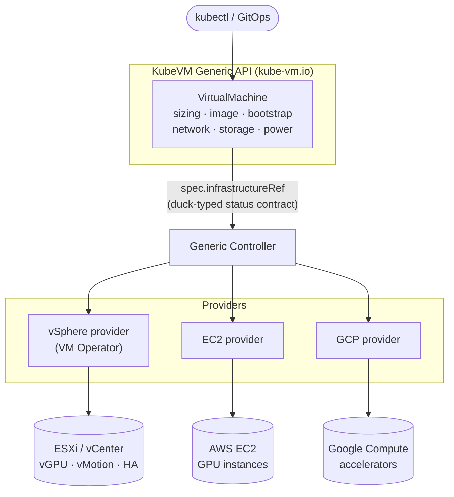

# KubeVM: A Generic, Provider-Agnostic Virtual Machine API for Kubernetes

**Author:** Arunesh Pandey · **Status:** Proposal, open for discussion

This is a design proposal, not an accepted API.
The types it describes are implemented as a strawman in this repository so the shape can be reviewed concretely; see the repository README for what is and is not built.

## Summary

This document proposes **KubeVM**, a generic and vendor-neutral `VirtualMachine` API served under the `kube-vm.io` group, together with a provider model that lets hypervisors and cloud VM services expose their virtual machines (along with any specialized hardware such as accelerators) through one portable, Kubernetes-native interface.
KubeVM is intended to complement KubeVirt, not to replace it: it addresses the hypervisor-native design point that the VM-as-Pod model leaves unaddressed.

The `VirtualMachine` resource is the starting point rather than the whole proposal.
Standardizing the virtual machine is what lets the ecosystem build a set, a service, a rolling deployment, quota, policy, health checking, capacity-aware placement across providers, and eventually a workload model spanning both VMs and Pods.
Each of those is then written once for every provider rather than once per platform.
That trajectory is described in [Beyond a single machine](#beyond-a-single-machine), and it is where most of the long-term value of a generic virtual machine API lies.

## Motivation

Kubernetes has become the default control plane for modern infrastructure, yet the ecosystem still lacks a cross-platform, VM-centric API: a single declarative surface through which any hypervisor or cloud can expose both the full lifecycle of a virtual machine and the hardware capabilities that demanding workloads depend on.
This gap is becoming urgent because a new class of workload is arriving faster than the tooling to run it.
Agentic workloads (specifically, long-running processes that execute model-generated code and orchestrate tools) are increasingly deployed inside virtual machines, both for the strong isolation a VM provides around untrusted code and for direct access to the hardware accelerators, such as GPUs, SR-IOV network functions, and passthrough devices, that hypervisors already virtualize well.
The community needs a credible way to run these workloads, and today it does not have one.

The CNCF landscape today addresses adjacent needs but not this one.
Kata Containers provides VM-strength isolation for individual workloads by wrapping a Pod in a lightweight micro-VM: well suited to isolating untrusted code at the granularity of a container.
KubeVirt takes a different approach, converging the virtual machine into the container model by running a QEMU/KVM process inside a Pod, which is an excellent fit when Kubernetes is the sole infrastructure layer and rich, device-level VM modeling on Kubernetes nodes is the goal.
Both are strong at their design point.
What neither sets out to be is a portable, Kubernetes-native front door to a full-blown, hypervisor-native estate, such as an existing vSphere deployment or a public-cloud VM service, that exposes that platform's own lifecycle and hardware capabilities (GPUs, SR-IOV, passthrough) through one vendor-neutral API.
That is the gap KubeVM fills, and it is complementary to both.

### Goals

- Define a portable, vendor-neutral `VirtualMachine` API that expresses a machine's full intent (e.g., sizing, image, bootstrap, networking, storage, power state) independently of the platform that realizes it.
- Define a provider contract narrow enough that a provider implements only what is genuinely specific to its platform, and stable enough that the generic core imports no provider code and does not change when a provider is added.
- Make hypervisor-native hardware capabilities, accelerators first among them, reachable through that portable API rather than only through each vendor's own CRD.
- Establish the machine as a stable substrate for higher-level orchestration (e.g., sets, services, deployments, quota, policy, health checking, and placement) so that each is written once for the ecosystem rather than once per platform.
- Fill the gap in the CNCF landscape between the VM-as-Pod model and single-vendor facades over a cloud's VM API.

### Non-Goals

- KubeVM does not replace KubeVirt.
  The VM-as-Pod model remains valid for clusters where Kubernetes is the only infrastructure layer, and KubeVM can even expose a KubeVirt provider; the two are complementary points in the design space.
- KubeVM is not itself a hypervisor or a virtualization implementation.
  It is an API and a set of controllers; the hypervisor or cloud is always the provider, and no nested virtualization is introduced.
- KubeVM does not re-implement hypervisor capabilities such as live migration, high availability, or resource scheduling on top of raw Kubernetes primitives.
  These are delegated to the provider that already implements them.
- A dedicated, portable accelerator/GPU field is not part of the initial version.
  Accelerators are requested through the compute-sizing profile (see [Hardware specification](#hardware-specification-including-accelerators)); a standalone portable field waits for a Dynamic Resource Allocation (DRA) strategy that holds across providers.
- KubeVM ports the *declaration* of a machine, not a running instance's state or its disk contents.
  Cross-provider migration of a live VM or its data, and import of pre-existing VMs not created through the API, are out of scope for the initial version.
- Backup and disaster recovery, marketplace, and billing integrations are outside the scope of the initial version.

## Proposal

### User Stories

**Declaring a machine.**
As a DevOps user, I declare a virtual machine, including its size, image, bootstrap configuration, networking, storage, and accelerators, through a single portable API, regardless of the platform that ultimately runs it.

**Requesting accelerators.**
As a DevOps user, I request GPU-backed VMs through the portable sizing profile, and the provider resolves that profile to its own accelerator representation.
This is a weaker guarantee than "identically everywhere": where a platform models accelerators as a separate per-instance attachment rather than as a property of the profile, v1 cannot express it.
Richer accelerator types (SR-IOV, arbitrary passthrough) follow once a portable shape is established.

**Naming an image.**
As a DevOps user, I name the operating-system image I want, and the provider resolves it to its native artifact: a vSphere Content Library item, an EC2 AMI, or a GCP image.
What ports is the reference and the resolution mechanism, not the artifact itself: the same name has to have been published into each platform's catalog by its administrator for the same manifest to boot in both places.
Making the catalog itself portable is the `VirtualMachineImage` work owed by v1, and OCI-based distribution is under evaluation as the cross-provider format that would close the remaining gap.

**Moving a workload to a cluster on different infrastructure.**
As a platform engineer, I move a workload to a cluster backed by a different provider by pointing at a different provider object and supplying that platform's specifics, not by re-authoring the machine's shape.
Concretely: the portable `VirtualMachine` carries over unchanged, what changes is `spec.infrastructureRef` and the provider object behind it, and every catalog name the machine references (image, sizing profile, storage class) has to resolve at the destination.
This is portability of the *declaration*, not migration of a running instance or its disks, which is a non-goal.
How close this comes to a re-target rather than a rewrite is the honest measure of whether the portable core is wide enough, and it is the first thing a conformance suite should test.

**Cross-platform provisioning / deployment to meet QoS standards or capacity constraints.**
As a platform engineer, when my primary cluster's infrastructure has no capacity for the machines a set needs, I want the remaining replicas placed against a second provider rather than left pending indefinitely.
This is only expressible because the machine is portable; it is described in [Capacity-aware placement across providers](#capacity-aware-placement-across-providers).

**Governing what a namespace may ask for.**
As a tenant admin, I set quota and policy (e.g., how much CPU and memory a namespace may run in total, which sizing profiles and images it may reference, floors and ceilings on machine size) once, and have them enforced identically no matter which provider backs the namespace.

**Shipping a provider.**
As a provider author, I ship a provider that maps the generic API onto my platform, implementing only the behavior that is genuinely unique to it, and I inherit every abstraction above the machine without implementing any of them.

**Having a place to stand in the ecosystem.**
As a member of the CNCF community, I have a hypervisor-native, vendor-neutral VM API that is well suited to agentic and accelerated workloads and that fills the gap left open by the VM-as-Pod model.

### Big Picture

The proposal introduces a new API group, `kube-vm.io`, whose central resource is a `VirtualMachine` supported by a small set of companion types for sizing, images, networking, and snapshots.
The design deliberately places everything that is shared across backends in the generic API, so that a provider contributes only the settings that are unique to its platform.
A machine is bound to its backend through a Cluster-API-style `spec.infrastructureRef`, and the generic layer observes the backend exclusively through a duck-typed status contract: a small, fixed set of well-known status fields (provider identifier, readiness, and network addresses) that the contract *requires* each provider to surface at agreed field paths.
The generic core reads only those paths and imports no provider code, so it needs no per-provider translation and does not change when a provider is added.
A provider whose native status already carries the same information under its own field names, as VM Operator does today, publishes the contract fields on its own object alongside them.
Settling the exact contract, and the canonical `providerID` form in particular, is part of defining the API.
A generic controller reconciles the `VirtualMachine` against its provider object, and each provider contributes a controller that translates the resolved intent into calls against its platform.
To keep the generic API from degenerating into the union of every vendor's feature set, a field is promoted into the portable core only once at least two providers converge on a common shape for it; until then it stays on the provider object where it originated.



An example makes the split concrete.
The user writes one portable `VirtualMachine` that carries the whole intent: power state, sizing (including any accelerator, via the sizing profile), boot image, networking, and bootstrap.
The provider object it points at carries only what cannot be said portably, such as a storage policy, a firewall attachment, or a cloud identity.
Here is a GPU workload written once against the sketched `kube-vm.io/v1alpha1` type.

```yaml
# Portable, user-authored resource: the machine's full intent in one place.
# Portable in shape, not in every value: the marked lines below resolve against
# whatever each platform's administrator has published under those names.
apiVersion: kube-vm.io/v1alpha1
kind: VirtualMachine
metadata:
  name: inference-01
  namespace: team-a
spec:
  powerState: PoweredOn
  # A GPU-bearing sizing profile: a VirtualMachineClass on vSphere, a GPU
  # instance type (e.g. g5 or p5) on EC2.
  instanceType:
    name: gpu-standard-16
  bootDisk:
    source:
      image:
        apiGroup: kube-vm.io
        kind: VirtualMachineImage
        name: ubuntu-2204-cuda
    sizeGiB: 100
    # Disk performance lives in an admin-published class, not in fields here.
    storageClassName: fast
  # Guest-wide settings sit beside the interface list.
  network:
    searchDomains:
      - team-a.example.com
    interfaces:
      - name: eth0
        network:
          apiGroup: infrastructure.vsphere.kube-vm.io
          kind: Network
          name: workload-net
        dhcp4: true
  bootstrap:
    cloudInit:
      # A Secret reference, never inline plaintext.
      userData:
        name: inference-01-userdata
        key: user-data
  sshPublicKeys:
    - "ssh-ed25519 AAAA... admin"
  # A backend-scoped value: resolves to a vSphere zone here, to an AWS
  # availability zone or a GCP zone on those backends.
  failureDomain: zone-a
  # The provider binding. Retargeting this VM at another platform means
  # changing the apiGroup and kind here, and supplying the corresponding
  # provider object shown below.
  infrastructureRef:
    apiGroup: infrastructure.vsphere.kube-vm.io
    kind: VSphereVirtualMachine
    name: inference-01
```

On vSphere, the referenced provider object holds only the vSphere-specific capabilities; sizing, image, networking, and bootstrap are all inherited from the portable object above and are not restated.

```yaml
# vSphere provider object: capability-only.
apiVersion: infrastructure.vsphere.kube-vm.io/v1alpha1
kind: VSphereVirtualMachine
metadata:
  name: inference-01
  namespace: team-a
spec:
  storagePolicy: vsan-default
  minHardwareVersion: 20
  bootOptions:
    efiSecureBoot: true
# status (provider-written): providerID, ready, addresses, instanceState
```

Retargeting the same workload to EC2 keeps the portable object's shape intact, with its sizing, image, networking, and bootstrap unchanged, and takes three edits: repoint `infrastructureRef` at the EC2 provider group and kind, repoint the network reference the same way, and supply the EC2 provider object, which carries what is irreducibly AWS-specific: the region, the firewall attachment, the named key pair, and the instance's IAM identity.
A handful of values *inside* the portable object are themselves backend-scoped (the `failureDomain`, the `storageClass`, and the names of the referenced network and image) and resolve against whatever each platform's administrator has published under those names, in the same way a Cluster API manifest depends on identically named classes existing on each management cluster.
The schema ports; those catalog names port by convention.

```yaml
# EC2 provider object: capability-only; same portable VM, different backend.
apiVersion: infrastructure.aws.kube-vm.io/v1alpha1
kind: AWSVirtualMachine
metadata:
  name: inference-01
  namespace: team-a
spec:
  region: us-west-2
  # A firewall attachment is a provider concept, not a portable one.
  securityGroupIDs:
    - sg-0abc123
  # A named EC2 key pair.
  keyName: team-a-bastion
  iamInstanceProfile: arn:aws:iam::123456789012:instance-profile/inference
# status (provider-written): providerID=aws:///us-west-2a/i-0…, ready, addresses
```

The portable specification keeps the same shape in both cases; the provider binding and the provider object differ, and a few backend-scoped values inside the portable object (zone, storage class, network and image names) resolve per platform.
Each portable field resolves to the platform's native concept during reconciliation: `instanceType.name` selects a `VirtualMachineClass` on vSphere and an instance type on EC2; the image reference resolves to a Content Library item on vSphere and to an AMI on EC2; the cloud-init user-data is delivered through guest customization on vSphere and through instance user-data on EC2; and a GPU request, carried on the sizing profile, resolves to a vGPU-equipped `VirtualMachineClass` on vSphere and to a GPU-bearing instance type on EC2.
In this idealized shape the provider object never restates the portable intent; it exists to add the platform-specific capabilities that have no portable equivalent, and to publish status back through the contract.
(The vSphere provider is deliberately not idealized: it reuses VM Operator's full native CRD as the provider object, which is thicker.
See [VM Operator, the vSphere provider](#vm-operator-the-vsphere-provider).)

### Risks and Mitigations

**The API becomes a least common denominator of capabilities offered by different providers.**
There is a risk that the API remains very thin because of a lack of interest from providers in adding support for features.
This proposal handles it in two ways.

The first is the field-promotion rule: a field enters the portable core only once two providers converge on a shape for it, so the core grows from demonstrated agreement rather than from whoever asks loudest, and a platform's unique capability stays reachable on its provider object in the meantime rather than being lost.

The second, and the more important one, is that the value of this API is not concentrated in the virtual machine's field list at all.
It is in what can be built above (and around) a portable virtual machine: sets, services, deployments, quota, policy, health checking, capacity-aware placement and more.
A provider can of course build any of these for itself, and VM Operator already ships its own `VirtualMachineService`.
The point is not that it cannot be done, it is that it is done once per platform: each version diverges, and nothing written above them carries across, so an admission policy, a GitOps pipeline, or a conformance suite has to be rewritten for every provider.
Capacity-aware placement is the one item that is not merely duplicated but genuinely out of reach, because no provider's own schema can express placing a machine into another provider's.
Built once in the generic layer, all of them are inherited by a provider that implements nothing beyond the virtual machine contract.
A narrow core is the precondition for that layer, not a concession made in spite of it.

**The abstraction leaks, because operators always need to tweak what is underneath.**
There are legitimate reasons for doing so, particularly for security, performance, and compliance, and the design supports it rather than resisting it.
The provider object is a deliberate, first-class escape hatch: anything the portable core cannot express is expressed there, and the two objects are reconciled rather than placed in competition.
The cost is scoped and explicit: a virtual machine that depends on a provider-specific field stops being portable *in that respect*, which is a far narrower loss than the machine not being expressible at all.
The status contract also makes the boundary observable rather than silent: a provider that cannot honor a field this API defines reports `UnsupportedByProvider` instead of ignoring the request or failing the write.

**Overlap and confusion with KubeVirt.**
A second `VirtualMachine` API in the CNCF landscape will be read as competition unless the difference is stated plainly, and the difference is in what the object *is*, not in how much of a feature list each one covers.

- **What realizes the machine.** KubeVirt realizes the machine itself, as a QEMU/KVM process in a `virt-launcher` Pod scheduled onto a Kubernetes node, so the cluster is the infrastructure. KubeVM realizes nothing: it has no data plane, no node component, and no opinion about where a machine runs. The machine already belongs to a platform that may sit entirely outside the cluster, and the generic controller's job is to express intent, adopt what the provider creates, and report what it observes.
- **What the schema describes.** KubeVirt's spec models a libvirt domain in depth, down to device buses and firmware, which is the right fidelity for a hypervisor you operate yourself. KubeVM's spec models a machine's portable intent, and everything platform-specific lives on the provider object behind `spec.infrastructureRef` rather than in the shared type. That is why the two schemas cannot be reconciled by adding fields to either one.
- **Who owns the lifecycle.** Because KubeVirt runs the machine, its controllers necessarily own scheduling, live migration, and high availability. KubeVM lists those as non-goals and delegates them to the platform that already implements them, so vSphere's DRS and vMotion, or a cloud's own placement and maintenance behavior, stay in force beneath the provider.
- **How it extends.** KubeVirt is an implementation. KubeVM is a contract with many implementations behind it, and the generic core imports no provider code.

The overlap that is real is worth conceding rather than arguing.
Where Kubernetes nodes are the only infrastructure, KubeVirt is the better answer and KubeVM adds an indirection that buys nothing.
The two only diverge once a machine's real home is a hypervisor estate or a cloud VM service the cluster does not own, which is the case this proposal exists for.

They also compose, which is the strongest evidence that this is not a competing VM stack: a KubeVirt provider under this contract is coherent, and is the demonstration worth building.
Why KubeVM does not simply extend KubeVirt's own type instead is in [Alternatives](#alternatives).
Stating all of this is necessary but not sufficient, and engagement is still owed: walking the maintainers through the API and the provider model is a prerequisite for taking the proposal to the wider community, not a follow-up to it.

**Providers diverge and the contract drifts.**
Independent release cadences make skew inevitable.
Contract versioning is the mechanism (see [API versioning and skew](#api-versioning-and-skew)), and a conformance suite defining what "supports KubeVM" means is the enforcement, gated on a second provider existing, since a conformance suite written against a single implementation only encodes that implementation.

**The proposal is shaped by one provider's experience.**
VM Operator is the reference provider, which is a genuine source of maturity and an equally genuine source of bias.
The accelerator discussion in [Hardware specification](#hardware-specification-including-accelerators) is the worked example of what that bias costs: the portable core as specified does not serve a provider that models accelerators as a per-instance attachment, and that gap was found by examining a second and third platform rather than by reasoning outward from the first.
Recruiting provider authors from other platforms early, and treating their objections as API input rather than as porting problems, is the only real mitigation.

## Design Details

### The KubeVM API and the field-promotion philosophy

The API centers on a single user-facing resource, `kube-vm.io/VirtualMachine`, accompanied by companion types for sizing, images, networking, and snapshots.
Its guiding principle is that the generic API should carry every concept that is shared across backends, leaving a provider object to express only what is genuinely platform-specific.
To prevent the portable core from accreting a union of vendor features, a field is admitted into the generic API only after at least two providers converge on a common representation for it; until then, the field remains on the provider object where it originated.
This mirrors the pattern Cluster API established for `Machine` and its infrastructure objects, applied here to the lifecycle of a virtual machine.

### Hardware specification, including accelerators

KubeVM supports two complementary models for describing virtual hardware and unifies them under one API.
A machine may be sized by reference to a predefined class or instance type, in the manner of EC2 instance types, or it may be sized freely by specifying CPU and memory directly, in the manner of GCP custom machine types.

Accelerators ride on the sizing profile in the initial version rather than on a dedicated field, because that is where the target platforms already place them and it is the only shape that ports today.
A GPU is requested by selecting a sizing profile that carries one, and the provider resolves that profile to its native representation:

| Provider | Where the accelerator lives natively | How the sizing profile resolves |
|---|---|---|
| **vSphere (VM Operator)** | on the `VirtualMachineClass`: `spec.hardware.devices.vgpuDevices[].profileName` (mediated vGPU) or `dynamicDirectPathIODevices[]` (full PCI passthrough) | the provider resolves the profile to a `VirtualMachineClass` bearing the matching device and sets `spec.className` |
| **EC2** | intrinsic to the instance type (for example the `p5` and `g5` families) | the provider maps the profile to the matching GPU-bearing instance type |
| **GCP** | two distinct models. On `a2`/`a3`/`g2` the accelerator is built into the machine type. On `n1` it is a separate per-instance attachment, `guestAccelerators[]{acceleratorType, acceleratorCount}`, and **there is no GPU-bearing `n1` machine type** | the provider selects the matching machine type for the built-in families. The `n1` attach model is **not expressible in v1**; see below |

A dedicated, portable per-VM accelerator field is deferred in v1, and the argument for deferring it is weaker than it first appears, so it is worth stating precisely rather than glossing.

On vSphere and EC2 the accelerator genuinely is inseparable from the class or instance type: a vGPU is a property of the `VirtualMachineClass`, and on EC2 not only the GPU but its *count* is encoded in the instance type name (`g5.12xlarge` is four A10Gs, `g5.48xlarge` is eight).
For those two, a standalone field would collapse straight back into profile selection.
**GCP is different, and the difference is not cosmetic:** on `n1` machine types a GPU is a genuine per-instance attachment, and no GPU-bearing `n1` machine type exists, so "n1-standard-8 with two T4s" cannot be expressed through a sizing profile at all.
The per-instance attach model this section treats as hypothetical already exists on one of the three named providers.

So the honest position is not "no provider needs a separate field yet." It is that two of three do not, the third does, and v1 does not serve it.
This is a real gap in the portable core, and it lands on the capability the business case leads with.
One candidate shape, an optional `accelerators[{type, count}]` alongside the profile name, where profile-intrinsic providers *validate* the pairing and attach-model providers *attach*, is recorded as an open question rather than adopted, because settling it without a provider author from either cloud in the room is how the rest of this document's GCP claims went wrong.
Two further constraints belong with it when it is settled: an accelerated GCE instance must also set `onHostMaintenance: TERMINATE`, and on EC2 the GPU-bearing P and G families do not support hibernation, so an accelerated EC2 VM can never reach `Suspended`.

Dynamic Resource Allocation (DRA) remains the plausible Kubernetes-wide vehicle for a general attach model and is still maturing, but it is no longer the whole reason to wait.
SR-IOV and latency-sensitive scheduling are deferred on firmer ground: they live on the class or the provider object until two providers agree on a portable shape.
Note that EC2's analog, Elastic Fabric Adapter, is reached through a per-ENI `interfaceType` and a cluster placement group, neither of which the portable core models; multi-node GPU training on EC2 is therefore out of reach in v1.

### Image specification

A machine references its operating-system image through a portable identifier that each provider resolves to its native artifact: a vSphere Content Library item, an EC2 AMI, or a GCP image.
The generic layer defines how images are named and selected, while the resolution to a concrete artifact is the provider's responsibility.
OCI-based image distribution is under evaluation as a cross-provider format.
Because an image is an optional, provider-resolved resource, its availability is validated asynchronously during reconciliation rather than at admission time, which matches the behavior mature providers already exhibit.

### Storage

Disk performance is named, not described.
A disk carries a `storageClassName` and, for attributes that change over the disk's life, a `volumeAttributesClassName`, which is the same immutable-provisioning-class plus mutable-attributes-class pair a `PersistentVolumeClaim` carries, with the same mutability rules.
Nothing about IOPS, throughput, or disk type appears in this API.
That is deliberate: those knobs are real but they do not port, since EC2 decouples provisioned IOPS and throughput from size, GCE Hyperdisk does the same but gates it on machine family, and vSphere expresses the whole thing as a storage policy.
Putting platform-specific numbers with platform-specific limits into the portable object would defeat the point of having one.

Kubernetes has already standardized this.
`StorageClass` carries opaque, provisioner-specific parameters; the EBS and GCE PD CSI drivers already accept disk type, IOPS, and throughput there; and `VolumeAttributesClass`, generally available since Kubernetes 1.34, exists precisely to change those attributes on a live volume through the CSI `ModifyVolume` call.
Reusing that machinery is strictly better than restating it, and it is the same admin-curated-catalog-behind-a-stable-name pattern this API already uses for sizing profiles and images.

This is not a borrowed convention.
VM Operator's data volumes are *only* PersistentVolumeClaims (its volume source wraps the upstream `PersistentVolumeClaimVolumeSource` directly), so on the reference provider these classes already act through the genuine CSI path rather than as parameter carriers.
The intent is the same elsewhere: EC2 and GCP data disks provisioned through their existing CSI drivers, which both already implement `ModifyVolume`.

One honest asymmetry.
Data disks map onto this cleanly.
Boot disks are the harder case, because an image-provisioned root volume is not a claim on every platform: an EC2 instance's root device is created from the AMI's own block device mapping, and overriding it requires naming a device path that depends on the image.
So the classes apply to both, but the provisioning path behind a boot disk is not necessarily CSI, and the device-level details of overriding an image's root volume stay on the provider object.

### Networking

Networking is grouped under `spec.network` rather than hanging a bare interface list off the spec, because a few settings are properties of the guest as a whole rather than of any one adapter: a host name is singular, and a resolver list is conventionally system-wide.
Grouping those with the interface list keeps one concern in one place and leaves room for further guest-wide settings without widening the top-level spec, which is the same shape VM Operator arrived at independently.
Each interface attaches to a network by reference, because what a network *is* differs sharply between platforms, whereas the shape of an interface (its addressing, whether it requests DHCP, whether it needs an externally reachable address) does not.

The guest-wide fields are held to the same two-provider bar as everything else, and are limited to those the API can itself render into guest network configuration: vSphere applies them through guest customization, and the other targets apply them through cloud-init, whose network-config schema carries the same concepts.
Settings only one platform can honor stay on that provider's object.
Suppressing network configuration entirely is coherent on vSphere but meaningless on EC2, where an instance always has an elastic network interface, so it is not promoted here.

### Bootstrap

Guest bootstrapping is expressed through a portable reference to a bootstrap configuration, together with SSH key injection, which the provider then delivers through its own mechanism: guest customization, cloud user-data, or a metadata service.
The generic API standardizes the shape of the bootstrap request; the provider is responsible for injecting it into the guest.

v1 defines exactly one bootstrap path, cloud-init, and exactly one channel into it.
An earlier draft also carried a free-form metadata map, on the reasoning that several platforms expose a metadata service.
That was a mistake: on those platforms user-data *is* a metadata key (GCE delivers it as `metadata.items[]` keyed `user-data`), so the two were not two features but one wire with two doors, and the second door was inline on the object rather than Secret-backed and had no defined precedence against the first.
It has been removed as redundant.
A runtime guest-readable key/value channel is a genuinely different concept, does not belong under bootstrap, and is not portable yet: EC2 has no user-settable instance metadata map, and its nearest equivalent surfaces instance tags through IMDS, so there the concept collides with `spec.tags` rather than standing apart from it.

cloud-init is the baseline because it is the only path every reference platform can already deliver.
Other engines, such as Ignition and Sysprep for Windows, are anticipated but deliberately not yet in the schema; adding one is an additive change, and naming it before a provider needs it would be speculative.
Note that this leaves a real gap rather than a theoretical one: Windows guests on EC2 are configured by EC2Launch v2, not cloud-init, so the portable bootstrap path does not currently reach them.

### Controllers

The generic controller reconciles the `VirtualMachine` against its provider object.
It does not write the provider object's spec.
Configuration reaches the platform because the provider reads the generic object it is linked to, which keeps platform-specific translation on the provider side where the platform knowledge already is.
The generic controller resolves the reference, adopts the object, reads the backend's observed state through the duck-typed status contract, a fixed set of well-known fields each provider surfaces at agreed paths on its own object, and rolls the provider identifier, readiness, and network addresses up into the generic machine's status.
It also owns the lifecycle concerns that belong to the portable object, including finalizers, status conditions, and backoff on transient failure.
Because it interacts with the backend solely through the infrastructure reference and the status contract, the generic controller imports no provider code, and each provider evolves independently behind that contract.

### Providers

A provider has two responsibilities: it maps the resolved generic specification onto its platform's native API, and it surfaces status on the well-known field paths the contract requires.
How *thin* the provider object is varies.
A greenfield cloud provider can be a near-empty capability object plus a translation controller.
An established platform may instead reuse its existing rich CRD as the provider object, as the vSphere provider does with VM Operator's `VirtualMachine` (see [VM Operator, the vSphere provider](#vm-operator-the-vsphere-provider)), which is thicker but delivers immediate feature parity.
Either way the generic API carries the common surface, so the provider adds only what is platform-specific.

### VM Operator, the vSphere provider

[VM Operator](https://github.com/vmware-tanzu/vm-operator) serves as both the reference provider and the maturity anchor for the proposal.
It is a production Kubernetes-native VM controller, validated at twenty-five thousand virtual machines and shipping as the control plane for VMware's VM Service, and it exposes the full range of capabilities the design cares about, including virtual and passthrough GPUs, SR-IOV, vTPM, live migration through vMotion, and snapshots.
It was architected to be provider-agnostic from the outset: all vSphere-specific code is isolated under `pkg/providers/vsphere/`, alongside a `pkg/providers/fake/` implementation used to exercise the core against a non-vSphere backend.
That gives KubeVM a credible, shipping first backend.

One reconciliation to be explicit about, because it differs from the illustrative examples above.
Those examples show a bespoke, capability-only `VSphereVirtualMachine` provider object for clarity.
The vSphere realization is expected to differ: the provider object would be **VM Operator's own `vmoperator.vmware.com/VirtualMachine` CRD, reused directly**, a full-featured and therefore *thick* object, rather than a slim bespoke type.
Reusing the native CRD buys day-one parity with everything VM Operator already does, at the cost of a thick provider object.
Fields the generic API owns are resolved by VM Operator from the generic object and persisted into its own spec: those that are immutable once set are resolved when the machine is created, and power state is kept in step on every reconcile.
The generic object is authoritative for those fields, so a direct edit to them on the provider object is reverted on the next reconcile, in the same way an edit to a Pod owned by a Deployment is.
In other words, "thin provider object" is the aspiration the generic API is built toward and is realistic for greenfield cloud providers; a mature platform's provider may reasonably trade thinness for parity.
This is also the strongest argument that the design generalizes: it has to accommodate a provider whose native API is richer than the portable core, not only providers built to fit it.

### Security and tenancy

KubeVM inherits Kubernetes' namespace and RBAC model as its tenancy boundary and adds no new authorization mechanism of its own.
Both the portable `VirtualMachine` and the provider object are namespaced resources, so an administrator governs who may create machines, and against which provider, with standard Kubernetes RBAC, scoped per namespace or cluster-wide.
Administrators control the catalog a tenant can consume by publishing the sizing profiles (classes and instance types) and images a namespace is allowed to reference: these are exposed either as namespaced resources associated with specific namespaces, or as cluster-scoped resources available fleet-wide, so a tenant can size and boot a machine only from an approved set.
The sensitive surface is the provider object that carries a cloud identity, such as an EC2 IAM instance profile or a GCP service account, because referencing one grants the resulting VM that identity; administrators constrain this through RBAC on the provider object and through the provider's own validating webhooks, so a namespaced user cannot attach an arbitrary cloud role.
The trust boundary between a tenant's request and the provider's platform credentials is owned by the provider, where the platform-specific privilege model already lives.

### API versioning and skew

The generic API and each provider version independently, so the design follows Cluster API's contract-version approach rather than requiring lockstep releases.
A provider CRD advertises which contract version it satisfies through a well-known label, in the same way CAPI infrastructure objects carry a version marker, and the generic controller reconciles any provider that satisfies a contract version it understands.
Each API, generic and provider alike, serves multiple versions behind conversion webhooks, so the stored and served representations can differ across an upgrade, and a newer generic core can continue to drive an older provider (and the reverse) as long as both share a supported contract version.
This lets the generic core, VM Operator, and the cloud providers upgrade on their own cadence, with the contract version, rather than a synchronized release train, as the compatibility gate.

## Beyond a single machine

A portable `VirtualMachine` is the substrate, not the destination.
The reason to standardize the machine first is that everything layered above it can then be written once.
A controller that maintains a set of machines, keeps them behind a stable network identity, enforces a namespace's quota, replaces unhealthy members, or rolls them in waves during an image update needs to understand *a* machine, not vSphere's machine, EC2's machine, and GCE's machine as three separate problems.
That is where the leverage of a generic API actually comes from: a provider-specific CRD can carry any one of these on its own platform, but it can never carry them once for the ecosystem.

Kubernetes itself is the clearest precedent.
`Pod` alone did not drive adoption; `Deployment`, `Service`, `Job`, and the controllers layered above `Pod` did, and they were only possible because `Pod` was first a stable, portable contract.
Cluster API repeats the pattern: almost nobody authors a bare `Machine`, because the value lives in `MachineDeployment` and `MachineSet`, written once against a deliberately narrow portable object and reused by every infrastructure provider.
Read that way, a narrow portable core is not a shortcoming of this proposal but the precondition for the useful part.

The sequence below is ordered by dependency rather than ambition, since each step needs the one before it.

| Horizon | Resources | Why it is credible, and what it needs first |
|---|---|---|
| **Owed by v1** | `VirtualMachineImage` | Already referenced by `bootDisk.source.image` but not yet defined. The catalog question, whether images are portable types or provider-owned, has to be answered before the boot path is complete. |
| **Next** | `VirtualMachineTemplate`, `VirtualMachineSet` | A template is only worth its indirection once something fans out from it, so the two arrive together. `VirtualMachineSpec` is already a standalone, embeddable struct, so a template is additive rather than a restructuring, the same relationship `PodTemplateSpec` has to `PodSpec`. Providers need matching template kinds so a set can stamp out provider objects alongside portable ones. The argument for a set is not that KubeVM would ship a VM autoscaler. It is that a `/scale` subresource on `VirtualMachineSet` makes `kubectl scale` and every GitOps tool that understands scale work against virtual machines unchanged, on every provider, with no new code on either side, which is leverage from standardization rather than from features. `HorizontalPodAutoscaler` can target the same subresource, but not for free: its resource-metrics path reads CPU and memory from the Pods behind a target, so scaling on machine utilization needs a metrics source for machines before HPA is usable here. |
| **Next** | `VirtualMachineService` | The least speculative item here, and the cleanest instance of the whole argument, because the generic layer does not implement load balancing at all. VM Operator's `VirtualMachineService` controller reconciles a core `Service` and the endpoints behind it from the VMs' addresses; the cluster's existing service controller and load-balancer provider, NSX on Supervisor and the cloud load-balancer controller anywhere else, do the actual work. Generalizing it means every cloud LB controller, MetalLB, ingress controller, service mesh, and `kubectl port-forward` applies to virtual machines unchanged, and a provider that implements nothing beyond the machine contract gets `type: LoadBalancer` in front of its VMs on day one. It also asks nothing new of the contract: endpoint reconciliation consumes exactly the addresses and readiness the duck-typed status already requires, which is evidence the contract was sized correctly. Three things to settle: publish `EndpointSlice` rather than the deprecated `Endpoints` VM Operator still writes; state plainly that endpoints assume the VM addresses are routable from the cluster, which holds on Supervisor and is a real constraint elsewhere; and decide what endpoint membership should key on, since `Ready` is defined as "running and usable" and does not assert that the guest is serving on the port, which is the distinction a readiness probe would have to introduce. |
| **Then** | `VirtualMachineDeployment` | Rolling replacement over a set. This is also where the strongest safety property of the Cluster API model becomes available: fields that cannot be changed on a live machine are handled by replacing the machine rather than by failing the edit, which a single hand-authored VM cannot do without destroying its disks. |
| **Then** | Portable quota | Kubernetes `ResourceQuota` can count custom-resource *objects*, via `count/virtualmachines.kube-vm.io`, but it cannot count the CPU, memory, or disk *inside* them, so a namespace capped at ten VMs is not capped at any amount of compute. The generic layer can close this precisely because it is the layer that resolves a sizing profile into concrete CPU and memory, before any provider is involved. This is the item with the most scar tissue behind it. Supervisor hit exactly this wall and had to build `StoragePolicyQuota`, tracking reserved-versus-used accounting per storage class, because the upstream primitive did not reach far enough. Reserved-versus-used is the part that is easy to miss and expensive to retrofit: quota has to be charged at admission against machines that do not exist yet, or concurrent creates oversubscribe it. Solving it once in the generic layer means no other provider has to learn that lesson the same way. |
| **Then** | Portable sizing and configuration policy | Floors and ceilings on CPU and memory, permitted sizing profiles and images, required or forbidden configuration. What matters is *where* it is enforced. Because the portable object carries the machine's full intent, an administrator's policy is evaluated at admission, against the generic `VirtualMachine`, before a provider object is created or a platform API is ever called, so a rejected request costs nothing and produces a comprehensible Kubernetes error, rather than a machine that is created and then fails somewhere inside a vendor's API with a vendor's error text. [Security and tenancy](#security-and-tenancy) already covers the catalog half of this, where administrators publish the profiles and images a namespace may reference; the additive part is expressing the constraints themselves, for which CEL and `ValidatingAdmissionPolicy` are the natural vehicle and require no new controller at all. |
| **Then** | `VirtualMachineHealthCheck` | Cluster API's `MachineHealthCheck`, applied to virtual machines: express a health condition and a remediation policy, and have unhealthy machines replaced. It is a pure consumer of the status contract (watch the duck-typed conditions, delete the machine, let the set recreate it), so it adds no provider obligation whatsoever, and the Cluster API precedent it follows is already this design's spine. Needs sets to exist first, since remediation without something to recreate the machine is only deletion. |
| **Then** | Warm pools | Pre-provisioned, powered-on capacity that a set claims from, so a request is satisfied by assignment rather than by a create call against the platform. This is the piece the agentic case needs most, and the one a single-machine API cannot supply: sandbox-per-task workloads are dominated by time-to-ready, and provisioning latency differs by an order of magnitude across platforms, which is exactly the kind of difference an abstraction above the machine is able to absorb. Depends on sets, and on the power-state contract that already exists. |
| **Then** | Scheduled lifecycle and TTL | Expire a machine after a deadline, or power it off when idle and back on when needed. Small and entirely generic, because the power-state and deletion semantics it needs are already in the contract. It carries an obvious cost story for precisely the ephemeral, sandbox-shaped workloads that motivate this proposal. Listed last among the near-term items because it is the least structural, not because it is the least useful. |
| **Then** | A bootstrap and customization provider contract | A second provider contract alongside the infrastructure one, mirroring Cluster API's separation of bootstrap providers from infrastructure providers. There is already a concrete gap driving it: the API defines cloud-init as its only bootstrap path, which does not reach Windows guests on platforms that use a different mechanism. |
| **Further out** | A workload model spanning VMs and Pods | Deliberately speculative. Once machines, sets, and services are portable, a higher-level workload composed of both virtual machines and Pods becomes expressible: an application whose database runs in a VM with passthrough storage and whose stateless tier runs in Pods, described and rolled out as one unit. This is the most valuable direction and the least specified; it is listed to show where the model leads, not as a commitment. |

One boundary is worth stating plainly, because it is easy to misread.
Everything above orchestrates *above* the machine and continues to delegate *below* it.
A `VirtualMachineDeployment` replacing machines in waves is workload orchestration; it is not this API re-implementing live migration, high availability, or host-level placement, which remain the provider's to implement and are listed as non-goals for exactly that reason.
The higher-level controllers add no new provider obligations beyond the machine contract itself, which is the property that makes them free for every provider, and the test any future addition to this list has to pass.

This trajectory also sharpens the agentic case that motivates the proposal.
Workloads that create a sandbox per task need a set-shaped primitive, warm capacity, fast replacement, and an expiry far more than they need any individual field on a single machine: the set, warm pool, health-check, and TTL rows above, none of which are properties of a machine.
That is another reason to get the machine's contract right first rather than widening it.

None of the resources in the table above is part of the initial version, and their ordering there is deliberate: each step assumes the contract beneath it is stable, and adding higher-level resources before the machine contract settles would bake today's open questions into more places than one.

### Who implements these

One rule keeps the layer above the machine from becoming ambiguous: **where the generic layer implements a capability, it owns it.**
A provider is not asked to implement quota, policy, health checking, or placement, and is not offered a hook to implement them differently.

That is deliberate.
The claim being made here is that a provider receives these without doing any work, and a contract that let each provider substitute its own version would reintroduce, one level up, exactly the divergence the portable machine exists to remove.
Two enforcement paths with no stated precedence is a worse outcome than one.

This is a statement about delegation, not about the platform underneath.
Whatever a platform enforces on its own, such as vSphere's resource pools, a cloud's service quotas, or the network fabric's own policy, remains in force beneath the provider, and a request that satisfies KubeVM's policy can still be refused there.
`WaitingForCapacity` and `UnsupportedByProvider` exist to report precisely that.
What KubeVM does not do is consult the provider before making its own decision.

If a provider later brings a concrete case for delegating one of these, the contract can grow capability advertisement to support it, using the same mechanism [API versioning and skew](#api-versioning-and-skew) already describes for contract versions.
Adding that flexibility before anyone has asked for it would be speculative, and it would cost the simplicity that makes the claim above true in the first place.

### Capacity-aware placement across providers

Everything above sits above *one* provider at a time.
The question that goes further, and the one most likely to be asked by someone deciding whether a portable machine is worth adopting at all, is whether a workload can spill into a second provider when the first runs out.

Nothing in the single-machine API answers that, and no provider-specific CRD can: a controller cannot place a machine somewhere else when "somewhere else" has a different schema.
A portable machine makes it expressible for the first time.
The line drawn above holds here: this selects a *provider*, not a host.
Which hypervisor, zone, or node a machine lands on within a provider remains that provider's scheduling decision, and nothing here reaches into it.

A set would carry more than one placement target, either an ordered list of provider references or a policy that selects among them, and the portable `VirtualMachine` stamped out against each target is the same object; only `spec.infrastructureRef` and the provider object behind it differ.

The status contract already anticipates the signal this needs.
`WaitingForCapacity` is defined as explicitly non-terminal, for exactly the cases that drive this (EC2's `InsufficientInstanceCapacity` and GCE's `ZONE_RESOURCE_POOL_EXHAUSTED`), and `Preempted` reports spot and preemptible reclamation.
A placement controller needs no new provider obligation to act on those; it needs the reasons providers are already required to report.

What this makes possible, concretely:

- **Overflow.** The primary provider cannot satisfy the next replica, so it is placed against the next target rather than left pending.
- **Cost and capability arbitrage.** GPU capacity that is scarce on-premises and available, at a price, in a cloud, or the reverse, for workloads whose economics invert at scale.
- **Preemption absorption.** A set backed partly by spot or preemptible capacity refills from on-demand or on-premises capacity as replicas are reclaimed.
- **Evacuation.** Draining a provider for maintenance by replacing its machines elsewhere, one wave at a time, reusing the rolling-replacement machinery a `VirtualMachineDeployment` already needs.

And what it is not, because the limits matter as much as the capability:

- It places *new* machines. It does not move a running one or its disks; cross-provider migration of a live instance is a non-goal and nothing here changes that. Overflow serves workloads that a replacement replica can satisfy, meaning the set-shaped, sandbox-shaped case this proposal is motivated by, and does not serve a pet.
- Network identity does not follow automatically. The `VirtualMachineService` story holds within a routable network; a burst target on another provider needs its own ingress, or an overlay, and reconciling that is a harder problem than the placement decision itself.
- It presumes the catalog resolves in both places. An image or sizing profile published only on the primary makes the second target unusable, which ties this directly to the `VirtualMachineImage` work owed by v1.
- Data gravity and egress cost are real and are not modeled. A machine placed away from its data can be worse than no machine at all.

None of this is close to specified, and it sits further out than everything in the table above.
It is described here because it is the clearest answer to what a portable machine is actually *for*: the capability is not a field on anything, and it is not available at any price without a portable machine underneath it.

## Alternatives

**Extend KubeVirt's `VirtualMachine` rather than define a new API.**
This is the most serious alternative and the one that most deserves a real conversation with the KubeVirt maintainers before this proposal advances.
It is not adopted here because KubeVirt's object is tied to the VM-as-Pod realization model, a `virt-launcher` Pod on a Kubernetes node, and much of its schema describes a libvirt domain rather than a machine in the abstract.
Reaching a hypervisor-native estate through it would mean either widening that schema with fields meaningless to its own implementation, or adding an indirection to a provider that its design does not have.
The narrower observation is that KubeVirt is an excellent *provider* under this contract, which is the composition worth pursuing.

**Use Cluster API's `Machine` directly.**
Cluster API already has a portable machine with an infrastructure reference and a duck-typed status contract, and this proposal borrows that pattern deliberately.
It is not reused because a CAPI `Machine` exists to become a Kubernetes node: it is bound to a cluster, carries a bootstrap contract that produces kubeadm configuration, and its lifecycle is governed by cluster membership.
A virtual machine that runs a database, a Windows desktop, or an agent sandbox is not a node and should not have to pretend to be one.
The pattern generalizes; the type does not.

**Ship no generic API and let each platform expose its own CRD.**
This is the status quo, and it works adequately for a single machine on a single platform, which is the substance of the least-common-denominator critique.
It fails at everything above the machine: sets, services, quota, policy, health checking, and placement have to be written once per platform, which in practice means they are written well for one and poorly or not at all for the rest.
[Beyond a single machine](#beyond-a-single-machine) is the argument against this option in full.

**Build a single-vendor facade over one cloud's VM API.**
AWS Controllers for Kubernetes and Azure Service Operator take this approach, and it is studied in [Prior art and related work](#prior-art-and-related-work) as precedent for owning an API surface rather than exposing a dependency's native one.
It is rejected as the goal here for the obvious reason that it produces no portability, and the abstractions above the machine remain unavailable to anyone else.

## In this repository

- [`api/v1alpha1/`](../api/v1alpha1/): the types this document describes.
- [`config/crd/bases/`](../config/crd/bases/): the generated CRD.
- [`config/samples/virtualmachine.yaml`](../config/samples/virtualmachine.yaml): a worked example.
- [`README.md`](../README.md): what is implemented, and the known gaps and open API questions.

## Prior art and related work

The design draws on, and is meant to complement, the following:

- [Cluster API](https://cluster-api.sigs.k8s.io/): the source of the `infrastructureRef` plus duck-typed status contract pattern this proposal applies to VMs rather than to Kubernetes nodes.
- [KubeVirt](https://kubevirt.io/): the VM-as-Pod design point, complementary rather than competing. How the two differ is set out in [Risks and Mitigations](#risks-and-mitigations), and why this proposal does not extend KubeVirt's own type is in [Alternatives](#alternatives).
- [Kata Containers](https://katacontainers.io/): VM-strength isolation at container granularity, a different point in the same space.
- [VM Operator](https://github.com/vmware-tanzu/vm-operator): the reference provider and maturity anchor.
- [AWS Controllers for Kubernetes](https://github.com/aws-controllers-k8s/ec2-controller) and [Azure Service Operator](https://github.com/Azure/azure-service-operator): single-provider facades over a cloud VM API, studied as precedent for building an owned API surface rather than exposing a dependency's native one.
- [virtrigaud](https://github.com/projectbeskar/virtrigaud) and [kubeswift](https://github.com/kubeswift/kubeswift): independent attempts at a multi-hypervisor VM API, sources of the GPU-request shape and the status-side provider-metadata escape hatch.

## Feedback

This proposal is open for discussion.
Comments on the API shape, the provider contract, and the open questions listed in the repository README are all welcome, particularly from anyone who would implement a provider.
