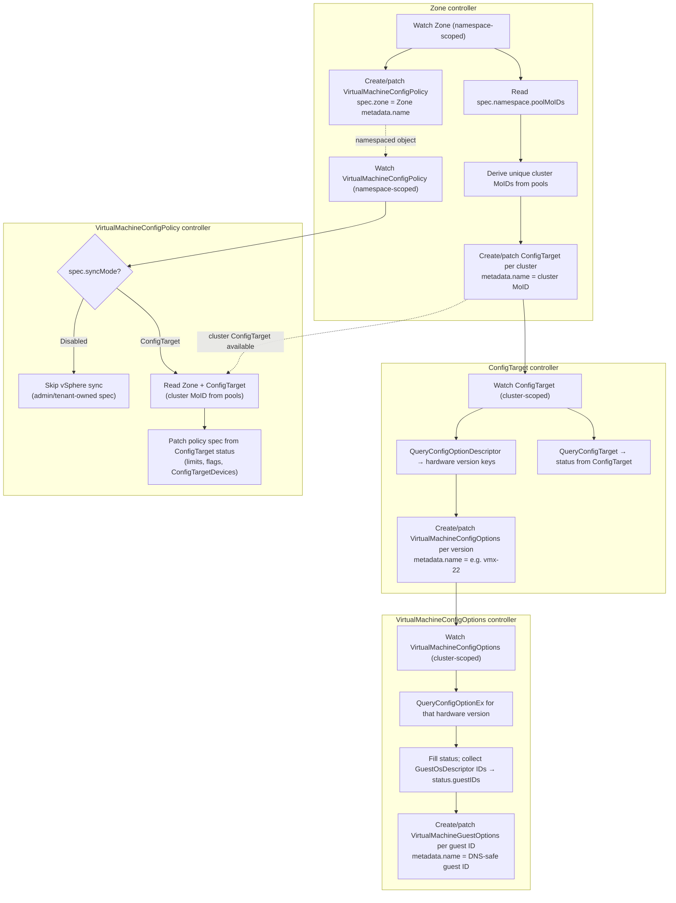
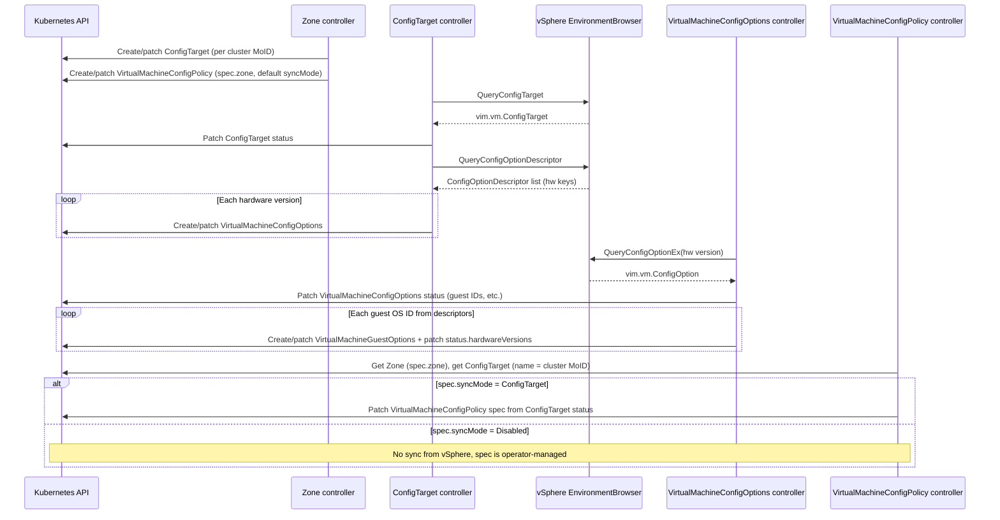

# Controller workflows

This document describes how zone discovery fans out into cluster-scoped config metadata and guest option resources, and how namespace-scoped policy is kept in sync with that metadata.

There are two related pipelines:

1. **Hardware and guest descriptors:** `Zone → ConfigTarget → VirtualMachineConfigOptions → VirtualMachineGuestOptions`.
2. **Namespace policy:** The `Zone` controller also creates a `VirtualMachineConfigPolicy` per zone. When `spec.syncMode` is `ConfigTarget`, the `VirtualMachineConfigPolicy` controller copies cluster limits and device capabilities from the cluster’s `ConfigTarget` into the policy’s **spec** (the policy embeds the same device and capability fields as `ConfigTarget` status, so consumers read one namespaced object).

## End-to-end flow

Each `VirtualMachineGuestOptions` reconciliation updates `status.hardwareVersions` with one entry for the hardware version of the `VirtualMachineConfigOptions` being reconciled; reconciles of other hardware versions append their own entries (see the `VirtualMachineConfigOptions` controller section above).

Dashed edges: (1) the `Zone` controller creates the namespaced policy object that the policy controller reconciles; (2) syncing policy spec requires a cluster `ConfigTarget` (created by the same reconcile chain) whose `metadata.name` is the cluster MoID derived from the zone’s `spec.namespace.poolMoIDs`, matching the `Zone` controller’s logic.

## vSphere API and Kubernetes writes

## Controllers

### `Zone` controller

1. `Zone` controller watches `Zone` resources in a namespace.
2. When `Zone` object is reconciled, its `spec.namespace.poolMoIDs` list is inspected to get a list of the resource pool IDs belonging to the zone.
3. A unique set of vSphere cluster managed object IDs is derived from the list of the zone's pool IDs.
4. For each of the unique cluster managed object IDs, the `Zone` controller creates or patches a cluster-scoped `ConfigTarget` resource with the `metadata.name` of the resource being the managed object ID of the cluster.
5. The `Zone` controller creates or patches a namespace-scoped `VirtualMachineConfigPolicy` object for the given `Zone`. The `VirtualMachineConfigPolicy` field `spec.zone` records the name of the `Zone` to which the policy applies. If the resource does not already exist, then the `VirtualMachineConfigPolicy` field `spec.syncMode` is set to `ConfigTarget`.

### `ConfigTarget` controller

1. The new `ConfigTarget` controller watches for the `ConfigTarget` resources. Upon seeing a `ConfigTarget` resource, the controller calls [`QueryConfigTarget`](https://developer.broadcom.com/xapis/vsphere-web-services-api/latest/vim.EnvironmentBrowser.html#queryConfigTarget) on the cluster's environment browser. The controller uses the [result](https://developer.broadcom.com/xapis/vsphere-web-services-api/latest/vim.vm.ConfigTarget.html) to populate the `ConfigTarget`'s status information.
2. The new `ConfigTarget` controller also calls the [`QueryConfigOptionDescriptor`](https://developer.broadcom.com/xapis/vsphere-web-services-api/latest/vim.EnvironmentBrowser.html#queryConfigOptionDescriptor) API, getting a list of the hardware versions supported by the cluster (the [`key`](https://developer.broadcom.com/xapis/vsphere-web-services-api/latest/vim.vm.ConfigOptionDescriptor.html#key) field).
3. For each hardware version, the `ConfigTarget` controller creates or patches a cluster-scoped `VirtualMachineConfigOptions` resource, with its `metadata.name` field being the hardware version, ex. vmx-22.

### `VirtualMachineConfigOptions` controller

1. The new `VirtualMachineConfigOptions` controller watches the new, cluster-scoped `VirtualMachineConfigOptions` API. Upon seeing a `VirtualMachineConfigOptions` resource, the controller calls [`QueryConfigOptionEx`](https://developer.broadcom.com/xapis/vsphere-web-services-api/latest/vim.EnvironmentBrowser.html#queryConfigOptionEx) using the hardware version the `VirtualMachineConfigOptions` object represents.
2.  Using the [result](https://developer.broadcom.com/xapis/vsphere-web-services-api/latest/vim.vm.ConfigOption.html) of this call, the `VirtualMachineConfigOptions` controller fills in the status of the `VirtualMachineConfigOptions` object. However, for each of the `ConfigOption` result's `GuestOsDescriptors`, only the ID is used (after being converted to the CRD format of the ID). All the guest IDs are placed in the `VirtualMachineConfigOptions` object's `status.guestIDs` field.
3. For each guest ID, the `VirtualMachineConfigOptions` controller creates/patches a `VirtualMachineGuestOptions` object, with the `metadata.name` value being the DNS-safe version of the guest ID. The object's spec includes the guest ID. The controller fills out the object's status and updates its `status.hardwareVersions` listMap with the information for the hardware version represented by the `VirtualMachineConfigOptions` object being reconciled. Please note, this will mean filling out only a single element in the `status.hardwareVersions` list map, since other entries are populated when the `VirtualMachineConfigOptions` controller reconciles `VirtualMachineConfigOptions` objects representing other hardware versions.

### `VirtualMachineConfigPolicy` controller

1. The new `VirtualMachineConfigPolicy` controller watches the new, namespace-scoped `VirtualMachineConfigPolicy` API.
2. The `VirtualMachineConfigPolicy` controller checks the value of the `VirtualMachineConfigPolicy` field `spec.syncMode`.
3. If the value of `spec.syncMode` is `Disabled`, the controller does not copy data from vSphere into the policy; reconciliation may still update status (for example conditions). The policy **spec** is treated as operator-managed.
4. If the value of `spec.syncMode` is `ConfigTarget`, the controller continues to reconcile the resource against the cluster `ConfigTarget`.
5. The `VirtualMachineConfigPolicy` controller looks up the `Zone` resource named in `spec.zone`.
6. Using the same pool-to-cluster derivation as the `Zone` controller, the controller obtains the vSphere cluster managed object ID(s) from the zone's `spec.namespace.poolMoIDs`. For each relevant cluster, it reads the cluster-scoped `ConfigTarget` whose `metadata.name` is that cluster MoID. Please note, today a Zone applied to a namespace maps to a single vSphere cluster. The other clusters are there strictly for infrastructure mobility / cluster decommissioning.
7. The `VirtualMachineConfigPolicy` controller maps the `ConfigTarget`'s **status** (numeric limits, feature flags, and the embedded device capability lists) into the policy's **spec**, which shares the `ConfigTargetDevices` shape and related fields (`numCPUCores`, `memory`, and so on). That gives namespaced consumers a single object for "what this zone allows," aligned with `vim.vm.ConfigTarget` after `QueryConfigTarget`.

Additional **spec** fields on `VirtualMachineConfigPolicy` are not filled by vSphere sync; they are part of the policy contract for workloads and admission: `createMode`, `updateMode`, and `powerOnMode` (`Allow` vs `Deny`), `vmClassMode` (`AsPolicy` vs `AsConfig`), and optional `extraConfig` allow/deny lists. Defaults match the CRD (`syncMode` defaults to `ConfigTarget`, modes default to `Allow`, `vmClassMode` defaults to `AsPolicy`).
