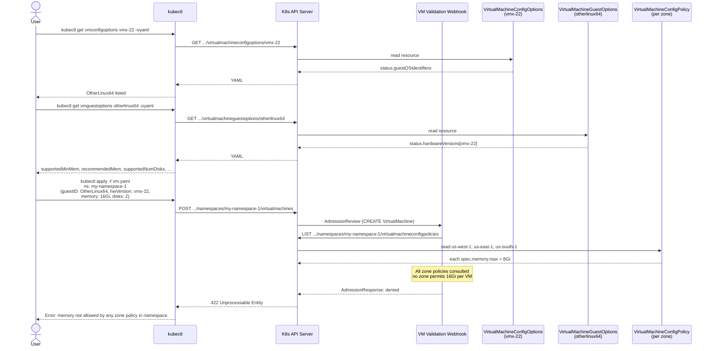

# Deploying a VM

This document outlines how the VIM APIs augment the experience of deploying a workload using the VM Operator APIs.

The vSphere [`EnvironmentBrowser`](https://developer.broadcom.com/xapis/vsphere-web-services-api/latest/vim.EnvironmentBrowser.html) managed object provides access to the execution environment of a `ComputeResource` or `VirtualMachine`. Its data informs several Kubernetes resources:

| vSphere API method | Kubernetes resource(s) | Scope |
|---|---|---|
| `QueryConfigOption` / `QueryConfigOptionEx` | `VirtualMachineConfigOptions` (per hardware version) and `VirtualMachineGuestOptions` (per guest ID) | Cluster |
| `QueryConfigTarget` | `ConfigTarget` | Cluster |

`VirtualMachineConfigPolicy` has **no VMODL equivalent**. It is described in its own section below.

## Resource names

These APIs use predictable **`metadata.name`** values (and matching `spec` identifiers where applicable). The table uses the same short labels as in `kubectl` and everyday discussion; full kinds are in the first column.

| Resource | Kind | `metadata.name` convention | Example names |
|---|---|---|---|
| **configtarget** | `ConfigTarget` | The vSphere cluster **managed object ID** (MoID) | `cluster-1`, `cluster-2`, `cluster-3` |
| **vmconfigoption** | `VirtualMachineConfigOptions` | The **hardware version** string | `vmx-22`, `vmx-19` |
| **vmguestoption** | `VirtualMachineGuestOptions` | **Lowercased** guest ID (DNS-safe label) | `otherlinux64`, `windows2022srv64` |
| **vmconfigpolicy** | `VirtualMachineConfigPolicy` | The **zone** name for that policy | `us-east-1`, `us-west-2` |

`kubectl` short names, where registered, are **`vmconfigoptions`**, **`vmguestoptions`**, and **`vmconfigpolicy`** (note the plural **s** on the first two). For `ConfigTarget`, the registered plural resource name is **`configtargets`** (for example `kubectl get configtargets cluster-1`); some clients also accept the singular form **`configtarget`**.

## VirtualMachineConfigOptions

`VirtualMachineConfigOptions` is a **cluster-scoped** resource: **one object per supported hardware version**. The object is **named after that version** (e.g., `vmx-22`). It maps to the hardware-level portions of the vSphere `VirtualMachineConfigOption` returned by `QueryConfigOption` / `QueryConfigOptionEx`.

The resource’s spec pins the desired `hardwareVersion`. Its status includes:

- **`guestOSIdentifiers`** — the set of supported guest OS identifiers (`OtherLinux64`, `Windows2022srv64`, etc.) for this hardware version, without the full per-guest constraint payload.
- **`hardwareOptions`** — hardware-version constraints on processor, memory, and virtual devices (controllers, buses, etc.).
- **`capabilities`** — VM feature flags for this hardware version (snapshots, CBT, Secure Boot, nested HV, AMD SEV/SEV-SNP, Intel TDX, vTPM 2.0, and similar).
- **`storageClassOptions`**, **`supportedMonitorTypes`**, **`supportedOvfEnvironmentTransports`**, **`supportedOvfInstallTransports`** — additional option metadata from the config option.
- **`defaultDevices`** — virtual devices vSphere creates by default for this version; clients should not recreate them explicitly.
- **`propertyRelations`** — relationships between VM config spec properties (for example, a guest ID implying a required firmware type).

Per-guest min/max memory, disk counts, recommended controllers, hot-plug behavior, and related fields **moved** to `VirtualMachineGuestOptions` (see below).

## VirtualMachineGuestOptions

`VirtualMachineGuestOptions` is a **cluster-scoped** resource: **one object per guest ID**. The object is **named after the lowercased guest ID** (e.g., `otherlinux64` for `OtherLinux64`). Short name: `vmguestoptions`. Its spec sets `id` to the canonical guest identifier (matching the enum / vSphere guest ID casing).

Status includes `fullName`, optional `family`, and **`hardwareVersions`**: for each hardware version where the guest is valid, a `VirtualMachineGuestOptionsHardwareVersionStatus` entry carries the guest-specific limits and recommendations that used to live alongside hardware options in a single config-options shape—for example minimum and maximum memory, recommended memory, CPU and socket/core limits, disk and controller recommendations, firmware and Secure Boot behavior, hot-add/remove capabilities, TPM and confidential-computing-related flags, persistent memory limits, support level, and whether the guest is supported for create.

Clients typically combine **`VirtualMachineConfigOptions`** (hardware version + device/capability matrix) with **`VirtualMachineGuestOptions`** (chosen guest ID + matching `hardwareVersions` entry) when validating or shaping a VM spec.

## ConfigTarget

`ConfigTarget` is a **cluster-scoped** resource tied to a **single vSphere cluster**. The object is **named after that cluster’s MoID** (e.g., `cluster-1`). Its spec requires **`id`**, the same managed object ID. Status reflects **physical / pool-level** capacity from the vSphere `ConfigTarget` returned by `QueryConfigTarget`, for example:

- Pool-wide CPU and core counts, NUMA node count, maximum SMT threads, and **`maxCPUsPerVM`** (cap on CPUs for one VM given cluster inventory).
- Memory ceilings such as **`supportedMaxMem`** and **`maxMemOptimalPerf`**.
- The same broad device categories as in the embedded **`ConfigTargetDevices`** structure (PCI passthrough, SR-IOV, vGPU, shared GPU passthrough, SGX, precision clock, DVX, raw disks, vFlash, USB, CD-ROM, floppy, serial, parallel, and related targets).
- Hardware security flags: **`smcPresent`**, **`sevSupported`**, **`sevSnpSupported`**, **`tdxSupported`**.

`NumCPUs`, **`numCPUCores`**, and similar fields here describe **what the cluster (or chosen compute path) exposes in aggregate**, not tenant policy for a single VM.

## VirtualMachineConfigPolicy

`VirtualMachineConfigPolicy` is **namespace-scoped** (short name: `vmconfigpolicy`). It is **not** a projection of a single vSphere method; think of it as a **namespace-scoped companion to `ConfigTarget`** whose fields are interpreted **per virtual machine**.

There is **one `VirtualMachineConfigPolicy` object per zone** in a namespace. Each object is **named after that zone** (for example `us-east-1`, `us-west-1`). If namespace `my-namespace-1` spans three zones—`us-west-1`, `us-east-1`, and `us-south-1`—then there are **three** policy objects in that namespace. Validators and placement-aware components **must consider every zone’s policy** when deciding whether a configuration is allowed: **all zone policies in the namespace are consulted**, and the outcome depends on whether **any** of them permits the requested VM configuration (for example, at least one zone allows the requested memory, CPU, devices, and ExtraConfig rules so the VM could legally run there). If **no** zone’s policy allows the request, admission or scheduling should reject it.

Where `ConfigTarget` status describes cluster inventory (for example, logical CPUs available to run workloads), policy fields such as **`memory`** (`ResourceQuantityRange`), **`numCPUCores`**, **`numNUMANodes`**, and **`numSimultaneousThreads`** (`IntRange`) express **what one VM is allowed to use under that zone’s policy**, not totals across hosts in the cluster.

The spec also carries information **not** modeled on `ConfigTarget`, including:

- **`extraConfig`** — allow and deny lists for ExtraConfig keys (fixed, regex, or glob matching; denied keys override allowed).
- VM-oriented capability toggles such as **`latencySensitivityLevels`**, **`cpuLockedToMaxSupported`**, **`memoryLockedToMaxSupported`**, **`hugePagesSupported`**, **`iommuSupported`**, **`rssSupported`**, **`udpRSSSupported`**, **`lroSupported`**, and **`txRxThreadModels`**.

Device-related fields are embedded via **`ConfigTargetDevices`**: passthrough, vGPU, SR-IOV, and the same device families as on `ConfigTarget`, so administrators can **expose a subset** of what the cluster supports and attach **per-zone, namespace-local** policy to those devices.

## Workflows

### Creating a VM with configuration validation

The following scenario walks through how a user leverages these APIs when deploying a new virtual machine.

1. The user wants to deploy a VM. They pick a Linux image and choose guest ID `OtherLinux64`.

2. They target hardware version `vmx-22`.

3. They confirm the guest is supported on that version from **`VirtualMachineConfigOptions`** (hardware version as the object name):

   ```shell
   kubectl get vmconfigoptions vmx-22 -oyaml
   ```

   In `status.guestOSIdentifiers`, they verify `OtherLinux64` is listed.

4. They load **guest-specific** limits for that hardware version from **`VirtualMachineGuestOptions`** (lowercased guest ID as the object name):

   ```shell
   kubectl get vmguestoptions otherlinux64 -oyaml
   ```

   `spec.id` must match the canonical guest identifier (e.g. `OtherLinux64`). In `status.hardwareVersions`, they find the element with `hardwareVersion: vmx-22` and read fields such as **`supportedMinMem`**, **`recommendedMem`**, and **`supportedNumDisks`**.

5. They decide to create the VM with **16 GiB** of memory and **2** disks.

6. The Kubernetes API server receives the `VirtualMachine` create request and routes it to the VM resource’s validation webhook.

7. Namespace `my-namespace-1` has three zones, so there are three policies: **`VirtualMachineConfigPolicy`** objects **`us-west-1`**, **`us-east-1`**, and **`us-south-1`**. The webhook **lists or fetches every** `vmconfigpolicy` in the namespace and evaluates whether **any** zone’s policy permits the VM. Here, **`spec.memory.max`** is **8 Gi** **per VM** in **each** zone.

8. The request asks for **16 Gi**. **None** of the three zone policies allows that much memory for a single VM, so **no** zone would accept the configuration. The webhook rejects the request and the API server returns an error to `kubectl`.


