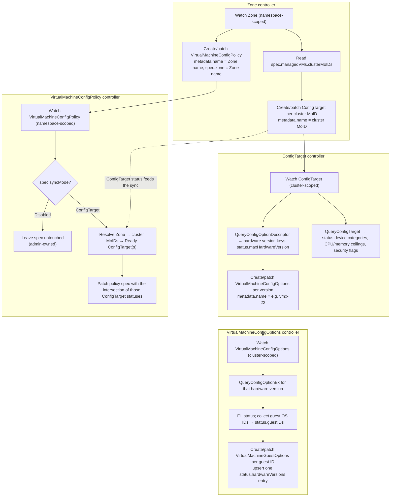

# Integration guide

This guide is for teams that consume the `vim.vmware.com` APIs from outside VM Operator — UI and CLI surfaces, placement and quota tooling, and anything that needs to answer "what can this zone actually run?" before a `VirtualMachine` is submitted.

It describes the four `vim.vmware.com` CRDs, how VM Operator populates them, and how `VirtualMachineConfigPolicy` is enforced against a `VirtualMachine`. For the narrative walkthrough of the reconcile chain see [`controller-workflows.md`](./controller-workflows.md); for a resource-by-resource field tour see [`deploying-a-vm.md`](./deploying-a-vm.md). This document is the integration contract: what you can rely on, what is not populated yet, and what will reject your request.

## Status and enablement

The whole feature is behind a single Supervisor capability:

```
supports_vm_service_vm_config_policy
```

While that capability is deactivated, VM Operator does not register the `vim.vmware.com` scheme, does not run any of the controllers below, and does not enforce policy on `VirtualMachine` admission or power-on. The CRDs may still be installed on the cluster — installation is unconditional — so **the presence of the CRDs is not a signal that the feature is on**. Detect enablement from the capability, or from whether a `ConfigTarget` for your cluster exists and is `Ready`.

The API version is `v1alpha1`. It is alpha: fields may be added, and unpopulated fields may start being populated, without a version bump.

## The four resources

| Kind | Scope | Plural / short name | `metadata.name` | Written by | Derived from |
|---|---|---|---|---|---|
| `ConfigTarget` | Cluster | `configtargets` | vSphere cluster MoID, e.g. `domain-c52` | Zone controller (creates), `ConfigTarget` controller (status) | `EnvironmentBrowser.QueryConfigTarget` + `QueryConfigOptionDescriptor` |
| `VirtualMachineConfigOptions` | Cluster | `virtualmachineconfigoptions` / `vmconfigoptions` | Hardware version, e.g. `vmx-22` | `ConfigTarget` controller (creates), `VirtualMachineConfigOptions` controller (status) | `EnvironmentBrowser.QueryConfigOptionEx` |
| `VirtualMachineGuestOptions` | Cluster | `virtualmachineguestoptions` / `vmguestoptions` | DNS-safe form of the guest ID, e.g. `otherlinux64` | `VirtualMachineConfigOptions` controller | `QueryConfigOptionEx` guest OS descriptors |
| `VirtualMachineConfigPolicy` | Namespaced | `virtualmachineconfigpolicies` / `vmconfigpolicy` | Zone name, e.g. `us-west-1` | Zone controller (creates), `VirtualMachineConfigPolicy` controller (syncs spec) | `ConfigTarget.status`, plus admin/tenant-authored fields |

`ConfigTarget` has no registered short name; use `configtargets`.

All four are **owned by VM Operator**. Treat `ConfigTarget`, `VirtualMachineConfigOptions`, and `VirtualMachineGuestOptions` as strictly read-only from outside the operator: they are recreated and their status overwritten on every reconcile. `VirtualMachineConfigPolicy` is the one object an administrator is expected to edit, and only the fields called out in [Which policy fields are yours](#which-policy-fields-are-yours).

## The pipeline



Two things about this graph matter to consumers:

- **Everything is level-triggered and eventually consistent.** A hardware version added to a cluster shows up as a new `VirtualMachineConfigOptions`, then as new `status.hardwareVersions` entries on the affected `VirtualMachineGuestOptions`, then — for `syncMode=ConfigTarget` policies — as a widened `spec` on the zone's policy. Do not assume these land in the same instant. Gate on the `Ready` condition of the object you are reading.
- **The `ConfigTarget` controller queries the cluster's `EnvironmentBrowser` only.** It does not enumerate hosts and makes no `PropertyCollector` calls. Everything in `ConfigTarget.status` is cluster-aggregate data.

## Reading cluster capability

### ConfigTarget

`metadata.name` is the cluster MoID and is validated by a CEL rule on the CRD: it must match `^domain-c[0-9]+$`. `spec.id` carries the same MoID and is immutable after create.

`status` holds the cluster's aggregate capability. The fields most consumers want:

- `maxHardwareVersion` — the highest hardware version creatable on at least one host in the cluster, computed as the maximum `key` among `QueryConfigOptionDescriptor` results with `createSupported == true`. This is the cheap answer to "is this VM's hardware version feasible here" without reading per-host anything.
- `numCPUs`, `numCPUCores`, `numNumaNodes`, `maxCPUsPerVM`, `maxSimultaneousThreads`.
- `supportedMaxMem`, `maxMemOptimalPerf`, `availablePersistentMemoryReservation`. Each is omitted rather than zeroed when the cluster does not report it, so distinguish "absent" from "zero".
- `smcPresent`, `sevSupported`, `sevSnpSupported`, `tdxSupported`.
- The inlined `ConfigTargetDevices` device categories: CD-ROM, floppy, serial, parallel, sound, USB, PCI passthrough, dynamic passthrough, vGPU device and profile, shared GPU passthrough types, SGX, precision clock, vendor device groups, DVX classes, IDE and SCSI disks, SCSI passthrough, and vFlash module.

Three fields exist on `ConfigTargetStatus` but **are never written today**, and always read as their zero value:

- `sriov` — SR-IOV enrichment requires per-host iteration and is deferred to a later release; SR-IOV entries nested inside the PCI-passthrough union are excluded as well.
- `defaultHardwareVersion` — use `maxHardwareVersion`, or read the per-version `VirtualMachineConfigOptions` objects.
- `vMotionBandwidth`.

Do not build on any of them yet. They will start returning data in a later release, which is a behavior change for a consumer that treats the zero value as meaningful, even though it is not an API change.

`status.conditions` carries a `Ready` condition. When it is not `True` the reason is one of `ClusterNotFound`, `QueryConfigTargetFailed`, or `QueryConfigOptionDescriptorFailed`, and the status shown is the last successful query's data, not current data.

### VirtualMachineConfigOptions and VirtualMachineGuestOptions

`VirtualMachineConfigOptions` is one object per hardware version supported by the cluster; `metadata.name` must equal `spec.hardwareVersion` and must match `^vmx-[0-9]+$` (both CEL rules on the CRD; `spec.hardwareVersion` is immutable).

`VirtualMachineGuestOptions` is one object per guest OS ID, named after the DNS-safe transform of the guest ID: lowercased, runs of non-DNS-safe characters collapsed to a hyphen, trimmed, truncated to 63 characters. Its `spec.id` carries the canonical, correctly-cased guest identifier — **match on `spec.id`, not on the object name**, which is lossy by construction.

`VirtualMachineGuestOptions.status.hardwareVersions` is a listMap keyed by `hardwareVersion`, with one entry contributed by each `VirtualMachineConfigOptions` that reports the guest. Entries are garbage-collected when a hardware version stops reporting the guest, and the object is deleted when its last entry goes away. So a guest OS present in this list for `vmx-22` is genuinely supported on `vmx-22` right now, not merely at some point in the past.

The pair is meant to be read together: `VirtualMachineConfigOptions` for the hardware-version-level device and capability matrix, `VirtualMachineGuestOptions` for the guest-specific limits at that hardware version.

## VirtualMachineConfigPolicy

One policy per zone per namespace, named after the zone. A namespace spanning three zones has three policy objects.

### syncMode

`spec.syncMode` decides who owns the capability portion of the spec. It defaults to `ConfigTarget` and is only defaulted on create — the Zone controller will not reset it afterwards.

- **`ConfigTarget`** — the `VirtualMachineConfigPolicy` controller resolves `spec.zone` to a `Zone`, reads `spec.managedVMs.clusterMoIDs`, loads the matching `ConfigTarget` objects, and writes the intersection of their statuses into the policy's **spec**. Every cluster behind the zone must have a `Ready` `ConfigTarget`; if any does not, the controller writes nothing and marks the policy not `Ready`.
- **`Disabled`** — no vSphere data is copied. The spec is entirely administrator-managed. `Ready` is set `True` with reason `SyncDisabled`.

Today a zone applied to a namespace maps to a single vSphere cluster; the multi-cluster path exists for infrastructure mobility and cluster decommissioning. When it is exercised, the merge is an intersection: minimum of numeric maxima, logical AND of boolean support flags, and, for device categories, only descriptors present value-for-value on every `ConfigTarget`.

Only the `Max` side of a range field is synced. `Min` is a tenant-managed floor and is never touched. If a cluster's capability shrinks far enough that a synced `Max` would drop below an administrator-set `Min`, the controller refuses the whole write rather than publish an inverted range, and marks `Ready=False` with reason `InvalidRange`.

### Which policy fields are yours

Synced from `ConfigTarget` when `syncMode=ConfigTarget` — **do not hand-edit these, they will be overwritten**:

`numCPUCores.max`, `numNUMANodes.max`, `numSimultaneousThreads.max`, `memory.max`, `smcPresent`, `sevSupported`, `sevSnpSupported`, `tdxSupported`, and the inlined `ConfigTargetDevices` fields.

Administrator-owned in both sync modes:

`createMode`, `updateMode`, `powerOnMode`, `vmClassMode`, `extraConfig`, `latencySensitivityLevels`, `txRxThreadModels`, the `Min` side of every range, and the support flags that have no `ConfigTarget` counterpart: `cpuLockedToMaxSupported`, `memoryLockedToMaxSupported`, `hugePagesSupported`, `iommuSupported`, `rssSupported`, `udpRSSSupported`, `lroSupported`.

### Ready condition reasons

| Reason | Meaning |
|---|---|
| *(none, `Ready=True`)* | Spec reflects a successful sync from every cluster behind the zone. |
| `SyncDisabled` | `syncMode=Disabled`; spec is administrator-managed and is not stale by definition. |
| `ZoneNotFound` | `spec.zone` does not resolve to a `Zone` in this namespace. |
| `ConfigTargetNotFound` | The zone lists a cluster MoID with no `ConfigTarget` object. |
| `ConfigTargetNotReady` | One or more of the zone's `ConfigTarget`s are not `Ready`. |
| `InvalidRange` | A synced `Max` would have fallen below an administrator-set `Min`; the sync was refused. |

A policy that is not `Ready` still has a usable spec — the last known-good sync — and **is still enforced**. Enforcing a possibly-stale ceiling is deliberate: the alternative is either failing open or denying every request in the namespace over one flapping `ConfigTarget`. The staleness is logged at each enforcement point and, on the power-on path, appended to the condition message on the `VirtualMachine`.

## Enforcement

There are two enforcement points, sharing one matcher so they cannot drift:

1. **`VirtualMachine` admission webhook** — evaluates the VM's *desired spec* on create, update, and power-on transitions.
2. **vSphere power-on reconcile** — evaluates the VM's *actual, live vSphere `ConfigInfo`* immediately before powering on. This catches a VM that was compliant when last reconfigured but whose governing policy has since tightened.

### Which policy governs a VM

The policy is resolved by the VM's **assigned zone**: the value of the `topology.kubernetes.io/zone` label on the `VirtualMachine`, used as the name of a `VirtualMachineConfigPolicy` in the VM's namespace. It is a single `Get`.

Two consequences worth designing around:

- **A VM that has not yet been placed is not enforced.** With no zone label there is no resolvable policy, so admission returns no error. Enforcement resumes on the next update once placement sets the label.
- **Enforcement is against one zone, not "any zone that would accept it."** If your tooling wants to tell a user which zones could host a configuration, it must read every `VirtualMachineConfigPolicy` in the namespace itself; the webhook will not do that reasoning for it.

If no policy object exists for the VM's zone, nothing is enforced.

### When enforcement actually runs

The three modes are independent gates, each defaulting to `Allow`. Compliance is only evaluated when a mode that applies to *this* request is set to `Deny`:

| Request | Gated by |
|---|---|
| Create, VM not powered on | `createMode` |
| Create, `spec.powerState: PoweredOn` | `createMode` **or** `powerOnMode` |
| Update, no power-state change | `updateMode` |
| Update that flips the VM to `PoweredOn` | `updateMode` **or** `powerOnMode` |
| Power-on reconcile (live config) | `powerOnMode` |

`powerOnMode=Deny` therefore lets an administrator leave create and update alone while still refusing to power on a non-compliant VM. **With all three modes at their `Allow` default, a policy enforces nothing** — it is purely a published description of the zone's capability.

`spec.vmClassMode` gates this one level higher and defaults to `AsPolicy`, which means a VM whose configuration derives from a VM Class bypasses the policy entirely. Only `vmClassMode=AsConfig` subjects a VM with a `spec.className` to policy evaluation. This default preserves pre-feature behavior.

### What is checked

| Policy field | VM spec field | Live `ConfigInfo` |
|---|---|---|
| `extraConfig.allowed` / `.denied` | `spec.advanced.extraConfig[].key` | `config.extraConfig[].key` |
| `hardwareVersions` (min/max) | `spec.minHardwareVersion` | `config.version` |
| `numCPUCores` | `spec.resources.size.cpu` | `config.hardware.numCPU` |
| `memory` | `spec.resources.size.memory` | `config.hardware.memoryMB` |
| `numNUMANodes` | `spec.cpuAdvanced.topology.vnumaNodeCount` | *not checked* |
| `iommuSupported` | `spec.cpuAdvanced.iommuEnabled` | `config.flags.vvtdEnabled` |
| `memoryLockedToMaxSupported` | `spec.memoryAdvanced.reservationLockedToMax` | `config.memoryReservationLockedToMax` |
| `hugePagesSupported` | `spec.advanced.hugePages1GEnabled` | *not checked* |

Not enforced by either point, despite being present on the policy spec: `smcPresent`, `sevSupported`, `sevSnpSupported`, `tdxSupported`, `cpuLockedToMaxSupported` (host/cluster capabilities, not VM settings a config can violate), `numSimultaneousThreads` (no unambiguous VM spec counterpart), `latencySensitivityLevels` (the `vmoperator.vmware.com` and `vim.vmware.com` enums do not map one-to-one), the per-NIC properties `rssSupported`, `udpRSSSupported`, `lroSupported`, `txRxThreadModels`, and the `ConfigTargetDevices` device categories. A consumer that wants to warn on those must do it itself.

Range semantics: for `numCPUCores`, `memory`, and `hardwareVersions`, a zero `Min` means no minimum and a zero `Max` means no maximum. `numNUMANodes` is the exception — a synced `Max` of zero is real data meaning the cluster reports no NUMA support, and is enforced as such.

`extraConfig` matching: each entry has a `type` of `Fixed`, `Regex`, or `Glob`, defaulting to `Glob`. A key matching any `denied` entry is rejected; `denied` beats `allowed`. If `allowed` is non-empty, a key matching nothing in it is also rejected. A malformed pattern is treated as a non-match rather than failing the request.

### What a denial looks like

Admission denials come back as HTTP 422, with field errors on the specific offending path — `spec.advanced.extraConfig[2].key`, `spec.resources.size.memory`, `spec.minHardwareVersion`, and so on — every violation reported at once rather than one per round trip, joined into a single reason string with `, `.

The power-on path is different. It always sets a `VirtualMachineConfigPolicyVerified` condition on the `VirtualMachine`, and consumers should read that rather than inferring compliance from anything else:

- `True` — the live configuration complies.
- `False`, reason `NotVerified` — it does not. If `powerOnMode` is not `Deny` the VM still powers on; the condition is the only signal.
- *Absent* — no policy governs the VM: it is unplaced, its zone has no policy, or `vmClassMode=AsPolicy` exempts it.

When `powerOnMode=Deny` and the live config is non-compliant, the power-on is refused as a terminal (non-requeueing) error. Fixing the VM or relaxing the policy triggers a fresh reconcile; there is no retry loop in between.

### Worked example: denying an oversized VM

Namespace `my-namespace-1`, zone `us-west-1`. The zone's cluster reports 8 GiB as its per-VM memory ceiling, and the administrator has set `createMode: Deny`:

```yaml
apiVersion: vim.vmware.com/v1alpha1
kind: VirtualMachineConfigPolicy
metadata:
  name: us-west-1
  namespace: my-namespace-1
spec:
  zone: us-west-1
  syncMode: ConfigTarget   # memory.max below is synced, not hand-written
  createMode: Deny
  vmClassMode: AsConfig    # required, or a VM with a spec.className is exempt
  memory:
    max: 8Gi
  extraConfig:
    denied:
    - type: Glob
      key: "guestinfo.*"
status:
  conditions:
  - type: Ready
    status: "True"
```

A `VirtualMachine` created in that namespace, already placed in `us-west-1`, asking for 16 GiB:

```yaml
apiVersion: vmoperator.vmware.com/v1alpha6
kind: VirtualMachine
metadata:
  name: my-vm
  namespace: my-namespace-1
  labels:
    topology.kubernetes.io/zone: us-west-1
spec:
  className: best-effort-large
  imageName: vmi-0a0044d7c690bcbea
  storageClass: wcpglobal-storage-profile
  resources:
    size:
      memory: 16Gi
  advanced:
    extraConfig:
    - key: guestinfo.metadata
      value: "..."
```

The webhook resolves `us-west-1` from the zone label, sees `createMode: Deny`, evaluates the spec, and rejects with both violations at once. The denial is an HTTP 422 from `default.validating.virtualmachine.v1alpha6.vmoperator.vmware.com`, whose reason is every field error joined with `, `:

```
spec.resources.size.memory: Invalid value: "16Gi": memory 16Gi
exceeds the maximum 8Gi supported by the namespace's
VirtualMachineConfigPolicy, spec.advanced.extraConfig[0].key:
Forbidden: guestinfo.metadata: denied by the namespace's
VirtualMachineConfigPolicy
```

(Line breaks added for readability — the real reason is one line.)

Change either `createMode` to `Allow` or the VM to fit, and the create succeeds. Note that with `createMode: Allow` and `powerOnMode: Deny` the same VM would be admitted and then refused at power-on instead — the pre-flight answer for a UI is to read the policy, not to submit and see.

## Validation you will hit

Rejections that come from the API server's CEL rules, before any webhook runs:

| Object | Rule |
|---|---|
| `ConfigTarget` | `spec.id` immutable, `spec.id.id` non-empty, `metadata.name` matches `^domain-c[0-9]+$` |
| `VirtualMachineConfigOptions` | `spec.hardwareVersion` immutable, matches `^vmx-[0-9]+$`, and equals `metadata.name` |
| `VirtualMachineGuestOptions` | `spec.id` immutable and non-empty |

Rejections that come from admission webhooks:

| Object | Rule |
|---|---|
| `VirtualMachineGuestOptions` | `metadata.name` must equal the DNS-safe transform of `spec.id` |
| `VirtualMachineConfigPolicy` | `spec.zone` must reference an existing `Zone` in the same namespace; every `extraConfig` `allowed`/`denied` entry must have a non-empty key |

`ConfigTarget` and `VirtualMachineConfigOptions` have no validating webhook — every check they need is expressible in CEL and lives on the CRD.

## Compatibility notes

- **Do not depend on `status.sriov`, `status.defaultHardwareVersion`, or `status.vMotionBandwidth`.** They are unwritten today and will become populated.
- **Do not depend on absence of enforcement.** A namespace whose policies are all at the `Allow` default enforces nothing today; an administrator flipping one mode to `Deny` changes that with no API change and no notice to your component.
- **Do not derive a cluster MoID from a policy.** Go through `Zone.spec.managedVMs.clusterMoIDs`. An earlier design derived it from `spec.namespace.poolMoIDs`; that is not what the controllers do.
- **Do not treat `VirtualMachineGuestOptions.metadata.name` as the guest ID.** It is a lossy, truncated transform. Use `spec.id`.
- **Read the `Ready` condition before trusting any status or synced spec.** Every object here publishes last-known-good data when its upstream query fails.
